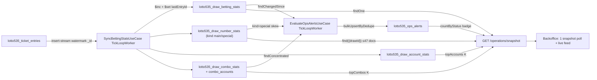

# Lotto 5/35 — Operations & Risk Control (Analysis)

> **Status**: `draft` · **Ngày**: 05/08/2026
> **Nguồn tham chiếu**: [`power655-operations-risk-control.analysis.md`](./power655-operations-risk-control.analysis.md) (TEMPLATE BẮT BUỘC — §10 của tài liệu đó) · [`keno-operations-risk-control.analysis.md`](./keno-operations-risk-control.analysis.md) · code Lotto 5/35 production (`packages/game-lotto535*`, `apps/worker-lotto535`, backoffice ops page).
>
> **VAI TRÒ TÀI LIỆU**: Analysis port mô hình ops/risk-control (stats worker + alerts + exposure) sang Lotto 5/35 — game jackpot có **Split Cycle** (cơ chế duy nhất trong 7 game). Cấu trúc §1–§9 mirror template Power 6/55; bảng verdict §6 đối chiếu với **Power 6/55** (không phải Keno) theo quy trình §10 của template.

---

## 0. TL;DR

Lotto 5/35 hiện dùng đúng mô hình ops CŨ (polling ~7 route aggregate on-demand trên `lotto535_ticket_entries`) — không stats worker, không alerts, không exposure, `GlobalConfigDoc` chưa có section `ops`. Giải pháp: port nguyên khung canonical (2 worker `TickLoopWorker`, pre-aggregate delta-only + watermark, 1 snapshot endpoint) với các điều chỉnh theo đặc thù game:

1. **Single jackpot + Split Cycle**: 1 JP (seed 1 tỷ, không có JP2); khi JP ≥ 12 tỷ và không ai trúng tại kỳ 21h → TOÀN BỘ pool chia xuống tier1–tier5 theo `betUnitCount`. Exposure vẫn 2 phần chuẩn template (§3.6); split KHÔNG làm tăng liability vượt pool → không đưa vào exposure. **Không có KPI banner/alert nào cho split cycle** (user chốt 05/08 — JackpotHeroCard hiện hữu là đủ).
2. **2 chiều số**: 35 số chính + 12 số đặc biệt → number stats 1 collection với field `kind: "main" | "special"` (≤47 doc/kỳ).
3. **`byPlayType` 13 key** (user chốt 05/08): `standard`, `mainCover4`, `mainCover6`..`mainCover15` tách riêng theo N (board 60k → 30tr), `specialCover` gộp 1 key (board tối đa 120k — không có rủi ro cần tách).
4. **Alert mới `special_skew`** (user chốt 05/08, P0): không gian số đặc biệt chỉ 12 số — tiền dồn bất thường vào 1 số ĐB là rủi ro đặc thù (số đó được quay → mọi line chứa nó trúng ít nhất consolation, kéo tier2/tier4). Alert `cover_high_stake` thay `bao_high_stake` (đánh giá từ byPlayType `mainCover13`–`mainCover15`).
5. **Nhịp kỳ 2 kỳ/NGÀY** (13h, 21h) — cửa sổ bán ngắn (~8 tiếng), gần Keno hơn Power 6/55; vẫn giữ nguyên khung worker cron 1 phút + tickSeconds.
6. **Mẫu số nhất quán là BET UNITS**: mọi cơ chế chia (JP per-unit, split bonus) đều theo `betCount`/`betUnitCount` — stats `sets` phải là `Σ(expandedLines × betCount)`, không phải line count.

---

## 1. Luật chơi → cấu trúc rủi ro (đối chiếu `rules/` + `entities/`, 05/08/2026)

Nguồn: `rules/play-types.ts`, `rules/prize-tiers.ts`, `rules/jackpot.ts` (`DEFAULT_LOTTO535_CONFIG`), `entities/entry.ts`, `entities/enums.ts`, `use-cases/place-bet/place-bet.ts`.

### 1.1. Play types & pricing

Chọn 5 số chính (01–35) + 1 số đặc biệt (01–12). `unitPrice` 10.000 VND/line, `betCount` 1–10, tối đa 5 board/vé (`maxBoardsPerTicket`), tối đa 6 kỳ (`maxDrawCount`).

| PlayType (enum) | Chọn | Lines | Giá board (10k/line, betCount=1) |
|---|---|---|---|
| `standard` | 5 chính + 1 ĐB | 1 | 10.000 |
| `mainCover4` | 4 chính + 1 ĐB | 31 (ghép 31 số còn lại) | 310.000 |
| `mainCover` (N=6–15) | N chính + 1 ĐB | C(N,5): 6→6, 10→252, 13→1.287, 15→3.003 | 60k → **30.030.000** |
| `specialCover` (K=2–12) | 5 chính + K ĐB | K | 20k → 120.000 |

- Board đắt nhất: `mainCover` N=15 = 30,03tr; × betCount 10 = **300,3tr/kỳ** — nguồn rủi ro cược lớn chính.
- `specialCover` tối đa 120k/board — rủi ro không đáng kể → gộp 1 key byPlayType (§3.4).
- Pricing (place-bet.ts dòng 151–159): `betUnitsPerDraw = Σ(expandedLines × betCount)` per board; `amountPerDraw = unitPrice × betUnitsPerDraw`; commission snapshot per entry (`entry.tenant.commissionAmount = round(amountPerDraw × commissionRate)`).
- Entry shape (`TicketEntryDoc`): có `username`, `tenantId`, `financialDate`, `betUnitCount`, `amount`, `entrySummary.boards[]` (`boardNo`, `playType`, `mainNumbers[]`, `specialNumbers[]`, `expandedLines`, `betCount`), `version` — ĐỦ field cho accumulator, không cần đổi hot path.

### 1.2. Prize tiers (7 hạng, mỗi line trúng hạng CAO NHẤT phù hợp)

| Tier | Điều kiện | Default VND | Split? |
|---|---|---|---|
| `jackpot` | 5 chính + ĐB | tích luỹ (seed 1 tỷ) | — (là nguồn chia) |
| `tier1` | 5 chính | 10.000.000 | ✅ nhận 2/6 |
| `tier2` | 4 chính + ĐB | 5.000.000 | ✅ 1/6 |
| `tier3` | 4 chính | 500.000 | ✅ 1/6 |
| `tier4` | 3 chính + ĐB | 100.000 | ✅ 1/6 |
| `tier5` | 3 chính | 30.000 | ✅ 1/6 |
| `consolation` | chỉ ĐB (≤2 chính) | 10.000 | ❌ không tham gia |

### 1.3. Dòng tiền & jackpot (rules/jackpot.ts — công thức đối chiếu từng dòng)

- `companyTake = round(revenue × companyRate)` (companyRate 0.15); `remainAfterPrizes = revenue − fixedPrizes − agentCommission`; `actualCompanyTake = min(companyTake, max(remainAfterPrizes, 0))`; `jackpotContribution = max(remainAfterPrizes − actualCompanyTake, 0)`. Doanh thu không đủ → công ty thu 0, contribution 0 (không âm).
- **JP winner**: `jackpotPerUnit = floor((opening + contribution) / totalBetUnits)` — chia theo betCount trên toàn bộ line trúng JP toàn kỳ (`patch-jackpot-prize.ts`), chặn bởi pool. Y hệt nguyên tắc Power 6/55 §3.6(2).
- **Split Cycle** (`isSplitCycleDraw`): `JP ≥ splitThreshold (12 tỷ)` AND `không ai trúng JP` AND `drawNo = 2 (kỳ 21h)`. `calculateSplitDistribution`: chia pool theo ratio tier1=2/6, tier2–5=1/6; tier không có winner → redistribute đều cho tier có winner; `bonusPerWinner` = per **bet unit** (mẫu số là `tierBetUnitCounts[tier] = Σ betUnitCount` — xem JSDoc dài trong `entities/entry.ts` §EntryPayoutTier), làm tròn xuống 5.000 VND (`SPLIT_ROUNDING_UNIT`) trừ tier cao nhất có winner nhận phần dư. `ApplySplitBonuses` push tier `{isSplitBonus: true}` + `$inc winAmount` per entry = `bonusPerUnit × betUnitCount`.
- **Điểm mấu chốt cho ops**: split là phân phối **post-hoc từ pool đã tích luỹ** — tổng chi không vượt `opening + contribution` → KHÔNG cộng vào exposure trước kỳ quay (§3.6).

### 1.4. Nhịp kỳ

2 kỳ/ngày (13h00, 21h00), đóng bán trước 5 phút, 1 kỳ active tại 1 thời điểm. Cửa sổ bán ~8–16 tiếng — dài hơn Keno (8 phút) nhưng ngắn hơn nhiều so với Power 6/55 (3 ngày). Kết hợp betUnitCount lớn của mainCover → data/kỳ ở mức trung bình; các quyết định tách collection của template vẫn áp dụng nguyên.

### 1.5. Ma trận rủi ro vận hành

| # | Rủi ro | Tín hiệu | Mức |
|---|---|---|---|
| R1 | Vé đơn lẻ cực lớn (mainCover13–15) | `entry.amount` ≥ ngưỡng; board mainCover N cao | Cao |
| R2 | Syndicate dồn 1 bộ số (5 chính + ĐB) | Nhiều account distinct cùng comboKey | Cao |
| R3 | Tiền dồn 1 số đặc biệt (chỉ 12 số) | 1 số ĐB chiếm % amount bất thường → số đó quay ra kéo consolation/tier2/tier4 hàng loạt | Cao — đặc thù game |
| R4 | Fixed-prize exposure phình (tier1 = 10tr × sets) | `sets × tier1` vượt ngưỡng VND | Trung bình |
| R5 | Kỳ split hút cược đột biến (JP ≥ 12 tỷ công khai) | revenue spike kỳ 21h | Theo dõi qua KPI/heatmap, KHÔNG alert (user chốt 05/08) |
| R6 | Nghẽn đọc BO đè collection entries | ~7 timer × N staff aggregate on-demand | Đã hiện hữu |

---

## 2. Hiện trạng (đọc trực tiếp source, 05/08/2026)

### 2.1. Trang ops hiện tại — mô hình CŨ y hệt Power 6/55 trước khi port

`apps/backoffice/src/app/(main)/games/lotto535/operations/_lib/use-operations.ts` — polling độc lập: `useDrawSelectorList`, `useOpsSummary`, `useOpsTenantBreakdown`, `useOpsNumberFrequency`, `useOpsPlayTypeDistribution`, `useOpsLiveEntries`, `useOpsTopCombos` (+ `useWinningEntries` on-demand). Mỗi hook gọi 1 route riêng trong `api/lotto535/operations/` → use-case aggregate on-demand trong `packages/game-lotto535-application/src/use-cases/operations/` → repo methods `aggregateOpsSummary`/`aggregateNumberFrequency`/`aggregateTopCombos`/`aggregatePlayTypeDistribution`/`aggregateTenantBreakdown` trong `entry-repo.ts`. UI 5 zones (JackpotHeroCard / DrawManagement / KPI / Result / Analytics) — **KHÔNG có** exposure-card, section `alerts/`, combo-lookup.

### 2.2. Ba phát hiện kỹ thuật

1. **Index chết `drawDate` trên `lotto535_ticket_entries`** — `packages/game-lotto535/src/indexes/index.ts` dòng 120–137 khai 3 index (`idx_tenant_account_drawDate`, `idx_tenant_drawDate_status`, `idx_drawDate_status`) trên field `drawDate` — field **KHÔNG tồn tại** trên `TicketEntryDoc` (chỉ có `drawId` + `financialDate`); grep `drawDate` trong `entry-repo.ts` = 0 match. Đúng bug Power 6/55 §2.2(1) — xoá ở P0.
2. **Chưa có hạ tầng stats/alert**: `GlobalConfigDoc` không có section `ops`; `apps/worker-lotto535` chỉ có 5 nhóm function (settle/void/resettle/feed/outstanding), không có `stats.yml`; không có collection stats/alerts nào.
3. **Game-core đã sẵn toàn bộ base types** (`DrawBettingStatsBase`, `DrawBettingTotals`, `DeltaAccumulatedDoc`, `TenantBettingStat`, `TopAccountStat`, `OpsStatsConfig` có `topCombosK`, `OpsAlertBase`, `OpsAlertStatus/Severity`) — chỉ cần extend, KHÔNG tự định nghĩa lại. Power 6/55 đang implement song song (`power655_draw_betting_stats`… + `stats.yml` + snapshot API) — code đó là tiền lệ trực tiếp để copy khung.

---

## 3. Thiết kế database

### 3.1. Nguyên tắc bất biến — GIỮ NGUYÊN template §3.1 (không bàn lại)

1. KHÔNG đụng hot path place-bet — worker đọc insert-stream async theo watermark `_id`.
2. Delta-only, `$inc` + watermark per-doc (`DeltaAccumulatedDoc`); `bulkWrite {ordered: false}`, duplicate key 11000 = no-op.
3. Top-K theo metric tích luỹ KHÔNG lưu mảng trong doc — nuôi collection đầy đủ, `sort().limit(K)` lúc đọc. Top-K theo metric bất biến per-item (topPotential) nằm trong doc.
4. KHÔNG `resetFinal`/`recomputeFull` — model cũ đã xoá toàn monorepo.

### 3.2. Ma trận quyết định lưu trữ — theo chuẩn template §3.2

| Dữ liệu | Cardinality | Quyết định | Lý do |
|---|---|---|---|
| `totals` (revenue/entries/sets/commission/largeBetCount) | scalar | Nhúng | Counter thuần |
| `byPlayType` | **13 key cố định** (§3.4) | Nhúng | Hằng số nghiệp vụ — user chốt 05/08 |
| `byTenant` | ~số tenant | Nhúng | Record không phình |
| `exposure` | scalar | Nhúng | 1 counter toàn kỳ `fixedWorstCase`; JP đọc lúc build response (§3.6) |
| `topPotential` | K bounded | Nhúng (`$push/$sort/$slice`) | Metric bất biến per-entry |
| **Tần suất từng số** | 35 main + 12 special | **TÁCH** `lotto535_draw_number_stats` (§3.3) | Chuẩn nhóm jackpot (template §10.2); thêm chiều `kind` |
| **Per-account** | unbounded | **TÁCH** `lotto535_draw_account_stats` | topAccounts chính xác, drill-down `large_bet` |
| **Per-combo (bộ số)** | unbounded | **TÁCH** `lotto535_draw_combo_stats` + `_combo_accounts` | topCombos, rule `combo_concentration` |
| Alerts | unbounded theo sự kiện | **TÁCH** `lotto535_ops_alerts` | Badge/panel BO, upsert dedupeKey |
| Per-line expanded | 3.003/board mainCover15 | **KHÔNG TẠO** | Thống kê theo board/combo là đủ; expand lines chỉ ở settle |
| Per-number liability | — | **KHÔNG TẠO** | Trúng theo BỘ (5 chính + ĐB) — liability không quy được cho từng số (kết luận toán học Keno §3.7). Riêng consolation phụ thuộc ĐÚNG 1 số ĐB nhưng liability nhỏ (10k/unit) — theo dõi qua `special_skew` (§3.7), không cần counter liability riêng |

### 3.3. Collection `lotto535_draw_number_stats` — 1 doc / (draw × kind × số)

Theo chuẩn template §3.3 (tách number stats ngay từ đầu), thêm chiều `kind` vì game có 2 không gian số:

```ts
/** lotto535_draw_number_stats — unique {drawId, kind, number}. ≤47 doc/kỳ (35 main + 12 special). */
export const Lotto535NumberKind = {
  Main: "main",       // "01".."35"
  Special: "special", // "01".."12"
} as const;
export type Lotto535NumberKind = (typeof Lotto535NumberKind)[keyof typeof Lotto535NumberKind];

interface Lotto535DrawNumberStatsDoc extends DeltaAccumulatedDoc {
  _id: unknown;
  drawId: string;              // "YYYY-MM-DD.001"
  kind: Lotto535NumberKind;
  number: string;              // zero-padded theo kind
  /** Σ(expandedLines × betCount) các board chứa số này. */
  sets: number;
  /** Σ(board amount) các board chứa số này — KHÔNG chia (Keno §3.7). */
  amount: number;
  /** Số board chứa số này (không nhân betCount). */
  boards: number;
  createdAt: Date;
  updatedAt: Date;
}
```

Đếm theo `board.mainNumbers` (4–15 số) cho `kind=main` và `board.specialNumbers` (1–12 số) cho `kind=special` — KHÔNG expand lines. Doc `kind=special` là đầu vào trực tiếp cho rule `special_skew` (§3.7): tỷ trọng = `amount(số ĐB) / Σ amount(kind=special)`.

### 3.4. Collection `lotto535_draw_betting_stats` — 1 document / draw

**`byPlayType` 13 key** (user chốt 05/08): PlayType enum chỉ có 4 giá trị nhưng `mainCover` trải từ N=6 (60k/board) đến N=15 (30tr/board) — gộp 1 key thì mất tín hiệu rủi ro và không đánh giá được `cover_high_stake` từ byPlayType. Key stats dẫn xuất từ board: `mainCover` → `mainCover${mainNumbers.length}`; `specialCover` gộp 1 key (board ≤120k, không có rủi ro cần tách).

```ts
import { PlayType } from "./enums";

/**
 * Key thống kê byPlayType — dẫn xuất từ (playType, mainNumbers.length). 13 giá trị cố định.
 *
 * BẮT BUỘC (review user 06/08): giá trị tham chiếu PlayType member + template literal,
 * KHÔNG plain text tự chế — đổi giá trị PlayType 1 chỗ là toàn bộ key đổi theo,
 * compiler bắt mọi chỗ gõ nhầm ("maincover6", "mainCover16"...).
 * Template literal trong `as const` cho literal type chính xác ("mainCover6"...).
 */
export const Lotto535StatsPlayKey = {
  Standard: PlayType.Standard,
  MainCover4: PlayType.MainCover4,
  MainCover6: `${PlayType.MainCover}6`,
  MainCover7: `${PlayType.MainCover}7`,
  // ... mainCover8..mainCover14 cùng pattern ...
  MainCover15: `${PlayType.MainCover}15`,
  SpecialCover: PlayType.SpecialCover,
} as const;
export type Lotto535StatsPlayKey = (typeof Lotto535StatsPlayKey)[keyof typeof Lotto535StatsPlayKey];

/**
 * Map 1 board → key thống kê. Đặt cạnh const trên (entities), dùng ở accumulator §4.3.
 * mainCover → `mainCover${mainNumbers.length}` (N=6–15 đã được validateSelection đảm bảo);
 * 3 playType còn lại giữ nguyên giá trị PlayType.
 */
export function toStatsPlayKey(board: Pick<EntryBoardSnapshot, "playType" | "mainNumbers">): Lotto535StatsPlayKey;
```

interface Lotto535PlayTypeStat {
  amount: number;   // Σ tiền cược (VND)
  sets: number;     // Σ(expandedLines × betCount) — khớp DrawBettingTotals.sets
  boards: number;   // số board (không nhân) — mainCover15 amount lớn nhưng boards nhỏ
}

interface Lotto535Exposure {
  /** Worst-case giải CỐ ĐỊNH (VND) = totals.sets × tier1 (RAW — xem §3.6). */
  fixedWorstCase: number;
}

/** Vé nguy hiểm nhất theo fixed-potential — metric bất biến per-entry. */
interface Lotto535TopPotential {
  entryId: string;
  accountId: string;
  username: string;
  amount: number;
  /** = entry.betUnitCount × tier1 (config snapshot lúc accumulate) — KHÔNG cộng JP/split share. */
  fixedPotential: number;
}

interface Lotto535DrawBettingStatsDoc
  extends Omit<DrawBettingStatsBase, "lastEntryId">, DeltaAccumulatedDoc {
  _id: unknown;
  // Kế thừa base: drawId, updatedAt, final, totals (DrawBettingTotals), byTenant
  byPlayType: Record<Lotto535StatsPlayKey, Lotto535PlayTypeStat>;
  exposure: Lotto535Exposure;
  topPotential: Lotto535TopPotential[];   // cắt theo ops.stats.topPotentialK
}
```

KHÔNG có `numberFreq` (tách §3.3), KHÔNG `topAccounts`/`topCombos` (derive lúc đọc §3.5). `final` đóng dấu ở trạng thái TERMINAL (`Settled`/`Void`) — KHÔNG ở `SalesClosed`.

**An toàn dữ liệu của `topPotential` nhúng trong doc (review user 06/08)** — trả lời câu hỏi "thay đổi nhanh có mất/sai dữ liệu không":

- **Không mất, không double**: `$push + $sort + $slice` nằm trong **cùng 1 lệnh `updateOne`** với `$inc` totals + `$set lastEntryId` — nguyên tử trên 1 doc. Crash giữa chừng → replay batch bị watermark guard (`lastEntryId < batchMaxId`) chặn → không push trùng. 1 worker giữ lock độc quyền → không có writer thứ hai đua nhau. Nền tảng nhúng an toàn: `fixedPotential` là metric **bất biến per-entry** — vào mảng rồi không bao giờ cần cập nhật lại, khác top-K theo metric tích luỹ (bug drift Keno p2-01 chỉ xảy ra với metric cộng dồn).
- **Caveat 1 — đổi `tier1` giữa cửa sổ bán**: `fixedPotential` snapshot config lúc accumulate → entries trước/sau lần đổi config so sánh trên baseline khác nhau trong cùng danh sách. Chấp nhận (tín hiệu giám sát, không phải sổ cái); UI hiển thị kèm `amount` để staff đối chiếu.
- **Caveat 2 — void/resettle không gỡ khỏi mảng**: entry vào topPotential rồi bị void thì vẫn nằm trong mảng (không có cơ chế remove — remove sẽ vi phạm delta-only). Drill-down từ topPotential PHẢI đọc trạng thái entry thật lúc xem (live-entries/entry detail); UI đánh dấu entry không còn active nếu cần. Kỳ void toàn draw → stats doc bị `stampFinal`, panel chỉ mang tính lịch sử.

### 3.5. Collections account/combo — copy pattern Power 6/55, đổi comboKey 2 chiều số

- `lotto535_draw_account_stats` — 1 doc/(draw × account): `{drawId, accountId, username ($set), amount, entries, sets}` + watermark. Nguồn `topAccounts`, `uniquePlayers`, drill-down `large_bet`.
- `lotto535_draw_combo_stats` — 1 doc/(draw × comboKey): `{drawId, comboKey, playType, mainNumbers[], specialNumbers[], sets, amount, accountCount}` + watermark. **`comboKey = "${playType}:${sortedMain.join(",")}|${sortedSpecial.join(",")}"` theo BOARD** — 1 board mainCover15 = 1 combo doc (15 số đã chọn), KHÔNG expand C(15,5). Khai tại `packages/game-lotto535/src/rules/combo-key.ts` (tiền lệ `packages/game-power655/src/rules/combo-key.ts`); thay thế comboKey inline hiện có trong `aggregateTopCombos` (format cũ `playType|main|special` — dữ liệu on-read cũ không cần migrate vì use-case bị xoá theo §5.3).
- `lotto535_draw_combo_accounts` — 1 doc/(draw × combo × account): `{drawId, comboKey, accountId, username, sets, amount}` + watermark. `accountCount` sync bằng `countAccountsByCombo` + `syncAccountCounts` ($set tuyệt đối).

### 3.6. Exposure — giữ nguyên cấu trúc 2 phần của template §3.6, thêm ghi chú Split

1. **Fixed worst-case** (trong stats doc, `$inc`): `fixedWorstCase = totals.sets × tier1` (tier1 = 10tr default — giải cố định cao nhất; tier2–5/consolation luôn nhỏ hơn). RAW không cap; ngưỡng alert VND tuyệt đối `ops.alerts.fixedExposureWarnAmount`.
2. **Jackpot exposure** (KHÔNG cộng dồn — đọc snapshot lúc build response/eval alert): `jackpotExposure = jackpot cycle hiện hành (currentAmount)` — single pool, đơn giản hơn Power 6/55 (không có JP2). JP chia theo betCount (`jackpotPerUnit = floor(pool / totalBetUnits)`), chặn bởi pool → KHÔNG nhân số vé.
3. **Split Cycle KHÔNG vào exposure**: split chia pool đã tích luỹ xuống tier1–5 SAU khi quay — tổng chi ≤ pool, không tạo liability mới trước kỳ quay. `fixedWorstCase` cũng KHÔNG cộng phần split tiềm năng (split bonus không bất biến per-entry — phụ thuộc `tierBetUnitCounts` toàn kỳ, vi phạm nguyên tắc §3.1(3) nếu cố tính trước). Kỳ split: JP pool hiển thị qua JackpotHeroCard sẵn có — user chốt 05/08 KHÔNG thêm banner/alert.

`topPotential.fixedPotential = betUnitCount × tier1` — bất biến per-entry. KHÔNG cộng JP share lẫn split share.

### 3.7. Collection `lotto535_ops_alerts` — khung template §3.7, đổi bộ alert type

```ts
export const Lotto535OpsAlertType = {
  /**
   * Cược lớn. BẬT KHI: tồn tại entry có `entry.amount >= ops.alerts.largeBetAmount`
   * (worker đếm vào `totals.largeBetCount` lúc accumulate; evaluator bắn khi `largeBetCount > 0`).
   * Critical khi `largeBetCount >= 10`.
   */
  LargeBet: "large_bet",
  /**
   * Exposure giải cố định chạm ngưỡng. BẬT KHI:
   * `stats.exposure.fixedWorstCase >= ops.alerts.fixedExposureWarnAmount`.
   * Critical khi `fixedWorstCase >= 2 × fixedExposureWarnAmount`.
   */
  ExposureThreshold: "exposure_threshold",
  /**
   * Dồn cược 1 bộ số (syndicate). BẬT KHI: tồn tại combo doc có
   * `accountCount >= ops.alerts.comboAccountsWarn` (query index `{drawId, accountCount}`).
   * Critical khi `accountCount >= 2 × comboAccountsWarn`. dedupeKey = `combo:${comboKey}`.
   */
  ComboConcentration: "combo_concentration",
  /**
   * Board bao số chính mức cược cao (analog `bao_high_stake` Power 6/55).
   * BẬT KHI (đánh giá từ `byPlayType`): tồn tại key trong nhóm mainCover6..mainCover15
   * có `byPlayType[key].boards > 0` VÀ giá board chuẩn (C(N,5) × unitPrice)
   * >= `ops.alerts.coverHighStakeAmount`. Critical khi key = mainCover15.
   * Drill-down chi tiết qua topPotential / live-entries.
   */
  CoverHighStake: "cover_high_stake",
  /**
   * Tiền dồn bất thường vào 1 số ĐẶC BIỆT — MỚI, đặc thù Lotto 5/35 (user chốt 05/08, P0).
   * Không gian số ĐB chỉ 12 số; số ĐB được quay → mọi line chứa nó trúng ít nhất
   * consolation và kéo tier2/tier4 lên. BẬT KHI (đánh giá từ number stats kind=special):
   * tồn tại số ĐB có `amount / Σ amount(kind=special) >= ops.alerts.specialSkewRatio`
   * VÀ `Σ amount(kind=special) >= ops.alerts.specialSkewMinAmount` (chống nhiễu kỳ vắng).
   * Critical khi tỷ trọng >= 2 × specialSkewRatio. dedupeKey = `special_skew:${number}`.
   */
  SpecialSkew: "special_skew",
  /** Để dành — KHÔNG bắn P0, chưa có rule. */
  RevenueAnomaly: "revenue_anomaly",
  /** Để dành — KHÔNG bắn P0, chưa có rule. */
  SettleStuck: "settle_stuck",
} as const;
```

`Lotto535OpsAlertDoc extends OpsAlertBase { type }` — dedupeKey unique cùng drawId, upsert idempotent. JSDoc từng member PHẢI ghi công thức bật + điều kiện Critical (quy tắc template §3.7). **BỎ so với Keno**: `sidebet_skew`, `cap_sets_near` (không có side bet/payout cap). **KHÔNG có** alert jackpot/split nào (user chốt 05/08 — R5 §1.5).

### 3.8. `GlobalConfigDoc.ops` + tab "Vận hành" trang config

```ts
interface Lotto535OpsAlertsConfig {
  largeBetAmount: number;            // default 30.000.000 (user chốt 05/08 — đồng nhất Power 6/55)
  fixedExposureWarnAmount: number;   // default 500.000.000 (tham khảo — tier1 10tr nhỏ hơn Power 6/55 40tr, ngưỡng thấp hơn tương ứng)
  comboAccountsWarn: number;         // default 5
  coverHighStakeAmount: number;      // default 10.000.000 (board mainCover13 = 12,87tr chạm; mainCover12 = 7,92tr chưa)
  specialSkewRatio: number;          // default 0.35 (1 số ĐB chiếm ≥35% tiền kind=special; baseline đều = 1/12 ≈ 8,3%)
  specialSkewMinAmount: number;      // default 50.000.000 (Σ amount kind=special tối thiểu để rule có nghĩa)
  enabled: Record<Lotto535OpsAlertType, boolean>;
}
interface Lotto535OpsConfig {
  alerts: Lotto535OpsAlertsConfig;
  stats: OpsStatsConfig;             // game-core: tickSeconds, topPotentialK, topAccountsK, topCombosK
}
```

Defaults là THAM KHẢO — staff chỉnh qua tab "Vận hành" trang config game. Zod schema route siết range; use-case KHÔNG validate lại (rule §8 code-quality). **Get config PHẢI trả default khi thiếu** doc/section `ops` (merge tại tầng đọc — template §3.8); thêm `ops` vào `DEFAULT_LOTTO535_CONFIG` trong `rules/jackpot.ts`.

### 3.9. Index mới + sửa index hiện có

Mới (thêm vào `LOTTO535_INDEXES`):

| Collection | Index | Mục đích |
|---|---|---|
| `draw_betting_stats` | `{drawId: 1}` unique · `{final: 1}` · `{updatedAt: 1}` | findOne snapshot · hàng đợi worker · findChangedSince |
| `draw_number_stats` | `{drawId: 1, kind: 1, number: 1}` unique · TTL `{createdAt}` 90d | heatmap 2 lưới + upsert + rule special_skew · retention |
| `draw_account_stats` | `{drawId: 1, accountId: 1}` unique · `{drawId: 1, amount: -1}` · TTL 90d | upsert · topAccounts · retention |
| `draw_combo_stats` | `{drawId: 1, comboKey: 1}` unique · `{drawId: 1, sets: -1}` · `{drawId: 1, accountCount: 1}` · TTL 90d | upsert · topCombos · rule concentration · retention |
| `draw_combo_accounts` | `{drawId: 1, comboKey: 1, accountId: 1}` unique · TTL 90d | upsert + drill-down |
| `ops_alerts` | `{drawId: 1, dedupeKey: 1}` unique · `{status: 1, severity: 1, createdAt: -1}` · TTL 180d | upsert dedupe · badge/panel |
| `ticket_entries` | `{_id: 1, drawId: 1}` (đối chiếu Keno/Power 6/55 khi implement) | insert-stream scan `getEntriesForStatsAfter` |
| `ticket_entries` | `{drawId: 1, accountId: 1}` | ownership-gate combo popularity §3.10 |
| `draw_combo_stats` | `{drawId: 1, playType: 1, mainNumbers: 1}` (multikey) | nhánh coverage mainCover tính `jackpotUnits` — §3.10(3) |

Sửa: **XOÁ 3 index chết** `idx_tenant_account_drawDate`, `idx_tenant_drawDate_status`, `idx_drawDate_status` trên `lotto535_ticket_entries` (§2.2). Query báo cáo dùng `financialDate` — đối chiếu index `financialDate` hiện có khi implement, thiếu chiều nào thêm chiều đó.

### 3.10. Minh bạch chia thưởng cho player — combo popularity ownership-gated (P1)

**Bước kiểm tra bắt buộc theo template §10.7** — đọc code settle thật (`settle-entries.ts`, `calculate-financials.ts`, `patch-jackpot-prize.ts`, `apply-split-bonuses.ts`, 05/08/2026), trả lời câu hỏi *"Giải nào bị GIỚI HẠN tiền thưởng hoặc bị CHIA do nhiều người trúng?"*:

| Giải | Cap payout? | Chia thưởng? | Kết luận |
|---|---|---|---|
| tier1–tier5, consolation (kỳ THƯỜNG) | KHÔNG | KHÔNG — trả `unitAmount × betUnitCount` cố định | Không cần minh bạch |
| Jackpot | KHÔNG cap (không có overflow như Power 6/55) | **CÓ** — `jackpotPerUnit = floor(pool / totalBetUnits)`, chia theo betCount trên toàn bộ line trúng JP toàn kỳ | **CẦN minh bạch** |
| tier1–tier5 (kỳ SPLIT) | KHÔNG | **CÓ** — bonus split = `bonusPerUnit(tier) × betUnitCount`, mẫu số `tierBetUnitCounts[tier]` toàn kỳ, redistribute tier vắng winner, rounding 5.000 | **CẦN minh bạch — cơ chế RIÊNG, không copy Power 6/55** |

→ Port combo transparency (`GET /games/lotto535/draws/{drawId}/combo-popularity` + player-sdk `getComboPopularity`; BO staff dùng `combo-lookup` §5.1), với các ràng buộc:

1. **Ownership-gate nghiêm ngặt**: combo KHÔNG thuộc entry của account → trả `{found: false}` đồng nhất — KHÔNG 403/404 (chống dò bộ số hệ thống, y hệt Keno/Power 6/55).
2. **`jackpotUnits` cho combo chuẩn (5 chính + 1 ĐB)** — tính được TRƯỚC giờ quay. Board phủ bộ S = (M: 5 số chính, s: 1 số ĐB) theo playType:
   - `standard`: `mainNumbers = M` AND `specialNumbers = [s]` — 1 exact lookup comboKey, O(1).
   - `mainCover4`: `mainNumbers (4 số) ⊂ M` AND `specialNumbers = [s]` — C(5,4) = 5 exact lookup, O(1) × 5. (Bài học Power 6/55 §3.10(3): phủ theo `⊂` KHÔNG bắt được bằng `$all` — phải enumerate tập con.)
   - `mainCover` (N=6–15): `mainNumbers ⊇ M` AND `specialNumbers = [s]` — `find({drawId, playType: "mainCover", mainNumbers: {$all: M}, specialNumbers: [s]})` trên index `{drawId, playType, mainNumbers}` (§3.9) — bound theo playType, không quét biển combo standard.
   - `specialCover`: `mainNumbers = M` AND `s ∈ specialNumbers` — `find({drawId, playType: "specialCover", mainNumbers: M, specialNumbers: s})` (multikey match phần tử) — hoặc enumerate không khả thi (2^11 tập) → dùng query index.
   - Mỗi nguồn: `betCount = sets / expandedLines[key]` (nguyên vì expandedLines là hằng theo playType/N/K). `jackpotUnits = Σ betCount` cả 4 nhánh — "nếu bộ này trúng JP, pool chia cho đúng chừng này units".
3. **Split KHÔNG có mẫu số tính trước** — PHẢI mô tả trong response/JSDoc SDK: bonus split kỳ chia phụ thuộc `tierBetUnitCounts[tier]` của TOÀN KỲ SAU KHI QUAY (ai trúng tier nào chỉ biết khi có kết quả) → không trả con số dự tính; response chỉ ghi flag/mô tả cơ chế ("kỳ này nếu không ai trúng JP, pool ≥ 12 tỷ sẽ chia tier1–5 theo đơn vị tham gia dự thưởng"). `sets` cùng comboKey là tín hiệu tham khảo (lower bound), KHÔNG phải mẫu số công thức — khác Keno (cap per-combo chính xác), giống Power 6/55 (chia per-draw).
4. Bài học Keno 28/07: chỉ trả field là INPUT của công thức chia. TUYỆT ĐỐI không trả `amount`/`accountId`/`username` cho player. Kèm `boardPrice = unitPrice × expandedLines` (chuẩn Power 6/55).
5. Phụ thuộc data combo stats (p0 stats worker) → xếp phase **P1**.
6. **CHANGELOG player-sdk**: đối chiếu `package.json` vs entry mới nhất lúc implement — version chứa `getComboPopularity` (Keno/Power 6/55) chưa release thì ghi TIẾP vào entry đó, KHÔNG tạo entry mới, KHÔNG bump (template §3.10(6)).
7. **UI BO tra combo trên heatmap** theo chuẩn template §3.10(7): heatmap 2 lưới (35 chính + 12 ĐB) — ô số là button multi-select; dialog tra cứu nhận bộ đang chọn, playType TỰ SUY: 5 chính + 1 ĐB = standard, 4 chính + 1 ĐB = mainCover4, 6–15 chính + 1 ĐB = mainCoverN, 5 chính + 2–12 ĐB = specialCover; menu LUÔN bật, validate client-side là hint, API trả 400 là chốt chặn cuối.
8. **Đánh giá performance với kỳ TRĂM NGHÌN entries (review user 06/08)** — kết luận: chi phí KHÔNG tỷ lệ theo số entries.
   - **Biến chi phí đúng**: cả 4 nhánh coverage query `lotto535_draw_combo_stats` (1 doc/bộ số distinct/playType) — số entries không xuất hiện trong công thức chi phí. Kỳ 200.000 entries (≤5 board/vé → ≤1 triệu board) nén xuống còn `số combo DISTINCT`, và chỉ nhánh 3–4 phải range-scan.
   - **Chi phí per nhánh**: (1) standard — 1 point lookup unique index, O(1); (2) mainCover4 — 5 point lookup, O(1)×5; (3) mainCover `$all` — index `{drawId, playType, mainNumbers}` bound `drawId + playType = "mainCover"` rồi seek theo 1 phần tử của M, quét CHỈ combo mainCover chứa số đó. Rào cản kinh tế: board mainCover tối thiểu 60k, phổ biến là tiền lớn — muốn tạo 10.000 combo mainCover distinct phải bỏ ≥600tr tiền cược thật/kỳ; kể cả kịch bản đó, index scan ~10.000/35 × hệ số phủ ≈ vài nghìn index key + filter — mili-giây; (4) specialCover — exact `mainNumbers = M` seek theo phần tử đầu của M + filter membership `s` — cùng cỡ nhánh 3, tập specialCover còn hiếm hơn (board ≤120k nhưng ít người chơi kiểu này).
   - **Ownership-gate**: `find({drawId, accountId})` trên index `{drawId, accountId}` (§3.9) — O(số entry của 1 account trong 1 kỳ), thực tế vài chục doc, projection chỉ `entrySummary.boards`.
   - **Tần suất gọi**: endpoint on-demand (player chủ động tra, đã ownership-gated — không phải ai cũng gọi được), KHÔNG có timer polling. Mitigation phòng xa (ghi vào plan p1-01, bật khi cần): rate-limit per account trên route + cache ngắn theo `(drawId, comboKey)` 30–60s khi draw còn mở bán (kết quả thay đổi chậm, sai lệch 1 tick chấp nhận được vì `jackpotUnits` là con số minh bạch tham khảo trước giờ quay).
   - **Không cần pre-compute**: KHÔNG build collection "coverage index" riêng (map bộ chuẩn → jackpotUnits) — cardinality C(35,5)×12 ≈ 3,9 triệu bộ/kỳ, chi phí ghi khổng lồ để phục vụ lookup hiếm; 4 nhánh query on-demand trên combo stats là điểm cân bằng đúng.

---

## 4. Worker — kiến trúc & thuật toán (mirror canonical, copy khung Power 6/55)

### 4.1. Kiến trúc tổng thể



2 worker ĐỘC LẬP, 2 lock riêng: `SyncBettingStatsUseCase` (lock `"lotto535:stats-sync"`, `ttlSeconds = 120`) + `EvaluateOpsAlertsUseCase` (lock `"lotto535:ops-alerts"`, `ttlSeconds = 120`). Deploy: `apps/worker-lotto535/src/functions/stats.yml` — 2 function, `timeout: 120`, `cron(* * * * ? *)`, `budgetMs = 55_000` — copy nguyên `apps/worker-power655/src/functions/stats.yml`. Handlers: `src/handlers/stats/stats-sync.ts` + `ops-alerts.ts`.

Nhịp thực tế: 2 kỳ/ngày, 1 kỳ active — mỗi tick thường quét 1 draw doc. Cửa sổ bán ~8–16 tiếng: đủ dài để staff phản ứng alert, ngắn hơn Power 6/55 nên data/kỳ nhỏ hơn.

### 4.2. `SyncBettingStatsUseCase` — thuật toán (copy khung, đổi accumulator)

- Constants giữ nguyên: `READ_BATCH = 1_000`, `MAX_ENTRIES_PER_DRAW_PER_TICK = 20_000`, `MAX_DRAWS_PER_TICK = 200`.
- `beforeLoop`: đọc GlobalConfig 1 lần → `PrizeContext { tier1 }` + `statsConfig = config.ops.stats`; enroll `drawRepo.listUnfinishedDrawIds()` → `statsRepo.ensureDocs(ids)` (`$setOnInsert {final: false, lastEntryId: MIN_OBJECT_ID}` — seed skeleton tại mapper, không seed field nghiệp vụ).
- `runTick`: `statsRepo.findNotFinal(200)` → `drawRepo.getStatusesByDrawIds` → per-draw `syncDraw`:
  1. Đọc entries `_id > watermark` batch 1000 (`entryRepo.getEntriesForStatsAfter` — projection `_id, accountId, username, tenantId, amount, betUnitCount, tenant.commissionAmount, entrySummary.boards`).
  2. Gom qua `Lotto535StatsAccumulator` (§4.3).
  3. `writeBatch` thứ tự: comboAccounts → combo → `countAccountsByCombo` + `syncAccountCounts` → accountStats → numberStats → stats doc (mang watermark tổng) ghi CUỐI.
  4. `extendLock()` trong vòng đọc; mất lock → `LockTakenOverError`.
  5. Kỳ TERMINAL + drained → `stampFinal`. 1 kỳ lỗi → `recordStalledItem`, không chết tick.

### 4.3. `Lotto535StatsAccumulator` — pure, delta-only

Input 1 entry → deltas:

- `totals`: `revenue += amount`, `entries += 1`, `sets += betUnitCount`, `commission += tenant.commissionAmount`, `largeBetCount += (amount ≥ largeBetAmount ? 1 : 0)`.
- `byPlayType[toStatsPlayKey(board)]`: `amount += boardAmount`, `sets += expandedLines × betCount`, `boards += 1` — `boardAmount = expandedLines × betCount × unitPrice`; `toStatsPlayKey`: `mainCover` → `mainCover${mainNumbers.length}`, còn lại giữ nguyên.
- `byTenant[tenantId]`: `amount/entries/commission`.
- `exposure.fixedWorstCase += betUnitCount × tier1`.
- `topPotential`: `{entryId, accountId, username, amount, fixedPotential}` — `$push + $sort + $slice` theo `topPotentialK`.
- Number deltas 2 chiều: per số trong `board.mainNumbers` → delta `kind=main`; per số trong `board.specialNumbers` → delta `kind=special` — mỗi delta `{sets += expandedLines × betCount, amount += boardAmount, boards += 1}` (cộng TRỌN board, không chia — Keno §3.7).
- Combo deltas: per board → comboKey §3.5 → `{sets, amount}` + combo-account delta per (combo × account).

Xuất `drainStatsDelta()` / `drainNumberDeltas()` / `drainComboDeltas()` / `drainAccountDeltas()` — KHÔNG đọc baseline từ DB.

### 4.4. `EvaluateOpsAlertsUseCase` + `evaluate-alerts.ts` (pure)

Copy khung: `MAX_DOCS_PER_TICK = 50`, `MAX_CONCENTRATED_COMBOS = 50`; cursor `updatedAt` persist qua lock doc, at-least-once (alert upsert dedupe). `runTick`: `statsRepo.findChangedSince(cursor, 50)` → per doc: `comboRepo.findConcentrated(drawId, comboAccountsWarn, 50)` + `numberStatsRepo.getByDraw(drawId, kind: special)` (≤12 docs — thêm input so với Power 6/55) → pure `evaluateAlerts(...)` → `alertRepo.bulkUpsertByDedupe`; lỗi 1 kỳ → break, KHÔNG tiến cursor.

Rules trong `evaluate-alerts.ts`:

| Rule | Điều kiện | dedupeKey | Critical khi |
|---|---|---|---|
| `large_bet` | `totals.largeBetCount > 0` | `large_bet` | ≥ 10 entry |
| `exposure_threshold` | `fixedWorstCase ≥ fixedExposureWarnAmount` | `exposure_threshold` | ≥ 2× ngưỡng |
| `combo_concentration` | combo có `accountCount ≥ comboAccountsWarn` | `combo:${comboKey}` | ≥ 2× ngưỡng |
| `cover_high_stake` | byPlayType key mainCover6..15 có `boards > 0` VÀ giá board chuẩn ≥ `coverHighStakeAmount` | `cover_high_stake` | có board `mainCover15` |
| `special_skew` | số ĐB có `amount/Σamount(special) ≥ specialSkewRatio` VÀ `Σamount(special) ≥ specialSkewMinAmount` | `special_skew:${number}` | tỷ trọng ≥ 2× ngưỡng |

Alert đánh giá TỪ STATS pre-aggregated (stats doc + combo docs + number docs kind=special) — evaluator không bao giờ đụng `ticket_entries`.

---

## 5. API + UI backoffice — snapshot model

### 5.1. API routes `apps/backoffice/src/app/api/lotto535/operations/`

| Route | Thay đổi | Nguồn dữ liệu |
|---|---|---|
| `snapshot` | **MỚI** | `GetOpsSnapshotUseCase`: findOne stats doc + find number_stats (≤47, 2 kind) + topAccounts K + topCombos K + alert badge count + jackpot pool hiện hành — 1 response gộp |
| `alerts` + `alerts/[id]/ack` | **MỚI** | `ListAlertsUseCase` / `AckAlertUseCase` |
| `combo-lookup` | **MỚI** | Tra 1 bộ số (main + special): combo doc + danh sách account (`_combo_accounts`) |
| `draw-selector`, `live-entries`, `winning-entries` | GIỮ | live-entries đọc entries mới nhất — hợp lệ, không phải aggregation |
| `summary`, `tenant-breakdown`, `number-frequency`, `playtype-distribution`, `top-combos` | **XOÁ** | Thay bằng snapshot |

### 5.2. UI `(main)/games/lotto535/operations/`

- **1 nhịp chung `ops.stats.tickSeconds`** cho cả `useOpsSnapshot` lẫn `useLiveFeed` (chuẩn mới từ Power 6/55 §5.2/§6.1-D2; cả 2 dừng khi draw settled; live feed chỉ chạy khi tab analytics mở). `useDrawSelectorList` giữ 15s. Badge alert đọc từ snapshot — KHÔNG timer riêng.
- **Giữ đặc thù Lotto 5/35**: JackpotHeroCard (single JP + trạng thái cycle — đã có sẵn), `resettle-action` trong draw-management; thêm **exposure-card** (fixed worst-case + jackpot pool, ngưỡng từ snapshot — KHÔNG hardcode client) + section **`alerts/`** mới (format payload theo type, không lộ JSON).
- Heatmap **2 lưới**: 35 số chính + 12 số đặc biệt (toggle `sets`/`amount`) + cơ chế chọn số tra combo trực tiếp trên heatmap theo chuẩn §3.10(7); phân bố 13 play key (nhấn nhóm mainCover cao); topCombos hiển thị `mainNumbers + specialNumbers + playType + sets + accounts`; topAccounts ưu tiên username kèm accountId.
- Tab structure theo `operations-page-ui.mdc` (Giám sát / Phân tích cược).
- **Best practice UI bắt buộc** (template §5.2): shadcn/ui từ registry, `next-best-practices`, `vercel-react-best-practices`, `vercel-composition-patterns`, `frontend-design`/`web-design-guidelines`.

### 5.3. Kỷ luật xoá dead code (BẮT BUỘC)

Xoá theo chuỗi use-case → route → hook → component props → query-keys:

- Use-cases: `get-ops-summary`, `get-number-frequency`, `get-playtype-distribution`, `get-tenant-breakdown`, `get-top-combos` (+ DTO, barrel `operations/index.ts`).
- Repo methods `entry-repo.ts`: `aggregateOpsSummary`, `aggregateNumberFrequency`, `aggregateTopCombos`, `aggregatePlayTypeDistribution`, `aggregateTenantBreakdown` (+ helper filter nếu hết caller).
- Routes + Zod schema tương ứng trong `api/lotto535/operations/`.
- Hooks `useOpsSummary`/`useOpsTenantBreakdown`/`useOpsNumberFrequency`/`useOpsPlayTypeDistribution`/`useOpsTopCombos` + query-keys trong `lib/query-keys/lotto535.ts`.

GIỮ: `get-draw-selector`, `get-live-entries`, `get-winning-entries` + repo methods chúng dùng.

---

## 6. So sánh quyết định với Power 6/55 — bảng verdict

| Hạng mục | Power 6/55 | Lotto 5/35 | Verdict |
|---|---|---|---|
| Stats doc 1 doc/draw, watermark idempotent | ✅ | Giữ nguyên | **keep** |
| 2 worker TickLoopWorker, 2 lock, cron 1 phút | ✅ | Giữ nguyên | **keep** |
| Accumulator delta-only, không baseline | ✅ | Giữ nguyên | **keep** |
| Number stats tách collection | ✅ (55 số, 1 chiều) | Tách + field `kind: main/special` (35+12) | **adapt** — 2 không gian số (§3.3) |
| `byPlayType` | 12 key (standard + bao5..bao18) | **13 key**: mainCover4/6..15 tách, specialCover gộp | **adapt** — user chốt 05/08 (§3.4) |
| Exposure 2 phần (fixed $inc + JP pool đọc snapshot) | ✅ (JP1+JP2) | Giữ cấu trúc, JP single pool; **split KHÔNG vào exposure** | **keep + ghi chú split** (§3.6) |
| topPotential = betUnitCount × tier1 | tier1 = 40tr | tier1 = 10tr | **keep** — cùng công thức |
| Alert `bao_high_stake` | ✅ (bao13–18) | Đổi tên `cover_high_stake` (mainCover6..15, ngưỡng 10tr) | **adapt** |
| Alert `special_skew` | — | **THÊM** (P0, user chốt 05/08) | **add** — 12 số ĐB là không gian hẹp đặc thù (§3.7) |
| Alert jackpot/split milestone | BỎ (`jackpot_milestone`) | BỎ — không banner, không alert (user chốt 05/08) | **keep (cut)** |
| comboKey theo BOARD | theo `playType` + main | thêm chiều số ĐB: `playType` + main + special | **adapt** (§3.5) |
| 1 nhịp chung `tickSeconds` cho snapshot + live feed | ✅ (chuẩn mới) | Giữ nguyên | **keep** |
| Combo popularity player (P1) | `jackpotUnits` 3 nhánh coverage | `jackpotUnits` **4 nhánh** (standard/mainCover4 ⊂/mainCover ⊇/specialCover ∈) + **mô tả cơ chế split trong response, KHÔNG có mẫu số split tính trước** | **adapt** (§3.10) |
| Nhịp kỳ | 3 kỳ/tuần, bán 3 ngày | 2 kỳ/NGÀY, bán ~8–16h | thông số — không đổi kiến trúc |

Không phát sinh divergence THIẾT KẾ mới so với chuẩn Power 6/55 (mọi khác biệt trên đều do LUẬT GAME) → không thêm dòng vào bảng đồng bộ ngược §6.1 của template.

---

## 7. Kỷ luật triển khai (BẮT BUỘC cho mọi plan phái sinh)

Áp dụng nguyên template §7:

1. Rule/skill ràng buộc theo tầng: `code-quality-standards.mdc` (const-as-const §5.3, không indexed-access §5.4, JSDoc alert đầy đủ công thức, curly), `mongodb.mdc`, `operations-page-ui.mdc`, luật game Lotto 5/35 (`rules/` + JSDoc entities). Tầng UI: skill `shadcn`, `next-best-practices`, `vercel-react-best-practices`, `vercel-composition-patterns`, `frontend-design`/`web-design-guidelines`.
2. Type dùng chung từ `@megawin/game-core/types` — KHÔNG tự định nghĩa lại. Field đặc thù (`Lotto535StatsPlayKey`, `Lotto535NumberKind`, alert type union) khai trong `packages/game-lotto535/src/entities/`, tuân tìm-trước-khi-tạo.
3. Worker health qua lock doc (`lastSuccessAt`/`lastError`/`stalledItems`) — hiện trên trang BO Workers sẵn có.
4. Seed/normalize tại MAPPER lúc đọc — không seed skeleton field nghiệp vụ lúc ghi.
5. Cấm `upsertFull`/`recomputeFull`/`resetFinal`.
6. Deploy per-app `turbo --filter=@megawin/worker-lotto535...`; không đổi workspace/turbo config.
7. **Mẫu số nhất quán**: mọi metric `sets` = Σ(expandedLines × betCount) — khớp `betUnitCount` của place-bet/settle/split; KHÔNG dùng lineCount làm mẫu số ở bất kỳ đâu.

## 8. Câu hỏi mở — trạng thái

| # | Câu hỏi | Trạng thái |
|---|---|---|
| Q1 | Granularity `byPlayType`? | **ĐÃ CHỐT** (user 05/08): 13 key — mainCover4/6..15 tách, specialCover gộp — §3.4 |
| Q2 | Alert `special_skew` làm P0? | **ĐÃ CHỐT** (user 05/08): làm ngay P0 — §3.7 |
| Q3 | Split Cycle hiển thị trên trang ops? | **ĐÃ CHỐT** (user 05/08): KHÔNG banner, KHÔNG alert — JackpotHeroCard sẵn có là đủ |
| Q4 | Ngưỡng default `largeBetAmount`? | **ĐÃ CHỐT** (user 05/08): 30tr — đồng nhất Power 6/55; các ngưỡng khác (`fixedExposureWarnAmount` 500tr, `coverHighStakeAmount` 10tr, `specialSkewRatio` 0.35, `specialSkewMinAmount` 50tr, `comboAccountsWarn` 5) là tham khảo — staff chỉnh runtime |
| Q5 | `topPotential` nhúng có rủi ro mất/sai dữ liệu khi thay đổi nhanh? | **ĐÃ TRẢ LỜI** (review 06/08): an toàn idempotent (cùng updateOne + watermark guard, metric bất biến); 2 caveat ghi tại §3.4 (đổi tier1 giữa kỳ, void không gỡ khỏi mảng — drill-down đọc entry thật) |
| Q6 | `Lotto535StatsPlayKey` plain text hay dẫn xuất PlayType? | **ĐÃ CHỐT** (user 06/08): dẫn xuất từ `PlayType` member + template literal — §3.4 |
| Q7 | Performance combo popularity với kỳ trăm nghìn entries? | **ĐÃ ĐÁNH GIÁ** (review 06/08): chi phí theo số combo DISTINCT không theo entries; 4 nhánh đều index-bound; mitigation rate-limit/cache ghi p1-01 — §3.10(8) |

## 9. Plans phái sinh — `.cursor/plans/lotto535-ops-risk-control/` (ĐÃ TẠO 06/08/2026)

Theo cấu trúc Power 6/55 (master `00-overview.md` + bảng trạng thái có cột Review). Toàn bộ plan tuân **quy tắc test trên DB staging chung** (00-overview): cấm hàm xoá data trong test, cách li bằng key ngẫu nhiên, TTL tự dọn.

- **p0-01-foundation-entities-config-indexes**: Entities (betting-stats 13 play key, number-stats 2 kind, account-stats, combo-stats, ops-alert 5+2 type) + `rules/combo-key.ts` + `ops` section GlobalConfig/DEFAULT + `LOTTO535_INDEXES` (thêm mới + xoá 3 index chết `drawDate`).
- **p0-02-stats-worker**: Repos + `Lotto535StatsAccumulator` + 2 worker use-case + handlers + `stats.yml`.
- **p0-03-operations-api-ui**: Snapshot/alerts/combo-lookup API + UI refactor (1 nhịp chung, alerts panel, exposure card, heatmap 2 lưới + tra combo) + get-config merge default `ops` + tab config "Vận hành" + dead-code cleanup §5.3.
- **p1-01-combo-transparency**: Minh bạch chia jackpot + mô tả cơ chế split cho player (§3.10) — endpoint `combo-popularity` ownership-gated + player-sdk `getComboPopularity` + `jackpotUnits` 4 nhánh coverage. Sau P0 chạy ổn.

Mỗi plan có mục **Cách review** + **Cách test** + **Rủi ro & cách test rủi ro** ở cuối.

## 10. Nguồn & lịch sử quyết định

- 05/08/2026 — Khảo sát code: domain `packages/game-lotto535` (rules/jackpot.ts, play-types.ts, prize-tiers.ts, entities, indexes), application layer (settle pipeline 9 bước, split bonuses, 20+ repos, ops use-cases on-read), worker serverless (5 nhóm function), backoffice ops page (2 explore subagents + đọc trực tiếp). Xác nhận: công thức tài chính/split khớp `rules/jackpot.ts`; `EntryPayoutTier.betUnitCount` là mẫu số split (JSDoc dài trong `entities/entry.ts`); 3 index `drawDate` chết trên entries.
- 05/08/2026 — User chốt 4 quyết định thiết kế đặc thù: (1) `byPlayType` 13 key; (2) `special_skew` làm P0; (3) KHÔNG banner/alert split cycle; (4) `largeBetAmount` default 30tr.
- 06/08/2026 — User review 3 điểm: (1) rủi ro `topPotential` nhúng → phân tích an toàn idempotent + 2 caveat (đổi tier1 giữa kỳ, void không gỡ) ghi §3.4; (2) `Lotto535StatsPlayKey` phải dẫn xuất từ `PlayType` (template literal), không plain text — §3.4; (3) bổ sung đánh giá performance combo popularity §3.10(8) — chi phí theo số combo distinct, không theo entries; mitigation rate-limit + cache ngắn đưa vào plan p1-01.
- Template kế thừa: [`power655-operations-risk-control.analysis.md`](./power655-operations-risk-control.analysis.md) §10 — khung 2 worker, ma trận lưu trữ, exposure 2 phần, topPotential bất biến, comboKey theo board, kỷ luật §7, bước kiểm tra §10.7 (đã thực hiện tại §3.10).
- Plan nguồn: `.cursor/plans/phân_tích_ops_lotto_5_35_2b0cbf29.plan.md`.
