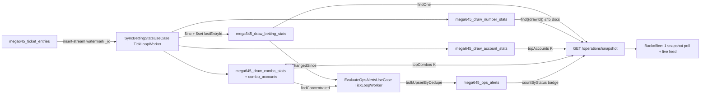

# Mega 6/45 — Operations & Risk Control (Analysis)

> **Status**: `reviewed` — user chốt 4 câu hỏi mở 06/08/2026, sẵn sàng triển khai plans (§9) · **Ngày**: 05/08/2026, review 06/08/2026
> **Nguồn tham chiếu**: [`power655-operations-risk-control.analysis.md`](./power655-operations-risk-control.analysis.md) (TEMPLATE BẮT BUỘC cho game jackpot — §10 của tài liệu đó) · [`keno-operations-risk-control.analysis.md`](./keno-operations-risk-control.analysis.md) · `.cursor/rules/mega645-game-rules.mdc` · code Mega 6/45 đọc trực tiếp 05/08/2026.
>
> **VAI TRÒ TÀI LIỆU**: Analysis thứ HAI trong nhóm game jackpot, viết theo đúng chuẩn Power 6/55 §10. Mọi quyết định đã chốt tại Power 6/55 (khung 2 worker, ma trận lưu trữ, exposure 2 phần, comboKey theo board, kỷ luật §7) được **giữ nguyên không bàn lại** — tài liệu này chỉ phân tích phần đặc thù Mega 6/45 và đối chiếu verdict với Power 6/55 (không phải với Keno).

---

## 0. TL;DR

Mega 6/45 có trang ops đúng kiến trúc thế hệ cũ (aggregate on-demand, ~7 timer polling trên `mega645_ticket_entries`) — giống hệt Power 6/55 TRƯỚC refactor. Chưa có stats worker, chưa có alert, chưa có exposure, chưa có `ops` config, và có 2 index chết `drawDate` trên entries.

Giải pháp: **port nguyên khung Power 6/55** (đang triển khai `.cursor/plans/power655-ops-risk-control/`) với các điều chỉnh theo đặc thù game — ít điều chỉnh hơn Power 6/55 từng phải làm so với Keno, vì Mega 6/45 ĐƠN GIẢN hơn Power 6/55:

1. **Single jackpot** (1 pool duy nhất, không JP2, không bonus number, không overflow 300 tỷ) → exposure 2 phần như Power 6/55 nhưng jackpot phần chỉ 1 số: `jackpotExposure = closingAmount` (hoặc `cycle.currentAmount`).
2. **Chơi Bao giống hệt Power 6/55 về cấu trúc** (bao5, bao7–bao15, bao18) nhưng số ghép bao5 = 40 (45−5) và giá Bao 18 = 185,64tr y hệt → alert `bao_high_stake` giữ nguyên, comboKey theo BOARD.
3. **Không có bonus number** → xác định tier chỉ bằng `matchCount`; heatmap 45 số 1 chiều (không có chiều `numberKind` như Lotto 5/35 sẽ cần).
4. **Không Split Cycle** (đã xác minh code: `MEGA645_SPLIT_ELIGIBLE_TIERS`/`splitEligible` là di sản template, KHÔNG có code path settle nào dùng — chốt XOÁ trong p0-01, §8 Q2) → phần minh bạch chia thưởng đơn giản hơn Lotto 5/35, giống Power 6/55 (chia jackpot theo betCount).
5. **Bug settle đã xác nhận, chốt SỬA trước p1-01**: `patch-jackpot-prize.ts` chia sai khi 1 entry có nhiều board cùng phủ bộ trúng (map betCount ghi đè) — plan fix riêng [`mega645-fix-jackpot-betcount.plan.md`](../plans/mega645-ops-risk-control/mega645-fix-jackpot-betcount.plan.md), port pattern Power 6/55 đã đúng.
6. Cửa sổ bán ~2–3 ngày/kỳ (3 kỳ/tuần T4/T6/CN 18h) → mọi quyết định "tách collection cho dữ liệu unbounded" của Power 6/55 áp dụng nguyên.

---

## 1. Bối cảnh & mục tiêu

Mega 6/45 là game jackpot phổ thông nhất nhóm Vietlott-style: jackpot đơn seed 12 tỷ tích luỹ vô hạn, vé Bao tới 185,64tr/board, bán ~2–3 ngày/kỳ, 3 kỳ/tuần. Nhu cầu vận hành giống Keno/Power 6/55 đã phân tích: staff cần thấy **dòng tiền realtime, cược tập trung bất thường, vé nguy hiểm**, và được hệ thống **chủ động cảnh báo**.

Mục tiêu:

- Thay toàn bộ aggregation on-demand bằng pre-aggregated stats — BO đọc O(1), không đè `mega645_ticket_entries` mỗi 30s.
- Nền tảng alert-driven ops: `large_bet`, `combo_concentration`, `exposure_threshold`, `bao_high_stake`.
- Minh bạch chia jackpot cho player (combo popularity ownership-gated — bắt buộc theo checklist Power 6/55 §10.7).

## 2. Hiện trạng (đọc trực tiếp source, 05/08/2026)

### 2.1. Trang ops hiện tại — kiến trúc thế hệ cũ, giống Power 6/55 trước refactor

`apps/backoffice/src/app/(main)/games/mega645/operations/_lib/use-operations.ts` (441 dòng) — **~7 timer polling độc lập**:

| Hook | Route | Interval |
|---|---|---|
| `useDrawSelectorList` | `/mega645/operations/draw-selector` | 30s |
| `useOpsSummary` | `/summary` | 30s (dừng khi settled) |
| `useOpsTenantBreakdown` | `/tenant-breakdown` | 30s |
| `useOpsNumberFrequency` | `/number-frequency` | 60s |
| `useOpsPlayTypeDistribution` | `/playtype-distribution` | 60s |
| `useOpsLiveEntries` | `/live-entries` | 30s |
| `useOpsTopCombos` | `/top-combos` | 60s |

Mỗi route gọi 1 use-case aggregate on-demand trong `packages/game-mega645-application/src/use-cases/operations/` (`get-ops-summary`, `get-number-frequency`, `get-playtype-distribution`, `get-tenant-breakdown`, `get-top-combos`) → repo methods `aggregateOpsSummary`/`aggregateTenantBreakdown`/`aggregateNumberFrequency`/`aggregateTopCombos`/`aggregatePlayTypeDistribution` + `buildOpsFilter` (private) trong `entry-repo.ts` dòng 1059–1400. Filter theo `financialDate` + `status ≠ void`.

UI có sections `analytics/` (analytics-panels, live-feed, number-heatmap), `draw-management/` (CÓ `resettle-action.tsx` như Power 6/55), `kpi/` (kpi-strip 6 KpiCard, **không có exposure-card**), `result/` (winning-entries-dialog). **KHÔNG có section `alerts/`**.

### 2.2. Bốn phát hiện kỹ thuật (đối chiếu từng dòng code)

1. **2 index chết `drawDate` trên `mega645_ticket_entries`** — `packages/game-mega645/src/indexes/index.ts` dòng 71–82 khai `idx_tenant_account_drawDate` (`{tenantId, accountId, drawDate: -1}`) và `idx_tenant_drawDate_status` (`{tenantId, drawDate, status}`) — field `drawDate` **KHÔNG tồn tại** trên `TicketEntryDoc` (entry chỉ có `drawId` + `financialDate`, xem `entities/entry.ts` dòng 176–178). Đúng bug "index lệch field" Keno/Power 6/55 từng có (Power 6/55 có 3 index chết, Mega 6/45 có 2 — thiếu bản `idx_drawDate_status` toàn cục). Repo ops filter theo `financialDate` (`buildOpsFilter` dòng 1059) và đã có `idx_tenant_financialDate_status` sẵn.
2. **Chưa có hạ tầng stats/alert nào**: `GlobalConfigDoc` (4 section `jackpot`/`rates`/`defaultPrizes`/`play`) không có section `ops`, không có `payoutCaps`; grep `potentialWin|exposure` toàn `packages/game-mega645*` = 0 match; `Mega645Collections` không có collection stats nào; `apps/worker-mega645` chỉ có 5 nhóm function (settle/resettle/void/feed/outstanding), không có `stats.yml`.
3. **Trang config game chưa có tab "Vận hành"**: `config/game/_lib/` chỉ có 4 section (jackpot, prizes, rates, play) — Power 6/55 đã thêm `ops-section.tsx`.
4. **Di sản gây nhiễu — CHỐT XOÁ (user 06/08, Q2)**: `packages/game-mega645/src/entities/enums.ts` dòng 67–75 còn `MEGA645_SPLIT_ELIGIBLE_TIERS` + `rules/prize-tiers.ts` field `splitEligible` — copy từ template Lotto 5/35, **KHÔNG có code path settle nào dùng** (grep `splitEligible|SPLIT_ELIGIBLE` 06/08: chỉ định nghĩa + tự tham chiếu, 0 caller ngoài; grep `split` toàn application: chỉ toàn comment "KHÔNG có Split Cycle"). Giữ nguyên sẽ khiến người đọc analysis/entities hiểu nhầm Mega 6/45 có split. Xử lý: **XOÁ hẳn** const `MEGA645_SPLIT_ELIGIBLE_TIERS`, field `splitEligible` khỏi `PrizeTierRule` + 4 chỗ gán trong `DEFAULT_PRIZE_TIER_RULES`, và mệnh đề "splitEligible" trong JSDoc dòng 209-tương-đương — thực hiện trong p0-01.

### 2.3. Luật chơi → cấu trúc rủi ro (đối chiếu `rules/` + `entities/` + `mega645-game-rules.mdc`)

Nguồn: `rules/prize-tiers.ts`, `rules/jackpot.ts` (`DEFAULT_MEGA645_CONFIG`), `rules/play-types.ts` (`PLAY_TYPE_CONFIGS`), `entities/types.ts` (`BAO_COMBINATIONS`), `entities/entry.ts`.

- **Giải cố định**: tier1 (5/6) = 10tr/lần, tier2 (4/6) = 300k, tier3 (3/6) = 30k. `determineTier(matchCount)`: 6→jackpot; 5→tier1; 4→tier2; 3→tier3; <3→null. **KHÔNG có bonus number** — đơn giản hơn Power 6/55 (không có nhánh 5+bonus→JP2).
- **Single jackpot**: seed 12 tỷ, tích luỹ vô hạn KHÔNG trần/overflow (khác Power 6/55 có overflow 300 tỷ → JP2). Tích luỹ residual: `jackpotContribution = max(revenue − fixedPrizes − commission − actualCompanyTake, 0)` (`calculateDrawFinancials`). **Chia JP theo tỷ lệ betCount** (`jackpotPerUnit = floor(pool / ΣbetCount)` — `patch-jackpot-prize.ts` dòng 96–101), KHÔNG chia đều per người. Không Split Cycle (§2.2-4).
- **Chơi Bao** — nguồn rủi ro tập trung tiền lớn nhất (bảng giống Power 6/55, chỉ khác bao5):

| PlayType | Số chọn | Lines | Giá vé (10k/line) |
|---|---|---|---|
| `standard` | 6 | 1 | 10.000 |
| `bao5` | 5 | **40** (ghép 40 số còn lại, 45−5) | 400.000 |
| `bao7`–`bao15` | 7–15 | C(N,6): 7→7 … 15→5005 | 70k → 50,05tr |
| `bao18` | 18 | 18.564 | **185.640.000** |

  1 board Bao 18 (chưa nhân `betCount` ≤ 10) = 185,64tr — y hệt Power 6/55 (cùng unitPrice 10k, cùng C(18,6)). Bao 18 trúng jackpot nếu 6 số quay nằm trọn trong 18 số chọn.
- **Entry shape** (`TicketEntryDoc`): `amount = betUnitCount × unitPrice`; `betUnitCount = Σ(expandedLines × betCount)` per board; `entrySummary.boards[]` (`boardNo` A–**F** — 6 boards, nhiều hơn Power 6/55 1 board, `playType`, `numbers`, `expandedLines`, `betCount`); có `username` + `financialDate` + `version`. `matchResult` chi tiết nằm trên line doc (`mega645_ticket_lines`), tạo lúc settle.
- **Nhịp kỳ**: 3 kỳ/tuần (**T4/T6/CN 18h00** — khác Power 6/55 T3/T5/T7), 1 kỳ active tại 1 thời điểm, bán ~2–3 ngày, đóng bán trước 5 phút (khác Power 6/55 15 phút), `maxDrawCount = 6`, `maxBetCount = 10`.
- **Xác suất** (từ `mega645-game-rules.mdc` §7): không gian mẫu C(45,6) = 8.145.060 (nhỏ hơn Power 6/55 C(55,6) ≈ 28,99tr ~3,6 lần) — P(jackpot per line) = 1/8.145.060; P(tier1) = 1/34.808. Cùng số tiền cược, xác suất "nổ" jackpot Mega 6/45 CAO hơn Power 6/55 ~3,6 lần → jackpot exposure hiện thực hoá nhanh hơn, KPI jackpot pool càng đáng theo dõi.

### 2.4. Ma trận rủi ro vận hành Mega 6/45

| # | Rủi ro | Tín hiệu | Mức |
|---|---|---|---|
| R1 | Vé đơn lẻ cực lớn (Bao 14–18) | `entry.amount` ≥ ngưỡng; board bao cao | Cao |
| R2 | Syndicate dồn 1 bộ số | Nhiều account distinct cùng comboKey | Cao |
| R3 | Fixed-prize exposure phình (5/6 = 10tr × sets) | `sets × tier1` vượt ngưỡng VND | Trung bình (tier1 10tr = ¼ Power 6/55 → ngưỡng thấp hơn) |
| R4 | Jackpot pool lớn + không gian mẫu nhỏ hút cược cuối kỳ | revenue spike khi pool cao | Trung bình (theo dõi KPI, chưa alert P0) |
| R5 | Nghẽn đọc BO đè collection entries | 7 timer × N staff aggregate on-demand | Đã hiện hữu |

---

## 3. Thiết kế database

### 3.1. Nguyên tắc bất biến — GIỮ NGUYÊN Power 6/55 §3.1 (gốc Keno + p2-01)

1. **KHÔNG đụng hot path place-bet** — worker đọc insert-stream async theo watermark.
2. **Delta-only, `$inc` + watermark per-doc** (`DeltaAccumulatedDoc` từ `@megawin/game-core/types`): `updateOne({...key, lastEntryId: {$lt: batchMaxId}}, {$inc: {...delta}, $set: {lastEntryId: batchMaxId}}, {upsert: true})` — nguyên tử trên 1 doc, idempotent, tự hội tụ sau crash. `bulkWrite {ordered: false}` qua `runDeltaBulkWrite`, duplicate key 11000 là no-op.
3. **Top-K theo metric TÍCH LUỸ không lưu mảng trong doc** — nuôi collection đầy đủ rồi `sort().limit(K)` lúc đọc. Top-K theo metric **bất biến per-item** (topPotential) an toàn nằm trong doc.
4. **KHÔNG có `resetFinal`/`recomputeFull`** — model cũ đã xoá toàn monorepo.

### 3.2. Ma trận quyết định lưu trữ — áp dụng nguyên Power 6/55 §3.2, đổi prefix

Nguyên tắc đã chốt tại Power 6/55 (user 05/08): cardinality bounded + key cố định → nhúng; unbounded theo người chơi/bộ số + cập nhật liên tục → **tách collection riêng**. Cửa sổ bán ~2–3 ngày/kỳ của Mega 6/45 tương đương Power 6/55 → giữ nguyên toàn bộ quyết định:

| Dữ liệu | Cardinality | Quyết định | Ghi chú Mega 6/45 |
|---|---|---|---|
| `totals` (revenue/entries/sets/commission/largeBetCount) | scalar | Nhúng | Counter thuần |
| `byPlayType` | **12 key cố định** | Nhúng | `standard` + `bao5` + `bao7`–`bao15` + `bao18` — đúng 12 key như Power 6/55 |
| `byTenant` | ~số tenant (nhỏ) | Nhúng | Record không phình |
| `exposure` | scalar | Nhúng | 1 counter TOÀN KỲ `fixedWorstCase`; jackpot đọc lúc build response — §3.6 |
| `topPotential` | K bounded | Nhúng (`$push/$sort/$slice`) | Metric bất biến per-entry |
| **Tần suất từng số** | **45 số** | **TÁCH** `mega645_draw_number_stats` | Chuẩn mới nhóm jackpot (Power 6/55 §3.3) — chừa đường chỉ số unbounded per số |
| **Per-account** | unbounded | **TÁCH** `mega645_draw_account_stats` | topAccounts chính xác, drill-down `large_bet` |
| **Per-combo (bộ số)** | unbounded | **TÁCH** `mega645_draw_combo_stats` + `_combo_accounts` | topCombos, rule `combo_concentration` |
| Alerts | unbounded theo sự kiện | **TÁCH** `mega645_ops_alerts` | Badge/panel BO, upsert dedupeKey |
| Per-line expanded | 18.564/board Bao 18 | **KHÔNG TẠO** | Thống kê theo board/combo là đủ; expand lines chỉ ở settle |
| Per-number liability | — | **KHÔNG TẠO** | Trúng theo bộ 6 số — kết luận toán học Keno §3.7/Power 6/55 §3.6 áp dụng nguyên |

### 3.3. Collection `mega645_draw_number_stats` — 1 doc / (draw × số)

Copy nguyên Power 6/55 §3.3 (đã là chuẩn cho nhóm jackpot), đổi range số:

```ts
/** mega645_draw_number_stats — unique {drawId, number}. */
interface Mega645DrawNumberStatsDoc extends DeltaAccumulatedDoc {
  _id: unknown;
  drawId: string;          // "YYYY-MM-DD.001"
  number: string;          // "01".."45" zero-padded
  /** Số bộ cược quy cho số này: Σ(board.expandedLines × betCount) các board chứa số. */
  sets: number;
  /** Dòng tiền quy cho số này (VND): Σ(board amount) các board chứa số — KHÔNG chia. */
  amount: number;
  /** Số board chứa số này (không nhân betCount) — phân biệt "nhiều người chọn" vs "ít người cược đậm". */
  boards: number;
  createdAt: Date;
  updatedAt: Date;
}
```

Đếm theo `board.numbers` (5–18 số/board tuỳ playType), **KHÔNG expand lines** — 1 board Bao 18 chạm đúng 18 doc số. Không có chiều `numberKind` (Mega 6/45 chỉ có 1 loại số — khác Lotto 5/35 tương lai).

### 3.4. Collection `mega645_draw_betting_stats` — 1 document / draw

```ts
/** Thống kê 1 kiểu chơi. */
interface Mega645PlayTypeStat {
  amount: number;   // Σ tiền cược (VND)
  sets: number;     // Σ(expandedLines × betCount)
  boards: number;   // số board (không nhân) — Bao 18 amount lớn nhưng boards nhỏ
}

/** Exposure — cấu trúc 2 phần như Power 6/55 (§3.6). */
interface Mega645Exposure {
  /** Worst-case giải CỐ ĐỊNH (VND) = totals.sets × tier1 (RAW, mỗi line trúng tối đa tier1). */
  fixedWorstCase: number;
}

/** Vé nguy hiểm nhất theo fixed-potential — metric bất biến per-entry. */
interface Mega645TopPotential {
  entryId: string;
  accountId: string;
  username: string;       // snapshot, "" → UI fallback accountId
  amount: number;
  /** = entry.betUnitCount × tier1 (config snapshot lúc accumulate) — KHÔNG cộng jackpot share. */
  fixedPotential: number;
}

interface Mega645DrawBettingStatsDoc
  extends Omit<DrawBettingStatsBase, "lastEntryId">, DeltaAccumulatedDoc {
  _id: unknown;
  // Kế thừa base: drawId, updatedAt, final, totals (DrawBettingTotals), byTenant
  byPlayType: Record<PlayType, Mega645PlayTypeStat>;  // 12 key cố định
  exposure: Mega645Exposure;
  topPotential: Mega645TopPotential[];                // cắt theo ops.stats.topPotentialK
}
```

KHÔNG có `numberFreq` (tách §3.3), KHÔNG có `topAccounts`/`topCombos` (derive lúc đọc §3.5). `final` đóng dấu ở trạng thái TERMINAL (`Settled`/`Void`) — KHÔNG ở `SalesClosed` (mở bán lại được).

### 3.5. Collections account/combo — copy nguyên pattern Power 6/55 §3.5

- `mega645_draw_account_stats` — 1 doc/(draw × account): `{drawId, accountId, username ($set), amount, entries, sets}` + watermark. Nguồn `topAccounts` (sort amount desc limit K), `uniquePlayers` (count), drill-down `large_bet`.
- `mega645_draw_combo_stats` — 1 doc/(draw × comboKey): `{drawId, comboKey, playType, numbers[], sets, amount, accountCount}` + watermark. **`comboKey = "${playType}:${sortedNumbers.join(",")}"` theo BOARD** — vé Bao 18 = 1 combo doc, KHÔNG expand C(18,6). Field số đặt tên `numbers` khớp `EntryBoardSnapshot.numbers` (Power 6/55 dùng `mainNumbers` vì entity của nó tên vậy — đây là adapt tên field, không phải đổi thiết kế).
- `mega645_draw_combo_accounts` — 1 doc/(draw × combo × account): `{drawId, comboKey, accountId, username, sets, amount}` + watermark. `accountCount` trên combo doc sync bằng `countAccountsByCombo` + `syncAccountCounts` ($set tuyệt đối — counter phái sinh, rule mongodb §8.7).

### 3.6. Exposure — công thức Mega 6/45 (đơn giản hoá từ Power 6/55 §3.6)

Giữ nguyên cấu trúc 2 phần đã chốt cho game jackpot:

1. **Fixed worst-case** (trong stats doc, cộng dồn `$inc`):
   `fixedWorstCase = totals.sets × tier1` — mỗi line trúng TỐI ĐA giải cố định tier1 (5/6, 10tr default; tier2/tier3 luôn < tier1). RAW không cap; ngưỡng alert so bằng VND tuyệt đối (`ops.alerts.fixedExposureWarnAmount`). Lưu ý tier1 Mega 6/45 = 10tr = **¼** tier1 Power 6/55 (40tr) → cùng lượng sets, exposure nhỏ hơn 4 lần → ngưỡng default phải đặt riêng (§3.8), KHÔNG copy số của Power 6/55.
2. **Jackpot exposure** (KHÔNG cộng dồn — đọc snapshot lúc build response/eval alert):
   `jackpotExposure = closingAmount` từ `DrawJackpotSnapshot` (hoặc `jackpotCycle.currentAmount` khi draw chưa có snapshot — snapshot chỉ ghi khi settle). **1 số duy nhất** — đơn giản hơn Power 6/55 (JP1 + JP2). Jackpot bị chặn bởi pool: chia theo betCount (`jackpotPerUnit = floor(pool / ΣbetCount)`), nhiều winner không làm công ty trả quá pool → KHÔNG nhân số vé (nguyên tắc bất di dịch của nhóm jackpot — Power 6/55 §3.6).

`topPotential.fixedPotential = betUnitCount × tier1` — bất biến per-entry. KHÔNG cộng jackpot share (phụ thuộc số winner cuối kỳ — không bất biến, vi phạm §3.1-3).

Exposure là số liệu **TOÀN KỲ** — stats doc chỉ lưu 1 counter `fixedWorstCase`; `jackpotExposure` không lưu ở đâu (đọc pool lúc build response). KHÔNG có "exposure per số" — liability không quy được cho từng số vì trúng theo BỘ 6 số.

### 3.7. Collection `mega645_ops_alerts` — copy khung Power 6/55 §3.7, giữ nguyên bộ alert

Bộ alert type Mega 6/45 **trùng khớp Power 6/55** (cùng cấu trúc rủi ro: jackpot + Bao, không side bet, không payout cap):

```ts
export const Mega645OpsAlertType = {
  /**
   * Cược lớn. BẬT KHI: tồn tại entry có `entry.amount >= ops.alerts.largeBetAmount`
   * (worker đếm vào `totals.largeBetCount` lúc accumulate; evaluator bắn khi `largeBetCount > 0`).
   * Critical khi `largeBetCount >= 10`.
   */
  LargeBet: "large_bet",
  /**
   * Exposure giải cố định chạm ngưỡng. BẬT KHI:
   * `stats.exposure.fixedWorstCase >= ops.alerts.fixedExposureWarnAmount`.
   * Critical khi `fixedWorstCase >= 2 × fixedExposureWarnAmount`.
   */
  ExposureThreshold: "exposure_threshold",
  /**
   * Dồn cược 1 bộ số (syndicate). BẬT KHI: tồn tại combo doc có
   * `accountCount >= ops.alerts.comboAccountsWarn` (query index `{drawId, accountCount}`).
   * Critical khi `accountCount >= 2 × comboAccountsWarn`. dedupeKey = `combo:${comboKey}`.
   */
  ComboConcentration: "combo_concentration",
  /**
   * Vé Bao mức cược cao. BẬT KHI (đánh giá từ `byPlayType` — theo quyết định Power 6/55):
   * tồn tại playType trong nhóm bao cao có `byPlayType[pt].boards > 0` VÀ
   * `giá board chuẩn (BAO_COMBINATIONS[N] × unitPrice) >= ops.alerts.baoHighStakeAmount`.
   * Critical khi playType = bao18. Drill-down qua topPotential / live-entries.
   */
  BaoHighStake: "bao_high_stake",
  /** Để dành — KHÔNG bắn P0, chưa có rule. */
  RevenueAnomaly: "revenue_anomaly",
  /** Để dành — KHÔNG bắn P0, chưa có rule. */
  SettleStuck: "settle_stuck",
} as const;
```

JSDoc từng member ghi **điều kiện bật (công thức + field config) + điều kiện Critical** — quy tắc bắt buộc chốt tại Power 6/55 §3.7. `Mega645OpsAlertDoc extends OpsAlertBase { type }` — dedupeKey unique cùng drawId, `OpsAlertStatus`/`OpsAlertSeverity` từ game-core. KHÔNG có `jackpot_milestone` (đã chốt bỏ tại Power 6/55 Q4 — jackpot hiển thị KPI là đủ).

### 3.8. `GlobalConfigDoc.ops` + tab "Vận hành" trang config — copy khung Power 6/55 §3.8, đổi ngưỡng

```ts
interface Mega645OpsAlertsConfig {
  largeBetAmount: number;            // default 30.000.000 — ĐÃ CHỐT Q1 (đồng bộ Power 6/55, giá Bao y hệt)
  fixedExposureWarnAmount: number;   // default 500.000.000 — ĐÃ CHỐT Q1 (scale theo tier1: 10tr = ¼ Power 6/55 → ¼ của 2 tỷ)
  comboAccountsWarn: number;         // default 5 — ĐÃ CHỐT Q1
  baoHighStakeAmount: number;        // default 30.000.000 — ĐÃ CHỐT Q1 (đồng bộ Power 6/55; bao14 = 30,03tr chạm, bao13 = 17,16tr chưa)
  enabled: Record<Mega645OpsAlertType, boolean>;
}
interface Mega645OpsConfig {
  alerts: Mega645OpsAlertsConfig;
  stats: OpsStatsConfig;             // game-core: tickSeconds, topPotentialK, topAccountsK, topCombosK
}
```

Defaults **ĐÃ CHỐT** (user 06/08 — §8 Q1), ghi vào `DEFAULT_MEGA645_CONFIG.ops` tại p0-01 — staff chỉnh runtime qua tab "Vận hành" trang config game (mirror `power655/config/game/_lib/ops-section.tsx`). Zod schema route siết range; use-case KHÔNG validate lại (rule code-quality §8).

**Get config PHẢI trả default khi thiếu** (chuẩn Power 6/55 §3.8): `GetGameConfigUseCase` merge `DEFAULT_MEGA645_CONFIG.ops` khi (a) chưa có config doc, hoặc (b) doc cũ thiếu section `ops` — normalize tại MAPPER lúc đọc, không migration backfill. Worker (`beforeLoop`) đọc cùng đường.

### 3.9. Index mới + sửa index hiện có

Mới (thêm vào `MEGA645_INDEXES`):

| Collection | Index | Mục đích |
|---|---|---|
| `draw_betting_stats` | `{drawId: 1}` unique · `{final: 1}` · `{updatedAt: 1}` | findOne snapshot · hàng đợi worker · findChangedSince |
| `draw_number_stats` | `{drawId: 1, number: 1}` unique · TTL `{createdAt}` 90d | heatmap + upsert · retention |
| `draw_account_stats` | `{drawId: 1, accountId: 1}` unique · `{drawId: 1, amount: -1}` · TTL 90d | upsert · topAccounts · retention |
| `draw_combo_stats` | `{drawId: 1, comboKey: 1}` unique · `{drawId: 1, sets: -1}` · `{drawId: 1, accountCount: 1}` · TTL 90d | upsert · topCombos · rule concentration · retention |
| `draw_combo_stats` | `{drawId: 1, playType: 1, numbers: 1}` (multikey) | nhánh `$all` bao7–18 tính `jackpotUnits` — §3.10(3), bound theo playType |
| `draw_combo_accounts` | `{drawId: 1, comboKey: 1, accountId: 1}` unique · TTL 90d | upsert + drill-down |
| `ops_alerts` | `{drawId: 1, dedupeKey: 1}` unique · `{status: 1, severity: 1, createdAt: -1}` · TTL 180d | upsert dedupe · badge/panel |
| `ticket_entries` | `{_id: 1, drawId: 1}` (đối chiếu Keno/Power 6/55 khi implement `getEntriesForStatsAfter`) | insert-stream scan |
| `ticket_entries` | `{drawId: 1, accountId: 1}` | ownership-gate combo popularity §3.10 (hiện CHỈ có trên `ticket_lines`, chưa có trên entries) |

Sửa: **XOÁ 2 index chết** `idx_tenant_account_drawDate`, `idx_tenant_drawDate_status` trên `mega645_ticket_entries` (field `drawDate` không tồn tại — §2.2). Query báo cáo đã dùng `idx_tenant_financialDate_status` sẵn có.

### 3.10. Minh bạch chia thưởng cho player — BƯỚC KIỂM TRA BẮT BUỘC (Power 6/55 §10.7)

**Kết quả kiểm tra luật tính thưởng khi settle** (đọc `settle-entries.ts` / `patch-jackpot-prize.ts` / `finalize-settle.ts` / `calculate-financials.ts`, 05/08/2026) — trả lời câu hỏi *"Giải nào bị GIỚI HẠN tiền thưởng hoặc bị CHIA do nhiều người trúng?"*:

| Giải | Cap payout? | Chia thưởng? | Bằng chứng code | Kết luận |
|---|---|---|---|---|
| tier1/tier2/tier3 (cố định) | KHÔNG (grep `payoutCap` = 0 match; khác Keno) | KHÔNG — trả `unitAmount × betCount` per line, độc lập số winner | `settle-entries.ts` dòng 144: `winAmount = unitAmount * betCount` | Không cần minh bạch |
| Jackpot (duy nhất 1 pool) | KHÔNG có trần pool (roll-over vô hạn; khác Power 6/55 có overflow 300 tỷ) | **CÓ** — `jackpotPerUnit = floor(totalJackpotPrize / totalBetUnits)`, `totalBetUnits = Σ(betCount)` trên các line JP toàn kỳ; mỗi entry nhận `jackpotPerUnit × betCount` | `patch-jackpot-prize.ts` dòng 96–113 | **CẦN minh bạch** — player thắc mắc khi jackpot bị chia |
| Split Cycle | — | **KHÔNG TỒN TẠI** (đã xác minh §2.2-4: không có code path split; `splitEligible` là di sản template) | grep `split` toàn application = chỉ comment phủ định | Response minh bạch KHÔNG cần mô tả split (khác Lotto 5/35 tương lai) |

→ Port Power 6/55 p1-01-combo-transparency (`GET /games/mega645/draws/{drawId}/combo-popularity` + player-sdk `getComboPopularity`; BO staff `combo-lookup`), với các ràng buộc kế thừa nguyên (a)–(g) từ Power 6/55 §10.7:

1. **Ownership-gate nghiêm ngặt**: combo KHÔNG thuộc entry của account → trả `{found: false}` **đồng nhất** với "combo không tồn tại" — KHÔNG 403/404 (chống dò bộ số hệ thống).
2. **JSDoc SDK phải ghi rõ**: Mega 6/45 chia jackpot **per-draw across mọi line trúng** (giống Power 6/55, khác Keno cap per-combo) → `sets` cùng comboKey chỉ là **tín hiệu tham khảo** (lower bound), không phải mẫu số công thức.
3. **Mẫu số chính xác `jackpotUnits` cho bộ 6 số standard** — tính được trước giờ quay. Board phủ bộ S (6 số) theo playType — điều kiện phủ per-playType (bài học Power 6/55 §3.10(3): bao5 phủ theo `⊂`, KHÔNG bắt được bằng `$all` superset):
   - standard: `numbers = S` → 1 exact lookup `comboKey = "standard:S"` — O(1).
   - bao5: `numbers (5 số) ⊂ S` → 6 exact lookup các key `"bao5:<tập con 5 của S>"` (C(6,5) = 6) — O(1) × 6.
   - bao7–18: `numbers ⊇ S` → `find({drawId, playType: {$in: [bao7..bao18]}, numbers: {$all: S}})` trên index **`{drawId, playType, numbers}`** (§3.9) — bound theo playType, KHÔNG quét biển combo standard.
   - Mỗi nguồn: `betCount = sets / expandedLines[playType]` (nguyên vì `expandedLines` là hằng theo playType: standard 1, bao5 40, baoN C(N,6)).
   - **Xác minh toán với công thức chia thật**: khi S trúng jackpot, MỌI board phủ S sinh đúng 1 line JP (C(6,6)=1) với betCount của board đó → `totalBetUnits` của `patch-jackpot-prize.ts` = Σ betCount các board phủ S = đúng `jackpotUnits` tính trên combo_stats. Trả `jackpotUnits` khi combo tra là 6 số standard: "nếu bộ này trúng JP, pool chia cho đúng chừng này units". Board Bao tra cứu (5, 7–18 số) KHÔNG có mẫu số xác định trước khi quay → chỉ trả `sets`.
   - ⚠️ **Bug settle đã xác nhận — CHỐT SỬA (user 06/08, Q3), plan riêng [`mega645-fix-jackpot-betcount.plan.md`](../plans/mega645-ops-risk-control/mega645-fix-jackpot-betcount.plan.md)**: `patch-jackpot-prize.ts` build `Map<entryId, betCount>` từ line docs (dòng 87–90) bằng `set()` GHI ĐÈ — nếu 1 entry có **NHIỀU board cùng phủ bộ trúng** (VD board A standard S + board B bao7 ⊇ S) thì entry có 2 line JP nhưng map chỉ giữ 1 betCount → `totalBetUnits` thiếu, chia sai tỷ lệ giữa winners; kèm 2 lỗi liên đới (line patch dùng betCount cấp entry cho từng line → Σ line.winAmount ≠ entry amount; `unitAmount` ghi bằng tổng tiền thay vì per-unit). Đọc sâu 06/08 xác nhận **Power 6/55 ĐÃ xử lý đúng** (`patchJackpotTier` cộng dồn betCount per entry) — Mega 6/45 là bản cũ chưa port. Fix là **PREREQUISITE của p1-01**: sau fix, `jackpotUnits` từ combo_stats khớp chính xác `totalBetUnits` của công thức chia; response minh bạch KHÔNG tự "bù" theo bug.
4. Bài học Keno 28/07 áp dụng nguyên: chỉ trả field là **input của công thức chia** (`sets`, `jackpotUnits`, `boardPrice`). TUYỆT ĐỐI không trả `amount`/`accountId`/`username` cho player. Response kèm `boardPrice = unitPrice × expandedLines` (chuẩn Power 6/55 review 05/08).
5. Phụ thuộc data p0-02 (combo stats worker) → xếp phase **P1** sau khi P0 chạy ổn.
6. **CHANGELOG player-sdk**: entry `[1.1.0] - 2026-07-28` **CHƯA release** (`package.json` = `1.0.18`, đã đối chiếu 05/08) → phần Added Mega 6/45 **ghi TIẾP vào entry `[1.1.0]`** (dưới khối Keno/Power 6/55), KHÔNG tạo entry mới, KHÔNG bump — quy tắc chung đã chốt Power 6/55 §3.10(6).
7. **UI backoffice — tra combo trên heatmap** theo chuẩn Power 6/55 §3.10(7) (copy Keno `number-heatmap.tsx`): mọi ô số là `<button aria-pressed>` multi-select; menu (DropdownMenu `MoreHorizontal`) LUÔN bật mở dialog tra cứu; CSV input + chips đồng bộ 2 chiều; playType TỰ SUY theo số lượng đã chọn — **Mega 6/45: 5 = bao5, 6 = standard, 7–15 = baoN, 18 = bao18** (16/17 số không map → hint client-side; API trả 400 là chốt chặn cuối); kết quả kèm `boardPrice`; hiển thị người chơi qua `PlayerName` (rule `player-display-username.mdc`) — chỉ ở BO staff combo-lookup, không ở player API.

---

## 4. Worker — kiến trúc & thuật toán (mirror Power 6/55 §4, đổi prefix)

### 4.1. Kiến trúc tổng thể



2 worker ĐỘC LẬP, 2 lock riêng (quyết định `keno-stats-worker-simplification`, giữ nguyên qua Power 6/55):

- `SyncBettingStatsUseCase extends TickLoopWorker<void, SyncBettingStatsResult>` — lock `"mega645:stats-sync"`, `ttlSeconds = 120`.
- `EvaluateOpsAlertsUseCase extends TickLoopWorker<void, EvaluateOpsAlertsResult>` — lock `"mega645:ops-alerts"`, `ttlSeconds = 120`.

Deploy: `apps/worker-mega645/src/functions/stats.yml` — 2 function, `timeout: 120`, `cron(* * * * ? *)` mỗi phút, `budgetMs = 55_000` — copy nguyên `apps/worker-power655/src/functions/stats.yml` (đang triển khai) / `worker-keno`. Handlers: `src/handlers/stats/stats-sync.ts` + `ops-alerts.ts` (singleton `.run()`). Thêm dòng `- ${file(src/functions/stats.yml)}` vào `serverless.yml` (hiện có 5 nhóm: settle/resettle/void/feed/outstanding).

Nhịp thực tế: 1 kỳ active (3 kỳ/tuần T4/T6/CN) → mỗi tick thường quét 1 draw doc — load thấp như Power 6/55. Giá trị chính ở cửa sổ bán 2–3 ngày: staff đủ thời gian phản ứng alert syndicate/cược lớn.

### 4.2. `SyncBettingStatsUseCase` — thuật toán (copy khung, đổi accumulator)

- Constants giữ nguyên: `READ_BATCH = 1_000`, `MAX_ENTRIES_PER_DRAW_PER_TICK = 20_000`, `MAX_DRAWS_PER_TICK = 200`.
- `beforeLoop`: đọc GlobalConfig 1 lần → `PrizeContext { tier1 }` + `statsConfig = config.ops.stats`; **enroll**: `drawRepo.listUnfinishedDrawIds()` → `statsRepo.ensureDocs(ids)` (1 bulkWrite, `$setOnInsert {final: false, lastEntryId: MIN_OBJECT_ID}`).
- `resolveTickMs` = `statsConfig.tickSeconds × 1000`.
- `runTick`: `statsRepo.findNotFinal(200)` (projection mỏng `{drawId, lastEntryId}`) → `drawRepo.getStatusesByDrawIds` → per-draw `syncDraw`:
  1. Đọc entries `_id > watermark` batch 1000 (`entryRepo.getEntriesForStatsAfter` — projection: `_id, accountId, username, tenantId, amount, betUnitCount, entrySummary.boards, tenant.commissionAmount`).
  2. Gom qua `Mega645StatsAccumulator` (delta-only, §4.3).
  3. `writeBatch` thứ tự: comboAccounts → combo → `countAccountsByCombo` + `syncAccountCounts` → accountStats → numberStats → stats doc (`applyDelta`, watermark tổng) ghi CUỐI.
  4. `extendLock()` trong vòng đọc; mất lock → throw `LockTakenOverError`.
  5. Kỳ TERMINAL (`Settled`/`Void`) + drained → `stampFinal`. 1 kỳ lỗi → `recordStalledItem`, không chết tick.

### 4.3. `Mega645StatsAccumulator` — pure, delta-only

Input 1 entry → deltas:

- `totals`: `revenue += amount`, `entries += 1`, `sets += betUnitCount`, `commission += tenant.commissionAmount`, `largeBetCount += (amount ≥ largeBetAmount ? 1 : 0)`.
- `byPlayType[board.playType]`: `amount += boardAmount`, `sets += expandedLines × betCount`, `boards += 1` (boardAmount = `expandedLines × betCount × unitPrice`).
- `byTenant[tenantId]`: `amount/entries/commission`.
- `exposure.fixedWorstCase += betUnitCount × tier1`.
- `topPotential`: `{entryId, accountId, username, amount, fixedPotential}` — Mongo `$push + $sort + $slice` theo `topPotentialK`.
- Number deltas: per số trong `board.numbers` → `{sets += expandedLines × betCount, amount += boardAmount, boards += 1}` (cộng TRỌN board, không chia).
- Combo deltas: per board → key `${playType}:${sortedNumbers}` → `{sets, amount}` + combo-account delta per (combo × account).

Xuất `drainStatsDelta()` / `drainNumberDeltas()` / `drainComboDeltas()` / `drainAccountDeltas()` — KHÔNG đọc baseline từ DB.

### 4.4. `EvaluateOpsAlertsUseCase` + `evaluate-alerts.ts` (pure)

Copy khung Power 6/55 §4.4: `MAX_DOCS_PER_TICK = 50`, `MAX_CONCENTRATED_COMBOS = 50`; cursor = `updatedAt` lớn nhất đã đánh giá (persist `setCursor` trên lock doc, at-least-once — an toàn vì alert upsert dedupe). Lỗi 1 kỳ → break, KHÔNG tiến cursor.

Rules trong `evaluate-alerts.ts` (pure, unit-test được):

| Rule | Điều kiện | dedupeKey | Critical khi |
|---|---|---|---|
| `large_bet` | `totals.largeBetCount > 0` | `large_bet` | ≥ 10 entry |
| `exposure_threshold` | `fixedWorstCase ≥ fixedExposureWarnAmount` | `exposure_threshold` | ≥ 2× ngưỡng |
| `combo_concentration` | combo có `accountCount ≥ comboAccountsWarn` | `combo:${comboKey}` | ≥ 2× ngưỡng |
| `bao_high_stake` | từ `byPlayType`: playType nhóm bao cao có `boards > 0` VÀ giá board chuẩn (`BAO_COMBINATIONS[N] × unitPrice`) ≥ `baoHighStakeAmount` | `bao_high_stake` | có board `bao18` |

Với default `baoHighStakeAmount` 30tr: bao14 (30,03tr) / bao15 (50,05tr) / bao18 (185,64tr) chạm ngưỡng; bao13 (17,16tr) chưa. Alert đánh giá TỪ STATS pre-aggregate — evaluator không đụng `ticket_entries`.

---

## 5. API + UI backoffice — snapshot model (follow Power 6/55 §5)

### 5.1. API routes `apps/backoffice/src/app/api/mega645/operations/`

| Route | Thay đổi | Nguồn dữ liệu |
|---|---|---|
| `snapshot` | **MỚI** | `GetOpsSnapshotUseCase`: findOne stats doc + find number_stats (≤45) + topAccounts K + topCombos K + alert badge count — 1 response gộp |
| `alerts` + `alerts/[id]/ack` | **MỚI** | `ListAlertsUseCase` / `AckAlertUseCase` |
| `combo-lookup` | **MỚI** | Tra 1 bộ số: combo doc + danh sách account (`_combo_accounts`) — staff only |
| `draw-selector`, `live-entries`, `winning-entries` | GIỮ | Không đổi (live-entries đọc entries mới nhất — không phải aggregation) |
| `summary`, `tenant-breakdown`, `number-frequency`, `playtype-distribution`, `top-combos` | **XOÁ** | Thay bằng snapshot |

### 5.2. UI `(main)/games/mega645/operations/`

- **Từ ~7 timer về 2 nhịp — live feed DÙNG CHUNG nhịp snapshot** (chuẩn mới chốt tại Power 6/55 §5.2, Q6): `useDrawSelectorList` (15s) + **1 nhịp chung `ops.stats.tickSeconds`** cho cả `useOpsSnapshot` lẫn `useLiveFeed` (live feed chỉ chạy khi tab analytics mở; cả 2 dừng khi draw settled). Mega 6/45 bán 2–3 ngày/kỳ — lý do gộp nhịp của Power 6/55 áp dụng nguyên. Badge alert đọc từ snapshot — KHÔNG timer riêng; panel alerts tải chi tiết on-demand.
- **Giữ đặc thù Mega 6/45**: KPI jackpot 1 pool (đọc từ jackpot cycle — đã có sẵn `useJackpotCurrent`), `resettle-action` trong draw-management (đã có), thêm **exposure-card** (fixed worst-case + jackpot pool, ngưỡng từ snapshot — KHÔNG hardcode client) + section **`alerts/`** mới (format payload theo type, không lộ JSON).
- Heatmap **45 số** 2 chỉ số (`sets`/`amount` toggle) **+ cơ chế chọn số tra combo trực tiếp trên heatmap** theo chuẩn §3.10(7) (multi-select, menu mở dialog — copy `keno/.../number-heatmap.tsx`, tham chiếu bản Power 6/55 đang triển khai), phân bố 12 playType (nhấn nhóm Bao cao), topCombos hiển thị `numbers + playType + sets + accounts`, topAccounts ưu tiên username kèm accountId.
- Tab structure theo `operations-page-ui.mdc` hiện hành (Giám sát / Phân tích cược).
- **Best practice UI bắt buộc** (chuẩn Power 6/55 §5.2): shadcn/ui theo skill `.cursor/skills/shadcn`; `next-best-practices` (RSC boundaries); `vercel-react-best-practices` (không waterfall, derive đúng chỗ, conditional rendering tường minh); `vercel-composition-patterns` (compound components); `frontend-design`/`web-design-guidelines` cho layout mới (exposure-card, alerts panel).

### 5.3. Kỷ luật xoá dead code (BẮT BUỘC)

Khi snapshot model hoạt động, xoá theo chuỗi use-case → route → hook → component props → query-keys:

- Use-cases: `get-ops-summary`, `get-number-frequency`, `get-playtype-distribution`, `get-tenant-breakdown`, `get-top-combos` (+ DTO `operations.dto.ts` phần tương ứng, barrel `operations/index.ts`, `helpers.ts` nếu không còn caller).
- Repo methods `entry-repo.ts`: `aggregateOpsSummary` (dòng 1072), `aggregateTenantBreakdown` (1120), `aggregateNumberFrequency` (1171), `aggregateTopCombos` (1239), `aggregatePlayTypeDistribution` (1332) + `buildOpsFilter` (1059) nếu không còn caller.
- Routes + Zod schema trong `api/mega645/operations/`: `summary`, `tenant-breakdown`, `number-frequency`, `playtype-distribution`, `top-combos`.
- Hooks `useOpsSummary`/`useOpsTenantBreakdown`/`useOpsNumberFrequency`/`useOpsPlayTypeDistribution`/`useOpsTopCombos` + query-keys trong `lib/query-keys/mega645.ts`.

GIỮ: `get-draw-selector`, `get-live-entries`, `get-winning-entries` + repo methods chúng dùng (`getLatestEntriesByDrawId`, `countEntriesByDrawId`, `getWinningEntries`...).

---

## 6. So sánh quyết định với Power 6/55 — bảng verdict

Đối chiếu với Power 6/55 (KHÔNG phải Keno — theo quy trình §10 template):

| Hạng mục | Power 6/55 | Mega 6/45 | Verdict |
|---|---|---|---|
| Stats doc 1 doc/draw, watermark idempotent | ✅ | Giữ nguyên | **keep** |
| 2 worker TickLoopWorker, 2 lock, cron 1 phút | ✅ | Giữ nguyên | **keep** |
| Accumulator delta-only, không baseline | ✅ | Giữ nguyên | **keep** |
| topAccounts/topCombos derive lúc đọc | ✅ | Giữ nguyên | **keep** |
| `numberFreq` tách `draw_number_stats` | ✅ (55 số) | Giữ nguyên (45 số, không `numberKind`) | **keep** |
| Exposure fixed (sets × tier1) + jackpot pool-bounded | ✅ (JP1 + JP2 = 2 pool) | **jackpot 1 pool duy nhất** (`closingAmount`/`cycle.currentAmount`) | **adapt** — single jackpot, không JP2/overflow (§3.6) |
| topPotential theo `fixedPotential = betUnitCount × tier1` | ✅ (tier1 = 40tr) | Giữ công thức (tier1 = 10tr) | **keep** — chỉ khác giá trị config |
| Bộ alert: large_bet / exposure / combo / bao_high_stake | ✅ | **Trùng khớp 100%** | **keep** — cùng cấu trúc rủi ro |
| Alert `bao_high_stake` ngưỡng | bao14+ chạm 30tr | bao14+ chạm 30tr (bảng giá y hệt) | **keep** |
| comboKey theo BOARD, không expand lines | ✅ (field `mainNumbers`) | Giữ nguyên (field `numbers` — khớp entity) | **keep** (adapt tên field) |
| 1 nhịp chung `tickSeconds` cho snapshot + live feed | ✅ | Giữ nguyên | **keep** |
| Get-config merge default `ops` khi thiếu | ✅ | Giữ nguyên | **keep** |
| Combo popularity + `jackpotUnits` cho bộ standard | ✅ (3 nhánh query: standard/bao5 ⊂/bao7-18 ⊇) | Giữ nguyên — bao5 ghép 40 số thay 50, C(6,5)=6 lookup không đổi | **keep** |
| Split trong response minh bạch | — (không split) | — (đã xác minh không split) | **keep** — khác Lotto 5/35 tương lai |
| Ngưỡng `fixedExposureWarnAmount` | 2 tỷ | **Đề xuất 500tr** (tier1 = ¼) | **adapt** — scale theo tier1 (§3.8, chờ chốt Q1) |
| Dọn di sản `splitEligible`/`MEGA645_SPLIT_ELIGIBLE_TIERS` | — | **XOÁ hẳn** trong p0-01 (chốt 06/08, Q2) | **add** — đặc thù codebase Mega 6/45 (§2.2-4) |
| Edge-case multi-board cùng phủ bộ JP trong 1 entry | Power 6/55 `patchJackpotTier` ĐÃ cộng dồn betCount per entry — đúng | **Bug thật ở Mega 6/45** — chốt SỬA (Q3), plan riêng `mega645-fix-jackpot-betcount.plan.md` | **fix** — port pattern Power 6/55 (§3.10-3) |

**Không có divergence THIẾT KẾ mới** — mọi cải tiến thiết kế của Power 6/55 (§6.1 bảng D1–D4 của tài liệu đó) được Mega 6/45 hưởng nguyên từ đầu. Nếu phát sinh divergence khi implement → thêm vào bảng D của Power 6/55, không mở bảng riêng.

---

## 7. Kỷ luật triển khai (BẮT BUỘC cho mọi plan phái sinh)

Áp dụng nguyên Power 6/55 §7:

1. **Rule/skill ràng buộc theo tầng**: `code-quality-standards.mdc` (const-as-const §5.3, không indexed-access §5.4, JSDoc, curly braces), `mongodb.mdc` (§7 TTL, §8 counter vô hướng + watermark per-doc), `entity-typesafe-mongodb.mdc`, `operations-page-ui.mdc`, `mega645-game-rules.mdc`. Tầng UI: skill `shadcn`, `next-best-practices`, `vercel-react-best-practices`, `vercel-composition-patterns`, `frontend-design`/`web-design-guidelines`.
2. **Type dùng chung từ `@megawin/game-core/types`**: `DrawBettingStatsBase`, `DrawBettingTotals`, `DeltaAccumulatedDoc`, `TenantBettingStat`, `TopAccountStat`, `OpsStatsConfig`, `OpsAlertBase`, `OpsAlertStatus/Severity` — KHÔNG tự định nghĩa lại. Field đặc thù (`byPlayType`, `exposure`, alert type union) khai trong `packages/game-mega645/src/entities/`.
3. **Worker health**: 2 use-case tự báo qua lock doc (`lastSuccessAt`/`lastError`/`stalledItems`) — hiện trên trang BO Workers sẵn có.
4. **Seed/normalize tại MAPPER lúc đọc** — không seed skeleton field nghiệp vụ lúc ghi.
5. **Không du nhập model cũ**: cấm `upsertFull`/`recomputeFull`/`resetFinal`.
6. Deploy per-app `turbo --filter=@megawin/worker-mega645...`; không đổi workspace/turbo config.
7. **Thứ tự triển khai so với Power 6/55**: Power 6/55 đang triển khai (plans đã duyệt 05/08) — Mega 6/45 nên bắt đầu SAU khi Power 6/55 P0 chạy ổn để copy code đã qua thực chiến (đặc biệt accumulator + repos + snapshot use-case, gần như đổi prefix + PrizeContext là xong).

## 8. Câu hỏi mở — ĐÃ CHỐT (user review 06/08/2026)

| # | Câu hỏi | Quyết định |
|---|---|---|
| Q1 | Ngưỡng default | **ĐÃ CHỐT**: `largeBetAmount` = 30tr và `baoHighStakeAmount` = 30tr **đồng bộ Power 6/55** (giá Bao y hệt); `fixedExposureWarnAmount` **scale theo tier1** = 500tr (tier1 10tr = ¼ Power 6/55 → ¼ của 2 tỷ); `comboAccountsWarn` = 5. Ghi vào `DEFAULT_MEGA645_CONFIG.ops` tại p0-01, staff chỉnh runtime qua tab "Vận hành" (§3.8) |
| Q2 | Di sản `MEGA645_SPLIT_ELIGIBLE_TIERS` + `splitEligible` | **ĐÃ CHỐT: XOÁ hẳn** (0 caller) — thực hiện trong p0-01 (§2.2-4) |
| Q3 | Bug `patch-jackpot-prize` map betCount ghi đè khi 1 entry nhiều board phủ bộ JP (§3.10-3) | **ĐÃ CHỐT: SỬA** — plan riêng [`mega645-fix-jackpot-betcount.plan.md`](../plans/mega645-ops-risk-control/mega645-fix-jackpot-betcount.plan.md): port pattern `patchJackpotTier` Power 6/55 (cộng dồn betCount per entry; line patch theo `line.betCount` riêng; `unitAmount = jackpotPerUnit`; xoá dead code `entryRepo.patchJackpotPrize`). Là prerequisite của p1-01 |
| Q4 | Thời điểm bắt đầu | **ĐÃ CHỐT**: analysis đã review xong (tài liệu này) — chuẩn bị triển khai plans §9; thứ tự thực thi giữ khuyến nghị §7.7 (P0 Mega 6/45 bắt đầu sau khi Power 6/55 P0 chạy ổn; riêng plan fix Q3 độc lập, làm được ngay) |

Các câu hỏi Power 6/55 đã chốt (tách number stats, tách combo, bao_high_stake từ byPlayType, bỏ jackpot_milestone, 1 nhịp chung, get-config merge default, combo popularity ownership-gated) — **KHÔNG hỏi lại**, áp dụng nguyên.

## 9. Plans phái sinh — sẵn sàng tạo (analysis đã duyệt 06/08)

**Plan fix độc lập (làm được ngay, không chờ P0):**

- **[`mega645-fix-jackpot-betcount.plan.md`](../plans/mega645-ops-risk-control/mega645-fix-jackpot-betcount.plan.md)** (ĐÃ VIẾT 06/08): sửa bug chia jackpot multi-board (Q3) — prerequisite của p1-01.

**Nhóm ops `.cursor/plans/mega645-ops-risk-control/`** — mirror cấu trúc `.cursor/plans/power655-ops-risk-control/` (master `00-overview.md` có bảng trạng thái + cột Review):

- **p0-01-foundation-entities-config-indexes**: Entities (betting-stats, number-stats, account-stats, combo-stats, ops-alert) + `ops` section GlobalConfig (defaults đã chốt Q1) + `MEGA645_INDEXES` (thêm mới + xoá 2 index chết) + **xoá di sản split** (Q2).
- **p0-02-stats-worker**: Repos + `Mega645StatsAccumulator` + 2 worker use-case + handlers + `stats.yml`.
- **p0-03-operations-api-ui**: Snapshot/alerts/combo-lookup API + UI refactor (1 nhịp chung, alerts panel, exposure card, heatmap 45 số + tra combo) + get-config merge default + tab config "Vận hành" + dead-code cleanup §5.3.
- **p1-01-combo-transparency**: Minh bạch chia jackpot cho player (§3.10) — endpoint `combo-popularity` ownership-gated + player-sdk `getComboPopularity` + `jackpotUnits` cho bộ 6 số standard. Sau P0 chạy ổn **VÀ sau khi plan fix Q3 merge**.

Mỗi plan có mục **Cách review** + **Cách test** + **Rủi ro & cách test rủi ro** ở cuối (chuẩn Power 6/55).

## 10. Nguồn & lịch sử quyết định

- 05/08/2026 — Khảo sát code Mega 6/45: đọc trực tiếp `rules/` (prize-tiers, jackpot, play-types), `entities/` (entry, draw, enums, types, global-config, jackpot-cycle), `indexes/`, settle pipeline (`settle-entries`, `patch-jackpot-prize`, `calculate-financials`, `finalize-settle`), `patch-jackpot-prize` + `line-repo.findJackpotLinesByDrawId` (xác minh công thức chia + phát hiện edge-case Q3); 2 explore subagents khảo sát hiện trạng ops/worker/config và settle/jackpot chi tiết.
- 05/08/2026 — Xác minh: (1) KHÔNG có Split Cycle trong code path settle (di sản `splitEligible` = 0 caller); (2) jackpot chia theo betCount per-draw (`jackpotPerUnit = floor(pool / totalBetUnits)`); (3) giải cố định không cap/không chia; (4) 2 index chết `drawDate` trên entries; (5) CHANGELOG SDK `[1.1.0]` chưa release (`package.json` 1.0.18) → ghi tiếp entry đó.
- 06/08/2026 — User review, chốt Q1–Q4 (§8). Đọc sâu bug Q3: xác nhận 3 lỗi liên đới (`totalBetUnits` thiếu do map ghi đè; line patch dùng betCount cấp entry; `unitAmount` sai semantic) + dead code `entryRepo.patchJackpotPrize` (0 caller) + **Power 6/55 `patchJackpotTier` đã đúng** (cộng dồn per entry, dòng 236–240) → viết plan fix riêng `mega645-fix-jackpot-betcount.plan.md`. Phát hiện thêm khi đối chiếu: Power 6/55 có lỗ hổng idempotency ngược lại (mẫu số tính từ lines chưa-patch — crash giữa chừng làm retry early-return) — ghi nhận trong plan fix §5, ngoài scope Mega 6/45.
- Template: `power655-operations-risk-control.analysis.md` §10 (checklist bắt buộc §10.7 đã thực hiện đầy đủ — bảng cap/chia per-tier §3.10).

