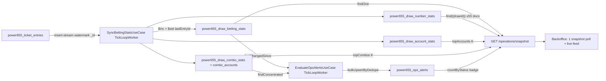

# Power 6/55 — Operations & Risk Control (Analysis)

> **Status**: `approved` (plan duyệt 05/08/2026) · **Ngày**: 04–05/08/2026
> **Nguồn tham chiếu**: [`keno-operations-risk-control.analysis.md`](./keno-operations-risk-control.analysis.md) · [`keno-stats-worker-simplification.analysis.md`](./keno-stats-worker-simplification.analysis.md) · code Keno canonical (đã hấp thụ p2-01 scale-hardening) · `.cursor/rules/power655-game-rules.mdc`
>
> **VAI TRÒ TÀI LIỆU — TIÊU CHUẨN CHO NHÓM GAME CÓ JACKPOT**: Đây là analysis ĐẦU TIÊN port mô hình ops/risk-control sang game có **jackpot tích luỹ**. Sau khi Power 6/55 hoàn thành, tài liệu này là **template tham chiếu bắt buộc** khi viết analysis cho **Mega 6/45** và **Lotto 5/35** (xem §10). Keno/Bingo18 là chuẩn cho game giải cố định; tài liệu này là chuẩn cho game jackpot.

---

## 0. TL;DR

Power 6/55 là game **cuối cùng** trong 5 game đã có trang ops mà chưa port mô hình stats worker mới (Keno, Bingo18, Max3D, Max3DPro đều đã chạy model delta). Trang ops hiện tại lặp đúng kiến trúc Keno CŨ: ~7 timer polling 7 route aggregate on-demand trên `power655_ticket_entries` — không scale, không có alert, không có exposure.

Giải pháp: port nguyên khung canonical của Keno — 2 worker `TickLoopWorker` (`stats-sync` + `ops-alerts`), pre-aggregate vào collection stats với watermark per-doc idempotent, backoffice đọc 1 snapshot endpoint — với các điều chỉnh theo đặc thù game:

1. **Dual jackpot** (JP1 6/6, JP2 5/6+bonus) → exposure tách 2 phần: fixed worst-case (chặn bởi `tier1`) + jackpot exposure (chặn bởi pool, KHÔNG nhân số vé).
2. **Chơi Bao** (bao5, bao7–bao15, bao18) → vé đơn lẻ có thể tới 185,64 triệu (Bao 18) → alert `bao_high_stake` mới; combo stats theo **BOARD** không theo line (tránh nổ 18.564 docs/vé).
3. **Không side bet, không payout cap** → bỏ `sidebet_skew`, `cap_sets_near`.
4. **Cửa sổ bán ~3 ngày/kỳ** (vs Keno 8 phút) → mỗi kỳ tích luỹ data LỚN hơn nhiều → các dữ liệu unbounded/cập-nhật-liên-tục **bắt buộc tách collection riêng**; kể cả `numberFreq` (55 số) cũng tách (quyết định user 05/08, khác Keno — xem §3.3).

---

## 1. Bối cảnh & mục tiêu

Power 6/55 là game jackpot doanh thu lớn nhất nhóm Vietlott-style: JP1 seed 30 tỷ không trần tích luỹ (overflow 300 tỷ chuyển JP2), vé Bao giá trị cao, cửa sổ bán 3 ngày. Nhu cầu vận hành giống Keno đã phân tích: staff cần thấy **dòng tiền realtime, cược tập trung bất thường, vé nguy hiểm** — và được hệ thống **chủ động cảnh báo** thay vì tự nhìn dashboard.

Mục tiêu:

- Thay toàn bộ aggregation on-demand bằng pre-aggregated stats — BO đọc O(1), không đè `power655_ticket_entries` mỗi 30s.
- Nền tảng alert-driven ops: `large_bet`, `combo_concentration`, `exposure_threshold`, `bao_high_stake`.
- Chuẩn hoá kiến trúc cho 2 game jackpot còn lại (Mega 6/45, Lotto 5/35 — §10).

## 2. Hiện trạng (đọc trực tiếp source, 04/08/2026)

### 2.1. Trang ops hiện tại — lặp lại đúng kiến trúc Keno CŨ (trước P0)

`apps/backoffice/src/app/(main)/games/power655/operations/_lib/use-operations.ts` — **~7 timer polling độc lập**:

| Hook | Route | Interval |
|---|---|---|
| `useDrawSelectorList` | `/power655/operations/draw-selector` | 30s |
| `useOpsSummary` | `/summary` | 30s (dừng khi settled) |
| `useOpsTenantBreakdown` | `/tenant-breakdown` | 30s |
| `useOpsNumberFrequency` | `/number-frequency` | 60s |
| `useOpsPlayTypeDistribution` | `/playtype-distribution` | 60s |
| `useOpsLiveEntries` | `/live-entries` | 30s |
| `useOpsTopCombos` | `/top-combos` | 60s |

Mỗi route gọi 1 use-case aggregate on-demand trong `packages/game-power655-application/src/use-cases/operations/` (`get-ops-summary`, `get-number-frequency`, `get-playtype-distribution`, `get-tenant-breakdown`, `get-top-combos`…) → repo methods `aggregateOpsSummary`/`aggregateNumberFrequency`/`aggregateTopCombos`/`aggregatePlayTypeDistribution`/`aggregateTenantBreakdown` trong `entry-repo.ts` (dòng 892–1250). Đây đúng là mô hình Keno đã bỏ: chi phí đọc tỷ lệ thuận số entry × số client × tần suất poll.

UI có sections `analytics/` (analytics-panels, live-feed, number-heatmap), `draw-management/` (có thêm `resettle-action.tsx` — Keno không có), `kpi/` (kpi-strip, **không có exposure-card**), `result/`. **KHÔNG có section `alerts/`**.

### 2.2. Ba phát hiện kỹ thuật (đối chiếu từng dòng code)

1. **Index chết `drawDate` trên `power655_ticket_entries`** — `packages/game-power655/src/indexes/index.ts` dòng 81–94 khai 3 index (`idx_tenant_account_drawDate`, `idx_tenant_drawDate_status`, `idx_drawDate_status`) trên field `drawDate` — field này **KHÔNG tồn tại** trên `TicketEntryDoc` (entry chỉ có `drawId` + `financialDate`, xem `entities/entry.ts:171`). Repo chỉ filter theo `financialDate` (`buildOpsFilter` dòng 892–895). Đúng bug "index lệch field" Keno từng có — 3 index này chiếm chỗ ghi mà không phục vụ query nào.
2. **Chưa có hạ tầng stats/alert nào**: `GlobalConfigDoc` không có section `ops`, không có `payoutCaps`; grep `potentialWin|exposure|ops` trên toàn `packages/game-power655*` = 0 match; `apps/worker-power655` chỉ có 5 nhóm function (feed/outstanding/settle/void/resettle), không có `stats.yml`.
3. **Power 6/55 là game cuối chưa port**: bingo18/max3d/max3dpro đều đã có `sync-betting-stats.ts` + `evaluate-ops-alerts.ts` model delta (`extends TickLoopWorker`, `applyDelta`/`bulkUpsertDelta`); grep `upsertFull|recomputeFull` toàn monorepo = 0 kết quả — model cũ đã bị xoá sạch, KHÔNG được du nhập lại.

### 2.3. Luật chơi → cấu trúc rủi ro (đối chiếu `rules/` + `entities/`)

Nguồn: `rules/prize-tiers.ts`, `rules/jackpot.ts` (`DEFAULT_POWER655_CONFIG`), `entities/types.ts` (`BAO_COMBINATIONS`), `entities/entry.ts`.

- **Giải cố định**: tier1 (5/6) = 40tr/lần, tier2 (4/6) = 500k, tier3 (3/6) = 50k. `determineTier(mainMatchCount, bonusMatched)`: 6→JP1; 5+bonus→JP2; 5→tier1; 4→tier2; 3→tier3.
- **Dual jackpot**: JP1 seed 30 tỷ, JP2 seed 3 tỷ; tích luỹ `= max(revenue − fixedPrizes − commission − actualCompanyTake, 0)` chia 90/10; overflow khi `!JP1winner && JP2winner && projectedJp1 > 300 tỷ`. **Chia JP theo tỷ lệ betCount** (`jackpotPerUnit = floor(pool / ΣbetCount)` — `patch-jackpot-prize.ts`), KHÔNG chia đều per người. Không có Split Cycle (khác Lotto 5/35).
- **Chơi Bao** — nguồn rủi ro tập trung tiền lớn nhất:

| PlayType | Số chọn | Lines | Giá vé (10k/line) |
|---|---|---|---|
| `standard` | 6 | 1 | 10.000 |
| `bao5` | 5 | 50 (ghép 50 số còn lại) | 500.000 |
| `bao7`–`bao15` | 7–15 | C(N,6): 7→5005 | 70k → 50,05tr |
| `bao18` | 18 | 18.564 | **185.640.000** |

  1 board Bao 18 (chưa nhân `betCount` ≤ 10) đã gần 186tr — bằng ~37 lần ngưỡng `large_bet` mặc định của Keno. Vé Bao lớn cũng phủ xác suất trúng rộng: Bao 18 trúng jackpot nếu 6 số quay nằm trong 18 số chọn.
- **Entry shape** (`TicketEntryDoc`): `amount = betUnitCount × unitPrice`; `betUnitCount = Σ(expandedLines × betCount)` per board; `entrySummary.boards[]` (`boardNo` A–E, `playType`, `mainNumbers`, `expandedLines`, `betCount`); có `username` + `financialDate` + `version`.
- **Nhịp kỳ**: 3 kỳ/tuần (T3/T5/T7 18h00), 1 kỳ active tại 1 thời điểm, bán ~3 ngày, đóng bán trước 15 phút, `maxDrawCount = 6`.

### 2.4. Ma trận rủi ro vận hành Power 6/55

| # | Rủi ro | Tín hiệu | Mức |
|---|---|---|---|
| R1 | Vé đơn lẻ cực lớn (Bao 13–18) | `entry.amount` ≥ ngưỡng; board bao cao | Cao |
| R2 | Syndicate dồn 1 bộ số | Nhiều account distinct cùng comboKey | Cao |
| R3 | Fixed-prize exposure phình (5/6 = 40tr × sets) | `sets × tier1` vượt ngưỡng VND | Trung bình |
| R4 | Jackpot pool lớn hút cược bất thường cuối kỳ | revenue spike + JP1 gần overflow | Trung bình (theo dõi, chưa alert P0) |
| R5 | Nghẽn đọc BO đè collection entries | 7 timer × N staff aggregate on-demand | Đã hiện hữu |

---

## 3. Thiết kế database

### 3.1. Nguyên tắc bất biến — GIỮ NGUYÊN Keno §3.1 + p2-01

1. **KHÔNG đụng hot path place-bet** — worker đọc insert-stream async theo watermark.
2. **Delta-only, `$inc` + watermark per-doc** (`DeltaAccumulatedDoc` từ `@megawin/game-core/types`): mọi update dạng `updateOne({...key, lastEntryId: {$lt: batchMaxId}}, {$inc: {...delta}, $set: {lastEntryId: batchMaxId}}, {upsert: true})` — nguyên tử trên 1 doc, idempotent, tự hội tụ sau crash. `bulkWrite {ordered: false}`, coi duplicate key 11000 là no-op (hành vi đúng thiết kế).
3. **Top-K theo metric TÍCH LUỸ không được lưu mảng trong doc** — phải nuôi collection đầy đủ rồi `sort().limit(K)` lúc đọc (bài học drift p2-01). Top-K theo metric **bất biến per-item** (topPotential) thì an toàn nằm trong doc.
4. **KHÔNG có `resetFinal`/`recomputeFull`** — model cũ đã xoá toàn monorepo.

### 3.2. Ma trận quyết định lưu trữ (TRỌNG TÂM — chuẩn cho game jackpot)

Nguyên tắc: **cardinality bounded + key cố định → nhúng trong stats doc (findOne O(1)); cardinality unbounded theo người chơi/bộ số + cập nhật liên tục → tách collection riêng**. Power 6/55 bán vé ~3 NGÀY/kỳ (vs Keno 8 phút) → 1 kỳ tích luỹ entry/account/combo lớn hơn nhiều lần — càng bắt buộc tách.

| Dữ liệu | Cardinality | Quyết định | Lý do |
|---|---|---|---|
| `totals` (revenue/entries/sets/commission/largeBetCount) | scalar | Nhúng | Counter thuần |
| `byPlayType` | 12 key cố định | Nhúng | `standard` + 11 loại Bao — hằng số nghiệp vụ |
| `byTenant` | ~số tenant (nhỏ) | Nhúng | Record không phình |
| `exposure` | scalar | Nhúng | 1 counter TOÀN KỲ `fixedWorstCase` (jackpot đọc lúc build response, KHÔNG lưu) — KHÔNG phải per-số, xem §3.6 |
| `topPotential` | K bounded | Nhúng (`$push/$sort/$slice`) | Metric bất biến per-entry |
| **Tần suất từng số** | 55 số × N chỉ số tương lai | **TÁCH** `power655_draw_number_stats` | Quyết định user 05/08 — xem §3.3 |
| **Per-account** | unbounded theo người chơi | **TÁCH** `power655_draw_account_stats` | topAccounts chính xác, drill-down `large_bet` |
| **Per-combo (bộ số)** | unbounded theo bộ số distinct | **TÁCH** `power655_draw_combo_stats` + `_combo_accounts` | topCombos, rule `combo_concentration` |
| Alerts | unbounded theo sự kiện | **TÁCH** `power655_ops_alerts` | Badge/panel BO, upsert dedupeKey |
| Per-line expanded | 18.564/board Bao 18 | **KHÔNG TẠO** | Thống kê theo board/combo là đủ; expand lines chỉ ở settle |
| Per-number liability | — | **KHÔNG TẠO** | Trúng theo bộ 6 số, không có liability per-number (kết luận toán học Keno §3.7 áp dụng nguyên) |

Vì sao KHÔNG lưu danh sách bộ số vào stats doc chung (chốt với user 05/08):

| Vấn đề | Nếu nhúng vào stats doc | Nếu tách collection |
|---|---|---|
| Kích thước doc | Phình theo bộ số distinct — kỳ 3 ngày dễ hàng chục nghìn combo → nguy cơ BSON 16MB | 1 doc/combo, kích thước cố định |
| Cập nhật | Read-modify-write mảng lớn mỗi vé → lost-update, chậm dần | `$inc` upsert 1 doc — không đọc trước, idempotent |
| Top combos | Mảng top-K tích luỹ trong doc → drift không tự sửa (bug Keno p2-01) | `sort({sets:-1}).limit(K)` trên index — chính xác tuyệt đối |
| Rule `combo_concentration` | Scan mảng, không index được | `{drawId, accountCount: {$gte: n}}` trên index |
| Drill-down "ai cược bộ số này" | Không có chỗ chứa | `_combo_accounts` đọc tức thì |

### 3.3. Collection `power655_draw_number_stats` — 1 doc / (draw × số) — KHÁC KENO CÓ CHỦ ĐÍCH

Keno nhúng `numberFreq` 80 key trong stats doc. Power 6/55 **tách riêng ngay từ đầu** (quyết định user 05/08/2026) dù 55 key là bounded:

- **Lý do chính**: chừa đường thêm chỉ số **unbounded** per số trong tương lai (drill-down account cược nhiều vào 1 số, time-series theo giờ trong cửa sổ bán 3 ngày) mà không refactor stats doc.
- **Lý do phụ**: đồng nhất 1 pattern ghi duy nhất (`bulkUpsertDelta` + watermark per-doc) với combo/account stats; index/sort per số độc lập.
- **Chi phí chấp nhận**: +1 collection/repo, mỗi batch thêm 1 bulkWrite ≤55 ops, snapshot API ghép 2 query (`findOne` stats + `find({drawId})` ≤55 docs) — vẫn O(1) thực tế.

```ts
/** power655_draw_number_stats — unique {drawId, number}. */
interface Power655DrawNumberStatsDoc extends DeltaAccumulatedDoc {
  _id: unknown;
  drawId: string;          // "YYYY-MM-DD.001"
  number: string;          // "01".."55" zero-padded
  /** Số bộ cược quy cho số này: Σ(board.expandedLines × betCount) các board chứa số. */
  sets: number;
  /** Dòng tiền quy cho số này (VND): Σ(board amount) các board chứa số — KHÔNG chia (theo Keno §3.7). */
  amount: number;
  /** Số board chứa số này (không nhân betCount) — phân biệt "nhiều người chọn" vs "ít người cược đậm". */
  boards: number;
  createdAt: Date;
  updatedAt: Date;
}
```

Đếm theo `board.mainNumbers` (5–18 số/board tuỳ playType), **KHÔNG expand lines** — 1 board Bao 18 chạm đúng 18 doc số, không phải 18.564.

### 3.4. Collection `power655_draw_betting_stats` — 1 document / draw

```ts
/** Thống kê 1 kiểu chơi. */
interface Power655PlayTypeStat {
  amount: number;   // Σ tiền cược (VND)
  sets: number;     // Σ(expandedLines × betCount) — khớp DrawBettingTotals.sets
  boards: number;   // số board (không nhân) — Bao 18 amount lớn nhưng boards nhỏ
}

/** Exposure — cấu trúc KHÁC KENO (xem §3.6). */
interface Power655Exposure {
  /** Worst-case giải CỐ ĐỊNH (VND) = totals.sets × tier1 (RAW, mỗi line trúng tối đa tier1). */
  fixedWorstCase: number;
}

/** Vé nguy hiểm nhất theo fixed-potential — metric bất biến per-entry. */
interface Power655TopPotential {
  entryId: string;
  accountId: string;
  username: string;       // snapshot, "" → UI fallback accountId
  amount: number;
  /** = entry.betUnitCount × tier1 (config snapshot lúc accumulate) — KHÔNG cộng jackpot share (xem §3.6). */
  fixedPotential: number;
}

interface Power655DrawBettingStatsDoc
  extends Omit<DrawBettingStatsBase, "lastEntryId">, DeltaAccumulatedDoc {
  _id: unknown;
  // Kế thừa base: drawId, updatedAt, final, totals (DrawBettingTotals), byTenant
  byPlayType: Record<PlayType, Power655PlayTypeStat>;  // 12 key cố định
  exposure: Power655Exposure;
  topPotential: Power655TopPotential[];                // cắt theo ops.stats.topPotentialK
}
```

KHÔNG có `numberFreq` (tách §3.3), KHÔNG có `topAccounts`/`topCombos` (derive lúc đọc §3.5). `final` đóng dấu ở trạng thái TERMINAL (`Settled`/`Void`) — KHÔNG ở `SalesClosed` (có thể mở bán lại).

### 3.5. Collections account/combo — copy nguyên pattern Keno, đổi comboKey

- `power655_draw_account_stats` — 1 doc/(draw × account): `{drawId, accountId, username ($set), amount, entries, sets}` + watermark. Nguồn `topAccounts` (sort amount desc limit K), `uniquePlayers` (count), drill-down `large_bet`.
- `power655_draw_combo_stats` — 1 doc/(draw × comboKey): `{drawId, comboKey, playType, mainNumbers[], sets, amount, accountCount}` + watermark. **`comboKey = "${playType}:${sortedMainNumbers.join(",")}"` theo BOARD** — vé Bao 18 = 1 combo doc (18 số đã chọn), KHÔNG expand C(18,6). Hai board cùng bộ số + cùng playType từ 2 người → cùng doc → tín hiệu syndicate.
- `power655_draw_combo_accounts` — 1 doc/(draw × combo × account): `{drawId, comboKey, accountId, username, sets, amount}` + watermark. `accountCount` trên combo doc sync bằng `countAccountsByCombo` + `syncAccountCounts` ($set tuyệt đối) như Keno.

### 3.6. Exposure — công thức Power 6/55 (KHÁC KENO CĂN BẢN — chuẩn cho game jackpot)

Keno: worst-case = Σ(units × maxPrize[playType]) rồi cap `maxPerDraw`. Power 6/55 KHÔNG có bảng maxPrize per playType và KHÔNG có cap — thay bằng cấu trúc 2 phần:

1. **Fixed worst-case** (nằm trong stats doc, cộng dồn `$inc`):
   `fixedWorstCase = totals.sets × tier1` — mỗi line trúng TỐI ĐA giải cố định tier1 (5/6 không bonus, 40tr default). Đây là trần tuyệt đối phần công ty trả từ doanh thu giải cố định (tier2/tier3 luôn < tier1 nên không cần tách). RAW không cap; ngưỡng alert so bằng VND tuyệt đối (`ops.alerts.fixedExposureWarnAmount`) vì không có `maxPerDraw` để tính %.
2. **Jackpot exposure** (KHÔNG cộng dồn — đọc snapshot lúc build response/eval alert):
   `jackpotExposure = closingJackpot1 + closingJackpot2` từ `DrawJackpot` (hoặc jackpot cycle hiện hành khi draw chưa có snapshot). Jackpot **bị chặn bởi pool**: chia theo tỷ lệ betCount (`jackpotPerUnit = floor(pool / ΣbetCount)`), nhiều winner không làm công ty trả quá pool → KHÔNG được nhân số vé như giải cố định. Đây là điểm mà mọi analysis game jackpot sau này (Mega 6/45, Lotto 5/35) phải giữ nguyên.

`topPotential.fixedPotential = betUnitCount × tier1` — bất biến per-entry (an toàn top-K). KHÔNG cộng jackpot share vì nó phụ thuộc số winner cuối kỳ (không bất biến) — vi phạm nguyên tắc §3.1(3).

**Làm rõ (thảo luận 05/08)**: exposure là số liệu **TOÀN KỲ** — trong stats doc chỉ lưu đúng 1 counter `fixedWorstCase`; `jackpotExposure` không lưu ở đâu cả (đọc pool lúc build response). KHÔNG có khái niệm "exposure per số" nên KHÔNG chuyển vào `draw_number_stats` — liability không quy được cho từng số vì trúng theo BỘ 6 số (kết luận toán học Keno §3.7, đã ghi ở ma trận §3.2 dòng "Per-number liability: KHÔNG TẠO").

### 3.7. Collection `power655_ops_alerts` — copy khung Keno §3.5, đổi bộ alert type

```ts
export const Power655OpsAlertType = {
  /**
   * Cược lớn. BẬT KHI: tồn tại entry có `entry.amount >= ops.alerts.largeBetAmount`
   * (worker đếm vào `totals.largeBetCount` lúc accumulate; evaluator bắn khi `largeBetCount > 0`).
   * Critical khi `largeBetCount >= 10`.
   */
  LargeBet: "large_bet",
  /**
   * Exposure giải cố định chạm ngưỡng. BẬT KHI:
   * `stats.exposure.fixedWorstCase >= ops.alerts.fixedExposureWarnAmount`.
   * Critical khi `fixedWorstCase >= 2 × fixedExposureWarnAmount`.
   */
  ExposureThreshold: "exposure_threshold",
  /**
   * Dồn cược 1 bộ số (syndicate). BẬT KHI: tồn tại combo doc có
   * `accountCount >= ops.alerts.comboAccountsWarn` (query index `{drawId, accountCount}`).
   * Critical khi `accountCount >= 2 × comboAccountsWarn`. dedupeKey = `combo:${comboKey}`.
   */
  ComboConcentration: "combo_concentration",
  /**
   * Vé Bao mức cược cao — MỚI, đặc thù Power 6/55. BẬT KHI (đánh giá từ `byPlayType` — chốt 05/08):
   * tồn tại playType trong nhóm bao13..bao18 có `byPlayType[pt].boards > 0` VÀ
   * `giá board chuẩn (BAO_COMBINATIONS[pt] × unitPrice) >= ops.alerts.baoHighStakeAmount`.
   * Critical khi playType = bao18. Drill-down chi tiết qua topPotential / live-entries.
   */
  BaoHighStake: "bao_high_stake",
  /** Để dành — KHÔNG bắn P0, chưa có rule. */
  RevenueAnomaly: "revenue_anomaly",
  /** Để dành — KHÔNG bắn P0, chưa có rule. */
  SettleStuck: "settle_stuck",
} as const;
```

**Quy tắc bắt buộc (chốt 05/08)**: JSDoc của TỪNG member trong enum alert type PHẢI ghi rõ **điều kiện bật** (công thức + tên field config tham chiếu) và **điều kiện nâng Critical** — như mẫu trên. Không chấp nhận JSDoc mô tả chung chung kiểu `/** Cược lớn. */`. Quy tắc này đồng bộ ngược về Keno (§6.1).

`Power655OpsAlertDoc extends OpsAlertBase { type }` — dedupeKey unique cùng drawId, upsert idempotent, `OpsAlertStatus`/`OpsAlertSeverity` từ game-core. **BỎ so với Keno**: `sidebet_skew` (không có side bet), `cap_sets_near` (không có payout cap). **BỎ `jackpot_milestone`** (user chốt 05/08 — không cần alert jackpot; JP1/JP2 đã hiển thị KPI trên trang ops).

### 3.8. `GlobalConfigDoc.ops` + tab "Vận hành" trang config — copy khung Keno §3.9, đổi ngưỡng

```ts
interface Power655OpsAlertsConfig {
  largeBetAmount: number;            // default 30.000.000 (user chốt 05/08 — vé Bao phổ biến lớn, ngưỡng cao hơn Keno)
  fixedExposureWarnAmount: number;   // default 2.000.000.000 (VND tuyệt đối — không có cap để tính %)
  comboAccountsWarn: number;         // default 5
  baoHighStakeAmount: number;        // default 30.000.000 (board bao13 = 17,16tr chưa chạm; bao14+ chạm)
  enabled: Record<Power655OpsAlertType, boolean>;
}
interface Power655OpsConfig {
  alerts: Power655OpsAlertsConfig;
  stats: OpsStatsConfig;             // game-core: tickSeconds, topPotentialK, topAccountsK, topCombosK
}
```

Defaults là THAM KHẢO — staff chỉnh qua tab "Vận hành" trang config game (mirror UI Keno §4.9: nhóm ngưỡng + bảng bật/tắt alert giàu thông tin). Zod schema route siết range; use-case KHÔNG validate lại (rule §8 code-quality).

**Get config PHẢI trả default khi thiếu (chốt 05/08)**: `GetGameConfigUseCase` (đọc cho BO UI) merge `DEFAULT_POWER655_CONFIG.ops` khi (a) chưa từng có config doc, hoặc (b) doc cũ chưa có section `ops` (schema evolution). Normalize tại tầng đọc theo đúng nguyên tắc mapper-seed §7.4 — BO vào tab "Vận hành" lần đầu KHÔNG lỗi, form hiện giá trị default sẵn để lưu. Worker (`beforeLoop`) cũng đọc qua đường này → không cần migration backfill.

### 3.9. Index mới + sửa index hiện có

Mới (thêm vào `POWER655_INDEXES`):

| Collection | Index | Mục đích |
|---|---|---|
| `draw_betting_stats` | `{drawId: 1}` unique · `{final: 1}` · `{updatedAt: 1}` | findOne snapshot · hàng đợi worker · findChangedSince |
| `draw_number_stats` | `{drawId: 1, number: 1}` unique · TTL `{createdAt}` 90d | heatmap + upsert · retention |
| `draw_account_stats` | `{drawId: 1, accountId: 1}` unique · `{drawId: 1, amount: -1}` · TTL 90d | upsert · topAccounts · retention |
| `draw_combo_stats` | `{drawId: 1, comboKey: 1}` unique · `{drawId: 1, sets: -1}` · `{drawId: 1, accountCount: 1}` · TTL 90d | upsert · topCombos · rule concentration · retention |
| `draw_combo_accounts` | `{drawId: 1, comboKey: 1, accountId: 1}` unique · TTL 90d | upsert + drill-down |
| `ops_alerts` | `{drawId: 1, dedupeKey: 1}` unique · `{status: 1, severity: 1, createdAt: -1}` · TTL 180d | upsert dedupe · badge/panel |
| `ticket_entries` | `{_id: 1, drawId: 1}` (nếu `getEntriesForStatsAfter` cần — đối chiếu Keno khi implement) | insert-stream scan |
| `ticket_entries` | `{drawId: 1, accountId: 1}` | ownership-gate combo popularity §3.10 (hiện CHỈ có trên `ticket_lines`, chưa có trên entries) |
| `draw_combo_stats` | `{drawId: 1, playType: 1, mainNumbers: 1}` (multikey) | nhánh `$all` bao7–18 tính `jackpotUnits` — §3.10(3), bound theo playType để không quét combo standard |

Sửa: **XOÁ 3 index chết** `idx_tenant_account_drawDate`, `idx_tenant_drawDate_status`, `idx_drawDate_status` trên `power655_ticket_entries` (field `drawDate` không tồn tại — §2.2). Query báo cáo đã dùng `idx_tenant_financialDate_status` sẵn có; nếu thiếu chiều "toàn megawin theo financialDate" thì thêm `{financialDate: 1, status: 1}`.

### 3.10. Minh bạch chia thưởng cho player — combo popularity ownership-gated (P1, chốt 05/08)

**Kết quả kiểm tra luật tính thưởng khi settle** (đọc `settle-entries`/`patch-jackpot-prize.ts`/`finalize-settle.ts`, 05/08/2026):

| Giải | Cap payout? | Chia thưởng? | Kết luận |
|---|---|---|---|
| tier1/tier2/tier3 (cố định) | KHÔNG (khác Keno có `payoutCaps` 8/9/10) | KHÔNG — trả `unitAmount × hitCount` | Không cần minh bạch |
| JP1 + JP2 | Overflow 300 tỷ là cap **POOL** (chuyển JP2), KHÔNG phải cap payout | **CÓ** — `jackpotPerUnit = floor(totalPool / totalBetUnits)`, chia theo betCount trên **TOÀN BỘ line trúng toàn kỳ** | **CẦN minh bạch** — player thắc mắc khi jackpot bị chia |

→ Port Keno p1-01-combo-transparency (`GET /games/power655/draws/{drawId}/combo-popularity` + player-sdk `getComboPopularity`; BO staff đã có `combo-lookup` §5.1), với các ràng buộc:

1. **Ownership-gate nghiêm ngặt** (yêu cầu user 05/08: "player chỉ check được nếu họ cược bộ số đó"): combo KHÔNG thuộc entry của account → trả `{found: false}` **đồng nhất** với "combo không tồn tại" — KHÔNG 403/404 (chống dò ẩn bộ số hệ thống, y hệt Keno).
2. **Khác Keno căn bản — phải ghi trong JSDoc SDK**: Keno cap chia **per-combo** → `sets` cùng combo là mẫu số CHÍNH XÁC của công thức chia. Power 6/55 chia jackpot **per-draw across mọi line trúng** (kể cả line trong board Bao chứa bộ số trúng) → `sets` cùng comboKey chỉ là **tín hiệu tham khảo** (lower bound số bộ cùng cược).
3. **Mẫu số chính xác cho bộ 6 số standard** — tính được trước giờ quay. Board phủ bộ S (6 số) theo playType: standard khi `mainNumbers = S`; bao5 khi `mainNumbers (5 số) ⊂ S`; bao7–18 khi `mainNumbers ⊇ S`. → `jackpotUnits` = tổng betCount của cả 3 nguồn, đọc từ combo_stats bằng **3 nhánh query** (chốt 05/08 sau review performance — KHÔNG dùng 1 query `$all` trần):
   - standard: 1 exact lookup `comboKey = "standard:S"` — O(1).
   - bao5: 6 exact lookup các key `"bao5:<tập con 5 của S>"` (C(6,5) = 6) — O(1) × 6.
   - bao7–18: `find({drawId, playType: {$in: [bao7..bao18]}, mainNumbers: {$all: S}})` trên index **`{drawId, playType, mainNumbers}`** (§3.9) — index bound theo playType nên CHỈ quét doc Bao cao (hiếm tự nhiên: giá board 70k–185tr), KHÔNG quét biển combo standard.
   - Mỗi nguồn: `betCount = sets / expandedLines[playType]` (luôn nguyên vì `expandedLines` là hằng theo playType). **Impact dữ liệu lớn: KHÔNG** — query chạy trên combo_stats (1 doc/bộ distinct, nhỏ hơn nhiều so với trăm ngàn entries), nhánh `$all` bị chặn bởi playType, endpoint on-demand ownership-gated (không timer).
   - Trả `jackpotUnits` khi combo tra là 6 số standard: "nếu bộ này trúng JP1, pool chia cho đúng chừng này units". Board Bao tra cứu (7–18 số) KHÔNG có mẫu số xác định trước khi quay (phụ thuộc 6 số được quay) → chỉ trả `sets`.
4. Bài học Keno 28/07 áp dụng nguyên: **đọc công thức chia thật TRƯỚC khi thiết kế response public** — không trả field không phải input công thức (Keno từng bỏ `players` vì cap chia theo SỐ BỘ). TUYỆT ĐỐI không trả `amount`/`accountId`/`username` cho player.
5. Phụ thuộc data p0-02 (combo stats worker) → xếp phase **P1** sau khi P0 chạy ổn — mirror trình tự Keno (p1-01 sau p0-07).
6. **CHANGELOG player-sdk (chốt 05/08)**: entry `[1.1.0] - 2026-07-28` (chứa `getComboPopularity` Keno) **CHƯA release** — `package.json` vẫn `1.0.18`. Phần Added của Power 6/55 **ghi TIẾP vào entry `[1.1.0]`** (dưới khối Keno), KHÔNG tạo entry version mới, KHÔNG bump. Quy tắc chung cho MỌI game bổ sung SDK trước khi 1.1.0 release: cùng version chưa release → gộp chung entry, không hỏi lại.
7. **UI backoffice — heatmap chọn số tra cứu (chốt 05/08, QUAN TRỌNG — chuẩn cho mọi game)**: trang ops tab Phân tích cược PHẢI có cơ chế tra combo NGAY TRÊN heatmap như Keno `number-heatmap.tsx` (Keno ops production): mọi ô số là `<button aria-pressed>` LUÔN click chọn/bỏ chọn được (multi-select, ring brand màu game khi selected); menu (DropdownMenu icon `MoreHorizontal` trên header card) mở dialog tra cứu — **menu LUÔN bật, KHÔNG check điều kiện enable/disable** (user chốt 05/08: đỡ phức tạp); dialog nhận bộ số đang chọn làm input, có CSV input editable + chips đồng bộ 2 chiều với grid (state `selected` ở cha), nút "Bỏ chọn tất cả", playType TỰ SUY theo số lượng đã chọn (Power 6/55: 5 = bao5, 6 = standard, 7–15 = baoN, 18 = bao18 — khác Keno chỉ nhận 8/9/10), **validate tại dialog client-side là đủ (hint khi số lượng không khớp playType); API là chốt chặn cuối trả 400** — không xây tầng điều kiện phức tạp; kết quả kèm giá 1 lần cược bộ số (`unitPrice × expandedLines`) → gọi `combo-lookup` staff use-case, hiển thị người chơi qua `PlayerName` (rule `player-display-username.mdc`).

---

## 4. Worker — kiến trúc & thuật toán (mirror Keno canonical sau simplification)

### 4.1. Kiến trúc tổng thể



2 worker ĐỘC LẬP, 2 lock riêng — theo quyết định tách của `keno-stats-worker-simplification` (stats sync và alert eval có nhịp/độ ưu tiên khác nhau, lỗi bên này không kéo bên kia):

- `SyncBettingStatsUseCase extends TickLoopWorker<void, SyncBettingStatsResult>` — lock `"power655:stats-sync"`, `ttlSeconds = 120`.
- `EvaluateOpsAlertsUseCase extends TickLoopWorker<void, EvaluateOpsAlertsResult>` — lock `"power655:ops-alerts"`, `ttlSeconds = 120`.

Deploy: `apps/worker-power655/src/functions/stats.yml` — 2 function, `timeout: 120` (= lock TTL), `cron(* * * * ? *)` mỗi phút; `budgetMs = 55_000` loop trong invocation rồi thoát, invocation kế takeover — copy nguyên `apps/worker-keno/src/functions/stats.yml`. Handlers: `src/handlers/stats/stats-sync.ts` + `ops-alerts.ts` (singleton `.run()`).

Nhịp thực tế: Power 6/55 chỉ 1 kỳ active (3 kỳ/tuần) → mỗi tick worker thường chỉ quét 1 draw doc, load rất thấp so với Keno (~120 kỳ/ngày). Giá trị chính nằm ở cửa sổ bán 3 ngày: staff có nhiều thời gian phản ứng với alert syndicate/cược lớn — alert càng đáng làm.

### 4.2. `SyncBettingStatsUseCase` — thuật toán (copy khung Keno, đổi accumulator)

- Constants giữ nguyên Keno: `READ_BATCH = 1_000`, `MAX_ENTRIES_PER_DRAW_PER_TICK = 20_000`, `MAX_DRAWS_PER_TICK = 200` (thừa cho 1 kỳ active — giữ để đồng nhất codebase).
- `beforeLoop`: đọc GlobalConfig 1 lần → `PrizeContext { tier1 }` + `statsConfig = config.ops.stats`; **enroll**: `drawRepo.listUnfinishedDrawIds()` → `statsRepo.ensureDocs(ids)` (`$setOnInsert {final: false, lastEntryId: MIN_OBJECT_ID}` — seed skeleton tại MAPPER, không seed field nghiệp vụ).
- `resolveTickMs` = `statsConfig.tickSeconds × 1000`.
- `runTick`: `statsRepo.findNotFinal(200)` (projection mỏng `{drawId, lastEntryId}`) → `drawRepo.getStatusesByDrawIds` → per-draw `syncDraw`:
  1. Đọc entries `_id > watermark` batch 1000 (`entryRepo.getEntriesForStatsAfter` — projection: `_id, accountId, username, tenantId, amount, betUnitCount, entrySummary.boards`).
  2. Gom qua `Power655StatsAccumulator` (delta-only, §4.3).
  3. `writeBatch` theo thứ tự: comboAccounts → combo → `countAccountsByCombo` + `syncAccountCounts` → accountStats → **numberStats** → stats doc (`applyDelta`, mang watermark tổng) ghi CUỐI.
  4. `extendLock()` trong vòng đọc; mất lock → throw `LockTakenOverError`.
  5. Kỳ TERMINAL (`Settled`/`Void`) + drained → `stampFinal`. 1 kỳ lỗi → `recordStalledItem`, không chết tick.

### 4.3. `Power655StatsAccumulator` — pure, delta-only

Input 1 entry → deltas:

- `totals`: `revenue += amount`, `entries += 1`, `sets += betUnitCount`, `commission += tenant.commissionAmount`, `largeBetCount += (amount ≥ largeBetAmount ? 1 : 0)`.
- `byPlayType[board.playType]`: `amount += boardAmount`, `sets += expandedLines × betCount`, `boards += 1` (boardAmount = `expandedLines × betCount × unitPrice`).
- `byTenant[tenantId]`: `amount/entries/commission`.
- `exposure.fixedWorstCase += betUnitCount × tier1`.
- `topPotential`: gom `{entryId, accountId, username, amount, fixedPotential}` — Mongo `$push + $sort + $slice` theo `topPotentialK`.
- Number deltas: per số trong `board.mainNumbers` → `{sets += expandedLines × betCount, amount += boardAmount, boards += 1}` (số xuất hiện trong board nào cộng TRỌN board đó — không chia, theo kết luận Keno §3.7).
- Combo deltas: per board → key `${playType}:${sortedMainNumbers}` → `{sets, amount}` + combo-account delta per (combo × account).

Xuất `drainStatsDelta()` / `drainNumberDeltas()` / `drainComboDeltas()` / `drainAccountDeltas()` — KHÔNG đọc baseline từ DB (delta-only là bất biến của kiến trúc sau `keno-stats-worker-simplification`).

### 4.4. `EvaluateOpsAlertsUseCase` + `evaluate-alerts.ts` (pure)

Copy khung Keno: `MAX_DOCS_PER_TICK = 50`, `MAX_CONCENTRATED_COMBOS = 50`; cursor = `updatedAt` lớn nhất đã đánh giá (persist qua `setCursor` trên lock doc, at-least-once — an toàn vì alert upsert dedupe). `runTick`: `statsRepo.findChangedSince(cursor, 50)` → per doc: `comboRepo.findConcentrated(drawId, comboAccountsWarn, 50)` → pure `evaluateAlerts(...)` → `alertRepo.bulkUpsertByDedupe`; lỗi 1 kỳ → break, KHÔNG tiến cursor.

Rules trong `evaluate-alerts.ts` (pure function, unit-test được):

| Rule | Điều kiện | dedupeKey | Critical khi |
|---|---|---|---|
| `large_bet` | `totals.largeBetCount > 0` | `large_bet` | ≥ 10 entry |
| `exposure_threshold` | `fixedWorstCase ≥ fixedExposureWarnAmount` | `exposure_threshold` | ≥ 2× ngưỡng |
| `combo_concentration` | combo có `accountCount ≥ comboAccountsWarn` | `combo:${comboKey}` | ≥ 2× ngưỡng |
| `bao_high_stake` | Đánh giá TỪ `byPlayType` (chốt 05/08): playType bao13..bao18 có `boards > 0` VÀ giá board chuẩn ≥ `baoHighStakeAmount`; drill chi tiết qua topPotential/live-entries | `bao_high_stake` | có board `bao18` |

Alert đánh giá TỪ STATS đã pre-aggregate — evaluator không bao giờ đụng `ticket_entries`.

---

## 5. API + UI backoffice — snapshot model (follow guideline Keno §4)

### 5.1. API routes `apps/backoffice/src/app/api/power655/operations/`

| Route | Thay đổi | Nguồn dữ liệu |
|---|---|---|
| `snapshot` | **MỚI** | `GetOpsSnapshotUseCase`: findOne stats doc + find number_stats (≤55) + topAccounts K + topCombos K + alert badge count — 1 response gộp |
| `alerts` + `alerts/[id]/ack` | **MỚI** | `ListAlertsUseCase` / `AckAlertUseCase` |
| `combo-lookup` | **MỚI** | Tra 1 bộ số: combo doc + danh sách account (`_combo_accounts`) |
| `draw-selector`, `live-entries`, `winning-entries` | GIỮ | Không đổi (live-entries đọc entries mới nhất — hợp lệ, không phải aggregation) |
| `summary`, `tenant-breakdown`, `number-frequency`, `playtype-distribution`, `top-combos` | **XOÁ** | Thay bằng snapshot |

### 5.2. UI `(main)/games/power655/operations/`

- **Từ ~7 timer về 2 nhịp — live feed DÙNG CHUNG nhịp snapshot (chốt 05/08, KHÁC Keno)**: `useDrawSelectorList` (15s như Keno) + **1 nhịp chung `ops.stats.tickSeconds`** cho cả `useOpsSnapshot` lẫn `useLiveFeed` (live feed vẫn chỉ chạy khi tab analytics mở; cả 2 dừng khi draw settled). Lý do: Power 6/55 entry rải rác trong 3 ngày bán — 2 nhịp riêng như Keno (10s live / tick snapshot) không thêm giá trị, gộp 1 nhịp cho toàn trang refresh cùng chu kỳ, các panel nhất quán theo mắt người xem. Lưu ý bản chất: gộp timer đồng bộ NHỊP ĐỌC — live feed đọc thẳng entries (realtime) còn snapshot lag tối đa 1 tick worker, lệch này không xoá được. Badge alert đọc từ snapshot — KHÔNG timer riêng; panel alerts tải chi tiết on-demand.
- **Giữ đặc thù Power 6/55**: KPI jackpot JP1/JP2 (đọc từ jackpot cycle — đã có sẵn), `resettle-action` trong draw-management (Keno không có), thêm **exposure-card** (fixed worst-case + jackpot pool, ngưỡng từ snapshot — KHÔNG hardcode client, theo Keno §4.4) + section **`alerts/`** mới (format payload theo type, không lộ JSON — Keno §4.7).
- Heatmap 55 số 2 chỉ số (`sets`/`amount` toggle — Keno §4.6) **+ cơ chế chọn số tra combo trực tiếp trên heatmap theo chuẩn §3.10(7)** (multi-select/bỏ chọn, menu mở dialog tra cứu — copy `keno/.../number-heatmap.tsx`), phân bố 12 playType (nhấn nhóm Bao cao), topCombos hiển thị `mainNumbers + playType + sets + accounts`, topAccounts ưu tiên username kèm accountId (Keno §4.5).
- Tab structure theo `operations-page-ui.mdc` hiện hành (Giám sát / Phân tích cược) — mirror Keno §4.3.
- **Best practice UI bắt buộc (chốt 05/08)**: component dùng shadcn/ui theo skill `.cursor/skills/shadcn` (không tự chế component đã có trong registry); tuân `next-best-practices` (RSC boundaries, data patterns), `vercel-react-best-practices` (không waterfall, memo/derive đúng chỗ, conditional rendering tường minh), `vercel-composition-patterns` (compound components, không boolean-prop proliferation) và `frontend-design`/`web-design-guidelines` khi dựng layout mới (exposure-card, alerts panel).

### 5.3. Kỷ luật xoá dead code (BẮT BUỘC — theo Keno §9.3)

Khi snapshot model hoạt động, xoá theo chuỗi phụ thuộc use-case → route → hook → component props → query-keys:

- Use-cases: `get-ops-summary`, `get-number-frequency`, `get-playtype-distribution`, `get-tenant-breakdown`, `get-top-combos` (+ DTO tương ứng, barrel `operations/index.ts`).
- Repo methods `entry-repo.ts`: `aggregateOpsSummary`, `aggregateNumberFrequency`, `aggregateTopCombos`, `aggregatePlayTypeDistribution`, `aggregateTenantBreakdown` (+ `buildOpsFilter` nếu không còn caller).
- Routes + Zod schema tương ứng trong `api/power655/operations/`.
- Hooks `useOpsSummary`/`useOpsTenantBreakdown`/`useOpsNumberFrequency`/`useOpsPlayTypeDistribution`/`useOpsTopCombos` + query-keys trong `lib/query-keys/power655.ts`.

GIỮ: `get-draw-selector` (đã có re-sort ASC fix), `get-live-entries`, `get-winning-entries` + repo methods chúng dùng.

---

## 6. So sánh quyết định với Keno — bảng verdict

| Hạng mục | Keno | Power 6/55 | Verdict |
|---|---|---|---|
| Stats doc 1 doc/draw, watermark idempotent | ✅ | Giữ nguyên | **keep** |
| 2 worker TickLoopWorker, 2 lock, cron 1 phút | ✅ | Giữ nguyên | **keep** |
| Accumulator delta-only, không baseline | ✅ | Giữ nguyên | **keep** |
| topAccounts/topCombos derive lúc đọc | ✅ | Giữ nguyên | **keep** |
| `numberFreq` nhúng trong doc | ✅ (80 key) | **Tách `draw_number_stats`** | **diverge** — quyết định user 05/08, chừa đường chỉ số unbounded per số (§3.3) |
| Exposure = Σ units × maxPrize, cap maxPerDraw | ✅ | **fixed (sets × tier1) + jackpot (pool-bounded, không nhân vé)** | **diverge** — bản chất game jackpot (§3.6) |
| topPotential theo potentialWin | ✅ | theo `fixedPotential = betUnitCount × tier1` | **adapt** — jackpot share không bất biến |
| Alert `sidebet_skew`, `cap_sets_near` | ✅ | **BỎ** | **cut** — không có side bet/payout cap |
| Alert `bao_high_stake` | — | **THÊM** | **add** — vé Bao 13–18 là rủi ro đặc thù |
| Combo theo bộ số người chọn | pick numbers | comboKey theo BOARD (không expand lines) | **adapt** — chống nổ 18.564 lines/board |
| Live feed, winning entries, draw selector | ✅ | Giữ nguyên use-case hiện có | **keep** |
| Snapshot 1 endpoint, ngưỡng từ server | ✅ | Giữ nguyên + ghép number_stats vào snapshot | **keep** |
| 2 timer riêng (live 10s / snapshot tick) | ✅ | **1 nhịp chung `tickSeconds`** | **diverge** — thiết kế, xem §6.1 |
| Combo popularity player (ownership-gated, p1-01) | ✅ (minh bạch cap 8/9/10 per-combo) | Port + thêm `jackpotUnits` cho bộ 6 số standard; `sets` chỉ là tín hiệu tham khảo (chia per-draw) | **adapt** — công thức chia jackpot khác cap Keno (§3.10) |

### 6.1. Khác Keno do THIẾT KẾ (KHÔNG phải luật game) — checklist đồng bộ ngược về Keno

Các divergence ở §6 do **luật game** (exposure, alert types, comboKey…) thì Keno giữ nguyên của Keno. Riêng các mục dưới đây khác vì **cách thiết kế chức năng được cải tiến tại Power 6/55** — user sẽ quay lại đồng bộ về Keno (và các game đã port: Bingo18, Max3D, Max3DPro) sau khi Power 6/55 chạy ổn:

| # | Hạng mục | Keno hiện tại | Power 6/55 (chuẩn mới) | Việc cần làm khi đồng bộ ngược |
|---|---|---|---|---|
| D1 | Tần suất từng số | Nhúng `numberFreq` 80 key trong stats doc | Tách `draw_number_stats` 1 doc/(draw × số) — §3.3 | Tạo `keno_draw_number_stats`, migrate read path snapshot, bỏ field `numberFreq` khỏi doc + accumulator |
| D2 | Timer live feed | 2 nhịp riêng: live 10s, snapshot `tickSeconds` | 1 nhịp chung `tickSeconds` cho cả trang — §5.2 | Sửa `useLiveFeed` Keno dùng `tickSeconds` từ snapshot (cân nhắc: Keno 8 phút/kỳ, live 10s có giá trị realtime hơn — đánh giá lại trước khi ép chung) |
| D3 | JSDoc alert type | JSDoc ngắn 1 dòng (`/** Cược lớn: entry ≥ ngưỡng largeBetAmount. */`) | JSDoc đầy đủ: điều kiện bật (công thức + field config) + điều kiện Critical — §3.7 | Viết lại JSDoc `KenoOpsAlertType` (+ Bingo18/Max3D/Max3DPro) theo format §3.7 |
| D4 | Get config trả default | Chưa xác nhận hành vi khi doc thiếu section `ops` | Get-config merge default khi thiếu doc/section — §3.8 | Audit `GetGameConfigUseCase` Keno + 3 game đã port; bổ sung merge default nếu thiếu |

Quy tắc: khi phát sinh thêm divergence thiết kế trong lúc implement Power 6/55 → **thêm dòng vào bảng này**, không để rơi vào quên lãng.

---

## 7. Kỷ luật triển khai (BẮT BUỘC cho mọi plan phái sinh)

Áp dụng nguyên Keno §9 + `keno-stats-worker-simplification` §health:

1. **Rule/skill ràng buộc theo tầng**: `code-quality-standards.mdc` (const-as-const §5.3, không indexed-access §5.4, JSDoc, curly braces), `mongodb.mdc` (§7 index thủ công, §8 counter vô hướng indexable), `operations-page-ui.mdc` (layout trang ops), `power655-game-rules.mdc` (luật game). Tầng UI thêm (chốt 05/08): skill `shadcn` (component từ registry), `next-best-practices`, `vercel-react-best-practices`, `vercel-composition-patterns`, `frontend-design`/`web-design-guidelines` — chi tiết §5.2.
2. **Type dùng chung lấy từ `@megawin/game-core/types`**: `DrawBettingStatsBase`, `DrawBettingTotals`, `DeltaAccumulatedDoc`, `TenantBettingStat`, `TopAccountStat`, `OpsStatsConfig`, `OpsAlertBase`, `OpsAlertStatus/Severity` — KHÔNG tự định nghĩa lại. Field đặc thù (`byPlayType`, `exposure`, alert type union) khai trong `packages/game-power655/src/entities/`.
3. **Worker health**: 2 use-case tự báo qua lock doc (`lastSuccessAt`/`lastError`/`stalledItems`) — hiện trên trang BO Workers có sẵn, KHÔNG xây health riêng.
4. **Seed/normalize tại MAPPER lúc đọc** — không seed skeleton field nghiệp vụ lúc ghi (schema evolution theo simplification analysis).
5. **Không du nhập lại model cũ**: cấm `upsertFull`/`recomputeFull`/`resetFinal` — đã xoá toàn monorepo.
6. Deploy per-app `turbo --filter=@megawin/worker-power655...`; không đổi workspace/turbo config.

## 8. Câu hỏi mở — trạng thái

| # | Câu hỏi | Trạng thái |
|---|---|---|
| Q1 | Tách `numberFreq` thành collection riêng? | **ĐÃ CHỐT** (user 05/08): tách `power655_draw_number_stats` — §3.3 |
| Q2 | Danh sách bộ số tách collection? | **ĐÃ CHỐT** (user 05/08): tách combo_stats + combo_accounts — §3.2 |
| Q3 | `bao_high_stake` đánh giá từ stats hay cần per-board event? | **ĐÃ CHỐT** (user 05/08): đánh giá từ `byPlayType` — §3.7, §4.4 |
| Q4 | `jackpot_milestone` có bắn alert không? | **ĐÃ CHỐT** (user 05/08): KHÔNG làm — bỏ khỏi enum; JP1/JP2 hiển thị KPI là đủ |
| Q5 | Ngưỡng default | **ĐÃ CHỐT** (user 05/08): `largeBetAmount` = 30tr; các ngưỡng khác (`fixedExposureWarnAmount` 2 tỷ, `baoHighStakeAmount` 30tr, `comboAccountsWarn` 5) là tham khảo — staff chỉnh runtime |
| Q6 | Timer live feed dùng chung snapshot? | **ĐÃ CHỐT** (user 05/08): 1 nhịp chung `tickSeconds` — §5.2, §6.1-D2 |
| Q7 | Giải nào bị cap/chia thưởng → cần minh bạch cho player? | **ĐÃ CHỐT** (user 05/08 chiều): giải cố định KHÔNG cap/chia; JP1+JP2 chia theo betCount → port combo popularity ownership-gated (P1) + `jackpotUnits` cho bộ standard — §3.10 |

## 9. Plans phái sinh — `.cursor/plans/power655-ops-risk-control/` (đã tạo 05/08/2026)

Master: [`00-overview.md`](../plans/power655-ops-risk-control/00-overview.md) (bảng trạng thái = source of truth tiến độ). Theo phase Keno, gộp bớt vì hạ tầng game-core + worker-core đã sẵn:

- **[p0-01-foundation-entities-config-indexes](../plans/power655-ops-risk-control/p0-01-foundation-entities-config-indexes.plan.md)**: Entities + OpsConfig + index (domain package) — betting-stats, number-stats, account-stats, combo-stats, ops-alert, `ops` section GlobalConfig, `POWER655_INDEXES` (thêm mới + xoá 3 index chết).
- **[p0-02-stats-worker](../plans/power655-ops-risk-control/p0-02-stats-worker.plan.md)**: Repos + accumulator + 2 worker use-case (application package) + handlers + `stats.yml` (worker app).
- **[p0-03-operations-api-ui](../plans/power655-ops-risk-control/p0-03-operations-api-ui.plan.md)**: Snapshot/alerts/combo-lookup API + UI refactor (1 nhịp chung `tickSeconds` §5.2, alerts panel, exposure card) + get-config merge default `ops` (§3.8) + tab config "Vận hành" + dead-code cleanup §5.3.
- **[p1-01-combo-transparency](../plans/power655-ops-risk-control/p1-01-combo-transparency.plan.md)**: Minh bạch chia jackpot cho player (§3.10) — endpoint `combo-popularity` ownership-gated + player-sdk `getComboPopularity` + `jackpotUnits` cho bộ 6 số standard. Sau P0 chạy ổn.

Mỗi plan có mục **Cách review** + **Cách test** + **Rủi ro & cách test rủi ro** ở cuối (yêu cầu user 05/08).

## 10. TIÊU CHUẨN CHO GAME JACKPOT — áp dụng khi viết analysis Mega 6/45 & Lotto 5/35

Tài liệu này là **template bắt buộc** cho 2 game jackpot còn lại. Khi viết `mega645-operations-risk-control.analysis.md` / `lotto535-operations-risk-control.analysis.md`:

**Giữ nguyên không bàn lại** (đã chốt tại đây):

1. Khung 2 worker TickLoopWorker + lock + cron + budgetMs (§4.1) — chỉ đổi prefix lock/collection.
2. Ma trận lưu trữ §3.2: totals/byPlayType/byTenant/exposure/topPotential nhúng; **number stats, account stats, combo stats, alerts TÁCH collection riêng** (number stats tách là chuẩn mới cho nhóm jackpot — Mega 6/45: 45 số; Lotto 5/35: 35 số chính + 12 số đặc biệt → cân nhắc thêm chiều `numberKind`).
3. Exposure 2 phần (§3.6): fixed worst-case = `sets × giải cố định cao nhất` (cộng dồn `$inc`, ngưỡng VND tuyệt đối); jackpot exposure = pool hiện hành (đọc snapshot, KHÔNG nhân số vé — jackpot chia theo betCount, chặn bởi pool).
4. `topPotential` chỉ dùng metric bất biến per-entry (fixed-part) — KHÔNG cộng jackpot share.
5. comboKey theo BOARD người chơi chọn — KHÔNG expand lines Bao.
6. Kỷ luật §7 (delta-only, mapper-seed, dead-code cleanup, không model cũ).
7. **BƯỚC KIỂM TRA BẮT BUỘC (bổ sung 05/08 — yêu cầu user)**: đọc code settle thật (`settle-entries` + use-case chia jackpot/split + payout-cap nếu có) và trả lời: *"Giải nào bị GIỚI HẠN tiền thưởng hoặc bị CHIA do nhiều người trúng?"* Nếu có → analysis PHẢI có section minh bạch cho player theo mẫu §3.10: (a) bảng kết luận per-tier cap?/chia?; (b) combo popularity **ownership-gated** (player chỉ check được bộ số MÌNH đã cược, combo lạ trả `{found:false}` đồng nhất — không 403/404); (c) đọc CÔNG THỨC CHIA THẬT trước khi thiết kế response — chỉ trả field là input của công thức (bài học Keno 28/07 bỏ `players`); (d) player-sdk + BO combo-lookup cho staff; (e) **CHANGELOG SDK**: nếu version chứa thay đổi trước đó CHƯA release (đối chiếu `package.json` vs entry mới nhất) → ghi TIẾP vào entry đó, KHÔNG tạo entry mới — §3.10(6), không cần hỏi lại; (f) **UI BO tra combo trên heatmap** theo chuẩn §3.10(7) (multi-select số + menu + dialog — copy Keno `number-heatmap.tsx`); (g) query mẫu số kiểm tra kỹ điều kiện phủ per-playType (bài học Power 6/55: bao5 phủ theo `⊂` KHÔNG bắt được bằng `$all` superset — §3.10(3)) + index có prefix `playType` để không quét biển combo standard. Mega 6/45: jackpot 1 pool chia theo betCount → chắc chắn cần. Lotto 5/35: có **Split Cycle** (JP ≥ 12 tỷ chia nhiều người theo cơ chế riêng) → BẮT BUỘC mô tả split trong response minh bạch — đọc kỹ use-case split trước.

**Phải phân tích riêng theo từng game**:

| Chiều | Mega 6/45 | Lotto 5/35 |
|---|---|---|
| Jackpot | 1 jackpot (không JP2, không bonus number) → exposure jackpot 1 pool | 1 JP + **Split Cycle khi JP ≥ 12 tỷ** → exposure phải mô tả split; tier có `betUnitCount` semantics riêng |
| Bảng playType | standard + bao (5, 7–15, 18 — xác nhận theo `BAO_COMBINATIONS` của game) | 5 số chính + 1 đặc biệt; Bao 4–15 + Bao ĐB — key space khác |
| numberFreq | 45 số 1 chiều | 35 số chính + 12 đặc biệt → 2 chiều hoặc `numberKind` field |
| Alert đặc thù | `bao_high_stake` tương tự | cân nhắc alert theo số đặc biệt skew |
| Nhịp kỳ | 3 kỳ/tuần (T4/T6/CN) | 2 kỳ/NGÀY → cửa sổ ngắn hơn, gần Keno hơn |
| Minh bạch chia thưởng (§10.7) | jackpot chia betCount → combo popularity + `jackpotUnits` như Power 6/55 | **Split Cycle** — response minh bạch phải mô tả cơ chế split, KHÔNG copy nguyên Power 6/55 |

**Quy trình**: đọc tài liệu này → đọc `{game}-game-rules.mdc` + `rules/`/`entities/` của game → viết analysis theo đúng cấu trúc §1–§9 ở đây → bảng verdict §6 đối chiếu với Power 6/55 (không phải với Keno).

## 11. Nguồn & lịch sử quyết định

- 04/08/2026 — Khảo sát code: Keno canonical, Power 6/55 domain/application/worker/backoffice (2 explore subagents + đọc trực tiếp).
- 05/08/2026 (sáng) — User chốt: (1) dữ liệu unbounded/cập-nhật-liên-tục tách collection riêng; (2) danh sách bộ số tách `draw_combo_stats`; (3) `numberFreq` tách `draw_number_stats` ngay từ đầu; (4) tài liệu này là tiêu chuẩn cho analysis Mega 6/45 & Lotto 5/35.
- 05/08/2026 (chiều) — User chốt 6 điểm review: (1) live feed dùng chung nhịp `tickSeconds` với snapshot (§5.2, §6.1-D2); (2) get-config merge default khi thiếu doc/section `ops` (§3.8); (3) exposure là counter toàn kỳ, KHÔNG per-số — giữ nhúng (§3.6); (4) JSDoc từng alert type phải ghi công thức bật + điều kiện Critical (§3.7, §6.1-D3); (5) UI bắt buộc best practice shadcn/nextjs/frontend-design (§5.2, §7.1); (6) `bao_high_stake` từ `byPlayType`, BỎ `jackpot_milestone`, `largeBetAmount` default 30tr (§8 Q3–Q5). Thêm §6.1 — checklist đồng bộ ngược về Keno các divergence do thiết kế.
- 05/08/2026 (chiều, sau khi tạo plans) — User yêu cầu kiểm tra luật cap/chia thưởng khi settle: xác nhận giải cố định KHÔNG cap/chia, JP1+JP2 CÓ chia theo betCount → thêm §3.10 (combo popularity ownership-gated P1 + `jackpotUnits` cho bộ standard), Q7, index `{drawId, accountId}` entries + `{drawId, playType, mainNumbers}` combo_stats (§3.9), §10.7 (bước kiểm tra bắt buộc cho analysis Mega 6/45 & Lotto 5/35), plan p1-01.
- 05/08/2026 (chiều, review p1-01) — User chốt 3 điểm: (1) CHANGELOG SDK ghi tiếp entry `[1.1.0]` chưa release, không tạo entry mới — §3.10(6); (2) review performance `$all`: phát hiện + sửa lỗi công thức bao5 (phủ theo `⊂`, không bắt được bằng `$all`) → 3 nhánh query + index prefix `playType` — §3.10(3); (3) UI BO tra combo trên heatmap multi-select theo chuẩn Keno `number-heatmap.tsx` — §3.10(7), §5.2, chuẩn bắt buộc cho mọi game.
- 05/08/2026 (chiều, trước khi duyệt thực thi) — User yêu cầu: (1) thêm cột Review vào bảng trạng thái `00-overview.md` cho agent review độc lập tick; (2) review kỹ công thức toán — đã đối chiếu code production (`patch-jackpot-prize.ts`, `play-types.ts`, `place-bet.ts`, `BAO_COMBINATIONS`), chứng minh `jackpotUnits(S) = totalBetUnits` khi S trúng JP1 ghi vào p1-01 mục "Xác minh công thức toán"; (3) response tra cứu kèm `boardPrice` (giá 1 lần cược bộ số = `unitPrice × expandedLines`); (4) BO: menu tra cứu LUÔN bật, validate ở dialog client-side, API là chốt chặn cuối — bỏ yêu cầu disable nút.
- Plan nguồn: `.cursor/plans/phân_tích_ops_power_6_55_1bc65063.plan.md`.


