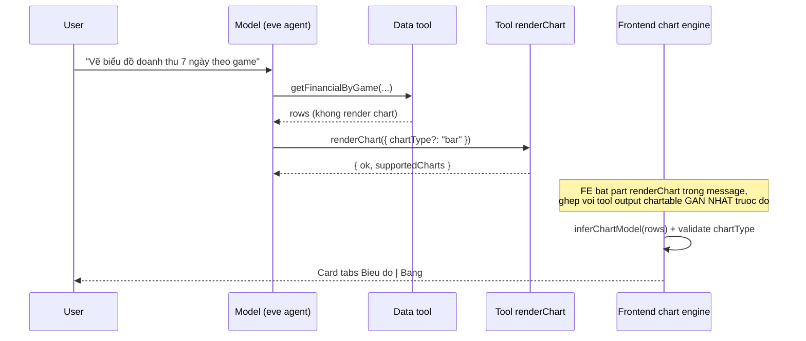

# P1-05 — Chart Generative UI trong AI Chat (panel + trang `/ai`)

> Trạng thái: **PLAN — cập nhật 23/08 theo feedback user.**
> Các quyết định đã chốt:
> 1. Chart **CHỈ vẽ khi user yêu cầu** — không auto-render cho mọi tool result.
> 2. User đòi loại chart cụ thể → **kiểm tra phù hợp**; không phù hợp → recommend loại đúng rồi mới vẽ.
> 3. User chỉ nói "vẽ biểu đồ" → **AI/hệ thống tự chọn loại** theo bảng quyết định.
> 4. Label/text sạch, đúng style backoffice; số lớn format **K / M / B** (`formatCurrency` sẵn có).
> 5. Toàn bộ code chart gom vào **một thư mục riêng** `src/components/ai-chat/chart/`.
> 6. Có **danh sách chart hỗ trợ** + gợi ý use case cho user (qua instructions, user hỏi là trả lời được).
> 7. UX: tabs `Biểu đồ | Bảng` trong card; toggle đổi loại trên card.

---

## 0. Mục tiêu & nguyên tắc

AI vẽ chart **theo yêu cầu của user**, trực tiếp từ dữ liệu tool, dùng `ChartContainer` (shadcn) +
`recharts@3.8` sẵn có ([src/components/ui/chart.tsx](../../apps/backoffice/src/components/ui/chart.tsx)).

Nguyên tắc bất biến (kế thừa p0-04):

1. **Model KHÔNG chép số, KHÔNG quyết layout/pixel** — dữ liệu đi thẳng `part.output` → UI.
   Tool `renderChart` (mới) chỉ chở **tín hiệu** (vẽ gì, loại nào), KHÔNG chở data.
2. **Suy luận chart ở frontend** — engine `chart-inference.ts` phân tích shape output để dựng
   `ChartModel`; hoạt động với MỌI tool trả dữ liệu dạng bảng, không fix cứng per-tool.
3. **Spec override tùy chọn** — chỉ khai khi cần tinh chỉnh (màu game, nhãn); mặc định chạy suy luận thuần.

Ngoài phạm vi: AI sinh JSX/code chart, realtime refresh, export ảnh, funnel/treemap/sankey
(không có dữ liệu phễu/phân cấp — khi có use case thật thì thêm `ChartKind`, hợp đồng không đổi).

---

## 1. Kiến trúc: vẽ theo yêu cầu qua tool `renderChart`



### 1.1. Tool `renderChart` ([apps/backoffice/agent/tools/renderChart.ts](../../apps/backoffice/agent/tools/renderChart.ts) — mới)

- Input zod: `{ chartType: z.enum(ChartKind).optional() }` — description ghi rõ: *"Gọi SAU một tool
  dữ liệu, khi user yêu cầu vẽ biểu đồ. Chỉ điền chartType khi user chỉ định loại; bỏ trống để hệ
  thống tự chọn."*
- `execute` không truy vấn gì — trả `{ ok: true }` ngay. Nó tồn tại thuần để tạo **tool part tín
  hiệu** trong message stream.
- FE (`registry.tsx`): renderer của `renderChart` tìm **tool part gần nhất phía trước trong cùng
  assistant message** có output chartable (`extractRows` khác null) → render card chart tại vị trí
  part `renderChart`. Không tìm thấy → render dòng ghi chú "Không có dữ liệu phù hợp để vẽ" (không lỗi).
- **Vì sao tool riêng thay vì thêm `chartType` vào từng data tool:** không đụng zod/DTO của ~20 tool
  hiện có, tool mới tương lai tự tương thích, và user có thể yêu cầu vẽ **sau khi** đã có dữ liệu
  ("giờ vẽ biểu đồ đi") — model chỉ cần gọi `renderChart`, không phải gọi lại data tool.

### 1.2. Khi KHÔNG có `renderChart` trong message

Mọi tool result hiển thị như hiện tại (table/KPI/JSON qua `ToolResultLine`) — **zero thay đổi hành
vi** cho các câu hỏi không liên quan chart.

### 1.3. Kiểm tra phù hợp — 2 tầng

- **Tầng model (chính, tạo trải nghiệm "recommend"):** instructions `55-charts.md` chứa bảng
  loại-chart ↔ dạng-dữ-liệu (§4). Model thấy dữ liệu từ data tool → nếu loại user đòi không phù hợp
  (vd pie cho chuỗi 30 ngày), model **trả lời text giải thích ngắn + recommend loại đúng, rồi gọi
  `renderChart` với loại được recommend** (vẽ luôn, không bắt user hỏi lại).
- **Tầng FE (chốt chặn, không tin model):** `chartType` từ part input ∉ `allowedKinds` suy luận →
  FE vẽ bằng `defaultKind` + hiện note nhỏ trên card: *"Dạng {X} không phù hợp dữ liệu này — đang
  hiển thị {Y}"*. User vẫn đổi được bằng toggle trong phạm vi `allowedKinds`.

---

## 2. Engine suy luận (`chart/chart-inference.ts`) — pure, unit-test được

### 2.1. `extractRows(output): Row[] | null`

- Output là mảng object → dùng luôn. Là object → tìm field mảng-object đầu tiên theo key quen thuộc
  (`rows`, `items`, `data`, `days`, `games`, `history`, `results`...) rồi tới field mảng bất kỳ.
- Không có mảng ≥ 2 phần tử object phẳng → `null` (không chartable).

### 2.2. Phân loại cột (`ChartFieldType`)

Quét ≤ 50 rows đầu, mỗi key:

| Type | Điều kiện |
|---|---|
| `time` | string ISO date/datetime hoặc drawId `YYYY-MM-DD.NNN` (sort được theo kỳ) |
| `currency` | number + tên khớp `revenue\|amount\|payout\|prize\|balance\|jackpot\|net\|ggr\|cost\|fee\|commission\|total(?!Count)` |
| `percent` | number ∈ [0,1] + tên khớp `rate\|ratio\|percent\|pct` (hoặc ∈ [0,100] kèm tên khớp) |
| `number` | number còn lại (count, số vé) |
| `category` | string còn lại, distinct ≤ 30 |
| bỏ qua | id-like (`^id$\|Id$\|^_`), boolean, string tự do distinct > 30, object lồng |

### 2.3. Chọn trục + kind mặc định → `ChartModel`

- **X**: ưu tiên `time` (sort tăng) → `category` distinct nhiều nhất ≤ 30.
- **Series**: cột `currency`/`number`/`percent`, currency trước, tối đa 4 (thừa vẫn đủ ở tab Bảng).
- **Kind mặc định + allowedKinds**: theo bảng §4 (cùng một bảng dùng cho instructions của model —
  một nguồn chân lý, viết ở `chart/chart-catalog.ts` rồi cả FE lẫn file instructions tham chiếu).

```typescript
interface ChartModel {
  kind: ChartKind;                    // sau khi merge chartType (nếu hợp lệ) / override / default
  allowedKinds: readonly ChartKind[];
  rejectedKind?: ChartKind;           // chartType user đòi nhưng không phù hợp → note trên card
  x: { dataKey: string; label: string; type: ChartFieldType };
  series: readonly ChartSeries[];     // dataKey, label, type, color?, composedAs?, yAxis?
  rows: Record<string, unknown>[];    // đã sort + tỉa maxPoints (60)
  title: string;
}
```

`ChartKind` = 10 loại (const `as const`): `line, area, bar, hbar, pie, donut, radar, radialBar,
scatter, composed`.

### 2.4. Override per-tool (tùy chọn)

`ToolViewSpec` thêm `chart?: ChartOverride<Row>` (mọi field optional, merge đè suy luận):
`defaultKind`, `allowedKinds`, `x`, `series` (kèm `colorByRow` — vd `getGameHex(row.gameKey)`),
`title`, `maxPoints`, `disabled`. Đợt đầu chỉ khai ~2 tool (màu game, nhãn).

---

## 3. UX/UI chi tiết — panel và trang `/ai`

### 3.1. Cấu trúc card (cả 2 bối cảnh dùng chung `ChatPanel`, chỉ khác width container)

```text
ToolResultLine (collapsible, đã có sẵn)
└── Card
    ├── Header: title (text-sm font-medium) · tabs [Biểu đồ | Bảng] · ToggleGroup loại chart (icon)
    ├── (note nhỏ nếu rejectedKind — text-xs text-muted-foreground)
    ├── Tab Biểu đồ: ChartContainer (dynamic import, skeleton đúng chiều cao)
    └── Tab Bảng: TableView sẵn có của tool (nếu có spec) hoặc bảng generic từ rows
```

- **Panel docked hẹp (~360px):** toggle loại chart thu thành icon-only; legend xuống đáy, wrap;
  tick trục X `interval="preserveStartEnd"` + `minTickGap={24}` — không chen chúc nhãn.
- **Trang `/ai` (`max-w-3xl`):** cùng component, `ChartContainer` responsive tự giãn; chiều cao cố
  định theo kind (`h-48`; pie/donut/radar `aspect-square max-h-56`) — không layout shift.
- **Panel resize:** `ResponsiveContainer` bắt qua resize observer — kéo handle mượt, không re-render React.

### 3.2. Label & format số — đúng style backoffice (điểm user nhấn mạnh)

Một module duy nhất `chart/chart-format.ts`, **chỉ bọc formatter sẵn có** của
`@megawin/shared/utils` (DRY như [format-cell.ts](../../apps/backoffice/src/components/ai-chat/tool-renderers/format-cell.ts)):

| Vị trí | Format | Hàm dùng |
|---|---|---|
| Tick trục Y (tiền) | `1.5B`, `200M`, `50K` | `formatCurrency` (đã có suffix K/M/B/T mặc định, `packages/shared/src/utils/number.ts`) |
| Tick trục Y (%) | `72.5%` | `formatPercent` |
| Tick trục X (ngày) | `16/08` (dd/MM); năm khác nhau → `16/08/25` | mới, nhỏ, trong chart-format |
| Tick trục X (drawId) | `#095` (NNN) — tooltip hiện full | mới |
| Tick trục X (category) | truncate 12 ký tự + `…`, tooltip hiện full | mới |
| Tooltip (tiền) | số ĐẦY ĐỦ `1,234,567 ₫` | `formatVND` |
| Tooltip (số thường) | `1,234,567` | `formatNumber` |
| Legend/series label | nhãn tiếng Việt từ override spec; không có → prettify key (`totalRevenue` → `Doanh thu` qua từ điển key phổ biến, fallback Title Case) |

- Số trên trục **luôn compact K/M/B** — không bao giờ hiện `12000000000` làm vỡ layout panel hẹp.
- Font/màu theo token backoffice: tick `text-xs fill-muted-foreground`, `tabular-nums` cho số,
  grid `stroke-border/50`, series màu CSS var `--chart-1..5` (dark mode tự khớp), game màu `getGameHex`.
- Từ điển nhãn key phổ biến (`revenue → Doanh thu`, `payoutRatio → Tỷ lệ TT`...) đặt trong
  `chart/chart-format.ts` — một chỗ, dùng cho cả legend/tooltip/table generic.

---

## 4. Danh sách chart hỗ trợ + gợi ý cho user

**Một nguồn chân lý:** `chart/chart-catalog.ts` khai catalog (kind, tên tiếng Việt, icon, dùng khi
nào) — FE dùng cho toggle/tooltip, và nội dung bảng được chép vào instructions `55-charts.md` cho model.

| Kind | Tên hiển thị | Dùng khi |
|---|---|---|
| `line` | Đường | Xu hướng theo thời gian, ≥ 2 chỉ số cùng đơn vị |
| `area` | Miền | Xu hướng 1 chỉ số theo thời gian |
| `bar` | Cột | So sánh giữa các nhóm (game, tier) ≤ 10 mục |
| `hbar` | Cột ngang | Nhãn dài / 8–20 mục (top đại lý, top player) |
| `pie` / `donut` | Tròn / Vành | Tỷ trọng phần-trên-tổng ≤ 7 mục |
| `radar` | Radar | So sánh hồ sơ đa chiều 3–8 trục (phân bố tier) |
| `radialBar` | Vòng tiến độ | % hoàn thành so với mục tiêu |
| `scatter` | Phân tán | Tương quan 2 biến số (cược vs thắng) |
| `composed` | Kết hợp | 2 đơn vị khác nhau: cột tiền + đường % (doanh thu + tỷ lệ TT) |

Cách user biết:

1. **Model trả lời trực tiếp** khi user hỏi "vẽ được những loại chart nào?" — instructions chứa bảng trên.
2. **Gợi ý theo ngữ cảnh dữ liệu:** instructions yêu cầu model, khi vẽ xong, nếu dữ liệu còn hợp với
   1-2 loại khác thì nhắc 1 câu ngắn (vd *"Dữ liệu này cũng xem được dạng cột ngang — bấm nút đổi
   loại trên biểu đồ hoặc yêu cầu tôi."*). KHÔNG liệt kê cả bảng mỗi lần.
3. **Toggle trên card** hiện đúng `allowedKinds` với tooltip tên loại — tự thân nó là danh sách
   "loại phù hợp với dữ liệu này".
4. **Suggestion chips:** thêm 1 gợi ý dạng chart vào `route-registry.ts` cho các trang báo cáo
   (vd `/reports/settle`: "Vẽ biểu đồ doanh thu 7 ngày theo game").

---

## 5. Tổ chức file — một thư mục riêng (điểm user yêu cầu)

Toàn bộ code chart nằm trong **`apps/backoffice/src/components/ai-chat/chart/`** (mới):

| File | Vai trò |
|---|---|
| `chart-catalog.ts` | `ChartKind` + catalog tên/icon/use-case + bảng quyết định default — nguồn chân lý |
| `chart-inference.ts` | `extractRows` + phân loại cột + dựng `ChartModel` (pure) |
| `chart-inference.test.ts` | Unit test với fixture output thật của các tool |
| `chart-format.ts` | Formatter tick/tooltip/legend (K/M/B, dd/MM, truncate) + từ điển nhãn key |
| `chart-format.test.ts` | Unit test formatter |
| `chart-tool-view.tsx` | Card tabs + toggle + note rejectedKind; `next/dynamic` load chart-body |
| `chart-body.tsx` | Import recharts + `ChartContainer`, switch 10 kind, animation off |
| `chart-skeleton.tsx` | Skeleton khớp chiều cao từng kind |
| `index.ts` | Barrel — bên ngoài chỉ import từ `@/components/ai-chat/chart` |

Phía agent: `agent/tools/renderChart.ts` (tool tín hiệu) + `agent/instructions/55-charts.md`
(quy tắc + bảng catalog). File ngoài thư mục chỉ sửa tối thiểu: `registry.tsx` (renderer cho
`renderChart`), `view-spec.ts` (field `chart?`), `agent.ts` (đăng ký tool).

---

## 6. Performance

1. **1 dynamic chunk recharts duy nhất** — `chart-body.tsx` (ssr:false, loading skeleton). Bundle
   chat không tăng; chỉ tải khi card chart đầu tiên xuất hiện.
2. **Chỉ chạy inference khi có `renderChart` part** — các message thường zero chi phí thêm.
3. `useMemo` inference theo reference `part.output` (bất biến sau `output-available`); component `memo`.
4. `maxPoints=60`: time → bucket đều; category → top-N theo series đầu + gộp "Khác"; tab Bảng giữ đủ.
5. `isAnimationActive={false}` — tránh jank khi nhiều message render.
6. Panel `<Activity>` luôn mounted — đóng/mở giữ state tab + toggle.

---

## 7. Thủ tục test chính xác vẽ chart (điểm user yêu cầu)

### 7.1. Unit test (tự động, chạy trong CI)

- `chart-inference.test.ts` — fixture là **output JSON thật** chụp từ 5 tool
  (`getFinancialDailyOverview`, `getFinancialByGame`, `getJackpotHistory`, `getDrawSettleReport`,
  `getSystemOutstanding`). Assert: rows extract đúng; cột phân loại đúng type; kind mặc định +
  allowedKinds đúng bảng §4; `getSystemOutstanding` (KPI object) → `null`, không chartable;
  chartType không hợp lệ → `rejectedKind` set + fallback default; maxPoints tỉa đúng (bucket/top-N).
- `chart-format.test.ts` — `12_345_000_000 → "12.3B"`, `1_500_000 → "1.5M"`, `950 → "950"`,
  số âm, `0.725 → "72.5%"`, ISO → `16/08`, drawId → `#095`, truncate + từ điển nhãn.

### 7.2. Test số liệu ĐÚNG trên chart (thủ công, checklist bắt buộc trước merge)

Nguyên tắc: **giá trị vẽ = giá trị tab Bảng = trang báo cáo gốc** — 3 nguồn phải khớp từng số.

1. Hỏi *"Vẽ biểu đồ doanh thu 7 ngày gần nhất"* → mở tab Bảng, đối chiếu từng ngày với
   `/reports/settle`; hover từng điểm chart, tooltip phải khớp số bảng (định dạng `formatVND` đầy đủ).
2. Hỏi *"Vẽ biểu đồ tròn doanh thu theo game tuần này"* → tỷ trọng các lát cộng = 100%, số từng
   game khớp trang báo cáo, màu đúng `getGameHex`.
3. Hỏi *"Vẽ đường jackpot Power 6/55 10 kỳ"* → giá trị các kỳ khớp trang jackpot history.
4. **Recommend flow:** hỏi *"Vẽ pie chart doanh thu 30 ngày"* → model phải giải thích + recommend
   line/area rồi vẽ loại đúng; card KHÔNG hiện pie.
5. **Mặc định:** hỏi chỉ *"vẽ biểu đồ"* sau 1 câu dữ liệu → hệ thống tự chọn kind đúng bảng §4.
6. **Không auto:** hỏi câu dữ liệu KHÔNG nhắc chart → không có card chart nào xuất hiện.
7. Toggle đổi loại → không có network request mới (kiểm tra DevTools), số không đổi.
8. Danh sách hỗ trợ: hỏi *"vẽ được những loại biểu đồ nào?"* → model liệt kê đúng catalog.

### 7.3. Test UI/UX 2 bối cảnh

- Panel docked ~360px: label không tràn, tick không đè nhau, legend wrap, toggle icon-only.
- Kéo resize handle liên tục: chart co giãn mượt, không giật.
- Trang `/ai` max-w-3xl + mobile drawer + dark mode: màu token đúng, không màu hardcode sáng.
- Collapse/expand `ToolResultLine`, đóng/mở panel (`Activity`): state tab + loại chart giữ nguyên.
- Skeleton xuất hiện đúng chiều cao khi chunk recharts tải lần đầu (throttle network để xem).

### 7.4. Lệnh verify

`pnpm --filter @megawin/backoffice check-types` · `biome check` các file sửa · chạy unit test ·
checklist 7.2/7.3 thực hiện trên dev thật (có thể dùng browser tool chụp màn hình từng case).

---

## 8. Thứ tự triển khai

1. `chart/chart-catalog.ts` + `chart/chart-inference.ts` + fixture tests.
2. `chart/chart-format.ts` + tests.
3. `chart-body.tsx` + `chart-tool-view.tsx` + `chart-skeleton.tsx` + barrel.
4. `agent/tools/renderChart.ts` + đăng ký `agent.ts` + `agent/instructions/55-charts.md`.
5. `registry.tsx` (renderer `renderChart`, ghép part gần nhất) + `view-spec.ts` (`chart?` override)
   + override ~2 tool + suggestion chips `route-registry.ts`.
6. Verify theo §7.

## 9. Rủi ro & đối sách

| Rủi ro | Đối sách |
|---|---|
| Model quên gọi `renderChart` khi user yêu cầu vẽ | Instructions ví dụ few-shot rõ; test case 7.2.5 |
| Model gọi `renderChart` khi user không yêu cầu | Instructions cấm rõ; FE vẫn render đúng nhưng đây là bug prompt — theo dõi |
| Heuristic đoán sai field tiền/% tên lạ | Override spec 1 dòng; mở rộng regex qua fixture test |
| `renderChart` không tìm thấy output chartable phía trước | Note "Không có dữ liệu phù hợp" — không crash, không JSON thô |
| Recharts chunk nặng lần đầu | Skeleton đúng chiều cao; cân nhắc preload khi model bắt đầu gọi renderChart (đợt sau) |

---

## 10. Addendum 23/08 (tối) — dữ liệu tự nhập, share engine, bỏ `Cell`, nhận xét sau vẽ

Cập nhật sau khi §1-9 đã triển khai xong và verify xanh (check-types/biome/vitest):

1. **Vẽ từ dữ liệu staff tự cung cấp (CSV/JSON/mô tả)** — `renderChart` giờ có thêm input tùy chọn
   `rows` (+ `title`). Model tự đọc nội dung staff dán/mô tả, phân loại thành mảng object phẳng,
   điền vào `rows` — hệ thống dùng THẲNG mảng đó (không dò lùi tool trước). Đây là NGOẠI LỆ có chủ
   đích với nguyên tắc "model không chép số" ở §0: ngoại lệ chỉ áp dụng khi KHÔNG có tool dữ liệu
   nào để dò (dữ liệu chưa từng ở trong hệ thống) — số liệu hệ thống VẪN PHẢI đi qua đường tool như
   cũ. Xem JSDoc `agent/tools/renderChart.ts` (2 chế độ) và mục mới trong `55-charts.md`.
2. **Share engine ra `src/lib/chart/`** — `chart-catalog.ts`, `chart-format.ts`, `chart-inference.ts`
   (pure, không React/recharts) dời từ `components/ai-chat/chart/` sang `src/lib/chart/` để trang
   backoffice khác (ngoài AI Chat) dùng lại được `buildChartModel`/formatter K-M-B mà không phải
   copy. `components/ai-chat/chart/` giữ lại phần RENDER gắn với UX AI Chat (`chart-body.tsx`,
   `chart-tool-view.tsx`, `chart-skeleton.tsx`, `chart-icon.tsx`) — barrel `index.ts` của thư mục đó
   re-export lại từ `@/lib/chart` nên `registry.tsx`/`view-spec.ts` không cần đổi cách import.
3. **Bỏ `Cell` (recharts deprecated, sẽ xoá ở Recharts 4.0)** — `BarChartBody` dùng prop `shape`
   (render `<Rectangle>`), `PieChartBody` dùng prop `shape` (render `<Sector>`), đọc row qua
   `shapeProps.payload` thay vì children `<Cell>`. `RadialBarChartBody` không đổi (đã gắn `fill`
   thẳng vào từng row từ trước, recharts đọc `entry.fill` tự nhiên, không qua `Cell`).
4. **Bắt buộc nhận xét sau khi vẽ** — `55-charts.md` mục "Sau khi vẽ" siết từ "có thể nói điều đáng
   chú ý" thành BẮT BUỘC viết 2-4 câu chỉ ra 1-2 điểm nổi bật nhất (giá trị cao/thấp, xu hướng, bất
   thường, ý nghĩa nghiệp vụ) kèm ví dụ câu SAI (liệt kê từng điểm) / ĐÚNG (tóm tắt insight).
