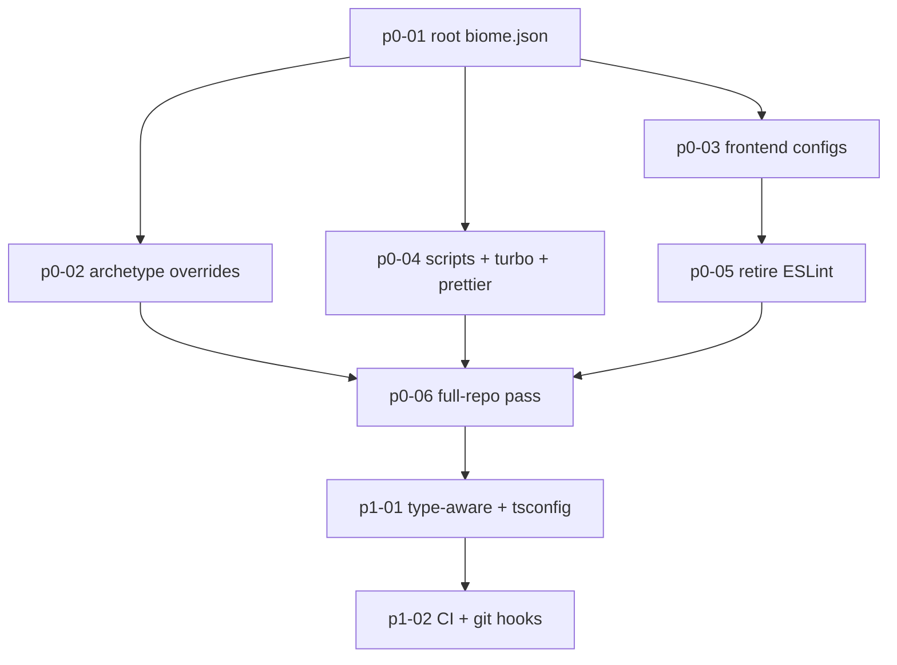

# Biome Monorepo Migration — Overview

> Nguồn: quyết định từ phiên nghiên cứu "Biome vs ESLint" (01/08/2026). Không có analysis doc riêng — bối cảnh khảo sát ghi trực tiếp trong file này.

Chuẩn hoá toàn bộ monorepo về **Biome 2.5.5** làm linter + formatter duy nhất; retire ESLint; thu hẹp Prettier về đúng định dạng Biome chưa hỗ trợ (Markdown, YAML).

## 1. Bảng trạng thái

| Plan | Phase | Status | Ghi chú |
|---|---|---|---|
| p0-01-root-biome-config | P0 | ⏳ pending | Nền tảng, chặn mọi plan sau |
| p0-02-archetype-overrides | P0 | ⏳ pending | Cần p0-01 |
| p0-03-frontend-configs | P0 | ⏳ pending | Cần p0-01 |
| p0-04-scripts-turbo-prettier | P0 | ⏳ pending | Cần p0-01 |
| p0-05-retire-eslint | P0 | ⏳ pending | Cần p0-03 (packages/ui phải rời ESLint trước) |
| p0-06-full-repo-pass | P0 | ⏳ pending | Cần p0-01→p0-05 |
| p1-01-typeaware-and-tsconfig | P1 | ⏳ pending | Sau khi P0 sạch warning |
| p1-02-ci-and-git-hooks | P1 | ⏳ pending | Sau p1-01 |

## 2. Thứ tự phụ thuộc



## 3. Hiện trạng đã khảo sát (01/08/2026)

| Khu vực | Tool hiện tại | File .ts/.tsx |
|---|---|---|
| `apps/backoffice` | Biome 2.5.5 (`biome.json` riêng, domain next+react) | 1.103 |
| `packages/ui` | ESLint (`@megawin/eslint-config/react-internal`) | 10 |
| 41 package/app còn lại | **KHÔNG có lint tooling** | ~2.009 |
| **Tổng** | | **3.122** |

Chi tiết quan trọng:

- `tooling/eslint-config/base.js` có `curly: "warn"` (đúng ý định), nhưng chỉ `packages/ui` (10 file) thực sự chạy ESLint → rule gần như vô tác dụng toàn repo.
- `packages/game-lotto535-application` có script `"lint": "eslint . --max-warnings 0"` nhưng **hỏng** — không có `eslint` dependency, không có config → `eslint: command not found`.
- `@megawin/eslint-config` chỉ có **1 consumer**: `packages/ui` (verify bằng grep toàn repo) → retire an toàn.
- **Không có CI workflow** (`.github/workflows` không tồn tại) → lint hiện 100% advisory, không block gì.
- `lint-staged` chỉ khai báo trong `apps/backoffice/package.json`, **không có `.husky`** ở root → hook pre-commit hiện không được wire, config đang nằm chết.
- Root `.prettierrc` dùng `printWidth: 100`, còn `apps/backoffice/biome.json` dùng `lineWidth: 120` → **đang lệch nhau**. Chuẩn hoá về **120** (khớp 1.103 file đã format sẵn, tránh diff khổng lồ).

## 4. Số liệu quyết định mức severity từng rule

Khảo sát bằng ripgrep toàn repo để rule không tạo warning vô ích:

| Pattern | Số lượng | Kết luận |
|---|---|---|
| TS `enum` declarations | **0** | `style/noEnum: "error"` — miễn phí, khớp §5.3 `code-quality-standards.mdc` |
| `export default` | 110 (94 trong backoffice, 15 là `*.config.ts`, 1 source thật: `packages/cache/src/redis/client.ts`) | `noDefaultExport` bật cho library code, tắt cho Next.js app dir + config files |
| `export * from` (barrel) | **248** | `performance/noBarrelFile` + `noReExportAll` phải **OFF** — barrel là convention BẮT BUỘC theo `mongodb.mdc` |
| `: any` / `as any` | **571** | `noExplicitAny: "warn"`; tắt hẳn ở `infras/repos/**` vì `mongodb.mdc` §5 chính thức endorse `result.map((r: any) => ...)` |
| `console.*` ở backend | **356** | `noConsole: "off"` cho `apps/api-*`, `apps/worker-*` — console→CloudWatch là idiom Lambda, repo không có logger package |
| `process.env.` | 20 (tập trung ở `packages/shared/src/utils/env.ts`, `apps/backoffice/src/env.ts`, `app-core/aws/config.ts`; ~8 chỗ rải rác) | `noProcessEnv: "warn"` + override off cho file env/config → nudge dồn về chỗ tập trung |
| File naming | 100% kebab-case (`tenant-config-repo.ts`, `sync-betting-stats.ts`) | `useFilenamingConvention` với `filenameCases: ["kebab-case"]` |

`apps/backoffice/next.config.ts` có `reactCompiler: true` và `compiler.removeConsole` (production) → React Compiler bật, nên rule "Rules of React" (`useExhaustiveDependencies`, `useHookAtTopLevel`) càng quan trọng; console frontend tự bị strip ở prod.

## 5. Đính chính so với nhận định ban đầu

Nghiên cứu sâu hơn cho thấy 2 gap tôi nêu ban đầu **không còn đúng** với Biome 2.5:

| Gap từng nêu | Thực tế Biome 2.5 |
|---|---|
| "Biome không có `import/no-cycle`" | **SAI** — có `nursery/noImportCycles`, bật qua `domains.project`. Vẫn nên bổ sung `dependency-cruiser` cho boundary rule `no-core-to-operator` (§5 `operator-monorepo-structure.mdc`) vì đó là rule kiến trúc cross-package, khác mục đích. |
| "Type-aware chỉ ~75-85%, coi như không có" | Có `domains.types` (v2.4+) với `noFloatingPromises`, `noMisusedPromises`, `useAwaitThenable`, `noUnnecessaryConditions`. ~75% parity với typescript-eslint, nhưng hiện tại backend đang **0%** → vẫn là bước tiến lớn. Đưa vào P1 kèm đo hiệu năng (project/types domain kích hoạt full scan, có index cả `node_modules/**/*.d.ts`). |

Gap còn lại thật sự (chấp nhận):

- `turbo/no-undeclared-env-vars` — không có tương đương. Rủi ro thấp: repo đã validate env qua `packages/shared/src/utils/env.ts` + `apps/backoffice/src/env.ts`.
- `@stylistic/padding-line-between-statements` (blank-line style) — Biome cố ý không có. Trước đây cũng chỉ áp dụng 10 file `packages/ui`.
- JSDoc completeness (§1, §2 `code-quality-standards.mdc`) — không linter nào enforce nội dung JSDoc. Vẫn dựa vào Cursor rules + review.
- §5.4 "KHÔNG dùng indexed-access `T[\"field\"]`" — chưa có rule sẵn; ứng viên cho GritQL plugin ở P2 (xem p1-01 §5).

## 6. Kiến trúc config chốt

Không tạo 43 file `biome.json`. Dùng:

```
biome.json                     ← root: formatter + rule nền + overrides theo archetype (p0-01, p0-02)
apps/backoffice/biome.json     ← nested (root:false, extends "//"): Tailwind sort, shadcn exclude (p0-03)
```

Lý do đủ 2 file: Biome v2 **tự phát hiện domain theo `package.json` của từng package** (`react`/`next` bật tự động ở backoffice + ui, tự tắt ở backend) — không cần khai báo tay per-package. Phần khác biệt còn lại xử lý bằng `overrides[].includes` glob trong root config.
