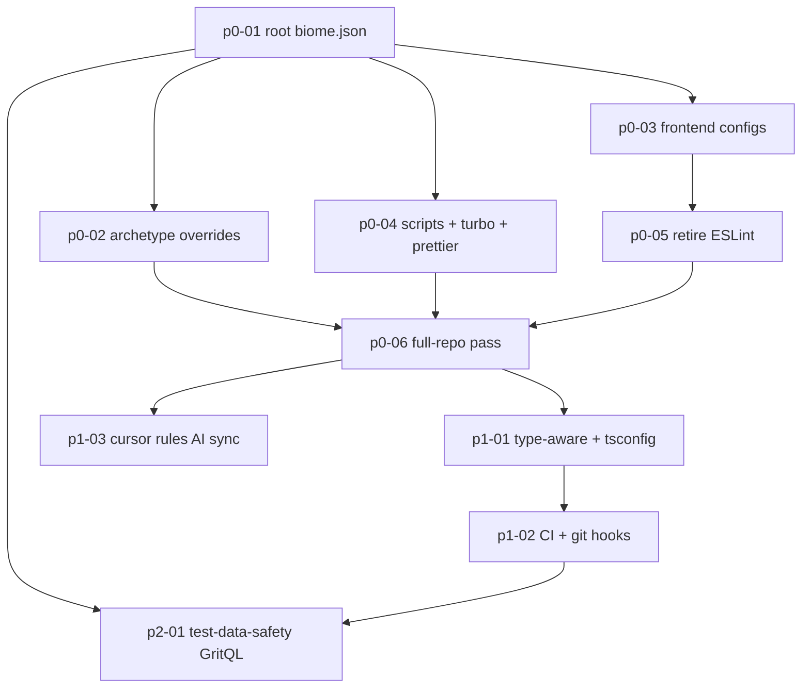

# Biome Monorepo Migration — Overview

> Nguồn: quyết định từ phiên nghiên cứu "Biome vs ESLint" (01/08/2026). Không có analysis doc riêng — bối cảnh khảo sát ghi trực tiếp trong file này.

Chuẩn hoá toàn bộ monorepo về **Biome 2.5.7** (bản mới nhất, 04/08/2026) làm linter + formatter duy nhất; retire ESLint; thu hẹp Prettier về đúng định dạng Biome chưa hỗ trợ (Markdown, YAML).

> **Quyết định version (cập nhật 07/08):** dùng **2.5.7** thay vì 2.5.5 (bản backoffice đang chạy).
> 2.5.6/2.5.7 chỉ là patch — KHÔNG promote rule nào (bảng nhóm rule ở §5 vẫn đúng). Hai thay đổi cần canh:
> 1. `useSortedClasses` 2.5.7 bắt thêm case tagged template (`tw.div\`...\``) trước đây bị bỏ sót → có thể
>    xuất hiện diagnostic MỚI ở backoffice so với 2.5.5 — là bug fix đúng, cứ fix theo.
> 2. Type-aware inference chính xác hơn (`noFloatingPromises` bắt aliased callback + async map;
>    `noUnnecessaryConditions` chọn đúng overload) — ảnh hưởng P1, tốt hơn cho code tài chính.
> Đồng thời 2.5.6 cải thiện ~7% hiệu năng formatter. Bump backoffice 2.5.5 → 2.5.7 NGAY tại p0-01 để
> không tồn tại 2 version song song trong repo dù chỉ một giai đoạn.

## 1. Bảng trạng thái

| Plan | Phase | Status | Ghi chú |
|---|---|---|---|
| p0-01-root-biome-config | P0 | ✅ done | Nền tảng, chặn mọi plan sau |
| p0-02-archetype-overrides | P0 | ✅ done | Cần p0-01 |
| p0-03-frontend-configs | P0 | ✅ done | Cần p0-01 |
| p0-04-scripts-turbo-prettier | P0 | ✅ done | Cần p0-01 |
| p0-05-retire-eslint | P0 | ✅ done | Cần p0-03 (packages/ui phải rời ESLint trước) |
| p0-06-full-repo-pass | P0 | ✅ done (xem lưu ý) | Cần p0-01→p0-05. **Lưu ý**: chưa commit theo yêu cầu user — 1985 file đang nằm trong working tree, chưa tách lớp format/autofix thành commit riêng, `.git-blame-ignore-revs` chưa tạo (phụ thuộc SHA commit). Còn 107 error backlog (chi tiết trong file plan) |
| p1-01-typeaware-and-tsconfig | P1 | ⏳ pending | Sau khi P0 sạch warning. **Tạm dừng theo yêu cầu user** — chờ user tự commit/review P0-06 trước |
| p1-02-ci-and-git-hooks | P1 | ⏳ pending | Sau p1-01 |
| p1-03-cursor-rules-ai-sync | P1 | ⏳ pending | Đồng bộ `.cursor/rules/` với chuẩn Biome để AI sinh code đúng convention. Cần p0-06 (rule set chốt) |
| p2-01-test-data-safety-guard | P2 | ⏳ pending | GritQL cấm lệnh xoá/sửa DB không-scope trong test; cần p0-01 + p1-02 (CI). Tách từ plan test-setup |

## 2. Thứ tự phụ thuộc



## 3. Hiện trạng đã khảo sát (01/08/2026)

| Khu vực | Tool hiện tại | File .ts/.tsx |
|---|---|---|
| `apps/backoffice` | Biome 2.5.5 (`biome.json` riêng, domain next+react) — bump lên 2.5.7 ở p0-01 | 1.103 |
| `packages/ui` | ESLint (`@megawin/eslint-config/react-internal`) | 10 |
| 41 package/app còn lại | **KHÔNG có lint tooling** | ~2.009 |
| **Tổng** | | **3.122** |

Chi tiết quan trọng:

- `tooling/eslint-config/base.js` có `curly: "warn"` (đúng ý định), nhưng chỉ `packages/ui` (10 file) thực sự chạy ESLint → rule gần như vô tác dụng toàn repo.
- `packages/game-lotto535-application` có script `"lint": "eslint . --max-warnings 0"` nhưng **hỏng** — không có `eslint` dependency, không có config → `eslint: command not found`.
- `@megawin/eslint-config` chỉ có **1 consumer**: `packages/ui` (verify bằng grep toàn repo) → retire an toàn.
- **Không có CI workflow** (`.github/workflows` không tồn tại) → lint hiện 100% advisory, không block gì.
- `lint-staged` chỉ khai báo trong `apps/backoffice/package.json`, **không có `.husky`** ở root → hook pre-commit hiện không được wire, config đang nằm chết.
- Root `.prettierrc` dùng `printWidth: 100`, còn `apps/backoffice/biome.json` dùng `lineWidth: 120` → **đang lệch nhau**. Chuẩn hoá về **120** (khớp 1.103 file đã format sẵn, tránh diff khổng lồ).

### 3.1. Drift sau khảo sát (cập nhật 07/08/2026 — re-verify khi thực thi p0-06)

Khảo sát 01/08 đã lệch với hiện trạng do các plan khác chạy song song (`monorepo-test-setup`, ops-risk-control 3 game):

- **`tooling/vitest-config` mới xuất hiện** (có source TS thật: `src/index.ts`, `src/setup-db-guard.ts`) — mọi override glob theo `packages/*/src/**` PHẢI mở rộng thêm `tooling/*/src/**` (đã sửa ở p0-02).
- **`tooling/class-arrangement` là thư mục RỖNG** (không có `package.json`) — dọn (xoá) trong p0-05 khi đụng vào `tooling/`.
- Hầu hết package/app giờ có `vitest.config.ts` + thư mục `test/` riêng (`test/global-setup.ts`, `test/helpers/**`) — khớp override (7a) config + (7b) test của p0-02, không cần đổi glob.
- Barrel `export * from`: 248 → **275**. Không đổi kết luận (vẫn OFF `noBarrelFile`).
- Root `package.json` có thêm `vitest` devDependency; `turbo.json` có task `test`/`test:watch` — nhưng **chưa có script `test` ở root** (p0-04 bổ sung, p0-06/p1-02 cần).
- Số file/số liệu `any`, `console` chỉ mang tính tham khảo — **re-run khảo sát trước khi chốt backlog p0-06**.

## 4. Số liệu quyết định mức severity từng rule

Khảo sát bằng ripgrep toàn repo để rule không tạo warning vô ích:

| Pattern | Số lượng | Kết luận |
|---|---|---|
| TS `enum` declarations | **0** | `style/noEnum: "error"` — miễn phí, khớp §5.3 `code-quality-standards.mdc` |
| `export default` | 110 (94 trong backoffice, 15 là `*.config.ts`, 1 source thật: `packages/cache/src/redis/client.ts`) | `noDefaultExport` bật cho library code, tắt cho Next.js app dir + config files |
| `export * from` (barrel) | **248** | `performance/noBarrelFile` + `noReExportAll` phải **OFF** — barrel là convention BẮT BUỘC theo `mongodb.mdc` |
| `: any` / `as any` | **571** | `noExplicitAny: "warn"`; tắt hẳn ở `infras/repos/**` vì `mongodb.mdc` §5 chính thức endorse `result.map((r: any) => ...)` |
| `console.*` ở backend | **356** | `noConsole: "off"` cho `apps/api-*`, `apps/worker-*` — console→CloudWatch là idiom Lambda, repo không có logger package |
| `process.env.` | 20 (tập trung ở `packages/shared/src/utils/env.ts`, `apps/backoffice/src/env.ts`, `app-core/aws/config.ts`; ~8 chỗ rải rác) | `noProcessEnv: "warn"` + override off cho file env/config → nudge dồn về chỗ tập trung |
| File naming | 100% kebab-case (`tenant-config-repo.ts`, `sync-betting-stats.ts`) | `useFilenamingConvention` với `filenameCases: ["kebab-case"]` |

`apps/backoffice/next.config.ts` có `reactCompiler: true` và `compiler.removeConsole` (production) → React Compiler bật, nên rule "Rules of React" (`useExhaustiveDependencies`, `useHookAtTopLevel`) càng quan trọng; console frontend tự bị strip ở prod.

## 5. Đính chính so với nhận định ban đầu

Nghiên cứu sâu hơn (+ re-check ngày 07/08 với changelog Biome 2.5.0) cho thấy **3 nhận định ban đầu không còn đúng**:

| Gap từng nêu | Thực tế Biome 2.5 |
|---|---|
| "Biome không có `import/no-cycle`" | **SAI** — có `suspicious/noImportCycles` (đã promote khỏi nursery, thuộc domain `project`). Vẫn nên bổ sung `dependency-cruiser` cho boundary rule `no-core-to-operator` (§5 `operator-monorepo-structure.mdc`) vì đó là rule kiến trúc cross-package, khác mục đích. |
| "Type-aware chỉ ~75-85%, coi như không có" | Có `domains.types` (v2.4+) với `noFloatingPromises`, `noMisusedPromises`, `useAwaitThenable`, `noUnnecessaryConditions`. ~75% parity với typescript-eslint, nhưng hiện tại backend đang **0%** → vẫn là bước tiến lớn. Đưa vào P1 kèm đo hiệu năng (project/types domain kích hoạt full scan, có index cả `node_modules/**/*.d.ts`). |
| "`turbo/no-undeclared-env-vars` không có tương đương" | **SAI kể từ Biome 2.5.0** — `suspicious/noUndeclaredEnvVars` đã được promote (recommended, thuộc domain Turborepo mới). Xem ghi chú ở p0-01. Lưu ý: `turbo.json` của repo có `globalPassThroughEnv: ["*"]` nên rule gần như không bắt được gì — giá trị thực tế thấp, nhưng "gap" không còn tồn tại. |

**Lưu ý phiên bản (quan trọng khi viết config):** Biome 2.5.0 đã **promote 73 rule khỏi `nursery`** sang nhóm stable; 2.5.6/2.5.7 là patch, không promote thêm. Mọi rule khai báo trong `biome.json` phải đặt đúng nhóm MỚI, nếu không Biome báo lỗi config. Trạng thái đã verify với 2.5.7 (07/08/2026):

| Rule | Nhóm ở 2.5.7 |
|---|---|
| `noImportCycles` | `suspicious` (KHÔNG còn nursery) |
| `noUnnecessaryConditions` | `suspicious` (promote ở 2.5.0) |
| `noUndeclaredEnvVars` | `suspicious` (promote ở 2.5.0, recommended, domain Turborepo) |
| `noFloatingPromises` | vẫn `nursery` |
| `noMisusedPromises` | vẫn `nursery` |
| `useAwaitThenable` | vẫn `nursery` |
| `useExhaustiveSwitchCases` | vẫn `nursery` |
| `useSortedClasses` | vẫn `nursery` (backoffice đang dùng đúng) |

Gap còn lại thật sự (chấp nhận):

- `@stylistic/padding-line-between-statements` (blank-line style) — Biome cố ý không có. Trước đây cũng chỉ áp dụng 10 file `packages/ui`.
- JSDoc completeness (§1, §2 `code-quality-standards.mdc`) — không linter nào enforce nội dung JSDoc. Vẫn dựa vào Cursor rules + review.
- §5.4 "KHÔNG dùng indexed-access `T[\"field\"]`" — chưa có rule sẵn; ứng viên cho GritQL plugin ở P2 (xem p1-01 §5).

## 6. Kiến trúc config chốt

**MỘT file `biome.json` duy nhất ở root** (khớp quyết định (A) của [p0-03](p0-03-frontend-configs.plan.md) — xoá `apps/backoffice/biome.json`):

```
biome.json                     ← root DUY NHẤT: formatter + rule nền + overrides theo archetype
                                  (p0-01, p0-02) + Tailwind sort/CSS/HTML kéo từ backoffice lên (p0-03)
```

Lý do đủ 1 file: Biome v2 **tự phát hiện domain theo `package.json` của từng package** (`react`/`next` bật tự động ở backoffice + ui, tự tắt ở backend) — không cần khai báo tay per-package. Phần khác biệt còn lại xử lý bằng `overrides[].includes` glob trong root config. Nested config (`"root": false`, `"extends": "//"`) chỉ thêm lại khi backoffice cần divergence lớn trong tương lai.

## 7. Cân nhắc BẮT BUỘC trước khi triển khai (đọc trước khi chạy p0-01)

Danh sách rủi ro đã rà soát ngày 07/08 — từng mục phải được xác nhận trạng thái trước khi bắt đầu:

| # | Cân nhắc | Mức độ | Cách xử lý |
|---|---|---|---|
| 1 | **Working tree đang RẤT bẩn** — hàng trăm file modified/untracked từ các plan song song (ops-risk-control 3 game, monorepo-test-setup). Chạy `biome format --write .` (p0-06) lúc này sẽ trộn diff format vào diff logic đang dở → không review nổi, blame nát. | 🔴 Chặn | **Điều kiện tiên quyết của p0-06**: commit/merge xong toàn bộ work-in-progress, `git status` sạch (hoặc chỉ còn file không thuộc scope). p0-01→p0-05 chỉ thêm config/scripts, chạy được trên tree bẩn; p0-06 thì KHÔNG. |
| 2 | **Bump 2.5.5 → 2.5.7 có thể tạo diff format nhỏ trên backoffice** (fix formatter CSS/HTML + `useSortedClasses` bắt thêm tagged template). Acceptance "0 diff trên backoffice" của p0-01 có thể fail vài file. | 🟡 | Chấp nhận sai số: nếu `biome format --check apps/backoffice` ra diff, xem từng file — diff do bug fix formatter của 2.5.6/2.5.7 là hợp lệ, gộp vào commit format-only của p0-06 và ghi chú lại. KHÔNG hạ version để né. |
| 3 | **`useSortedClasses` đổi thứ tự class = đổi specificity conflict** — với Tailwind thuần thì an toàn, nhưng nếu có custom CSS class trộn với utility trong cùng `className`, thứ tự có thể ảnh hưởng render. | 🟡 | Sau commit 2 của p0-06: smoke test UI backoffice trên các trang chính (operations 4 game, config). Rule đã chạy sẵn ở backoffice từ trước nên rủi ro chủ yếu ở `packages/ui` (10 file — review tay được). |
| 4 | **Số liệu khảo sát drift** (§3.1) — mọi con số trong plan là snapshot 01/08. | 🟡 | Bước 0 của p0-06: re-survey. |
| 5 | **Type-aware (P1) là biến số hiệu năng lớn nhất** — full scan + index `node_modules`. Repo 43 package, `.d.ts` của aws-sdk/mongodb rất nặng. | 🟡 | p1-01 đã có quy trình đo bằng hyperfine + 3 ngưỡng quyết định. KHÔNG bật domain `project`/`types` trong P0 dù "tiện tay". |
| 6 | **CI chạy test đụng DB staging** — db-guard sẽ chặn, nhưng tuyệt đối không lách bằng `ALLOW_DB_TESTS=true`. | 🔴 với P1 | Đã ghi phương án (a)/(b) trong p1-02. |
| 7 | **GritQL plugin (P2) chưa kiểm chứng cú pháp** trên 2.5.7. | 🟢 | p2-01 đã có fallback: bỏ lớp lint nếu không match tin cậy, 2 lớp còn lại vẫn bảo vệ. |
| 8 | **Thứ tự phase là cứng**: không nhảy cóc P1 khi P0 chưa có acceptance xanh; đặc biệt `verbatimModuleSyntax` (p1-01) phải chạy SAU `biome check --write` của p0-06 (nếu không sẽ sửa tay hàng trăm `import type`). | 🔴 | Tuân thủ mermaid §2. |
| 9 | **Mỗi lần bump minor Biome sau này**: check mục "Promoted rules" trong changelog trước khi bump (bài học 2.5.0 — 73 rule đổi nhóm làm config cũ vỡ). | 🟢 | Đã ghi vào p1-03 (Cursor rule cho AI) + quy trình ở §5. |

## 8. Phương pháp review từng plan (áp dụng thống nhất)

Mỗi plan p0-01 → p2-01 có mục **"Phương án review sau thực thi"** ở cuối file, theo cùng format:

1. **Diff review** — liệt kê đúng file được phép đổi; xuất hiện file ngoài danh sách = dừng, điều tra.
2. **Lệnh verify** — mỗi thay đổi có lệnh kiểm chứng + output kỳ vọng (copy-paste chạy được, không mô tả suông).
3. **Negative test** — chứng minh rule/config THỰC SỰ chặn vi phạm (tạo file vi phạm tạm → thấy lỗi → xoá), không chỉ chứng minh "không báo lỗi oan".
4. **Rollback** — cách quay lui nếu fail (hầu hết plan chỉ đổi config → `git revert` là đủ; p0-06 có `.git-blame-ignore-revs`).

Người thực thi (AI hoặc người) PHẢI chạy đủ mục review của plan đó và dán output vào phần trạng thái của plan trước khi chuyển plan tiếp theo.
