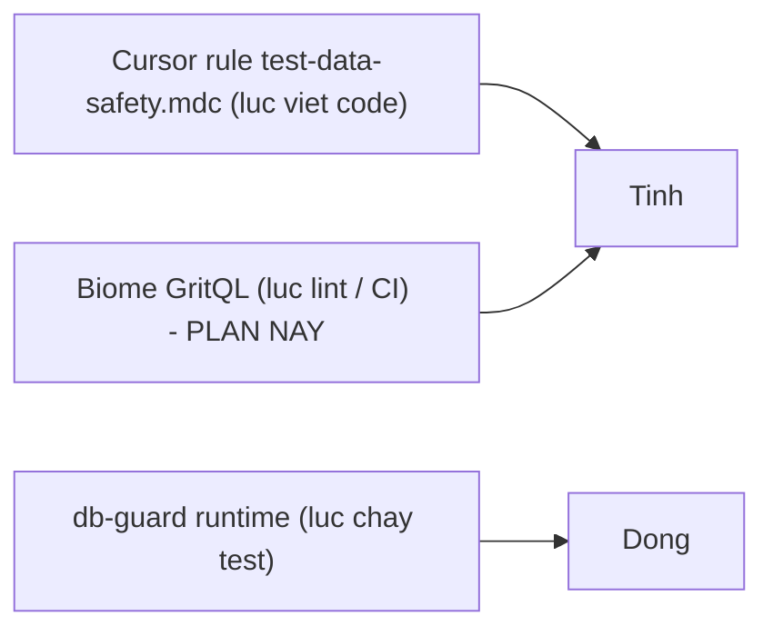

# p2-01 — GritQL guard: cấm lệnh xoá/sửa DB không-scope trong test

> Thuộc: `.cursor/plans/biome-monorepo-migration/` — xem [00-overview.md](00-overview.md).
> Chỉ làm SAU khi P0/P1 của Biome migration đã xong (root `biome.json` tồn tại + `plugins` khả dụng).
> Nguồn gốc: tách ra từ kế hoạch test-setup (`.cursor/plans/monorepo-test-setup/`) — enforce Cursor
> rule `.cursor/rules/test-data-safety.mdc` ở tầng lint/CI.

## Mục tiêu

Chốt chặn TĨNH ở lint/CI cho quy tắc "không xoá/sửa dữ liệu không do test sinh ra". Đây là lớp thứ
2 trong mô hình 3 lớp phòng thủ (đặc biệt quan trọng vì DB test = staging chung):



- Cursor rule: ngăn AI/người sinh code sai từ đầu (đã có).
- Biome GritQL (plan này): chặn khi lint/CI kể cả code viết tay không đọc rule.
- db-guard runtime (`@megawin/vitest-config/setup-db-guard`): chốt cuối lúc chạy, chặn cả filter
  build động thành `{}`.

## Phụ thuộc

- Cần `p0-01-root-biome-config` (root `biome.json` với field `plugins`).
- GritQL plugin của Biome 2.5.x — xác minh cú pháp theo docs bản đang dùng.

## Pattern cần bắt (chỉ trong file test)

Scope: `**/*.test.ts`, `**/*.test.tsx`, `**/test/**/*.ts`, `**/test/**/*.tsx`.

- `deleteMany({})`, `deleteMany()`
- `deleteOne({})`
- `updateMany({}, ...)`, `updateOne({}, ...)` (đối số filter rỗng)
- `findOneAndDelete({})`, `findOneAndUpdate({}, ...)`
- `drop()`, `dropDatabase()`, `dropCollection(...)`

## Kế hoạch thực thi

1. Tạo plugin GritQL, VD `tooling/biome-plugins/no-unscoped-db-mutation.grit`:

```grit
`$coll.deleteMany($args)` where {
  $args <: contains `{}`
}
```

   (Cú pháp trên là phác thảo — cần kiểm chứng GritQL match call-expression với empty-object
   argument theo docs Biome. Bổ sung các mẫu cho `updateMany`/`drop`/`deleteOne`.)

2. Wire plugin vào root `biome.json` field `plugins`, dùng `overrides[].includes` giới hạn glob
   test để không ảnh hưởng source thật (source layer CÓ QUYỀN dùng các lệnh này hợp pháp).

3. Severity `error` → CI đỏ khi vi phạm.

4. Chạy thử trên toàn repo: đảm bảo 0 false-positive ở source, bắt đúng nếu cố tình thêm
   `deleteMany({})` vào 1 file test scratch.

## Acceptance criteria

- Plugin bắt đúng anti-pattern trong `*.test.ts`, KHÔNG bắt ở source layer.
- Wire vào CI (`biome ci`) theo `p1-02-ci-and-git-hooks`.
- Ghi kết quả verify + bất kỳ hạn chế GritQL nào phát hiện vào file này.

## Phương án review sau thực thi

**1. Diff review — file được phép đổi:** `biome.json` (field `plugins` + override) và `tooling/biome-plugins/*.grit` (mới).

**2. Ma trận negative/positive test (chạy đủ, dán kết quả vào đây):**

| Probe | Đặt tại | Kỳ vọng |
|---|---|---|
| `coll.deleteMany({})` | `packages/shared/test/probe.test.ts` | **error** từ plugin |
| `coll.deleteMany()` | file test | **error** |
| `coll.updateMany({}, { $set: { x: 1 } })` | file test | **error** |
| `db.dropDatabase()` | file test | **error** |
| `coll.deleteMany({ drawId: TEST_ID })` | file test | **0 lỗi** (filter có scope) |
| `coll.deleteMany({})` | `packages/*/src/**` (source) | **0 lỗi** (ngoài scope glob test) |

**3. Kiểm tra tương thích version:** plugin viết cho GritQL của đúng bản Biome đang pin (2.5.7) — chạy `pnpm exec biome check --verbose` xem plugin được load, không warning parse.

**4. Đối chiếu lớp runtime:** chạy 1 test cố tình vi phạm với db-guard bật — cả 2 lớp (lint + runtime) cùng chặn. Nếu GritQL miss case nào mà db-guard bắt được → ghi vào "hạn chế GritQL" bên trên.

**5. Rollback:** xoá field `plugins` khỏi `biome.json` — 2 lớp còn lại (Cursor rule + db-guard) vẫn bảo vệ, đúng thiết kế 3 lớp.

## Ghi chú

Nếu GritQL của bản Biome đang dùng chưa match được empty-object argument đủ tin cậy, chấp nhận
tạm dừng lớp lint này — 2 lớp còn lại (Cursor rule + db-guard runtime) vẫn bảo vệ. Không hạ chuẩn
db-guard để bù.
