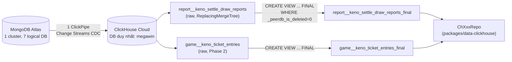
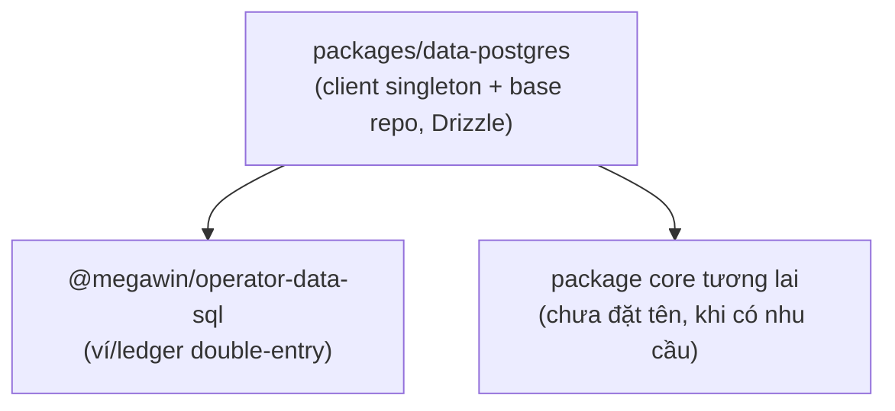

# Tech Stack ClickHouse Analytics cho Megawin — Overview

Bản cập nhật sau vòng phản hồi thứ 2 của user. Các quyết định MỚI trong bản này override bản
trước (`git diff` sẽ không hữu ích vì đây là rewrite toàn phần theo cùng file).

## Những gì THAY ĐỔI so với bản plan trước

| Chủ đề | Bản trước | Bản này (theo yêu cầu mới) |
|---|---|---|
| Số ClickPipe | 2 pipe (report, game riêng) | **1 pipe duy nhất** — đã verify ClickPipes MongoDB CDC cho phép 1 pipe map collection từ NHIỀU source database vào 1 đích qua `table_mappings` (`source_database_name` + `source_collection` + `target_table` riêng từng dòng) |
| Database ClickHouse | 2 DB (`megawin_report`, `megawin_game`) mirror Mongo | **1 DB duy nhất `megawin`**, phân biệt bằng prefix tên table/view theo domain nguồn |
| Repo base class | Chỉ đọc (`queryRows`, `queryOne`) | Đủ query type: `query`/`queryOne`/`exec`/`insert`/`stream`, chuẩn bị cho khả năng viết trực tiếp trong tương lai (vẫn mặc định readonly, write là escape hatch có role riêng) |
| Kết nối | Chưa thiết kế cụ thể | Env params tách rời (không phải 1 URI như Mongo) + client singleton mirror `packages/cache/src/redis/client.ts` |
| Postgres | Gắn với `operator-data-sql` (operator-only) | **Base package dùng chung** `packages/data-postgres`, bất kỳ package nào cũng import được — operator build domain repo riêng TRÊN nó |
| Rule chuẩn hoá | Chưa có file rule | Tạo `.cursor/rules/clickhouse-analytics.mdc` mới, tham chiếu skill `clickhouse-best-practices`/`clickhouse-js-node-troubleshooting` đã cài sẵn trong Cursor |
| Điểm áp dụng cụ thể | Chưa chỉ rõ | Chỉ đích danh file/route hiện đang dùng Mongo aggregate cho báo cáo lịch sử — candidate thay bằng ClickHouse |

## Bối cảnh giữ nguyên từ bản trước

- **Vai trò ClickHouse**: bổ sung, đọc-only. MongoDB tiếp tục là source of truth cho
  settle/void/outstanding — không đổi code tài chính hiện có.
- **Phase 1**: 31 report collections (7 game × 4 report + 3 system daily) — xem
  [`financial-reporting-system.mdc`](../../rules/financial-reporting-system.mdc).
- **Phase 2**: operational collections (`{game}_ticket_entries`, `{game}_tickets`, `{game}_draws`).
- ClickHouse Cloud đã setup sẵn (user xác nhận) — plan này không còn bước "tạo service", chỉ còn
  cấu hình ClickPipe + code.

## 1. Database topology — 1 DB `megawin`, prefix theo domain nguồn

**Đã verify qua doc chính thức ClickPipes** (`clickhouse.com/docs/integrations/clickpipes/mongodb`
+ Terraform provider schema `source.mongodb.table_mappings`): 1 ClickPipe MongoDB CDC kết nối **1
URI Mongo duy nhất** (đúng với thực tế — 7 "database" Mongo của Megawin đều nằm trên **cùng 1
Atlas cluster/replica set**, chỉ khác `dbName`, xem
[`packages/data/src/mongo/constants.ts`](../../../packages/data/src/mongo/constants.ts)), nhưng
mỗi **table mapping** trong pipe đó khai riêng `source_database_name` + `source_collection` +
`target_table`. Nghĩa là 1 pipe có thể chọn collection từ `megawin-report`, `megawin-game`,
`megawin-identity`... cùng lúc, và tự đặt tên bảng đích khác nhau cho từng collection.

→ Xác nhận đề xuất của user là ĐÚNG và tối ưu hơn phương án cũ: dùng **1 ClickPipe + 1 ClickHouse
database `megawin`**, KHÔNG tách nhiều pipe/nhiều DB theo domain Mongo. Lợi ích:

- Ít pipe hơn = ít chi phí vận hành/compute ClickPipes hơn (mỗi pipe có replicator riêng).
- 1 lần setup oplog retention + user role Mongo, không lặp lại cho từng domain.
- Vẫn giữ được khả năng phân biệt nguồn gốc dữ liệu — không phải qua tên DB mà qua **prefix tên
  bảng đích**, khai khi tạo `table_mappings`.

### Naming convention bảng đích (khai lúc setup ClickPipe, field `target_table`)

Format: `{domain}__{collectionName}` (double underscore làm ranh giới rõ, vì tên collection Mongo
đã có single underscore sẵn, ví dụ `settle_draw_reports`).

| Mongo source DB (`Constants.Default.*`) | Prefix domain | Ví dụ `target_table` |
|---|---|---|
| `megawin-report` | `report` | `report__keno_settle_draw_reports` |
| `megawin-game` | `game` | `game__keno_ticket_entries` |
| `megawin-identity` | `identity` | `identity__accounts` |
| `megawin-audit` | `audit` | `audit__audit_logs` |
| `megawin-tenant` | `tenant` | `tenant__<collection>` |
| `megawin-resultfeed` | `resultfeed` | `resultfeed__<collection>` |
| `megawin` (shared/default) | `shared` | `shared__worker_locks` |

View dedupe (`FINAL` + `_peerdb_is_deleted = 0`) đặt tên `{target_table}_final`, ví dụ
`report__keno_settle_draw_reports_final`. Đây là view mà mọi `ChXxxRepo` PHẢI query — KHÔNG BAO
GIỜ query bảng CDC raw (ràng buộc kỹ thuật giữ nguyên từ bản trước, do `ReplacingMergeTree` dedupe
bất đồng bộ).



### Phase 1 setup cụ thể (thao tác trên ClickHouse Cloud console, không phải code)

1. Bật oplog retention Atlas ≥ 72h, tạo Mongo user với role `readAnyDatabase` + `clusterMonitor`
   (không đổi so với bản trước).
2. Tạo **1** ClickPipe MongoDB CDC, đích = database `megawin` (tạo mới nếu chưa có).
3. Trong bước "Configure the tables", chọn 31 collection Phase 1 từ `megawin-report` +
   `megawin-game` (2 bảng system daily nằm ở DB nào tuỳ theo `system-settle-game-daily-repo.ts`
   đang trỏ — cần đọc lại để xác nhận dbName trước khi chọn), rename từng bảng theo convention
   `{domain}__{collectionName}` ở trên.
4. Khi cần thêm collection sau này (Phase 2), dùng flow "Add specific tables to a ClickPipe" (pause
   pipe → edit table settings → chọn thêm → update) — không cần tạo pipe mới.

## 2. Client singleton — env params tách rời + HMR support (mirror Redis/Mongo)

### 2.1. Vì sao env params tách rời, không phải 1 URI

Mongo/Redis dùng 1 URI (`MONGODB_URI`, `REDIS_URI`) vì driver của chúng nhận URI trực tiếp.
`@clickhouse/client` cũng hỗ trợ URL nhưng **khuyến nghị tách field khi cần set TLS/timeout/keep-alive
riêng** (xem skill `clickhouse-js-node-troubleshooting/reference/tls.md`) — và user đã yêu cầu rõ
env params tách rời. Quyết định: dùng field riêng, khai trong `.env.example`:

```bash
# apps/backoffice/.env.example — thêm block mới
CLICKHOUSE_URL=https://<host>.clickhouse.cloud:8443
CLICKHOUSE_USERNAME=default
CLICKHOUSE_PASSWORD=
CLICKHOUSE_DATABASE=megawin
```

Không dùng biến `CLICKHOUSE_URI` gộp — 4 biến riêng giúp: (a) inject secret riêng biệt trong CI/CD
dễ hơn 1 URI dài chứa cả password, (b) khớp đúng shape `ClickHouseClientConfigOptions` của
`@clickhouse/client` (`url`, `username`, `password`, `database` là field riêng, không phải parse
từ query string).

### 2.2. Singleton + HMR — mirror chính xác `packages/cache/src/redis/client.ts`

Repo đã có 2 tiền lệ singleton-with-HMR (Mongo, Redis) dùng chung pattern: cache theo `Map` ở
module scope cho production, chuyển sang `globalThis` khi `isDevNextJs()` để tránh HMR tạo client
mới mỗi lần save file. ClickHouse client PHẢI theo đúng pattern này — không phát minh cách khác.

```typescript
// packages/data-clickhouse/src/clickhouse/client.ts (phác thảo, theo đúng mirror redis/client.ts)
import { createClient, type ClickHouseClient } from "@clickhouse/client";
import { isDevNextJs, logError } from "@megawin/shared/utils";

import "../types/declarations/global";

/** Cache client theo composite key (host+db) ở scope module — 1 connection pool dùng lại cho cả process. */
const __clickhouseClientCache__ = new Map<string, ClickHouseClient>();

function getClientCache(): Map<string, ClickHouseClient> {
  if (!isDevNextJs()) {
    return __clickhouseClientCache__;
  }
  if (!globalThis.__nextJsClickHouseClients) {
    globalThis.__nextJsClickHouseClients = new Map();
  }
  return globalThis.__nextJsClickHouseClients;
}

/**
 * Lấy ClickHouse client đã connect (singleton per cache key, lazy-init).
 *
 * KHÔNG có khái niệm "connect" tường minh như Mongo — @clickhouse/client dùng HTTP interface,
 * kết nối thật chỉ xảy ra lúc query đầu tiên (giữ nguyên Keep-Alive pool phía dưới). Do đó hàm
 * này KHÔNG async — chỉ tạo/return instance, không có bước "await connect()".
 *
 * @param envPrefix - Tiền tố tên biến env (mặc định "CLICKHOUSE", cho phép trỏ nhiều cluster).
 * @throws {Error} Khi thiếu env `{envPrefix}_URL` (fail-fast).
 */
export const getClickHouseClient = (envPrefix = "CLICKHOUSE"): ClickHouseClient => {
  const clientCache = getClientCache();
  const cached = clientCache.get(envPrefix);
  if (cached) {
    return cached;
  }

  const url = process.env[`${envPrefix}_URL`];
  const username = process.env[`${envPrefix}_USERNAME`];
  const password = process.env[`${envPrefix}_PASSWORD`];
  const database = process.env[`${envPrefix}_DATABASE`];

  if (!url) {
    throw new Error(`Missing env ${envPrefix}_URL`);
  }

  try {
    const client = createClient({
      url,
      username,
      password,
      database,
      // Đăng ký readonly ở tầng application — role/permission thật chặn ở phía user Cloud (§4).
      clickhouse_settings: { readonly: "2" },
      keep_alive: { enabled: true },
    });
    clientCache.set(envPrefix, client);
    return client;
  } catch (error) {
    logError("ClickHouseClient", error, { envPrefix, phase: "create" });
    throw new Error("Create ClickHouse client error");
  }
};
```

```typescript
// packages/data-clickhouse/src/types/declarations/global.ts — mirror global.ts của mongo/cache
import type { ClickHouseClient } from "@clickhouse/client";

declare global {
  var __nextJsClickHouseClients: Map<string, ClickHouseClient> | undefined;
}
```

**Khác biệt so với Mongo cần lưu ý khi implement:** Mongo/Redis có bước `await client.connect()`
tường minh nên hàm factory là `async`. `@clickhouse/client` không có bước connect tách biệt (HTTP
client, lazy dial khi query) — hàm `getClickHouseClient` do đó **không async**, và không có khái
niệm "test connection ngay lúc tạo" trừ khi tự gọi `client.ping()` thêm (có thể làm ở
health-check route riêng, không làm trong hot path tạo client).

### 2.3. `client.close()` — không cần trong Next.js/Lambda, cần trong script/worker ngắn hạn

`@clickhouse/client` giữ Keep-Alive pool giống Mongo/Redis — KHÔNG gọi `close()` sau mỗi query.
Chỉ gọi khi process thực sự kết thúc (script CLI, test teardown) — theo đúng lý do process Lambda
tái sử dụng container giữa các lượt invoke (không đóng client giữa request, giống MongoClient).

## 3. Repository — đủ loại query, chuẩn bị cho làm việc trực tiếp trong tương lai

User yêu cầu repo có "đủ loại query" và "tương lai có thể làm việc trực tiếp trong ClickHouse" —
nghĩa là base class không chỉ có read (`queryRows`/`queryOne`) như bản trước, mà cần đủ bộ method
tương đương những gì `MongoRepository` cung cấp (đọc + viết + đếm + stream), dù ở Phase 1 chỉ dùng
nhánh đọc.

```typescript
// packages/data-clickhouse/src/clickhouse/base-repo.ts (phác thảo)
import type { ClickHouseClient, InsertParams } from "@clickhouse/client";

import { getClickHouseClient } from "./client";

/**
 * Base repository cho ClickHouse — mirror `MongoRepository` (packages/data/src/mongo/repository.ts)
 * về mặt kiến trúc: mỗi domain repo extends class này, khai `viewName`/`tableName`, không tự gọi
 * `getClickHouseClient()` rải rác trong use-case.
 *
 * MẶC ĐỊNH chỉ dùng nhánh đọc (`query*`) — Phase 1/2 đều là BI đọc-only. Nhánh viết (`insert`,
 * `exec` cho DDL) là ESCAPE HATCH cho tương lai (vd batch job ETL nội bộ ClickHouse, không phải
 * ghi từ business logic) — PHẢI dùng user Cloud có quyền ghi riêng, KHÔNG dùng chung user readonly
 * mặc định (xem §4 role tách biệt).
 */
export abstract class ClickHouseRepository {
  protected getClient(): ClickHouseClient {
    return getClickHouseClient();
  }

  /**
   * Query trả nhiều dòng, ép type tường minh qua generic — mirror `find().toArray()` bên Mongo.
   * LUÔN dùng `query_params` (named `{name: Type}`), KHÔNG nội suy string (chống SQL injection —
   * xem `clickhouse-js-node-troubleshooting/reference/query-params.md`).
   */
  protected async query<T>(sql: string, params?: Record<string, unknown>): Promise<T[]> {
    const rs = await this.getClient().query({
      query: sql,
      query_params: params,
      format: "JSONEachRow",
      clickhouse_settings: DEFAULT_QUERY_SAFETY_SETTINGS, // §4 — LIMIT/timeout mặc định
    });
    return rs.json<T>();
  }

  /** Query trả 1 dòng hoặc `null` — mirror `findOne()`. */
  protected async queryOne<T>(sql: string, params?: Record<string, unknown>): Promise<T | null> {
    const rows = await this.query<T>(sql, params);
    return rows[0] ?? null;
  }

  /** Đếm nhanh — mirror `countDocuments()`. Dùng `count()` phía SQL, không `SELECT *` rồi đếm mảng. */
  protected async count(sql: string, params?: Record<string, unknown>): Promise<number> {
    const row = await this.queryOne<{ total: string }>(sql, params);
    return row ? Number(row.total) : 0;
  }

  /**
   * Stream kết quả lớn — mirror use-case xuất báo cáo CSV lớn (chưa có tiền lệ Mongo tương đương
   * trực tiếp, nhưng cần cho "làm việc trực tiếp trong ClickHouse" mà user nhắc). BẮT BUỘC tiêu
   * thụ hết hoặc gọi `resultSet.close()` — không sẽ dangling stream, socket lỗi ECONNRESET ở
   * request kế tiếp (xem `clickhouse-js-node-troubleshooting/reference/socket-hangup.md`).
   */
  protected async *stream<T>(sql: string, params?: Record<string, unknown>): AsyncGenerator<T> {
    const rs = await this.getClient().query({
      query: sql,
      query_params: params,
      format: "JSONEachRow",
      clickhouse_settings: DEFAULT_QUERY_SAFETY_SETTINGS,
    });
    for await (const rows of rs.stream<T>()) {
      for (const row of rows) {
        yield row.json();
      }
    }
  }

  /**
   * Escape hatch — insert trực tiếp (KHÔNG dùng cho business write, CDC đã tự insert từ Mongo).
   * Chỉ dùng cho nhu cầu tương lai kiểu "materialize kết quả tính toán nặng vào bảng phụ nội bộ
   * ClickHouse". PHẢI review riêng khi có use-case thật — chưa có caller nào ở Phase 1/2.
   */
  protected async insert<T extends Record<string, unknown>>(
    table: string,
    values: T[],
  ): Promise<void> {
    const params: InsertParams<T> = { table, values, format: "JSONEachRow" };
    await this.getClient().insert(params);
  }

  /** Escape hatch — DDL/admin command (`CREATE VIEW`, `OPTIMIZE`...). Dùng trong migration script, KHÔNG trong request handler. */
  protected async exec(sql: string): Promise<void> {
    await this.getClient().command({ query: sql });
  }
}
```

**Named params bắt buộc — ví dụ chuẩn cho mọi method con:**

```typescript
// packages/data-clickhouse/src/repos/report/settle-draw-report.repo.ts (phác thảo)
export class ChSettleDrawReportRepo extends ClickHouseRepository {
  private readonly viewName = "report__keno_settle_draw_reports_final";

  /**
   * Tổng GGR theo ngày trong khoảng [from, to]. Nguồn: view đã dedupe qua FINAL.
   * Chi phí: quét theo `financialDate` — cần đảm bảo view có ORDER BY chứa cột này (§ migration).
   */
  async aggregateDailyGgr(from: string, to: string): Promise<DailyGgrRow[]> {
    return this.query<DailyGgrRow>(
      `SELECT financialDate, sum(ggr) AS ggr
       FROM ${this.viewName}
       WHERE financialDate >= {from: String} AND financialDate <= {to: String}
       GROUP BY financialDate
       ORDER BY financialDate`,
      { from, to },
    );
  }
}
```

Type kết quả (`DailyGgrRow`) tách sang `repos/types/{concern}.types.ts` — giữ nguyên convention từ
bản trước, đồng bộ với `mongodb.mdc` §2.3.

## 4. Tiêu chuẩn bảo mật — query & connection

Tổng hợp từ skill `clickhouse-best-practices` (`agent-query-safety`, `agent-connect-mcp`) +
`clickhouse-js-node-troubleshooting` (`query-params`, `readonly-users`, `tls`, `socket-hangup`),
áp dụng thành rule bắt buộc cho `packages/data-clickhouse` (chi tiết đầy đủ đưa vào file rule mới
ở §5):

1. **2 user Cloud tách biệt theo nguyên tắc least-privilege**, không dùng chung 1 user cho mọi việc:
   - `CLICKHOUSE_USERNAME` (mặc định, `readonly` profile hoặc role `readonly=2` gắn ở phía Cloud
     console) — user duy nhất mà 99% code (mọi `ChXxxRepo.query*`) dùng.
   - `CLICKHOUSE_WRITE_USERNAME`/`CLICKHOUSE_WRITE_PASSWORD` (role có `INSERT`/`ALTER` giới hạn
     đúng vài bảng phụ nội bộ, KHÔNG có quyền trên bảng do ClickPipes quản lý) — chỉ dùng trong
     `insert()`/`exec()` escape hatch, KHÔNG bao giờ set làm user mặc định.
   - Role-level `readonly=2` là **hàng rào chính** (Cloud console), setting `clickhouse_settings`
     trong code (`DEFAULT_QUERY_SAFETY_SETTINGS`) là **defense in depth**, không phải hàng rào duy
     nhất — agent quên set settings vẫn bị chặn ở role.
2. **TLS bắt buộc** — ClickHouse Cloud luôn secure (`https://...:8443`), không tạo custom agent
   `rejectUnauthorized: false` ở bất kỳ đâu ngoài dev cá nhân tạm thời (không commit).
3. **Named `query_params` bắt buộc 100%** — cấm nội suy template literal giá trị runtime vào SQL
   string dù là số/ngày (không chỉ string). Enforce bằng code review + có thể thêm ESLint/oxlint
   custom rule sau nếu phát hiện vi phạm lặp lại.
4. **Mọi `query()` PHẢI có `LIMIT` + safety settings mặc định** — base class set sẵn
   `DEFAULT_QUERY_SAFETY_SETTINGS` (`max_execution_time`, `max_rows_to_read`,
   `timeout_before_checking_execution_speed: 0`) áp dụng tự động cho mọi call qua `query()`; method
   con chỉ override khi có lý do rõ (ví dụ export lớn dùng `stream()` với budget riêng, ghi rõ
   trong JSDoc).
5. **Không dangling stream** — mọi `client.query()` gọi trực tiếp (ngoài base class) phải tiêu thụ
   qua `.json()`/`.stream()` đầy đủ hoặc gọi `.close()`; base class đã đóng gói đúng cách nên method
   con không tự gọi `client.query()` thô.
6. **Response compression tắt** khi dùng user readonly (mặc định `@clickhouse/client >= 1.0.0` đã
   tắt sẵn — chỉ cần KHÔNG bật `compression.response: true` cho client mặc định).
7. **Không log giá trị nhạy cảm** trong `logError` khi query lỗi — chỉ log `envPrefix`/tên
   view/tham số không nhạy cảm, giống convention hiện tại của Redis/Mongo client.
8. **Schema discovery trước khi viết method mới** — trước khi viết bất kỳ `ChXxxRepo` method mới,
   chạy discovery flow của skill (`system.tables` → `system.columns` → sort key → sample →
   `EXPLAIN`) để đảm bảo `WHERE` khớp `ORDER BY` của view, tránh full scan. Áp dụng đặc biệt khi
   viết migration tạo view mới ở §views-phase1 — quyết định `ORDER BY` của view lúc tạo là
   **immutable**, sai phải rebuild.

## 5. Rule file mới — `.cursor/rules/clickhouse-analytics.mdc`

Cần 1 file rule mới (không nhồi vào `mongodb.mdc` — khác driver, khác ngữ nghĩa write) tổng hợp
toàn bộ §1–§4 thành convention bắt buộc, theo đúng format các rule `.mdc` hiện có trong repo (có
ví dụ ĐÚNG/SAI, checklist cuối file). Nội dung chính:

- Kiến trúc package `packages/data-clickhouse` (mirror `packages/data/mongo`).
- Bảng naming convention `{domain}__{collection}` + `_final` view (§1).
- Client singleton + HMR (§2), kèm đoạn code mẫu.
- Base repo — đủ method (§3), quy tắc "chỉ dùng `query()` qua base class, không gọi
  `getClickHouseClient()` trực tiếp trong use-case" (mirror mongodb.mdc §3 "không Mongo trong
  use-case").
- Bảo mật (§4) dưới dạng checklist.
- **Tham chiếu rõ 2 skill đã cài** để agent chủ động đọc khi cần:
  - `clickhouse-best-practices` — BẮT BUỘC đọc trước khi viết `CREATE VIEW`/migration mới
    (schema-pk-plan-before-creation: `ORDER BY` immutable) hoặc trước khi viết query aggregation
    phức tạp (JOIN rules).
  - `clickhouse-js-node-troubleshooting` — tham chiếu khi debug lỗi client (`socket hang up`,
    `ECONNRESET`, TLS) thay vì đoán.
  - `clickhouse-architecture-advisor` — dùng khi thiết kế thêm bảng/pipeline mới ở Phase 2 (chọn
    ingestion strategy, partitioning cho `{game}_ticket_entries` — dữ liệu lớn theo thời gian).
- Checklist cuối file (theo format chung `code-quality-standards.mdc`/`mongodb.mdc`).

## 6. PostgreSQL — base package dùng chung (KHÔNG gắn riêng operator)

User đã làm rõ lại: Postgres là **1 thư viện base package cho bất kỳ package nào dùng**, không
phải gắn cứng vào `operator-data-sql`. Điều chỉnh so với bản trước:

- Tạo `packages/data-postgres` — **base package trung lập**, giống vai trò `packages/data`
  (Mongo) và `packages/data-clickhouse`: chỉ cung cấp client singleton (mirror §2, dùng
  `postgres`/`pg` driver + HMR pattern giống nhau) + base repo pattern, KHÔNG chứa domain logic.
- **`@megawin/operator-data-sql`** (đã có tên trong `operator-monorepo-structure.mdc`) trở thành
  **consumer** của `packages/data-postgres`, không phải bản thân là base package. Package này chỉ
  thêm domain-specific: connection pool riêng cho ví/ledger, Drizzle schema riêng của operator.
- Bất kỳ package core nào tương lai cần Postgres (ví dụ nhu cầu chưa đặt tên) cũng import
  `packages/data-postgres` trực tiếp — không phải xin qua `operator-data-sql`.
- Vẫn dùng **Drizzle ORM chính thức** cho Postgres (khác quyết định "không ORM" của ClickHouse) —
  vì Drizzle có dialect Postgres mature, và OLTP ghi/đọc cần transaction/type-safety khác bản chất
  BI đọc-only của ClickHouse.
- **KHÔNG code Postgres trong phase này** — chỉ chốt convention tên package + vị trí layering, để
  khi có nhu cầu thật (operator hoặc core khác) thì tạo `packages/data-postgres` theo đúng khung đã
  thống nhất, không phải quyết định lại từ đầu.



## 7. Điểm áp dụng cụ thể trong dự án (đã rà theo request "chỉ ra nơi áp dụng luôn")

Rà theo 2 hướng: (a) nơi ĐANG dùng Mongo aggregate cho báo cáo lịch sử/dashboard — candidate thay
bằng ClickHouse repo khi Phase 1 xong; (b) nơi cần TẠO MỚI mà trước đây phải viết Mongo aggregation
phức tạp, giờ có thể viết SQL ClickHouse đơn giản hơn.

| Vị trí trong repo | Hiện trạng | Vai trò ClickHouse sau Phase 1 |
|---|---|---|
| [`apps/backoffice/src/app/(main)/dashboard/_components/game-performance.tsx`](../../../apps/backoffice/src/app/(main)/dashboard/_components/game-performance.tsx) | Pie chart doanh thu theo game, dữ liệu từ `DashboardDayKpis` (aggregate Mongo cross-game) | Thay nguồn data bằng `ChXxxRepo.aggregateDailyGgr` theo range — 1 query SQL `GROUP BY gameProduct` thay cho việc gọi lần lượt use-case từng game rồi gộp tay ở app layer |
| [`apps/backoffice/src/app/(main)/reports/settle/_lib/tabs/daily-overview.tsx`](../../../apps/backoffice/src/app/(main)/reports/settle/_lib/tabs/daily-overview.tsx) + [`use-report-queries.ts`](../../../apps/backoffice/src/app/(main)/reports/settle/_lib/use-report-queries.ts) | Daily overview tổng hợp cross-game, cross-tenant | Ứng viên số 1 cho Phase 1 — đây chính xác là use-case "cross-game, time-series dài" mà Mongo aggregation yếu, ClickHouse mạnh |
| [`apps/backoffice/agent/tools/getFinancialDailyOverview.ts`](../../../apps/backoffice/agent/tools/getFinancialDailyOverview.ts) + [`getFinancialTrend.ts`](../../../apps/backoffice/agent/tools/getFinancialTrend.ts) | Tool AI gọi use-case Mongo cho xu hướng tài chính | Khi có `ChXxxRepo`, tool này đổi sang gọi use-case mới trả nhanh hơn cho khoảng ngày dài (AI hay hỏi range rộng — đúng use-case ClickHouse) |
| `packages/game-{game}-application/src/infras/repos/system-settle-game-daily-repo.ts` (7 file, tất cả game) | Đọc `system_settle_game_daily` — đúng 1 trong 3 system collection Phase 1 | Đây là bảng sẽ có `_final` view sớm nhất — nên chọn làm `ChXxxRepo` đầu tiên (`repo-phase1` trong todo) vì đã có sẵn use-case Mongo tương đương để so sánh kết quả khi verify đúng |
| [`packages/game-bingo18-application/src/use-cases/reports/list-settle-draw-reports.ts`](../../../packages/game-bingo18-application/src/use-cases/reports/list-settle-draw-reports.ts) (và 6 game khác tương tự) | List + filter theo draw/tenant | KHÔNG cần đổi — đây là truy vấn theo key đơn lẻ (draw/tenant cụ thể), Mongo vẫn nhanh hơn cho lookup theo `_id`/index. ClickHouse chỉ thắng ở aggregate cross-nhiều-kỳ |
| `apps/backoffice/src/components/ai-chat/tool-renderers/report-views.ts` | Render kết quả tool AI cho report | Không đổi code — chỉ cần đảm bảo shape response use-case mới (ClickHouse-backed) khớp type hiện có nếu muốn tái dùng renderer |

**Nguyên tắc chọn candidate:** ClickHouse thắng khi query có ≥ 1 trong 3 đặc điểm: (1) `GROUP BY`
cross-game/cross-tenant, (2) time-series dài (> vài chục kỳ quay), (3) ad-hoc filter không theo
index sẵn của Mongo. Query theo 1 draw/1 tenant cụ thể (lookup key) **giữ nguyên Mongo** — không
migrate tràn lan.

## 8. Testing — giữ nguyên định hướng Testcontainers, không đổi

Không thay đổi so với bản trước: bổ sung nhánh `@testcontainers/clickhouse` khi có `ChXxxRepo`
method đầu tiên cần test, tuân ràng buộc container-1-lần/suite của
[`testcontainers-setup/00-overview.md`](../testcontainers-setup/00-overview.md).

## 9. Việc KHÔNG làm trong phase này

- KHÔNG tạo nhiều ClickPipe theo domain — chỉ 1 pipe duy nhất (§1, quyết định mới).
- KHÔNG tách nhiều ClickHouse database — chỉ 1 DB `megawin` với prefix bảng (§1, quyết định mới).
- KHÔNG dùng ORM/query-builder bên thứ 3 cho ClickHouse (`hypequery`, `waddler`) — raw SQL qua base
  repo (§3, giữ từ bản trước).
- KHÔNG code Postgres ngay — chỉ chốt vị trí `packages/data-postgres` làm base package (§6).
- KHÔNG migrate các truy vấn lookup theo key đơn (draw/tenant cụ thể) sang ClickHouse (§7) — giữ
  Mongo cho các trường hợp đó.
- KHÔNG cấp quyền write mặc định cho user ClickHouse dùng trong request handler — write escape
  hatch dùng user riêng, review riêng khi có caller thật (§4, §3).

## Todo — nếu triển khai

- [ ] **infra-clickpipe-single** — Setup 1 ClickPipe MongoDB CDC duy nhất, đích `megawin`, chọn 31
      collection Phase 1 từ `megawin-report` + `megawin-game`, đặt tên theo
      `{domain}__{collection}` (§1). Tăng oplog retention Atlas → 72h, tạo Mongo user
      `readAnyDatabase` + `clusterMonitor`.
- [ ] **pkg-data-clickhouse** — Tạo `packages/data-clickhouse` (`client.ts` với env-params + HMR
      §2, `base-repo.ts` đủ method §3, `constants.ts` cho naming convention), export subpath
      `./clickhouse`.
- [ ] **rule-clickhouse-mdc** — Viết `.cursor/rules/clickhouse-analytics.mdc` tổng hợp §1–§5, tham
      chiếu 3 skill ClickHouse đã cài trong Cursor.
- [ ] **views-phase1** — Migration `@volkagames/clickhouse-migrations` tạo view `{table}_final`
      (`FINAL` + `_peerdb_is_deleted=0`) cho 31 bảng Phase 1; chạy schema discovery (`system.tables`
      → sort key) trước khi quyết định `ORDER BY` view.
- [ ] **repo-phase1** — Viết `ChXxxRepo` đầu tiên nhắm vào `system_settle_game_daily` (đã có sẵn
      use-case Mongo 7 game để so sánh kết quả) + đổi nguồn data cho
      `daily-overview.tsx`/`use-report-queries.ts` (§7).
- [ ] **security-hardening** — Tạo 2 user Cloud (readonly mặc định + write escape-hatch riêng),
      set `readonly=2` role, verify `DEFAULT_QUERY_SAFETY_SETTINGS` áp dụng đúng qua `EXPLAIN`/test
      thủ công 1 query cố ý không có `LIMIT`.
- [ ] **testcontainers-ch** — Bổ sung nhánh Testcontainers ClickHouse khi `repo-phase1` cần test.
- [ ] **pkg-data-postgres-scaffold** — (không gấp) Khi có nhu cầu Postgres thật đầu tiên (operator
      hoặc core khác), tạo `packages/data-postgres` theo khung §6 trước khi tạo package consumer.
- [ ] **phase2-operational** — Mở CDC thêm collection operational
      (`ticket_entries`/`tickets`/`draws`) qua flow "add table" (§1.4) + repo drill-down/cohort.
