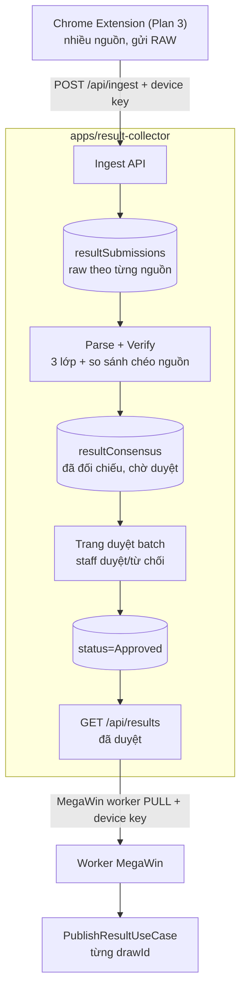

# Plan 2 — Result Collector Service (thu thập + duyệt kết quả, cung cấp cho MegaWin)

## Quyết định kiến trúc (đã chốt)

- **Ranh giới:** App MỚI trong CÙNG monorepo — `apps/result-collector` + `packages/result-collector` (domain) + `packages/result-collector-application` (use-case + infra). DB/collection RIÊNG, tách biệt backoffice nhưng dùng chung hạ tầng (`@megawin/next`, `@megawin/auth`, `@megawin/data`, `@megawin/http-client`).
- **Mô hình tiêu thụ:** MegaWin **PULL** — worker/cron MegaWin gọi API service lấy kết quả đã duyệt rồi tự `PublishResultUseCase`. Service KHÔNG biết nội bộ MegaWin, chỉ expose kết quả đã duyệt.
- **Xác thực extension → service:** device/API key riêng (service token), KHÔNG dùng session người dùng.
- **Multi-source:** extension lấy từ nhiều trang (không chỉ Vietlott), service so sánh chéo để chống 1 nguồn sửa HTML/sai lệch.

Lưu ý naming: đây là **core RGS-adjacent**, KHÔNG phải product operator B2C → KHÔNG prefix `operator-`. Tên trần `result-collector` hợp lệ.

## Kiến trúc tổng thể



## Cấu trúc thư mục

Theo tiền lệ `apps/api-player` (package.json workspace deps) + layering `game-*`/`game-*-application`:

```
apps/result-collector/            Next.js app: ingest API + results API + trang duyệt
packages/result-collector/        domain: entities, schemas, rules parser/verify (pure)
packages/result-collector-application/  use-cases + infras/repos (Mongo) + services
```

## Data model (packages/result-collector/src/entities)

Theo tiền lệ `ops_alerts` (`packages/game-core/src/types/ops-alert.ts` — `const object as const`, `dedupeKey`, `status`, `createdAt`; repo `bulkUpsertByDedupe`).

> ⚠️ **Sửa sau review Plan 3 (28/08):** bản trước đặt
> `dedupeKey = ${source}:${gameKey}:${drawPeriodSource}` và body ingest có `items[{ drawPeriodSource, ... }]`.
> **Không khả thi** — extension **KHÔNG parse** (analysis §4.5b) nên không biết `drawPeriodSource`, cũng
> không biết cách chia `items[]`. Hai plan lệch nhau ở chính chỗ quan trọng nhất. Đã đổi sang dedupe
> bằng **`contentHash`** do extension tính (`sha256(raw)`) — server dedupe được **TRƯỚC KHI parse**.

- **`resultSubmissions`** — 1 bản ghi = 1 lần push RAW từ 1 nguồn (blob có thể chứa NHIỀU kỳ):
  - `sourceId` (const: `vietlott`|`minhngoc`|...), `gameKey` (`keno`|`bingo18`) — **cả hai lấy từ config
    nguồn**, không phải parse ra.
  - `raw` (blob nguyên vẹn), `contentHash` (sha256 hex — **dedupe key**), `sourceUrl`, `capturedAt`,
    `receivedAt`, `deviceId`.
  - `parseState` (`Pending`|`Parsed`|`Failed`), `parsedDraws?` (danh sách kỳ tách được), `parseError?`.
  - `dedupeKey = ${sourceId}:${contentHash}` — khớp header `Idempotency-Key` extension gửi.
  - ❌ **Bỏ `screenshotUrl` khỏi P1** — `captureVisibleTab` chỉ chụp tab **active**, xung đột với tab
    `active: false` của extension (xem Plan 3 §Bằng chứng). Raw + hash + `capturedAt` là bằng chứng
    machine-verifiable tốt hơn.
- **`resultConsensus`** — kết quả sau đối chiếu, chờ duyệt / đã duyệt:
  - `gameKey`, `drawDate`, `drawNo` (đã map, xem dưới), `drawId` (`YYYY-MM-DD.NNN`), `numbers`, `sources`
    (danh sách nguồn + số của từng nguồn), `agreement` (số nguồn khớp / tổng), `checks` (3 lớp verify),
    `status` (`Pending`|`Approved`|`Rejected`|`Conflict`), `approvedBy?`, `approvedAt?`, `vietlottRef`.
- Enum: `ResultImportStatus`, `ResultSource`, `SubmissionParseState` — `const object as const` (§5.3 code-quality).
- Index: unique `{gameKey, drawId}` trên `resultConsensus`; unique `dedupeKey` trên `resultSubmissions`.

## Ingest API — POST /api/ingest

Theo pattern `withApi().body(zod).handler(useCase.run)` (`apps/backoffice/src/lib/api.ts`, `publish-result/route.ts`), NHƯNG auth bằng **device API key** thay vì session:

- Cần builder auth mới cho service token (repo hiện chỉ có session better-auth). Thiết kế: header
  `Authorization: Bearer <deviceKey>`, so khớp bảng `devices` (hoặc env allowlist giai đoạn đầu). Ghi rõ
  đây là hạ tầng auth MỚI.
- **Rate-limit theo `deviceId`** — `chrome.storage.local` của extension là plaintext trên disk, key CÓ
  THỂ lộ nếu ai vào được máy. Rate-limit là lớp chặn thực tế (xem Plan 3 §Bảo mật).
- **Body (đã đổi):**
  ```ts
  {
    sourceId: string;      // từ config nguồn
    gameKey: string;       // từ config nguồn
    raw: string;           // 1 BLOB duy nhất — server tự tách kỳ
    contentHash: string;   // sha256 hex, do extension tính
    capturedAt: string;    // ISO 8601
    sourceUrl: string;
    deviceId: string;
  }
  ```
- Header `Idempotency-Key: ${sourceId}:${contentHash}` — server **short-circuit trả 200 + `duplicate: true`
  nếu đã có**, KHÔNG parse lại. Rẻ và không cần hiểu nội dung.
- Use-case `IngestSubmissionsUseCase`: upsert `$setOnInsert` theo `dedupeKey`, `parseState = Pending`.
  KHÔNG parse ở đây (parse tách bước để re-run được khi đổi parser).
- **Extension chỉ POST khi `contentHash` KHÁC lần trước** → phần lớn nhịp poll chỉ gửi heartbeat, cắt
  ~80% traffic ingest (Plan 3 §Contract). Server không cần biết điều này, nhưng đừng thiết kế alert kiểu
  "không nhận ingest N phút = lỗi" — dùng **heartbeat** làm tín hiệu sống, không dùng ingest.

## Heartbeat API — POST /api/heartbeat

Tách riêng khỏi ingest vì extension gửi **mỗi nhịp** kể cả khi không có dữ liệu mới:

- Body: `deviceId`, `chromeVersion`, `lastOkAt`, `consecutiveFailures`, `outboxDepth`,
  `perSource: [{ id, state, reason, backoffSec }]`, `cfClearanceExpiresAt`.
- Response: `{ paused: boolean }` — **kill-switch**, extension đọc mỗi nhịp để dừng được từ xa.
- Server mất heartbeat > N phút → alert hạ tầng vào `/system/workers` (KHÔNG vào `ops_alerts`, analysis §4.5).

## Parse + Verify (packages/result-collector/src/rules + application service)

Bước tách riêng (chạy sau ingest, hoặc trigger ngay sau khi nhận):

1. **Tách kỳ + parse theo config nguồn:** mỗi `sourceId` có 1 parser config (selector/endpoint shape).
   Vì extension gửi **1 blob nhiều kỳ**, bước này phải: tách blob → N kỳ → mỗi kỳ ra
   `{ drawPeriodSource, drawDateSource, numbers }`. Config để ở server → đổi HTML chỉ sửa server, không
   đụng extension.
2. **3 lớp verify** (theo analysis §3.4):
   - A. Checksum nội tại: Keno parity/big-small count, Bingo18 sum of dice — verify từ chính số parse được.
   - B. Draw period liên tục: `drawPeriodSource` tăng đúng +1 so kỳ trước cùng nguồn.
   - C. **So sánh chéo nguồn** (điểm mới của multi-source): gom mọi kỳ cùng `(gameKey, drawId)` từ các
     nguồn khác nhau → nếu ≥2 nguồn khớp số → `agreement` cao, tin cậy; nếu lệch → `status=Conflict`,
     đánh dấu nguồn nào lệch.
3. Ghi `resultConsensus` với `checks` + `agreement`.

**Re-run được:** parse đọc từ `resultSubmissions.raw` đã lưu → đổi parser rồi chạy lại toàn bộ lịch sử
mà không cần extension gửi lại. Đây là lý do tách 2 bước.

## Source config API — GET /api/source-config

Extension tải danh sách nguồn từ đây (Plan 3 §Remote config). **Config là DATA thuần, KHÔNG phải code** —
MV3 cấm remote code execution, extension sẽ `eval` không được và bị Chrome vô hiệu hoá nếu thử.

- Response: `SourceConfig[]` với `version: 1`, các field: `id`, `gameKey`, `pageUrl`, `url`, `method`,
  `headers`, `bodyTemplate` (chỉ placeholder whitelist `{{today}}`/`{{totalRow}}`/`{{gameId}}`),
  `extract` (`responseText` | `domOuterHTML` + selector), `intervalSec`, `jitterSec`,
  `activeHours { tz, from, to }`, `totalRow`.
- **`activeHours.tz` bắt buộc `"Asia/Ho_Chi_Minh"`** — máy chạy AWS mặc định UTC, thiếu tz thì extension
  poll lệch 7 tiếng.
- **`totalRow` mặc định 30 cho poll thường** (Keno 10'/kỳ → ~5h lịch sử, dư phủ downtime ngắn). Chỉ dùng
  200 khi backfill gap dài. Bản trước dùng 200 mọi lần → payload lớn 6× vô ích.
- Đổi shape config → bump `version`; extension từ chối version lạ và dùng cache cũ.
- Type mirror TAY giữa Service và extension (không có compiler bảo vệ — như player-sdk ↔ backend). Sửa
  shape ở Service **phải** sửa `lib/types.ts` của extension trong cùng đợt.

## Map drawPeriod (Vietlott) → drawNo (MegaWin)

Theo analysis §4.3 (đã verify bằng dữ liệu thật):

- Vietlott `drawPeriod` liên tục, KHÔNG đứt số trong ngày và bắc cầu qua ngày.
- **Neo đầu ngày:** kỳ đầu tiên trong ngày ↔ `drawNo=1`, lưu `basePeriod`.
- `drawNo = drawPeriodSource − basePeriod + 1` → `drawId = ${drawDate}.${zeroPad(drawNo,3)}`.
- **Đã resolved (28/08):** MegaWin config Keno đã sửa `firstDrawTime` 06:00 → 06:08, khớp đúng 119 kỳ/ngày với dataset Vietlott (analysis §6 #15). Vẫn giữ kiểm tra chéo: đếm số kỳ/ngày phải khớp 119; lệch → quarantine cả ngày, không đoán.
- Kỳ huỷ/bù giữa ngày làm lệch offset → verify tổng số kỳ/ngày trước khi map.

## Trang duyệt batch — apps/result-collector/(main)/review

Theo tiền lệ `/system/workers` (`page.tsx` shell + Suspense, `_components/*-content.tsx` orchestrator giữ 1 dialog chung, `_lib/use-queries.ts` React Query) + `useDataTableInstance` (`apps/backoffice/src/hooks/use-data-table-instance.ts`, `enableRowSelection`) — đây là trang TIÊN PHONG dùng cột checkbox batch:

- Cột `select` (checkbox all + row), `drawId`, `numbers` (badge), `sources` (nguồn nào khớp/lệch), `agreement`, `status` (Badge theo enum), `checks`.
- Thanh batch action: hiện `getFilteredSelectedRowModel().rows.length`, nút "Duyệt N kỳ" / "Từ chối N kỳ".
- Confirm dialog CHUNG cho batch (state ở orchestrator, không render 1 dialog/dòng).
- Mutation batch → `POST /api/review/approve { ids }`; `onSuccess` invalidate + toast + `resetRowSelection()`.
- Lọc: theo `gameKey`, `status`, ngày. Ưu tiên hiển thị `Conflict` lên đầu để staff xử lý trước.
- Xem chi tiết 1 dòng: raw HTML của từng nguồn làm bằng chứng (raw + `contentHash` + `capturedAt` +
  `sourceUrl`). Không có ảnh chụp ở P1 — xem Plan 3 §Bằng chứng.

## Consume API — GET /api/results (MegaWin PULL)

- `GET /api/results?gameKey=&since=&status=approved` trả kết quả đã duyệt: `{ gameKey, drawId, numbers, vietlottRef, approvedAt }`.
- Auth: device key riêng cho MegaWin (khác key extension).
- Cursor/`since` để MegaWin poll incremental, idempotent.

## Tích hợp MegaWin (PULL)

- Worker/cron MegaWin (thêm vào `apps/worker-keno` + `apps/worker-bingo18`, hoặc worker mới) định kỳ gọi `GET /api/results`.
- Với mỗi kỳ đã duyệt: gọi `PublishResultUseCase.run({ drawId, numbers, vietlottRef, actor })` (`packages/game-{keno,bingo18}-application/src/use-cases/draws/publish-result.ts`) — use-case đã tự xử lý publish lần đầu / republish / chỉ update vietlottRef.
- `actor` = service account (audit rõ nguồn auto-import). Cần `DrawResultSource` enum trên `DrawDoc` để phân biệt kỳ auto vs người nhập (analysis §4.4).
- Idempotent: MegaWin lưu con trỏ đã pull tới đâu; publish lại cùng drawId không gây hại (use-case guard transition).
- **KHÔNG auto-publish thẳng** ở giai đoạn đầu: shadow mode — chỉ ghi log/so sánh, staff vẫn nhập tay, tới khi tin cậy mới bật auto (analysis P1→P3).

## Thứ tự triển khai (bám P1→P3 của analysis)

1. Scaffold app + package + data model.
2. Ingest API + heartbeat API + device auth + rate-limit + repo upsert theo `contentHash`.
3. **Source config API** (`GET /api/source-config`) — extension cần cái này để chạy được nhịp đầu tiên.
4. Parser 1 nguồn (Vietlott): tách blob → N kỳ + 3 lớp verify + drawNo mapping.
5. Trang duyệt batch (đọc + duyệt/từ chối, chưa nối MegaWin) → **P1 shadow mode**, rủi ro 0.
6. Consume API + worker MegaWin PULL (vẫn shadow, chưa auto-publish).
7. Thêm nguồn thứ 2/3 → bật so sánh chéo nguồn.
8. Bật auto-publish có ngưỡng exposure + kill-switch → **P3**.

## Không làm

- KHÔNG dùng dataset GitHub làm nguồn production (analysis §2.10 — không chính thức).
- KHÔNG auto-publish trước khi shadow mode đạt cửa ra.
- KHÔNG để service biết nội bộ MegaWin (chỉ expose kết quả đã duyệt).
- KHÔNG bắt extension gửi `drawPeriodSource`/`items[]` — extension không parse (analysis §4.5b).
- KHÔNG trả code/expression trong `/api/source-config` — MV3 cấm remote code execution.
- KHÔNG dùng "không nhận ingest N phút" làm tín hiệu chết — extension chủ động không POST khi
  `contentHash` trùng. Dùng **heartbeat**.

## Câu hỏi mở (chốt khi thực thi)

- Device auth: bảng `devices` trong service hay env allowlist giai đoạn đầu?
- `resultConsensus` per-game (2 collection) hay 1 collection chung có `gameKey`?
- Ngưỡng `agreement` để auto-duyệt (khi có multi-source): ≥2 nguồn khớp?
- ~~Số kỳ/ngày Keno 119 vs 120 — ai đúng (chặn mapping)?~~ **Đã trả lời:** 119 đúng, config đã sửa (`firstDrawTime` → "06:08").
- TTL của `resultSubmissions.raw` — giữ bao lâu? (raw là blob 200–500KB/lần, cần policy dọn)
- Ngưỡng mất heartbeat để alert (phút)? → analysis §6 #14.
