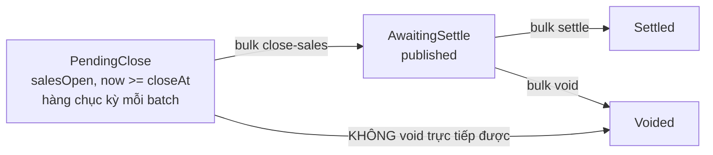

# p0-04 — Bulk draw actions API: settle / void / close-sales / open-sales

> **Phase:** P0 · **Status:** ✅ code done (07/09) · review code 07/09 — 4 use-case bulk + `bulk-runner.ts`
> đúng thiết kế partial-success/chunk-cap/dedupe; test §5 (bulk thật) vẫn CHƯA chạy · **Phụ thuộc:** p0-02 · **Chặn:** p1-02
> **Scope:** `game-keno-application` + route `apps/backoffice` (Bingo18 ở p1-04)
> **Guideline UI:** [`ops-hub-page-layout.guideline.md`](./ops-hub-page-layout.guideline.md) §5 (bảng + bulk bar), §1.5 (nhãn + action theo gate)
> **Nguyên tắc:** partial success, concurrency cap, **gọi lại** use-case đơn — không copy logic

## 0. Bản này khác bản trước ở đâu

| Bản trước | Bản này |
|---|---|
| Chỉ có `bulk-settle` + `bulk-void` | Thêm **`bulk-close-sales`** và **`bulk-open-sales`** — hai action mà mô hình vận hành batch cần nhất (§1.2) |
| Không nhắc `VOIDABLE_STATUSES` | **Ràng buộc chặn thật:** `salesOpen` **KHÔNG** void được → kỳ `PendingClose` phải `close-sales` trước (§1.3). Đây là lý do `bulk-close-sales` không phải "nice to have" |
| Không nhắc điều kiện `now < closeAt` cho mở bán | `OpenSalesUseCase` **không** kiểm tra `now < closeAt` → mở bán kỳ đã quá `closeAt` sẽ tạo kỳ bán được nhưng khoá ngay. **UI + bulk phải tự chặn** (§1.4) |
| 4 hằng số rải rác | Gom vào 1 module `bulk-limits.ts` để Zod ở route và use-case dùng cùng nguồn |

## 1. Vấn đề

### 1.1 Bấm từng kỳ là không khả thi

Sau p0-02, staff settle được nhiều kỳ nhưng phải bấm từng kỳ. Với backlog 112 kỳ, đó là 112 lần bấm.

Cách sai (phải chặn ngay từ thiết kế): để FE bắn N request lẻ. 20 kỳ = 20 request đồng thời → 20 Lambda
+ 20 SFN execution start cùng lúc, không có trần, không biết cái nào lỗi. Đây chính là lý do p0-04
**chặn** p1-02: bulk action bar không được ra đời trước khi có API batch thật.

### 1.2 Mô hình vận hành batch cần 4 action, không phải 2

Theo guideline §0.1, staff **mở bán cả ngày từ đầu** rồi **chốt sổ theo batch 1 giờ**. Nghĩa là mỗi
batch phải xử lý một dãy kỳ đã qua `closeAt`:



`bulk-close-sales` là **action bị dùng nhiều nhất** trong ngày (mỗi batch chạm hàng chục kỳ), nhưng bản
plan trước không có. Thiếu nó thì staff vẫn phải bấm đóng bán 112 lần — đúng vấn đề §1.1 chưa được giải.

`bulk-open-sales` cần cho hai tình huống thật (guideline §1.5): gate `PendingOpen` (quên mở bán, kỳ
`scheduled` mà `now < closeAt`) và gate `Halted` (đã ngắt bán vì sự cố, giờ mở lại). Cả hai thường
xuất hiện thành **dãy** kỳ liền nhau, không phải 1 kỳ lẻ.

### 1.3 Ràng buộc CHẶN: `salesOpen` không void được

[`void-draw.ts:12`](../../../packages/game-keno-application/src/use-cases/draws/void-draw.ts):

```typescript
const VOIDABLE_STATUSES = new Set<string>([DrawStatus.Scheduled, DrawStatus.SalesClosed, DrawStatus.Published]);
```

**`DrawStatus.SalesOpen` KHÔNG có trong danh sách.** Hệ quả trực tiếp lên UI Hub:

- Kỳ ở chặng `PendingClose` (`salesOpen` + `now >= closeAt`) — chặng **phổ biến nhất** trong bảng 5A —
  **không** void trực tiếp được. Phải `close-sales` trước, rồi mới void.
- Nếu bulk bar cho chọn lẫn kỳ `PendingClose` và kỳ `AwaitingSettle` rồi bấm "Huỷ kỳ", các kỳ
  `PendingClose` sẽ **toàn bộ** trả `DRAW_INVALID_TRANSITION` — người vận hành thấy "một nửa lỗi" mà
  không hiểu vì sao.

**Quyết định (KHÔNG sửa `VOIDABLE_STATUSES`):** giữ nguyên ràng buộc domain. Void một kỳ đang mở bán mà
không đóng bán trước là **thao tác nguy hiểm** — vé vẫn đang vào trong lúc void chạy. Bắt đóng bán
trước là đúng nghiệp vụ, không phải giới hạn kỹ thuật.

Thay vào đó **UI phải phản ánh đúng** (p1-02):

- Nút "Huỷ kỳ" trên bulk bar chỉ bật khi **mọi** kỳ đã chọn có `status ∈ VOIDABLE_STATUSES`.
- Chọn lẫn kỳ `salesOpen` → nút disabled + tooltip: *"Có N kỳ đang mở bán. Đóng bán trước rồi huỷ."*
- Bulk bar gợi ý chuỗi 2 bước: **Đóng bán** → **Huỷ kỳ**.

Use-case bulk-void **phải export** `VOIDABLE_STATUSES` (hoặc 1 helper `isVoidable(status)`) để FE
không hardcode lại danh sách — hardcode là cách chắc chắn nhất để hai bên lệch nhau khi domain đổi.

### 1.4 `OpenSalesUseCase` KHÔNG kiểm tra `now < closeAt`

[`open-sales.ts:19-20`](../../../packages/game-keno-application/src/use-cases/draws/open-sales.ts):

```typescript
const allowedFrom: DrawStatus[] = [DrawStatus.Scheduled, DrawStatus.SalesClosed];
if (!allowedFrom.includes(draw.status as DrawStatus)) { throw ... }
```

Chỉ kiểm tra `status`, **không** so `now` với `sales.closeAt`. Mở bán một kỳ đã quá `closeAt` sẽ thành
công và tạo ra kỳ `salesOpen` + `now >= closeAt` — tức chặng `PendingClose` — nhưng **không có vé nào
vào được** vì `closeAt` là khoá cứng phía đặt cược. Kết quả: một kỳ trông như đang bán nhưng vô dụng,
và người vận hành mất thêm một bước đóng bán lại.

**Quyết định:** không sửa `OpenSalesUseCase` (nó đúng ở tầng domain: chuyển trạng thái là hợp lệ), mà
chặn ở **2 tầng trên**:

1. **UI** (p1-02): nút "Mở bán" chỉ hiện khi `now < closeAt`. Kỳ `scheduled` + `now >= closeAt` là chặng
   `NeverOpened` → action đúng của nó là **Huỷ kỳ**, không phải mở bán (guideline §1.5).
2. **Bulk use-case** (plan này): filter trước khi gọi, kỳ nào `now >= closeAt` trả `ok: false` với mã
   riêng `DRAW_SALES_WINDOW_CLOSED` + message tiếng Việt rõ ràng. **Không** để nó "thành công" rồi
   người vận hành tự phát hiện sau.

Đây là ngoại lệ **có chủ đích** với `code-quality-standards.mdc` §8 ("không duplicate validation"): đây
**không** phải input-shape validation mà là **business rule phụ thuộc dữ liệu DB** (`sales.closeAt` của
từng kỳ) — đúng trường hợp §8 cho phép validate trong use-case.

## 2. Thiết kế

### 2.1 Hợp đồng dùng chung cho cả 4 action

4 endpoint, cùng một shape response:

| Endpoint | Body | Use-case đơn được gọi |
|---|---|---|
| `POST /api/games/keno/draws/bulk-settle` | `{ drawIds }` | `TriggerSettleUseCase` |
| `POST /api/games/keno/draws/bulk-void` | `{ drawIds, reason }` | `VoidDrawUseCase` |
| `POST /api/games/keno/draws/bulk-close-sales` | `{ drawIds }` | `CloseSalesUseCase` |
| `POST /api/games/keno/draws/bulk-open-sales` | `{ drawIds }` | `OpenSalesUseCase` |

Response **luôn 200** (kể cả khi vài kỳ lỗi):

```typescript
/** Kết quả bulk — mỗi kỳ độc lập, KHÔNG all-or-nothing. */
export interface BulkDrawActionOutput {
  /** Kết quả từng kỳ, THỨ TỰ khớp `drawIds` đầu vào (sau khi dedupe). */
  results: BulkDrawActionResult[];
  /** Số kỳ thành công. */
  successCount: number;
  /** Số kỳ thất bại. */
  failureCount: number;
}

/** Kết quả 1 kỳ trong lô. */
export interface BulkDrawActionResult {
  drawId: string;
  /** `true` = đã chuyển trạng thái (và start worker nếu là settle), hoặc idempotent-success. */
  ok: boolean;
  /**
   * Mã lỗi khi `ok = false` — dùng CHÍNH mã của use-case đơn
   * (`DRAW_ALREADY_SETTLED`, `DRAW_INVALID_TRANSITION`, `SFN_START_FAILED`…), cộng thêm
   * `DRAW_SALES_WINDOW_CLOSED` riêng cho bulk-open-sales (§1.4).
   * FE hiện thẳng tại dòng kỳ đó.
   */
  errorCode?: string;
  /** Thông báo tiếng Việt cho staff — hiện nguyên văn, không dịch lại ở FE. */
  errorMessage?: string;
}
```

**Vì sao 200 chứ không 207/400:** FE cần **luôn** đọc được `results` để tô từng dòng. Trả 4xx buộc FE
xử lý 2 đường (error branch vs success branch) cho cùng một payload → dễ bỏ sót nhánh.
`successCount`/`failureCount` đủ để FE quyết định toast thành công hay cảnh báo.

### 2.2 Hằng số — 1 module dùng chung

**File mới:** `packages/game-keno-application/src/use-cases/draws/bulk-limits.ts`

```typescript
/**
 * Trần số kỳ mỗi request bulk.
 *
 * Cơ sở: 50 kỳ × 5 đồng thời = 10 chunk. Các use-case đơn chỉ CHUYỂN TRẠNG THÁI (settle chỉ
 * *start* SFN, không chờ settle xong) nên mỗi kỳ ~100-200ms → 10 chunk ≈ 2s, an toàn dưới
 * timeout Lambda route. 200 kỳ sẽ chạm timeout và mất toàn bộ kết quả.
 *
 * Batch 1 giờ của Keno (`drawIntervalMinutes = 8`) ≈ 7-8 kỳ; Bingo18 (`= 6`) ≈ 10 kỳ → 50 đủ
 * rộng cho cả batch dồn 5-6 giờ. Backlog lớn hơn thì chia nhiều lần bấm — có chủ đích, để
 * người vận hành thấy kết quả từng lô thay vì chờ một request khổng lồ.
 */
export const BULK_MAX_DRAWS = 50;

/**
 * Trần số kỳ chạy đồng thời trong 1 request.
 *
 * Settle: mỗi kỳ = 1 SFN execution + 1 chuỗi Lambda + 1 luồng ghi rollup daily.
 * `Promise.all` trần trên 50 kỳ sẽ đấm 50 execution vào Step Functions cùng lúc. 5 giữ được
 * lợi ích song song mà vẫn đo được và không cần tăng reserved concurrency của worker.
 *
 * Với close-sales/open-sales (chỉ 1 DB write, không SFN) 5 là thừa an toàn — dùng chung một
 * hằng số cho cả 4 action để không có 4 con số phải nhớ.
 */
export const BULK_CONCURRENCY = 5;
```

Zod ở route **import** `BULK_MAX_DRAWS` từ đây — một nguồn duy nhất, không lặp số.

### 2.3 Runner dùng chung — 4 use-case, 1 cơ chế điều phối

Bốn action khác nhau ở đúng một điểm: gọi use-case nào cho 1 kỳ. Toàn bộ phần còn lại (dedupe, chunk,
cap, try/catch per-draw, gom `results`, đếm success/failure) **giống hệt**. Viết 4 lần là 4 chỗ để lệch
nhau.

**File mới:** `packages/game-keno-application/src/use-cases/draws/bulk-runner.ts`

```typescript
/**
 * Điều phối một hành động trên nhiều kỳ — hạ tầng dùng chung cho mọi bulk draw action.
 *
 * KHÔNG chứa logic nghiệp vụ nào. Nhận 1 hàm `runOne(drawId)` và lo 5 việc:
 *   1. Dedupe `drawIds` (giữ thứ tự xuất hiện đầu tiên).
 *   2. Chia chunk `BULK_CONCURRENCY` và chạy tuần tự từng chunk.
 *   3. Bọc `try/catch` RIÊNG mỗi kỳ — 1 kỳ throw KHÔNG làm mất kết quả các kỳ khác.
 *   4. Map `AppException` → `{ errorCode, errorMessage }`; lỗi lạ → `UNKNOWN` + log.
 *   5. Gom `results` theo đúng thứ tự đầu vào + đếm `successCount`/`failureCount`.
 *
 * PARTIAL SUCCESS là hợp đồng, không phải hệ quả: mỗi kỳ là một đơn vị độc lập về tài chính,
 * không transaction, không rollback.
 */
export async function runBulkDrawAction(
  drawIds: string[],
  runOne: (drawId: string) => Promise<void>,
): Promise<BulkDrawActionOutput>
```

Chunking: chia `drawIds` thành các mảng `BULK_CONCURRENCY` phần tử, `await Promise.all` từng chunk tuần
tự. Đủ đơn giản để đọc, **không** thêm dependency (`p-limit`…).

> `Promise.all` trong runner là chỗ **duy nhất** được phép. Mọi promise khác phải `await` hoặc `void`
> tường minh — `biome-lint-conventions.mdc` §d **cấm tuyệt đối** `biome-ignore` cho
> `noFloatingPromises` trong code tài chính, và settle là đường tiền.

### 2.4 Bốn use-case mỏng

Mỗi use-case chỉ còn khai báo "gọi ai" + ràng buộc riêng của nó.

```typescript
/**
 * Kết sổ hàng loạt — chạy `TriggerSettleUseCase` cho từng kỳ qua `runBulkDrawAction`.
 *
 * KHÔNG nhân bản logic settle: mỗi kỳ đi qua ĐÚNG use-case đơn, giữ nguyên cả 3 lớp chống
 * double-trigger (settledAt high-water mark, CAS published→settling, deterministic SFN
 * execution name). Bulk chỉ điều phối.
 */
export class BulkTriggerSettleUseCase extends UseCase<BulkTriggerSettleInput, BulkDrawActionOutput> {

/**
 * Huỷ kỳ hàng loạt — `VoidDrawUseCase` cho từng kỳ, MỘT `reason` áp cho cả lô.
 *
 * Không cho nhập lý do từng kỳ: UI sẽ rối, và lý do void hàng loạt về bản chất là một
 * (sự cố hệ thống, sai kết quả nguồn…).
 *
 * RÀNG BUỘC DOMAIN: `salesOpen` KHÔNG void được (`VOIDABLE_STATUSES` không chứa nó) → kỳ ở
 * chặng `PendingClose` sẽ trả `DRAW_INVALID_TRANSITION`. Đây là ĐÚNG nghiệp vụ (void trong
 * lúc vé vẫn đang vào là nguy hiểm); FE phải chặn trước bằng `isVoidable` và gợi ý chuỗi
 * "Đóng bán → Huỷ kỳ" (plan §1.3).
 */
export class BulkVoidDrawUseCase extends UseCase<BulkVoidDrawInput, BulkDrawActionOutput> {

/**
 * Đóng bán hàng loạt — `CloseSalesUseCase` cho từng kỳ.
 *
 * ĐÂY LÀ ACTION DÙNG NHIỀU NHẤT của Hub: mô hình vận hành mở bán cả ngày rồi chốt sổ theo
 * batch 1 giờ, mỗi batch chạm hàng chục kỳ ở chặng `PendingClose` (plan §1.2).
 *
 * Rẻ nhất trong 4 action: `CloseSalesUseCase` chỉ 1 DB write có điều kiện status (repo tự
 * filter `SalesOpen`), KHÔNG đọc draw trước, KHÔNG start SFN. Kỳ không ở `SalesOpen` sẽ nhận
 * `DRAW_INVALID_TRANSITION` từ repo — đúng hành vi idempotent mong muốn.
 */
export class BulkCloseSalesUseCase extends UseCase<BulkDrawIdsInput, BulkDrawActionOutput> {

/**
 * Mở bán hàng loạt — `OpenSalesUseCase` cho từng kỳ, CÓ kiểm tra cửa sổ bán.
 *
 * Dùng cho gate `PendingOpen` (quên mở bán) và `Halted` (đã ngắt bán, giờ mở lại) —
 * cả hai thường xuất hiện thành DÃY kỳ liền nhau (guideline §1.5).
 *
 * KIỂM TRA THÊM `now < sales.closeAt` trước khi gọi: `OpenSalesUseCase` chỉ check `status`,
 * không check cửa sổ bán, nên mở bán kỳ đã quá `closeAt` sẽ "thành công" nhưng tạo ra kỳ
 * không nhận được vé nào (plan §1.4). Kỳ quá hạn trả `DRAW_SALES_WINDOW_CLOSED`.
 *
 * Đây KHÔNG phải duplicate validation của Zod (`code-quality-standards.mdc` §8): là business
 * rule phụ thuộc dữ liệu DB (`sales.closeAt` của từng kỳ), Zod ở route không thể biết.
 */
export class BulkOpenSalesUseCase extends UseCase<BulkDrawIdsInput, BulkDrawActionOutput> {
```

### 2.5 `bulk-open-sales` — đọc `closeAt` trong 1 query, không N query

Kiểm tra cửa sổ bán cần `sales.closeAt` của từng kỳ. **Không** gọi `getDrawById` N lần (vi phạm đúng
nguyên tắc p0-03: số query không tỷ lệ với số kỳ).

Tái dùng `listUnfinishedDrawRows`? **Không** — nó filter theo `status`, không theo `drawIds`. Thêm 1
method mỏng:

```typescript
  /**
   * Đọc `sales.closeAt` cho nhiều kỳ trong 1 query — dùng cho bulk-open-sales kiểm tra
   * cửa sổ bán trước khi chuyển trạng thái.
   *
   * Projection chỉ `{ drawId, sales.closeAt }`. Kỳ không tồn tại KHÔNG có trong Map →
   * caller trả `DRAW_NOT_FOUND` cho kỳ đó.
   */
  async getCloseAtByDrawIds(drawIds: string[]): Promise<Map<string, Date>>
```

Luồng của `BulkOpenSalesUseCase`:

1. `getCloseAtByDrawIds(drawIds)` — **1 query**.
2. Chia `drawIds` thành 2 nhóm: hợp lệ (`now < closeAt`) và quá hạn.
3. Nhóm quá hạn: dựng `results` với `DRAW_SALES_WINDOW_CLOSED` **không gọi DB**.
4. Nhóm hợp lệ: `runBulkDrawAction` như bình thường.
5. Gộp 2 nhóm lại **theo thứ tự `drawIds` đầu vào**.

Bước 5 là chỗ dễ sai nhất: chia nhóm rồi gộp lại làm mất thứ tự. Dùng `Map<drawId, result>` rồi map lại
theo `drawIds` đã dedupe.

`now` lấy bằng `nowVN()` (`@megawin/shared/utils`) — cùng nguồn với `OpenSalesUseCase` (dòng 27), không
dùng `new Date()` trần để tránh lệch timezone.

### 2.6 Vì sao KHÔNG dùng `DistributedMutex` ở đây

`DistributedMutex` (`packages/worker-core/src/use-cases/lock/distributed-mutex.ts`) đang dùng cho
resettle — nơi cần độc quyền vì resettle **ghi đè** kết quả đã có. Bulk settle **lần đầu** đã có CAS
status bảo vệ: 2 request đồng thời cho cùng kỳ thì 1 thắng, 1 nhận `DRAW_INVALID_TRANSITION`. Thêm mutex
là thêm 1 collection write + 1 read mỗi kỳ, đổi lại không có gì.

## 3. Route

**File mới:** 4 route dưới `apps/backoffice/src/app/api/games/keno/draws/`:
`bulk-settle/route.ts`, `bulk-void/route.ts`, `bulk-close-sales/route.ts`, `bulk-open-sales/route.ts`.

Zod schema (`_lib/schema.ts`) — theo `code-quality-standards.mdc` §8, validate ở route, **không** lặp
lại trong use-case:

```typescript
import { BULK_MAX_DRAWS } from "@megawin/game-keno-application/use-cases/draws";

/** Dùng chung cho bulk-settle, bulk-close-sales, bulk-open-sales. */
export const bulkDrawIdsSchema = z.object({
  drawIds: z.array(z.string()).min(1).max(BULK_MAX_DRAWS),
});

export const bulkVoidSchema = bulkDrawIdsSchema.extend({
  reason: z.string().min(1).max(500),
});
```

`.max(BULK_MAX_DRAWS)` ở Zod đã chặn trần → use-case **không** check lại (chỉ import hằng số). Đúng
tinh thần §8: tin Zod ở route.

> **Ngoại lệ có chủ đích:** `BulkOpenSalesUseCase` **vẫn** validate `now < closeAt` (§1.4) — đó là
> business rule phụ thuộc DB, không phải input shape, nên không thuộc phạm vi §8.

**Permission:** mỗi bulk route phải cùng mức với action đơn tương ứng. Đọc route đơn hiện có và dùng
**đúng** guard đó:

```bash
rg -n 'trigger-settle|void-draw|close-sales|open-sales' apps/backoffice/src/app/api
```

Bulk **không** được là đường vòng qua phân quyền. Đặc biệt: nếu `void` yêu cầu quyền cao hơn `settle`
thì `bulk-void` phải giữ đúng mức cao hơn đó.

**Audit:** cả 4 use-case đơn **đã tự** audit mỗi kỳ (`auditSettle`, `auditDrawVoid`, `auditCloseSales`
dòng 21-27, `auditOpenSales` dòng 33-36). Bulk **không** thêm audit per-draw (sẽ trùng), nhưng **nên**
ghi 1 audit entry cho hành động bulk: ai bấm, action gì, bao nhiêu kỳ, `reason` nếu void, và
`successCount`/`failureCount`. Kiểm tra `services/audit-log.ts` có helper phù hợp; nếu không, thêm mới.

Lý do cần audit cấp lô: audit per-draw không trả lời được *"ai đã bấm chốt sổ lúc 14:00 và lô đó gồm
những kỳ nào"* — câu hỏi đầu tiên khi tra soát sự cố vận hành.

## 4. Tác động

| Vùng | Tác động |
|---|---|
| 4 use-case đơn | **Không đổi** — bulk gọi lại, không sửa |
| `VOIDABLE_STATUSES` | **Không đổi** (§1.3). Chỉ export thêm helper `isVoidable` cho FE |
| `OpenSalesUseCase` | **Không đổi** (§1.4). Kiểm tra cửa sổ bán đặt ở bulk + UI |
| UI action đơn hiện tại | Không đổi |
| Step Functions | Nhiều execution hơn, nhưng ≤ `BULK_CONCURRENCY` đồng thời/request |
| Rollup daily | ≤ 5 luồng đồng thời → **p0-01 phải xong** |
| Worker Lambda | Concurrency tăng. Kiểm tra reserved concurrency của `worker-keno` trước khi bật production |
| `bulk-close-sales` / `bulk-open-sales` | Chỉ DB write, **không** chạm SFN/worker → rủi ro hạ tầng ~0 |

## 5. Test

### 5.1 Unit — runner dùng chung

Test `runBulkDrawAction` riêng, mock `runOne`. Đây là nơi tập trung toàn bộ logic điều phối nên test ở
đây phủ cho cả 4 use-case.

| Case | Kỳ vọng |
|---|---|
| 3 kỳ đều ok | `successCount: 3`, `failureCount: 0` |
| 3 kỳ, kỳ giữa throw `AppException` | `results[1].ok = false` + đúng `errorCode`/`errorMessage`; 2 kỳ kia **vẫn ok** |
| `runOne` throw lỗi lạ (không `AppException`) | `errorCode: "UNKNOWN"`, có `console.error`, **không** throw ra ngoài |
| `drawIds` có trùng | Dedupe, `results` không có dòng trùng |
| Thứ tự `results` | Khớp thứ tự `drawIds` đầu vào (sau dedupe) |
| 12 kỳ, cap 5 | Chạy 3 chunk; counter tăng/giảm trong mock assert `maxConcurrent <= 5` |

Case cuối là case **quan trọng nhất** — nếu cap không enforce thật thì mọi lý luận về tải là vô nghĩa.

### 5.2 Unit — từng use-case

| Use-case | Case | Kỳ vọng |
|---|---|---|
| settle | Kỳ đã `settledAt` | `DRAW_ALREADY_SETTLED`, kỳ khác không ảnh hưởng |
| settle | Kỳ ở `Scheduled` | `DRAW_INVALID_TRANSITION` |
| void | Kỳ ở `salesOpen` | `DRAW_INVALID_TRANSITION` (**không** void được — §1.3) |
| void | 3 kỳ `published`, 1 `reason` | Cả 3 void, cùng `reason`, audit ghi đúng |
| close-sales | Kỳ ở `salesOpen` | ok |
| close-sales | Kỳ ở `salesClosed` (bấm 2 lần) | `DRAW_INVALID_TRANSITION`, idempotent-an toàn |
| open-sales | Kỳ `scheduled`, `now < closeAt` | ok |
| open-sales | Kỳ `scheduled`, `now >= closeAt` | **`DRAW_SALES_WINDOW_CLOSED`**, **không** gọi `OpenSalesUseCase` |
| open-sales | Kỳ `salesClosed`, `now < closeAt` (gate Halted) | ok |
| open-sales | Lẫn 2 kỳ hợp lệ + 2 kỳ quá hạn | `results` giữ đúng thứ tự đầu vào, 2 ok + 2 lỗi |
| open-sales | `drawId` không tồn tại | `DRAW_NOT_FOUND`, không throw |
| open-sales | Số DB call | **1** `getCloseAtByDrawIds` + N lần use-case đơn, **không** N lần `getDrawById` |

Case `open-sales` lẫn hợp lệ/quá hạn kiểm tra đúng chỗ dễ sai nhất (§2.5 bước 5).

### 5.3 Integration staging

1. Publish 10 kỳ Keno.
2. **Bulk close-sales** 10 kỳ ở `PendingClose` → cả 10 `salesClosed`.
3. Bulk settle cả 10 → `successCount: 10`.
4. Verify **đúng 10** SFN execution (không 20, không 9) — AWS Console hoặc CLI.
5. Verify rollup khớp (§6.3 của [p0-01](./p0-01-daily-rollup-race-fix.plan.md)), **và** mọi doc tenant
   cùng `rollupVersion`.
6. Bulk settle **lại** cùng 10 kỳ → tất cả `ok: false` (`DRAW_ALREADY_SETTLED`) hoặc idempotent success;
   **không** tạo execution mới, **không** trả thưởng lần 2. **Test chống double-pay, bắt buộc pass.**
7. Bulk void 3 kỳ `published` với 1 `reason` → cả 3 void, audit ghi đúng lý do + audit cấp lô có mặt.
8. Bulk void 3 kỳ đang `salesOpen` → cả 3 `DRAW_INVALID_TRANSITION`; verify **không** kỳ nào bị void
   nửa vời.
9. Bulk open-sales 3 kỳ `scheduled` trong đó 1 kỳ đã quá `closeAt` → 2 ok, 1
   `DRAW_SALES_WINDOW_CLOSED`; kỳ quá hạn vẫn ở `scheduled`.

## 6. Review checklist

- [ ] 4 use-case đều **gọi lại** use-case đơn, không copy logic. Đọc diff xác nhận.
- [ ] Logic điều phối nằm **1 chỗ** (`runBulkDrawAction`), không lặp 4 lần.
- [ ] `BULK_CONCURRENCY` / `BULK_MAX_DRAWS` khai **1 module**, Zod import từ đó — không lặp số.
- [ ] `BULK_CONCURRENCY` được **enforce thật**, có test đo `maxConcurrent` (§5.1).
- [ ] Mọi kỳ bọc `try/catch` riêng trong runner — grep `await` nào ngoài try.
- [ ] `results` giữ thứ tự + đã dedupe, kể cả nhánh chia nhóm của `bulk-open-sales` (§2.5).
- [ ] Response luôn `200` khi input hợp lệ, kể cả toàn bộ kỳ lỗi.
- [ ] **`VOIDABLE_STATUSES` KHÔNG bị sửa.** Export `isVoidable(status)` cho FE dùng, FE **không**
      hardcode danh sách: `rg -n "sales_open|SalesOpen" apps/backoffice/src/app/\(main\)/games/keno`
      — không được có chỗ nào tự liệt kê trạng thái void được.
- [ ] `OpenSalesUseCase` **KHÔNG bị sửa**; kiểm tra `now < closeAt` nằm ở bulk use-case + UI.
- [ ] `bulk-open-sales` đọc `closeAt` bằng **1 query**, không N lần `getDrawById`.
- [ ] `now` dùng `nowVN()`, không `new Date()` trần.
- [ ] Zod có `.max(BULK_MAX_DRAWS)`; use-case **không** validate lại trần (`code-quality-standards` §8).
- [ ] Permission **từng** bulk route giống action đơn tương ứng — đọc guard, không đoán.
- [ ] Có audit **cấp lô** (ai/action/số kỳ/reason/kết quả), **không** trùng audit per-draw.
- [ ] Không `biome-ignore` cho `noFloatingPromises`/`noMisusedPromises` (code tài chính — cấm tuyệt đối).
- [ ] Đã kiểm tra reserved concurrency của `worker-keno` chịu được 5 execution đồng thời.
- [ ] `pnpm check-types` + `pnpm lint` xanh.

## 7. Rủi ro

| Rủi ro | Mức | Xử lý |
|---|---|---|
| Trả thưởng 2 lần khi bấm bulk 2 lần | 🔴 | 3 lớp guard của use-case đơn còn nguyên. Test §5.3 bước 6 **bắt buộc pass** |
| Rollup sai vì 5 luồng đồng thời | 🔴 | **p0-01 là điều kiện chặn.** Ghi trong PR description |
| Staff void hàng loạt nhầm | 🔴 | Confirm dialog liệt kê **từng** `drawId` + tổng tiền + bắt nhập `reason` (p1-02). Không cho void bulk không xác nhận |
| Chọn lẫn kỳ `salesOpen` khi void → "nửa lô lỗi" không rõ lý do | 🟡 | `isVoidable` chặn ở UI + tooltip + gợi ý chuỗi "Đóng bán → Huỷ kỳ" (§1.3) |
| Mở bán kỳ đã quá `closeAt` → kỳ vô dụng | 🟡 | `DRAW_SALES_WINDOW_CLOSED` ở bulk + UI ẩn nút (§1.4). Test §5.2 |
| 1 kỳ throw làm mất kết quả cả lô | 🟡 | `try/catch` per-draw trong runner + test §5.1 case 3 |
| Quá tải worker khi settle backlog lớn | 🟡 | Cap 5 + trần 50 kỳ/request. Bắt đầu bằng lô nhỏ trên production |
| Bulk thành đường vòng qua phân quyền | 🟡 | Checklist permission, review **bắt buộc** đọc guard của cả 4 route |
| Chia nhóm trong `bulk-open-sales` làm mất thứ tự `results` | 🟡 | `Map` + map lại theo `drawIds`; test §5.2 case "lẫn hợp lệ/quá hạn" |
| Audit cấp lô thiếu → không tra soát được | 🟢 | Checklist + test §5.3 bước 7 |

## 8. Rollback

Code mới hoàn toàn (4 use-case mới, 1 runner mới, 1 module hằng số, 4 route mới, 1 repo method mới) —
**không sửa** code đang chạy. Revert commit là đủ.

Kỳ đã xử lý qua bulk **vẫn đúng**: chúng đi qua đúng use-case đơn, không có gì khác biệt về dữ liệu so
với bấm từng kỳ. Không có state nào cần dọn.