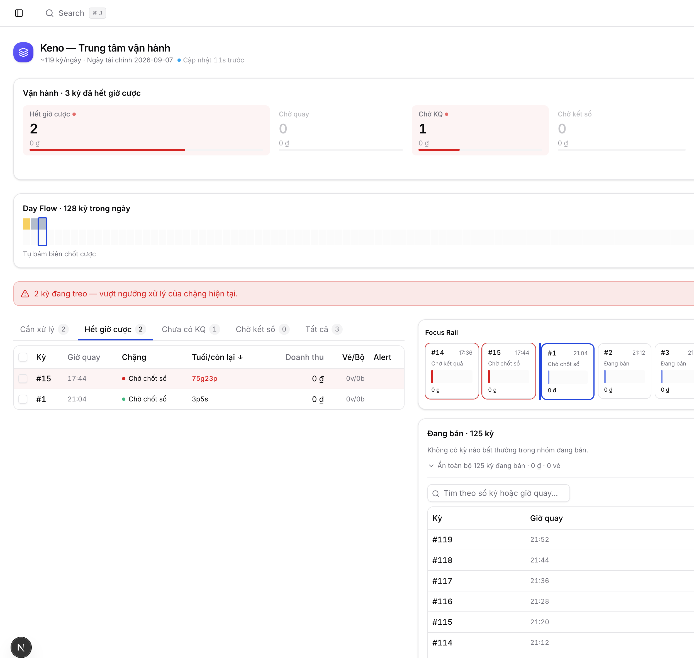
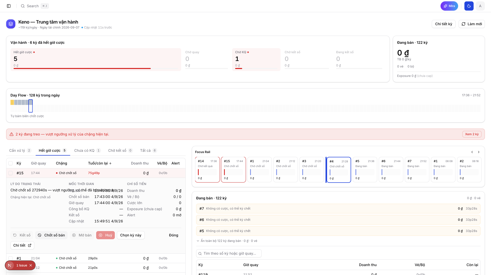

\
# Review & Risk Report — Keno Ops Hub (07/09/2026)

> Review đọc code thật (p0-01 → p1-03) + test UI trực tiếp trên `http://localhost:3000/games/keno/operations-hub`
> (Keno có kỳ thật đang chạy, ngày tài chính 2026-09-07). Không dùng GitNexus cho các finding UI/label
> (thuộc "vùng mù" của graph — Next.js App Router/JSX literal, xem `gitnexus-code-graph.mdc` §3) —
> mọi kết luận dưới đây từ **đọc code trực tiếp + quan sát UI**, không suy diễn.

## Tóm tắt

Code P0 (p0-01..p0-04) và P1 (p1-01..p1-03) đúng với thiết kế đã chốt ở mức logic nghiệp vụ và kiến
trúc — không phát hiện bug tính tiền/tính trạng thái nào. Phát hiện chính là ở tầng **UI/label**, nơi
implementation lệch khỏi `ops-hub-page-layout.guideline.md` và `frontend-dev.mdc` tại vài điểm cụ thể.

## 1. BUG THẬT — Label `PendingClose` lệch guideline, gây nhầm lẫn 2 chặng khác nhau

**Mức độ: Trung bình — không sai dữ liệu, nhưng phá mục tiêu "nhìn 5 giây hiểu ngay" của guideline.**

`ops-hub-page-layout.guideline.md` dòng 385 quy định rõ label chuẩn cho từng `OpsStage`:

| Stage | Nhãn (guideline) | Nhãn (code thật) |
|---|---|---|
| `PendingClose` | **`Hết giờ cược`** | **`Chờ chốt sổ`** ← lệch |
| `AwaitingDraw` | `Chờ quay kết quả` | `Chờ tới giờ quay` (lệch nhẹ, không va chạm) |
| `AwaitingResult` | `Chưa có kết quả` | `Chờ kết quả` (lệch nhẹ, không va chạm) |
| `NeverOpened` | `Chưa từng mở bán` | `Kỳ trắng` (lệch nhẹ, không va chạm) |

Nguồn: `queue-types.ts:78-87` (`OPS_STAGE_LABEL`) so với guideline dòng 382-391 (bảng "Stage | Nhãn | Màu | Hậu tố").

**Hậu quả quan sát được trên UI thật** (screenshot `full_page_ended_tab.png`):

- Zone 2 (khối "Vận hành") — đoạn phễu đầu tiên (`hub-overview-section.tsx:121`, hardcode
  `label: "Hết giờ cược"`) → hiện **"Hết giờ cược · 2"**.
- Tab 5A tương ứng (`HubGateTab.Ended`, `HUB_GATE_TAB_LABELS`) → hiện **"Hết giờ cược 2"**.
- Nhưng đúng 2 dòng đó trong bảng (kỳ #15, #1) lại hiện badge Chặng = **"Chờ chốt sổ"**
  (từ `OPS_STAGE_LABEL.pending_close`), và Focus Rail card cũng hiện **"Chờ chốt sổ"**.

→ **3 nơi trên CÙNG 1 trang, mô tả CÙNG 1 chặng pipeline, dùng 2 chuỗi tiếng Việt khác nhau.**
Nặng hơn: "Chờ chốt sổ" (pending_close — hết giờ cược, đang chờ chốt sổ BÁN theo batch) và
"Chờ kết sổ" (awaiting_settle — có kết quả, đang chờ KẾT SỔ để trả tiền) là 2 chặng **khác hoàn
toàn về nghiệp vụ** (một xảy ra ngay sau khi hết giờ cược, một xảy ra sau khi có kết quả quay) nhưng
tên **gần giống nhau tới mức chỉ khác 1 chữ** ("chốt" vs "kết"). Đây chính là nguyên nhân tạo cảm giác
"khả nghi" ban đầu khi quan sát: kỳ #15 hiện "Chờ chốt sổ" trong bảng nhưng tab "Chờ kết sổ" đếm 0 —
**đã xác minh bằng code đây KHÔNG phải bug đếm sai** (`filter-sort-rows.ts:52` map đúng
`PendingClose → HubGateTab.Ended`, không phải `AwaitingSettle`), nhưng chính sự giống nhau của 2 label
là rủi ro đọc-nhầm thật khi giám sát hàng chục kỳ trong vài giây.

**Đề xuất fix:** đổi `OPS_STAGE_LABEL.pending_close` từ `"Chờ chốt sổ"` → `"Hết giờ cược"` (khớp
guideline + khớp Zone 2 + khớp tên tab). Nếu vẫn muốn giữ thông tin "đang chờ chốt sổ batch" thì đưa
vào **hậu tố khi `health ≠ ok`** như guideline §1.5 thiết kế (`· chờ chốt sổ 2g14p`), không dùng làm
nhãn chính — **thực tế implementer có vẻ đã lấy đúng cụm chữ hậu tố này (`"chờ chốt sổ"`) làm nhãn
chính thay vì `"Hết giờ cược"`**, giải thích chính xác vì sao lỗi này xảy ra.

## 2. Deviation vs plan — Bảng 5A thiếu 2 cột plan yêu cầu (Exposure, Actions) + thiếu `pl-5`/`pr-5`

**Mức độ: Thấp/Trung bình — 3 điểm lệch riêng biệt trong CÙNG 1 đoạn plan (`p1-02` dòng 275-288), đáng
gộp thành 1 lượt sửa vì cùng khu vực code.**

`p1-02-hub-queue-table-bulk.plan.md` dòng 275-288 định nghĩa bảng 5A gồm **10 cột**, và ghi rõ 1 quy
tắc padding. Code thật (`hub-queue-table.tsx`) chỉ có **8 cột**, `colSpan={8}` khớp đúng 8 cột đó
(không phải lỗi tính colSpan — chỉ là thiếu cột theo plan):

| # | Plan (`p1-02` dòng 275-283) | Có trong code? |
|---|---|---|
| 1-7 | Checkbox, Kỳ, Giờ quay, Chặng, Trong chặng, Doanh thu, Vé/Bộ | ✅ đủ |
| 8 | **Exposure** — `right`, RAW + nhãn `(chưa cap)` | ❌ **không có** |
| 9 | Alerts | ✅ (đổi tên hiển thị thành "Alert", chấp nhận được) |
| 10 | **Actions** — `right`, `Chi tiết ↗` + action đơn dòng | ❌ **không có** (thay bằng: click dòng → mở inline expand; action đơn nằm trong `HubExpandPanel`) |

Cột #10 "Actions" bị bỏ là **chủ ý hợp lý** — khớp đúng thiết kế p1-03 sau khi viết lại ("mở tab mới +
inline expand không query", không cần cột action riêng vì click row đã mở panel có action). Nhưng
cột #8 "Exposure" bị bỏ **không có ghi chú chủ ý nào** trong code hay trong p1-02 cập nhật — exposure
chỉ còn thấy được sau khi click mở `HubExpandPanel` (`hub-expand-panel.tsx:179`, "Exposure (chưa
cap)"). Với kỳ đã hết giờ cược (phạm vi Zone 5A, không nhận cược mới nữa) mức độ khẩn cấp thấp hơn
Zone 5B (đang bán, exposure đổi liên tục — nơi vẫn hiện exposure ở khối tổng), nên có thể chấp nhận
được, nhưng **cần agent viết p1-02 xác nhận lại bằng 1 dòng trong plan** để tránh hiểu nhầm là thiếu
sót khi review sau này.

Plan dòng 287-288 còn ghi rõ: *"Cột đầu `pl-5`, cột cuối `pr-5` (`frontend-dev.mdc` §1.7a — bắt buộc
khi table trong `CardContent p-0`)"*. Code thật bọc `<Table>` trong `
` (KHÔNG phải `CardContent p-0` của shadcn `Card`) — nên chữ letter của `frontend-dev.mdc`
§1.7a (áp riêng cho `CardContent p-0`) không literally áp dụng, nhưng **plan riêng của trang này đã tự
đặt ra yêu cầu `pl-5`/`pr-5`** bất kể container nào, và code hiện tại không có (`<TableHead
className="w-8">` không có `pl-5`, `<TableHead>Alert</TableHead>` cuối cùng không có `pr-5`) — vẫn là
lệch so với plan riêng, dù không lệch literal rule chung.

## 3. BUG THẬT (2 lớp) — PageHeader Ops Hub hardcode màu icon, KHÔNG khớp bất kỳ nguồn chân lý nào hiện có

**Mức độ: Trung bình — vi phạm rõ pattern bắt buộc `frontend-dev.mdc` §1.4 (import `GAME_COLORS`,
không hardcode), và lộ ra thêm 1 vấn đề tech-debt có sẵn: rule doc đã lệch khỏi code thật.**

`frontend-dev.mdc` §1.4 (dòng 192-217) quy định code pattern **bắt buộc**: trang game phải
`import { GAME_COLORS } from "@/lib/game-colors"` rồi dùng `GAME_COLORS[GameProduct.X].iconGradient`
— **cấm hardcode** class gradient trực tiếp trong JSX (mục "❌ KHÔNG hardcode" dòng 384-385).

Đã verify bằng code, phát hiện **cả 3 trang liên quan đều hardcode**, không trang nào import
`GAME_COLORS`:

| File | Gradient hardcode trong JSX | `GAME_COLORS[...].iconGradient` thật (đọc `game-colors.ts`) |
|---|---|---|
| `apps/backoffice/.../keno/operations/page.tsx:110` | `from-orange-500 to-orange-600` | Keno = **`from-sky-500 to-sky-600`** ❌ lệch |
| `apps/backoffice/.../bingo18/operations/page.tsx:110` | `from-green-500 to-green-600` | Bingo18 = **`from-lime-500 to-lime-600`** ❌ lệch |
| `apps/backoffice/.../keno/operations-hub/_lib/hub-page-header.tsx:82` | `from-indigo-500 to-indigo-600` | (không khớp Keno lẫn `SYSTEM_ICON_GRADIENT` thật) |

**Phát hiện phụ quan trọng — rule doc đã lệch khỏi source code:** `game-colors.ts` dòng 121-123 có
comment tường minh *"Chuyển từ orange → sky-700 (#0284c7) để tách xa khỏi amber của Lotto535"* —
nghĩa là Keno **đã được đổi màu có chủ ý** (lý do: trên stacked bar chart, cam Keno cũ và amber
Lotto535 gần như không phân biệt được). Nhưng `frontend-dev.mdc` dòng 362-371 (bảng tra cứu
iconGradient) **chưa cập nhật theo** — vẫn ghi `Keno → from-orange-500 to-orange-600` và
`Hệ thống → from-indigo-500 to-indigo-600`, trong khi `SYSTEM_ICON_GRADIENT` thật trong code
(`game-colors.ts:218`) là `"from-primary/70 to-primary"` (theme-aware), không phải indigo cứng.
→ **2 trang `operations` (Keno cam, Bingo18 xanh lá) đang khớp với rule doc CŨ, không khớp
`GAME_COLORS` hiện tại** — đây là nợ kỹ thuật có sẵn từ trước Ops Hub, không phải lỗi mới, nhưng
Ops Hub kế thừa đúng pattern hardcode này rồi còn chọn 1 màu thứ 3 (indigo) không khớp gì cả.

**Hậu quả UX:** 2 trang `/games/keno/operations` và `/games/keno/operations-hub` — cùng 1 game, staff
chuyển qua lại liên tục trong ca — hiện icon 2 màu khác nhau (cam vs indigo), tạo cảm giác "2 hệ
thống khác nhau" chứ không phải 2 view của cùng 1 game.

**Đề xuất fix (làm đúng 1 lần, dứt điểm cả 3 lớp):**
1. Sửa `hub-page-header.tsx` dùng `GAME_COLORS[GameProduct.Keno].iconGradient` (import đúng, không
   hardcode) — tự động lấy đúng màu hiện hành, không cần biết màu gì.
2. Báo riêng cho team: `operations/page.tsx` (Keno + Bingo18) đang hardcode màu **cũ**, lệch khỏi
   `GAME_COLORS` hiện tại — nên sửa luôn cùng lúc để 2 trang tự động đồng bộ khi `game-colors.ts`
   đổi trong tương lai (đây là đúng mục đích của việc gom màu vào 1 file).
3. Cập nhật bảng tra cứu dòng 362-371 của `frontend-dev.mdc` cho khớp giá trị thật trong
   `game-colors.ts` (Keno→sky, Bingo18→lime, Hệ thống→`from-primary/70 to-primary`) — tránh AI đọc
   rule doc rồi viết code hardcode theo giá trị đã stale, đúng như đã xảy ra ở cả 3 file trên.

Khi port sang Bingo18 (p1-04), tham số hoá theo `GameProduct` truyền vào — tránh lặp lại lỗi hardcode.

## 4. Deviation vs `frontend-dev.mdc` §1.7 — Bảng 5A không có sticky header

**Mức độ: Thấp/Trung bình — chỉ lộ khi backlog lớn (giờ cao điểm ~150 kỳ theo guideline §0.2).**

§1.7 "Table Rules": *"Sticky header bắt buộc với table dài"*. `hub-queue-table.tsx` bọc `<Table>`
trong `
` không có `sticky`/`overflow-y-auto` + `max-h-*`; page
chỉ có `sticky` ở Bulk Action Bar (`hub-bulk-action-bar.tsx:121`). Lúc test (~21h, 3 kỳ Ended) không
thấy vấn đề vì bảng ngắn, nhưng theo phân bố trong guideline §0.2 (12h: ~45 kỳ Ended, phần lớn), khi
staff cuộn xuống dòng thứ 40-50 sẽ mất hoàn toàn header cột — không biết cột nào là gì khi nhìn cắt
ngang. Zone 5B bảng full (`SellingFullTable`) làm ĐÚNG (`max-h-96 overflow-y-auto` — header cuộn theo
khối riêng), Zone 5A nên áp dụng pattern tương tự nếu không muốn `sticky` toàn trang.

## 5. Xác minh KHÔNG phải bug — Đếm tab / phễu chuẩn xác 100%, inline expand panel (p1-03) hoạt động đúng

Đã đọc `filter-sort-rows.ts`, `derive-hub-summary.ts`, `derive-draw-state.ts` và test trực tiếp
(chọn tab "Hết giờ cược", quan sát: 2 kỳ #15/#1 cùng stage `pending_close`, tab "Cần xử lý"=2 khớp
2 kỳ có `health=stuck`, tab "Tất cả"=3 khớp `totalEnded`). Logic 2-trục (`SaleGate`/`OpsStage`) độc
lập, match-đầu-tiên-thắng, đúng đặc tả guideline §1.3. Bulk action bar test trực tiếp (chọn kỳ #15,
status=`salesOpen` sau `closeAt`) → đúng chỉ enable "Chốt sổ bán", disable "Kết sổ"/"Mở bán"/"Huỷ" —
khớp 100% rule domain (`partition-by-action.ts`, `void-draw-rules.ts` `VOIDABLE_STATUSES`).

Test thêm p1-03 (inline expand panel) bằng cách click trực tiếp vào dòng #15: panel mở đúng dưới dòng
(không phải Sheet), hiện đủ "Lý do trạng thái"/"Mốc thời gian"/"Chỉ số tiền", và 4 nút action đơn
(`Kết sổ`/`Chốt sổ bán`/`Mở bán`/`Huỷ`) disable đúng — chỉ "Chốt sổ bán" khả dụng, khớp state
`pending_close` (đã hết giờ cược, chưa chốt sổ). Xác nhận **0 query mới** phát sinh khi mở panel
(Network tab không có request nào — dữ liệu lấy thẳng từ `DerivedRow` đã có, đúng thiết kế p1-03 §3).

Lưu ý: panel cũng lộ lại đúng bug label #1 ở dòng "Chặng hiện tại: Chờ chốt sổ" — sửa 1 constant
`OPS_STAGE_LABEL.pending_close` ở mục 1 sẽ tự động fix luôn chỗ này (cùng nguồn dữ liệu).

## 6. Điểm khác — không phải bug, cần ghi nhận cho lần port Bingo18 (p1-04)

- Zone 2 (Vận hành + Đang bán) dùng layout funnel/summary tuỳ biến, **không** theo pattern
  `KpiCard` chuẩn `frontend-dev.mdc` §1.2a (icon `size-10` + nền màu). Đây là chủ ý theo
  `ops-hub-page-layout.guideline.md` §3 (cần hình dạng phễu tỉ lệ, không phải KPI đơn lẻ) —
  guideline riêng của Hub thắng quy tắc chung, không cần sửa, chỉ ghi chú lại vì nhìn khác các
  trang KPI khác trong hệ thống.
- Bảng 5A/5B không dùng `DataTableViewOptions` (§1.7) vì không dùng TanStack Table (quyết định
  kiến trúc p1-02 — object thường, `memo` primitive-props, tối ưu re-render cho ~150 dòng). Chủ ý,
  không phải thiếu sót.

## Checklist review theo `ops-hub-page-layout.guideline.md` §12

- [x] `salesOpen` sau `closeAt` hiểu là bình thường (`PendingClose`), không stuck khi trong ngưỡng
- [x] Kỳ đang bán không nằm cùng bảng với kỳ cần action (5A/5B tách biệt) — verify UI thật
- [x] Không có tab "Đã xong" — verify UI thật (5 tab: Cần xử lý/Hết giờ cược/Chưa có KQ/Chờ kết sổ/Tất cả)
- [x] Mốc phân chia là biên chốt cược, không phải `now` — verify code `deriveHubSummary` boundary logic
- [ ] Label `PendingClose` khớp guideline — **FAIL, xem mục 1**
