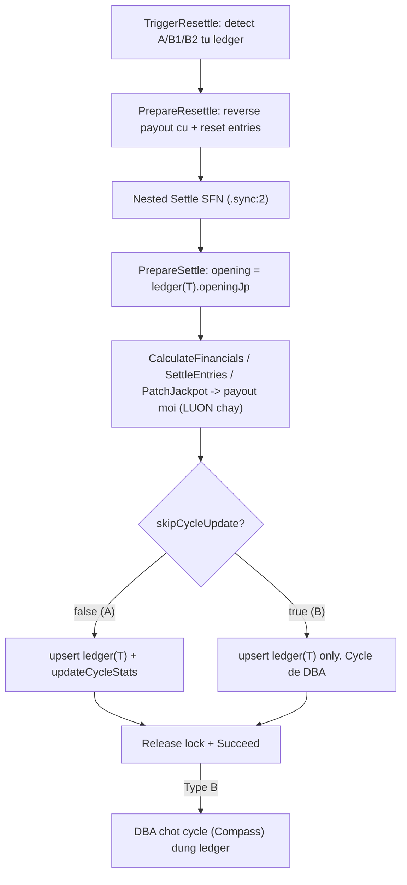

# Mega 6/45 Resettle Plan (Cycle Ledger)

> Mirror từ `power655-resettle.plan.md` (đã hoàn thiện), **đơn giản hoá cho SINGLE jackpot**. Thay snapshot rời trên DrawDoc bằng **Cycle Ledger** — collection `mega645JackpotCycleEntries` lưu lịch sử tích luỹ per-draw, làm single source of truth cho opening/closing từng kỳ, audit, pre-flight detection, và DBA restore.

## ⚠️ Code quy chuẩn (ĐỌC TRƯỚC KHI VIẾT BẤT KỲ DÒNG NÀO)

Mọi code trong plan này **BẮT BUỘC** tuân thủ 2 rule:

- **`.cursor/rules/code-quality-standards.mdc`**:
  - `/** JSDoc */` cho mọi class/method/interface/field public (IDE hover). `//` cho logic trong function body.
  - JSDoc class ghi pipeline position + CRASH-SAFE/IDEMPOTENT. JSDoc method ghi side effects, điều kiện đặc biệt, ràng buộc business param.
  - Comment business logic từng bước (tại sao + edge case + công thức). KHÔNG xoá comment khi sửa code — cập nhật cho khớp.
  - Tái dùng type từ `entities/`, `use-cases/*/types.ts`, `game-core/` — KHÔNG tự định nghĩa lại/inline.
  - §5.1: import named type chia sẻ từ `game-core` (re-export qua entity barrel), KHÔNG indexed-access `DrawDoc["field"]`.
  - §5.2: KHÔNG `Pick<T, ...>` khi đã chọn đủ TẤT CẢ field của `T` — dùng thẳng `T` (áp dụng cho `settleComplete` đang `Pick<DrawJackpotSnapshot, ...>`).
- **`.cursor/rules/mongodb-repository-architecture.mdc`**:
  - File `*-repo.ts` CHỈ chứa class + query. KHÔNG khai báo interface/type trong repo file → tách sang `repos/types/{concern}.types.ts` + re-export qua `types/index.ts`.
  - Aggregate result type là named interface (KHÔNG inline return type, KHÔNG return raw `any` — map sang typed interface).
  - Use case TUYỆT ĐỐI KHÔNG chứa MongoDB query (`$match/$group/aggregate`) — mọi DB I/O đi qua repo method.
  - API Route KHÔNG khởi tạo/gọi repo trực tiếp — phải đi qua Use Case (singleton module-level).
  - Repo method public PHẢI có JSDoc: mục đích, filter chính, idempotent?, index hint. Aggregate pipeline: mỗi stage 1 comment.

> Cụ thể cho plan này: `existsJpWinnerForDraw` (§6.4) là aggregate → return `boolean` (primitive, OK); `ResettleContext`/detection result là use-case type → đặt trong `use-cases/settle/types.ts` & `use-cases/resettle/types.ts`, KHÔNG trong repo. `detect-boundaries`/`trigger-resettle` chỉ gọi repo method, KHÔNG query trực tiếp. BO routes resettle/preflight gọi use-case singleton.

## 0. Khác biệt then chốt Mega 6/45 vs Power 6/55 (ĐỌC TRƯỚC)

| Khía cạnh | Power 6/55 (dual) | **Mega 6/45 (single)** |
|---|---|---|
| Số jackpot | JP1 (6/6) + JP2 (5/6 + bonus) | **CHỈ 1 Jackpot (6/6)** |
| Bonus number | Có (`bonusNumber`) | **KHÔNG có** |
| Kết quả | `winningMain[]` + `bonusNumber` | **`winningNumbers[]`** (6 số) |
| JP2 reset / overflow | Có (`jp2DidReset`, `jp1Overflow`) | **KHÔNG** |
| Winner đóng cycle | CHỈ JP1 đóng; JP2 chỉ reset | **MỌI jackpot winner ĐÓNG cycle** |
| Cycle close reason | winner / manual_reset | winner / manual_reset (giống) |
| `DrawJackpotSnapshot` | 4 field (JP1/JP2 open/close) | **2 field** (`openingAmount`, `closingAmount`) |
| Match jackpot | `inter ≥ 6` (JP1), `inter ≥ 5 ∧ bonus∈board` (JP2) | **CHỈ `inter ≥ 6`** |

**Hệ quả thiết kế** — Mega 6/45 đơn giản hơn:
- Ledger entry chỉ cần: `openingJp`, `jpContribution`, `closingJp`, `hasJpWinner` (bỏ toàn bộ JP2/overflow/jp2DidReset).
- `detect-boundaries` chỉ re-match 1 điều kiện jackpot (`inter ≥ 6`), không xét bonus.
- `ResettleReason` bỏ các lý do JP2 (`NewJackpot2Winner`, `OldJackpot2Winner`).
- Winner CŨ đọc từ `ledger(T).hasJpWinner` (1 cờ, không 2).
- **Bài học 2 CHIỀU winner (new/old) VẪN áp dụng** — xem §7.2.
- **`cascadeOpeningUpdate` + `findChainAfter` cho B2 VẪN cần** — single jackpot vẫn có chain kỳ sau khi sửa pool.

## 1. Vì sao Cycle Ledger

`JackpotCycleDoc` (Mega 6/45) hiện chỉ lưu **current state** (`currentAmount`, `totalContribution`, `drawCount`, `winners[]`) — lịch sử opening/closing từng kỳ bị mất. `FinalizeSettle` ghi cycle bằng giá trị tuyệt đối từ opening đọc lúc `PrepareSettle` (`activeCycle.currentAmount`) → KHÔNG idempotent khi resettle kỳ cũ mà kỳ sau đã cộng dồn.

Ledger lưu mỗi kỳ 1 entry bất biến. Lợi ích (giống Power 6/55):
- **Resettle**: nested `PrepareSettle` đọc `ledger(T).openingJp` thay vì `activeCycle` → payout JP winner chia pool đúng.
- **DBA restore (B2)**: đọc thẳng `ledger(T).openingJp` + `ledger(T).seq` → restore cycle về trước kỳ T, KHÔNG tính tay.
- **Audit/đối soát Vietlott**: view lịch sử tích luỹ từng kỳ.
- Ghi từ kỳ settle TỪ NAY về sau (sản phẩm mới, không backfill kỳ cũ).

## 2. Quy ước `seq` (tránh off-by-one)

`seq` = số thứ tự kỳ trong cycle, tính CẢ kỳ đó (1-based) = `drawCount` SAU khi settle kỳ này.
- `opening(T) === closing(T-1)` (tích luỹ tuần tự).
- `cycleDrawCountBefore` (drawCount TRƯỚC kỳ T, dùng cho `FinalizeSettle`) = `ledger(T).seq - 1`.
- Kỳ đầu cycle: `seq = 1`, `opening = seedAmount`, `cycleDrawCountBefore = 0` — không cần fallback đặc biệt.

## 3. Đọc opening: `ledger(T).openingJp` (KHÔNG đọc T-1.closing) — TRỪ cascade B2

Resettle 1 kỳ đơn (A/B1) lẫn DBA restore đọc **trực tiếp `ledger(T).openingJp`** — đại lượng cần chính xác, không edge case kỳ đầu cycle, đồng nhất 1 nguồn 1 field giữa worker và DBA.

**NGOẠI LỆ cascade B2**: với kỳ K trong chain (K > T), `ledger(K).openingJp` cũ đã bị **đóng băng** bởi `$setOnInsert` lúc settle lần đầu → KHÔNG còn đúng sau khi resettle kỳ trước làm đổi pool. Vì vậy `TriggerResettle.resolveOpening` phải lấy `opening(K) = closing(K-1)` từ `ledger(K-1)` (kỳ liền trước theo `seq`). Khi đó bật cờ `cascadeOpeningUpdate=true` để `FinalizeSettle` GHI ĐÈ `ledger(K).openingJp` (xem §6.1 + BÀI HỌC upsert).

DBA Type B2 restore cycle về trước kỳ T:
```
activeCycle.currentAmount = ledger(T).openingJp
activeCycle.drawCount     = ledger(T).seq - 1
```

## 4. Phân loại scenario + PA2 (worker payout / DBA cycle)

- **Type A — Auto (roll-over)**: T là kỳ MỚI NHẤT trong cycle active, kết quả cũ + mới đều KHÔNG có jackpot winner. → Worker recompute trọn (entry/payout + cycle). `skipCycleUpdate = false`.
- **Type B1 — Auto payout + DBA cycle**: T là kỳ MỚI NHẤT, kết quả mới/cũ phát sinh jackpot winner; KHÔNG có kỳ settle sau T (chain rỗng). → Worker auto reverse + re-settle payout (chia pool JP winner theo `ledger(T).openingJp`), **KHÔNG đụng cycle** (`skipCycleUpdate = true`). DBA chốt cycle SAU.
- **Type B2 — Cascade step-wise**: kết quả T thay đổi VÀ có chain kỳ đã settle sau T trong cùng cycle (`chainLength > 0`), HOẶC chain có winner. → Resettle TUẦN TỰ từng kỳ theo `seq` tăng dần (`T → T+1 → … → T+n`). MỖI kỳ chạy đúng luồng B1 (auto reverse + re-settle payout, `skipCycleUpdate = true`); SAU mỗi kỳ, DBA chốt cycle + xác nhận ledger trước khi resettle kỳ kế. **Kết quả số (winningNumbers) của các kỳ T+1..T+n KHÔNG đổi** — chỉ pool tích luỹ dịch chuyển → danh sách winner giữ nguyên, chỉ số tiền nhận được tính lại đúng theo opening mới.

**Vì sao B2 cascade được:**
- Sửa T chỉ đổi **pool tích luỹ**, KHÔNG đổi **kết quả số** của T+1..T+n → ai trúng vẫn là người đó, cycle đóng/mở vẫn đúng kỳ cũ.
- `PrepareSettle` đọc opening mỗi kỳ từ `resettleContext.openingJp` (ledger). Khi DBA đã chốt cycle + cập nhật `ledger(T)` đúng sau khi resettle T, thì `opening(T+1) = closing(T mới)` đã đúng trong ledger → resettle T+1 tự tính payout JP winner đúng.
- Worker LUÔN lo entry/payout, DBA CHỈ chốt cycle giữa các bước → audit trail rõ ràng.

**Nguyên tắc PA2**: Worker LUÔN lo entry/payout. Cycle: Type A worker tự ghi; Type B (B1 + B2) worker skip, DBA chốt. **MỘT code path resettle duy nhất** cho cả 3 type — khác biệt duy nhất là cờ `skipCycleUpdate` (A=false, B1/B2=true) và việc B2 lặp path đó nhiều lần (mỗi kỳ 1 lần `/trigger-resettle` riêng, DBA checkpoint xen giữa).

> ⚠️ `LEDGER_MISSING` chỉ là guard data integrity (ledger writer ghi cho mọi kỳ settle → không xảy ra trong vận hành bình thường); nếu gặp → dừng, báo kỹ thuật, KHÔNG tự xử lý.



> Guard an toàn cuối tại `PrepareSettle`/`FinalizeSettle`: nếu re-match phát sinh winner NHƯNG `skipCycleUpdate = false` → throw `RESETTLE_REQUIRES_DBA`.

## 5. Schema changes

### 5.1 NEW entity `packages/game-mega645/src/entities/jackpot-cycle-entry.ts`
```typescript
/**
 * Mega 6/45 – Jackpot Cycle Entry (Ledger)
 *
 * Collection: mega645JackpotCycleEntries
 *
 * 1 document = 1 kỳ settle trong 1 cycle. Bất biến sau khi ghi (trừ cascade B2).
 * Là single source of truth cho opening/closing jackpot từng kỳ → dùng cho
 * resettle (đọc opening), DBA restore cycle, audit lịch sử tích luỹ.
 *
 * SINGLE jackpot: KHÔNG có JP2/overflow/jp2DidReset (khác Power 6/55).
 */
export interface JackpotCycleEntryDoc {
  /** MongoDB document ID. */
  _id: unknown;
  /** Số thứ tự chu kỳ jackpot. Liên kết tới mega645_jackpot_cycles.cycleNo. */
  cycleNo: number;
  /** ID kỳ quay. Format "YYYY-MM-DD.001". */
  drawId: string;
  /** Số thứ tự kỳ quay (drawNo) — denormalized để sort/audit. */
  drawNo: number;
  /** Vị trí kỳ trong cycle (1-based) = drawCount SAU settle kỳ này. */
  seq: number;
  /** Giá trị jackpot đầu kỳ (VND) = closingJp kỳ trước (hoặc seedAmount nếu seq=1). */
  openingJp: number;
  /** Đóng góp jackpot kỳ này (VND) = draw.financial.jackpotContribution. */
  jpContribution: number;
  /** Giá trị jackpot cuối kỳ (VND) = openingJp + jpContribution. */
  closingJp: number;
  /** Kỳ này có người trúng Jackpot (6/6) hay không → đóng cycle. */
  hasJpWinner: boolean;
  /** Thời điểm kỳ này được settle. */
  settledAt: Date;
  /** Thời điểm cập nhật cuối (cascade B2 ghi đè opening → refresh field này). */
  updatedAt: Date;
}
```
Thêm `JackpotCycleEntries: "mega645JackpotCycleEntries"` vào `Mega645Collections` (enums.ts), export entity qua `entities/index.ts`.

### 5.2 `draw.ts` — thêm `cycleNo?` vào `DrawDoc`
Liên kết nhanh draw → cycle (tránh lookup ledger để biết cycle). KHÔNG thêm snapshot rời.

### 5.3 `draw.ts` — sửa JSDoc `settledAt` (BẮT BUỘC)
JSDoc hiện tại (line 217-224) viết *"Mega 6/45 không có resettle nên field này không bao giờ bị $unset"*. Sau khi có resettle, `republishResultAfterSettled` SẼ `$unset` financial/stats/settleSummary/jackpot nhưng **GIỮ `settledAt`** (high-water mark). Sửa JSDoc thành: *"Giữ qua resettle như high-water mark; chỉ `result.publishedAt > settledAt` mới mở luồng resettle."*

### 5.4 `entry.ts` — thêm `EntryReversal` + `reversal?`
Mirror Power 6/55 / Max 3D:
```typescript
/** Thông tin đảo ngược payout khi resettle (ghi tại PrepareResettle). */
export interface EntryReversal {
  /** Idempotency key cho reversal transaction — UUIDv7. Dùng làm dispatch tx. */
  reversalTx: string;
  /** Số tiền cần đảo (VND) = payout.payoutAmount của lần settle trước. */
  reversalAmount: number;
  /** ID phiên resettle (resettleId) sinh tại TriggerResettle. */
  resettleId: string;
  /** Thời điểm ghi reversal. */
  createdAt: Date;
}
```
Thêm `reversal?: EntryReversal;` vào `TicketEntryDoc`.

### 5.5 `draw-repo.ts` VALID_TRANSITIONS
Thêm `Settled -> Published` (resettle mở lại kỳ đã settle).

## 6. Repository changes — `game-mega645-application/src/infras/repos/`

### 6.1 NEW `jackpot-cycle-entry-repo.ts`
- `upsertEntry(entry, allowOpeningUpdate = false)`: upsert theo `{ cycleNo, drawId }` (idempotent) — gọi trong `FinalizeSettle`.
  - `openingJp` mặc định nằm trong `$setOnInsert` (bất biến sau lần ghi đầu).
  - Khi `allowOpeningUpdate = true` (cascade B2): chuyển `openingJp` sang `$set` để GHI ĐÈ — xem BÀI HỌC upsert.
- `findByDraw(drawId)`: lấy entry kỳ T (nguồn opening cho resettle + DBA).
- `findBySeq(cycleNo, seq)`: lấy entry theo `{cycleNo, seq}` — `resolveOpening` dùng để lấy `closing(K-1)` làm `opening(K)` trong cascade.
- `findChainAfter(cycleNo, seq, limit?)`: entries `seq > T.seq` cùng cycle. CHỈ phát hiện B2. **`limit` PHẢI optional** (`undefined` = full chain — đừng default limit, sẽ cắt cụt chain).
- `listByCycle(cycleNo)`: audit/UI history.

> ⚠️ **BÀI HỌC — upsert ledger không khóa `opening` bằng `$setOnInsert` trong cascade**
>
> Sai: để `openingJp` luôn trong `$setOnInsert`. Lần settle đầu đúng, nhưng cascade resettle kỳ K (K > T): pool đã đổi do resettle K-1 → `opening(K)` mới ≠ cũ. `$setOnInsert` KHÔNG ghi đè doc đã tồn tại → `ledger(K).openingJp` giữ giá trị CŨ → payout JP winner kỳ K chia pool SAI. Lỗi âm thầm.
>
> Fix: cờ `allowOpeningUpdate`. `resolveOpening` set `cascadeOpeningUpdate=true` khi opening lấy từ `closing(K-1)`; `FinalizeSettle` truyền xuống `upsertEntry`; repo chuyển `openingJp` từ `$setOnInsert` → `$set`. Settle thường (`false`) vẫn bất biến.

### 6.2 NEW `entry-resettle-repo.ts`
Mirror Power 6/55 (`packages/game-power655-application/src/infras/repos/entry-resettle-repo.ts`): `listCandidatesForReversal`, `bulkSetReversal`, `resetEntriesForResettle` (`$unset payout/outcome/result` + set status `Scheduled`), `getEntriesWithReversalForDispatch`, `clearReversalSnapshot`. Đổi collection sang `Mega645Collections.TicketEntries`.

### 6.3 `draw-repo.ts` — thêm methods
- `republishResultAfterSettled(drawId, result: DrawResult, vietlottRef?: DrawVietlottRef)`: `Settled -> Published` + `$unset financial/stats/settleSummary/jackpot`, GIỮ `settledAt`.
- `updateVietlottRef(drawId, vietlottRef: DrawVietlottRef)`.
- `findChainAfter(drawId)`: draws `drawNo > T.drawNo` đã settled (cross-check redundancy với ledger chain).

> ⚠️ **Quy ước type signature**: dùng named type chia sẻ từ `@megawin/game-core/types` (re-export qua entity barrel) — VD `vietlottRef: DrawVietlottRef`, KHÔNG indexed-access `DrawDoc["vietlottRef"]`. KHÔNG `Pick<DrawJackpotSnapshot, "openingAmount" | "closingAmount">` vì đó là TẤT CẢ field → dùng thẳng `DrawJackpotSnapshot` (sửa luôn `settleComplete` hiện tại đang `Pick` đủ 2 field). Xem `.cursor/rules/code-quality-standards.mdc` §5.1, §5.2.

### 6.4 `entry-repo.ts` — thêm `existsJpWinnerForDraw` (aggregation server-side)
Pre-flight re-match: với `proposedWinningNumbers: string[]`, kiểm tra có entry nào trúng Jackpot (6/6) không. **1 aggregation + `$limit: 1`**, KHÔNG cursor-loop (xem BÀI HỌC aggregation §7.2). Single jackpot → chỉ 1 điều kiện `inter ≥ 6`:
```
$match { drawId, status ∈ [Settled, Scheduled] }
$unwind "$entrySummary.boards"
$project { inter: { $size: { $setIntersection:
            ["$entrySummary.boards.numbers", proposedWinningNumbers] } } }
$match { inter: { $gte: 6 } }
$limit: 1
```
Trả `boolean`. Hit index `{ drawId, status }`.

### 6.5 `line-repo.ts` — `upsertLines` hybrid `$set` + `$setOnInsert` (BẮT BUỘC SỬA)

> ⚠️ **BÀI HỌC — lines PHẢI re-match khi resettle**
>
> Hiện tại `upsertLines` (line-repo.ts:32-38) dùng `$setOnInsert: doc` cho TOÀN BỘ document. Lần settle đầu đúng, nhưng RESETTLE với kết quả MỚI: `PrepareResettle` chỉ reset *entries* về `Scheduled` — KHÔNG đụng `mega645_ticket_lines`. `SettleEntriesBatch` chạy lại gọi `upsertLines`, nhưng `(entryId, lineIndex)` đã tồn tại → `$setOnInsert` **skip toàn bộ** → `matchResult` giữ theo kết quả CŨ. Hệ quả:
> - `patchJackpotLineWinAmountPerLine` / `findJackpotLinesByDrawId` query theo `matchResult.tier` từ DB → tìm sai lines trúng JP → chia/patch tiền JP sai.
> - Player view (`getLinesByEntryId`) đọc lines từ DB → hiển thị match/tier/winAmount cũ.
> Lỗi âm thầm, không throw.
>
> Fix (hybrid strategy):
> ```typescript
> async upsertLines(lines: Array<Omit<TicketLineDoc, "_id">>): Promise<void> {
>   if (lines.length === 0) return;
>   const ops = lines.map((doc) => {
>     const { createdAt, ...rest } = doc;
>     return {
>       updateOne: {
>         filter: { entryId: doc.entryId, lineIndex: doc.lineIndex },
>         update: { $set: rest, $setOnInsert: { createdAt } },
>         upsert: true,
>       },
>     };
>   });
>   for (const batch of chunk(ops, LineRepository.BULK_CHUNK_SIZE)) {
>     await this.bulkWrite(batch, { ordered: false });
>   }
> }
> ```
> - `$set rest` (matchResult, numbers, betCount, …): RESETTLE re-build line theo drawResult mới → overwrite. JP lines được re-set `matchResult.winAmount = 0` → `patchJackpotLineWinAmount*` (filter `winAmount: 0`) idempotent đúng cả khi resettle.
> - `$setOnInsert createdAt`: settle retry sau crash gọi lại với `now2 ≠ now1`; `$set` sẽ phá semantic "thời điểm tạo line".

## 7. Use cases — `game-mega645-application/src/use-cases/`

### 7.1 `use-cases/draws/publish-result.ts` — orchestrator (SỬA)
Hiện tại file này CHỈ xử lý `salesClosed -> published` (first) và `published -> published` (edit trước settle), KHÔNG có path resettle. Cần mở rộng theo mẫu Power 6/55:
- Thêm `Settled` vào tập status cho phép publish.
- Nếu `settledAt != null`:
  - Result giống hệt (so qua `isSameMega645Result`) → chỉ `updateVietlottRef` nếu vietlott ref đổi, KHÔNG resettle.
  - Result khác + status `Settled` → `republishResultAfterSettled` (Settled → Published, unset financial/stats/settleSummary/jackpot, giữ settledAt) → mở luồng resettle (UI hiện nút Kết sổ lại).
  - Result khác + status `Published` (đang chờ resettle) → overwrite result.
- Cần `isSameMega645Result(a, b)` tại `packages/game-mega645/src/rules/draw-result.ts`: so `winningNumbers[]` **exact order** (KHÔNG sort, KHÔNG bonus number).
```typescript
/** So sánh 2 kết quả Mega 6/45 — winningNumbers exact order, KHÔNG có bonus. */
export function isSameMega645Result(
  a: { winningNumbers: string[] },
  b: { winningNumbers: string[] },
): boolean {
  if (a.winningNumbers.length !== b.winningNumbers.length) return true === false; // length khác → khác
  for (let i = 0; i < a.winningNumbers.length; i++) {
    if (a.winningNumbers[i] !== b.winningNumbers[i]) return false;
  }
  return true;
}
```
(Lưu ý: dùng early length-check theo `vercel-react-best-practices` §7.7.)

### 7.2 `use-cases/resettle/detect-boundaries.ts` (NEW)
`DetectResettleBoundariesUseCase`. **3 nguồn tín hiệu độc lập** — `findChainAfter` CHỈ phát hiện B2, KHÔNG dùng để phán đoán winner tại chính kỳ T:

1. **Winner MỚI tại T (nguồn quyết định B1)**: RE-MATCH `proposedWinningNumbers[]` với selection entries kỳ T qua `EntryRepository.existsJpWinnerForDraw` (1 aggregation server-side, §6.4) → kết quả mới có phát sinh JP winner (6/6) không.
2. **Winner CŨ tại T**: `ledger(T).hasJpWinner` (kết quả cũ có winner → sửa đi cũng đổi cycle).
3. **Ảnh hưởng chuỗi (nguồn quyết định B2)**: `findChainAfter(cycleNo, T.seq)` trả entries `seq > T.seq` cùng cycle. Nếu có bất kỳ entry nào (kỳ sau đã settle) HOẶC có entry với `hasJpWinner` → B2.

Quy tắc phân loại (ưu tiên từ trên xuống):
- Có entry sau T trong cycle, HOẶC winner trong chain → **`ResettleScenario.TYPE_B2`** (cascade step-wise).
- T là kỳ mới nhất NHƯNG (winner mới từ re-match) HOẶC (winner cũ từ ledger) → **`ResettleScenario.TYPE_B1`**.
- Còn lại → **`ResettleScenario.TYPE_A`** (auto).
- `findByDraw(T) == null` → **`ResettleScenario.LEDGER_MISSING`** (data integrity, dừng + báo kỹ thuật).

> ⚠️ **BÀI HỌC — winner JP phải xét 2 CHIỀU (áp dụng cho TẤT CẢ game có jackpot)**
>
> Điều kiện B1/B2 dựa trên `jpWinnerAffected = hasNewJpWinner || hadOldJpWinner`, **KHÔNG** chỉ `hasNewJpWinner`. Bốn trường hợp tại kỳ T (chain rỗng):
>
> | # | Winner cũ | Winner mới | Scenario | Ghi chú |
> |---|:---:|:---:|---|---|
> | 1 | Không | Có | **B1** | Thêm winner mới — cycle phải đóng |
> | 2 | Có | Không | **B1** | **Gỡ winner cũ** — cycle cũ đã đóng oan, phải khôi phục |
> | 3 | Có | Có | **B1** | An toàn — luôn để DBA review cycle |
> | 4 | Không | Không | **A** | Chỉ đổi số liệu tích luỹ, auto hoàn toàn |
>
> Case 2 (gỡ winner cũ) nguy hiểm ngang case 1: kết quả cũ có JP winner → cycle cũ đã ĐÓNG, jackpot đã reset về seed, cycle mới đã mở. Nếu sửa thành "không winner" mà vẫn auto (TYPE_A), `FinalizeSettle` chạy với `getActiveCycle()` (cycle mới) → reset oan, cycle sai. Vì vậy **chỉ TYPE_A khi cả `hasNewJpWinner=false` VÀ `hadOldJpWinner=false`**.
>
> Winner CŨ đọc trực tiếp từ `ledgerEntry.hasJpWinner` (không cần re-match). Lỗi thường gặp khi port: implement thiếu nguồn tín hiệu này → case 2 bị nhầm thành TYPE_A.

Trả: `{ scenario: ResettleScenario, skipCycleUpdate: boolean, reasons: ResettleReasonValue[], chainDrawIds: string[], message: string }`. `skipCycleUpdate = scenario === ResettleScenario.TYPE_B1 || scenario === ResettleScenario.TYPE_B2`.

> ⚠️ **BÀI HỌC — detect JP winner mới phải chạy SERVER-SIDE bằng aggregation, KHÔNG cursor-loop in-memory**
>
> `detect-boundaries` là pre-flight gọi đồng bộ qua BO API route (Next.js/Vercel — giới hạn execution time). Jackpot game khi hot có thể hàng trăm nghìn → 1 triệu entries/kỳ. Cursor-loop (page 500 entries/lần, match JS) → 2000+ round-trip → timeout.
>
> **Đúng**: đẩy match xuống 1 aggregation + `$limit: 1` (`existsJpWinnerForDraw`, §6.4). Early-stop ngay winner đầu tiên. Hit index `{ drawId, status }`.
>
> **Entries hay Lines?** Dùng **`entries`** (`entrySummary.boards[].numbers` — selection gốc 6–18 số, bất biến), KHÔNG `lines` (đã expand: 1 board Bao18 = C(18,6) = 18.564 lines → nở khủng khiếp). `lines.matchResult` lưu theo kết quả CŨ → vô dụng cho re-match.
>
> **Luật match (single jackpot)**: `inter = |board.numbers ∩ proposedWinningNumbers|`. Tồn tại line JP ⟺ `inter ≥ 6`. Đơn giản hơn Power 6/55 (không xét bonus/JP2).

**Type-safety** — `packages/game-mega645/src/rules/resettle.ts` (mirror Power 6/55 đúng convention `TYPE_A/TYPE_B1/TYPE_B2/LEDGER_MISSING`; type cùng tên const):
```typescript
export const ResettleScenario = {
  /** Auto hoàn toàn: reversal + reset + re-settle + cycle update tự động. */
  TYPE_A: "TYPE_A",
  /** Auto payout: reversal + reset + re-settle; DBA chốt cycle thủ công sau. */
  TYPE_B1: "TYPE_B1",
  /** Cascade step-wise: chain kỳ đã settle sau T bị ảnh hưởng (số quay T+n giữ
   *  nguyên → winner không đổi, chỉ pool đổi). Auto payout từng kỳ; DBA chốt cycle giữa bước. */
  TYPE_B2: "TYPE_B2",
  /** Ledger entry kỳ T không tồn tại — data integrity bất thường → dừng, báo kỹ thuật. */
  LEDGER_MISSING: "LEDGER_MISSING",
} as const;
export type ResettleScenario = (typeof ResettleScenario)[keyof typeof ResettleScenario];

/** Lý do detect (single jackpot → KHÔNG có JP2 reasons như Power 6/55). */
export const ResettleReason = {
  NewJackpotWinner: "new_jackpot_winner",
  OldJackpotWinner: "old_jackpot_winner",
  HasSettledDrawsAfter: "has_settled_draws_after",
  WinnerInChain: "winner_in_chain",
} as const;
export type ResettleReasonValue = (typeof ResettleReason)[keyof typeof ResettleReason];
```

### 7.3 `use-cases/draws/trigger-resettle.ts` (NEW)
Mirror Power 6/55 (đã verify trigger-resettle.ts): validate `settledAt != null` (`DRAW_NEVER_SETTLED`) + `result.publishedAt > settledAt` (`DRAW_NO_NEW_RESULT`); validate status `Published`/`Settling`; `findByDraw` → null thì `LEDGER_MISSING`; gọi pre-flight (`detect-boundaries`) lấy `scenario`; `scenario === TYPE_B1 || TYPE_B2` mà chưa `dbaConfirmed` → 422 `RESETTLE_REQUIRES_DBA`; acquire lock `buildResettleLockKey(GameProduct.Mega645, drawId)` TTL 600s; `drawRepo.triggerSettle` (Published→Settling); `startExecution` Resettle SFN name `${toExecutionName(drawId)}-resettle-${settledAt.getTime()}` với input `{ drawId, resettleId, lockOwnerToken, lockKey, resettleContext }`; release lock khi fail (trừ `ExecutionAlreadyExists`).

Bổ sung cho cascade B2 (single jackpot → `resolveOpening` chỉ 1 `openingJp`):
- **`resolveOpening(cycleNo, seq, fallbackJp)`** (private): `seq <= 1` → `{ openingJp: fallbackJp, cascadeOpeningUpdate: false }` (kỳ đầu cycle, không kỳ trước). `seq > 1` → `findBySeq(cycleNo, seq-1)`; có `prev` → `{ openingJp: prev.closingJp, cascadeOpeningUpdate: true }`; không có `prev` (gap) → fallback `{ openingJp: fallbackJp, cascadeOpeningUpdate: false }`. **PHẢI đọc closing kỳ trước, KHÔNG tin `ledger(K).openingJp` cũ** (xem BÀI HỌC upsert §6.1).
- **`assertNoPendingPriorDraw(cycleNo, targetSeq, drawId)`** (private, CHỈ TYPE_B2): `listByCycle` → lọc `seq < targetSeq` → `getDrawsByIds` → nếu có kỳ `status != Settled` mà `publishedAt > settledAt` (đang dở) → throw `RESETTLE_CASCADE_ORDER`. Đảm bảo resettle ĐÚNG thứ tự `seq` tăng dần.

### 7.4 `use-cases/resettle/` (NEW)
`prepare-resettle.ts`, `enqueue-reversals.ts`, `index.ts` — copy từ Power 6/55, đổi `Power655 -> Mega645`.

### 7.5 `use-cases/draws/trigger-settle.ts` — KHÔNG cần sửa (đã verify)
`TriggerResettleUseCase` gọi **`drawRepo.triggerSettle(drawId)` TRỰC TIẾP** (mirror Power 6/55), KHÔNG đi qua `TriggerSettleUseCase`. `drawRepo.triggerSettle` chỉ filter `status == Published` (đã verify draw-repo.ts:261-275) → kỳ đã republish (status `Published`, `settledAt != null`) vẫn transition `Published -> Settling` được. Vì vậy guard `if (draw.settledAt) throw DRAW_ALREADY_SETTLED` trong `TriggerSettleUseCase` (trigger-settle.ts:46) **KHÔNG cản resettle** — nó chỉ chặn staff nhấn "Kết sổ" (settle thường) trên kỳ đã settle. **GIỮ NGUYÊN guard này**; chỉ cập nhật JSDoc bỏ câu "Mega 6/45 không có resettle" (resettle dùng nút "Kết sổ lại" → use-case khác).

### 7.6 `use-cases/settle/prepare-settle.ts` (SỬA)
Khi `resettleContext` present: `jackpotOpeningAmount` đọc từ **`ledgerEntry(T).openingJp`** (via `findByDraw`, hoặc `resettleContext.openingJp` đã resolve sẵn cho cascade) thay vì `activeCycle.currentAmount`. `cycleDrawCountBefore = ledger(T).seq - 1`, `cycleContributionBefore` đọc từ ledger/cycle tương ứng. Guard: re-match winner + `skipCycleUpdate=false` → throw `RESETTLE_REQUIRES_DBA`.

### 7.7 `use-cases/settle/finalize-settle.ts` (SỬA)
- **Mọi settle (thường + resettle)**: `upsertEntry` vào ledger (idempotent) — ghi `{ cycleNo, drawId, drawNo, seq, openingJp, jpContribution, closingJp, hasJpWinner, settledAt }`. Truyền `allowOpeningUpdate = resettleContext?.cascadeOpeningUpdate ?? false`.
  - `seq = config.cycleDrawCountBefore + 1`, `openingJp = jackpotOpeningAmount`, `closingJp = openingJp + jpContribution`.
- `resettleContext` present:
  - `skipCycleUpdate=false` (A): chạy roll-over `updateCycleStats` như cũ. Nếu lỡ có winner → throw `RESETTLE_REQUIRES_DBA`.
  - `skipCycleUpdate=true` (B): chỉ ghi draw snapshot (`settleComplete`) + payout + upsert ledger, **BỎ QUA `updateJackpotCycle` (closeCycle/updateCycleStats/createCycle)**.
  - Release lock cả 2 nhánh.

### 7.8 `use-cases/settle/types.ts` (SỬA)
Mirror `ResettleContext` của Power 6/55 (đã verify trigger-resettle.ts:166-176) nhưng đơn giản hoá single jackpot (1 `openingJp` thay vì `openingJp1/2`). `lockKey`/`lockOwnerToken` KHÔNG nằm trong context — chúng truyền RIÊNG trong SFN input (`{ drawId, resettleId, lockOwnerToken, lockKey, resettleContext }`).
```typescript
import type { ResettleScenario } from "@megawin/game-mega645/rules";

export interface ResettleContext {
  /** ID phiên resettle (UUIDv7) — propagate xuyên SFN. */
  resettleId: string;
  /** Scenario detect tại TriggerResettle (TYPE_A / TYPE_B1 / TYPE_B2). */
  scenario: ResettleScenario;
  /** Opening jackpot resolve sẵn (cascade B2 lấy từ closing kỳ trước). */
  openingJp: number;
  /** drawCount TRƯỚC kỳ T = ledger(T).seq - 1 — dùng cho FinalizeSettle. */
  cycleDrawCountBefore: number;
  /** A=false (worker ghi cycle); B1/B2=true (DBA chốt cycle). */
  skipCycleUpdate: boolean;
  /** Cho phép FinalizeSettle ghi đè ledger.openingJp (chỉ true trong cascade B2). */
  cascadeOpeningUpdate: boolean;
}
```
Thêm `resettleContext?: ResettleContext` vào `SettleContext` + `PrepareSettleInput`.

## 8. Worker — `apps/worker-mega645/`
- `handlers/resettle/prepare-resettle.ts` + `enqueue-reversals.ts` (mirror Power 6/55 handlers, đổi import sang mega645 use-cases).
- `step-functions/resettle.ts` + `resettle.asl.json` (states: `PrepareResettle` → `EnqueueReversals` → `StartSettleExecution` nested Settle SFN `mw-worker-mega645-*-settle` `.sync:2` → release lock). Crash-safe, `EnqueueReversals` chạy 1 lần.
- `functions/resettle.yml` + update `serverless.yml` (thêm function + SFN ARN output).

## 9. Backoffice
### 9.1 API
- `env.ts`: thêm `MEGA645_RESETTLE_SFN_ARN`. `.env.example`: thêm dòng tương ứng (KHÔNG sửa `.env*` thật).
- `api/mega645/draws/[drawId]/resettle/route.ts` (NEW) — body `{ reason, dbaConfirmed?, dbaOperatorId? }` → `TriggerResettleUseCase`. Errors: `DRAW_NEVER_SETTLED`, `RESETTLE_REQUIRES_DBA`, `RESETTLE_CASCADE_ORDER`, `LEDGER_MISSING`.
- `api/mega645/draws/[drawId]/resettle-preflight/route.ts` (NEW) — body `{ proposedWinningNumbers }` → `DetectResettleBoundariesUseCase` → trả scenario (TYPE_A/TYPE_B1/TYPE_B2/LEDGER_MISSING). Validate qua schema (mega645 `draws/_lib/schema.ts`).
### 9.2 DTO
`use-cases/operations/dto/draw-selector.dto.ts` + `get-draw-selector.ts`: thêm `settledAt` + `drawResultAt = result.publishedAt` (để UI biết kỳ đã settle + so sánh thời điểm).
### 9.3 UI — `games/mega645/operations/_lib/`
- `use-operations.ts`: `useTriggerResettle` + `useResettlePreflight`.
- `draw-management/draw-command-center.tsx`: `shouldShowResettle` (settled + result đổi), enable nút "Kết sổ lại".
- `draw-management/draw-actions/resettle-action.tsx` (NEW, mirror lotto535): confirm dialog + pre-flight card (Type B → hướng dẫn DBA + checkbox `dbaConfirmed`).
- `draw-management/draw-actions/index.ts`: export resettle action.

## 10. DBA workflow (Type B) — Compass, dùng ledger
PA2: worker đã ghi payout đúng; DBA CHỈ chốt cycle.
- **B1**: SAU khi SFN Succeed → theo kết quả mới:
  - Có JP winner → `closeCycle` (reason `winner`, `finalAmount = ledger(T).closingJp`, `winners[]`) + tạo cycle mới từ `seedAmount` bắt đầu kỳ kế.
  - KHÔNG còn winner (gỡ winner cũ — case 2) → **mở lại** cycle đã đóng oan: re-open cycle (status active), khôi phục `currentAmount = ledger(T).closingJp`, `drawCount`, xoá winner khỏi `winners[]`, xoá cycle mới đã tạo oan. Backup trước.
  - Cập nhật `drawCount`/`lastSettledDrawId`.
- **B2 — cascade step-wise** (lặp luồng B1 cho từng kỳ theo `seq` tăng dần):
  1. Xác định chain `T, T+1, …, T+n` (theo `seq`) từ `findChainAfter` (full chain, không limit). Backup trước.
  2. **Resettle kỳ T** (staff trigger `/trigger-resettle`, `dbaConfirmed=true`, `skipCycleUpdate=true`). Worker re-settle payout T với opening từ `ledger(T)`.
  3. **DBA checkpoint kỳ T**: chốt `mega645_jackpot_cycles` (active cycle) theo kết quả MỚI của T (giống B1). DBA KHÔNG sửa `mega645JackpotCycleEntries` — worker đã upsert `closingJp(T)` mới.
  4. **Resettle kỳ T+1** (staff trigger). `resolveOpening` tự lấy `opening(T+1) = closingJp(T mới)` (cờ `cascadeOpeningUpdate=true`, ghi đè `ledger(T+1).openingJp`). Worker re-settle payout T+1 đúng.
  5. **DBA checkpoint kỳ T+1**: chốt cycle theo winner T+1 (nếu có).
  6. Lặp 4–5 đến hết chain (`T+n`). Sau kỳ cuối, `activeCycle` phản ánh đúng trạng thái hiện tại.
  - Resettle ĐÚNG thứ tự `seq` tăng dần — guard `RESETTLE_CASCADE_ORDER` chặn nếu kỳ trước chưa xong.
  - **DBA chỉ lo `mega645_jackpot_cycles`; ledger opening/closing do worker tự resolve + ghi.**
- **LEDGER_MISSING**: kỳ trong chain thiếu ledger entry dù đã settled → BẤT THƯỜNG data integrity → dừng, báo kỹ thuật kiểm tra `mega645JackpotCycleEntries`, KHÔNG tự cascade.
- Maintenance mode block scheduled settle khi DBA cascade (tùy chọn).

## 11. Migration & rollout
- `cycleNo` + `reversal` optional → backward compatible.
- **KHÔNG backfill kỳ cũ** — sản phẩm mới, ledger chỉ ghi từ kỳ settle TỪ NAY (`FinalizeSettle` upsert). Pre-flight guard `findByDraw(T) == null` → `LEDGER_MISSING` thay vì crash.
- Index (thêm vào `packages/game-mega645/src/indexes/index.ts`):
  - `mega645JackpotCycleEntries`: `{ cycleNo: 1, seq: 1 }` unique + `{ drawId: 1 }`.
  - `mega645TicketEntries`: bổ sung `{ drawId, status, "payout.payoutAmount" }` + `{ "reversal.reversalTx" }` (sparse).
- Rollout phase: (1) ledger writer + repo + index, (2) pre-flight + Type A/B1 auto, (3) Type B2 cascade DBA mode.

## 12. Tài liệu DBA & staff — `apps/worker-mega645/docs/resettle/`
Viết tài liệu vận hành chi tiết (Markdown, mermaid inline):
- `README.md` — tổng quan resettle, 3 type (A/B1/B2), bảng quyết định scenario, vai trò staff vs DBA, ledger là source of truth, **nhấn mạnh single jackpot** (mọi winner đóng cycle).
- `type-a.md` — Type A (auto hoàn toàn): điều kiện, các bước staff qua UI, flow diagram (publish → trigger → SFN → reverse → re-settle → cycle roll-over), verify, troubleshooting (SFN fail giữa chừng → retry an toàn vì idempotent).
- `type-b1.md` — Type B1 (auto payout + DBA chốt cycle): điều kiện (winner mới/cũ tại T, T là kỳ mới nhất), bước staff trigger với `dbaConfirmed`, bước DBA chốt cycle SAU khi SFN Succeed (có winner → closeCycle + tạo cycle mới; gỡ winner cũ → re-open cycle), backup checklist, mongo command mẫu, verify.
- `type-b2.md` — Type B2 (cascade step-wise): điều kiện, nguyên tắc cascade (sửa T chỉ đổi pool, không đổi kết quả số → winner giữ nguyên), quy trình resettle TUẦN TỰ từng kỳ theo `seq` (mỗi kỳ luồng B1 + DBA checkpoint), mongo command mẫu, guard LEDGER_MISSING, verify chain ledger liên tục.
- `cycle-ledger.md` — schema `JackpotCycleEntryDoc` (single jackpot fields), ý nghĩa `seq`/`openingJp`/`closingJp`/`hasJpWinner`, query mẫu (`findByDraw`, `findChainAfter`, `listByCycle`).
- `troubleshooting.md` — SFN dừng giữa chừng, lock chưa release, LEDGER_MISSING, winner mới phát hiện sau khi staff trigger nhầm Type A (guard `RESETTLE_REQUIRES_DBA`), cách recover từng case.
- Mỗi file: bước đánh số + mermaid flowchart/sequence + bảng điều kiện + lệnh mẫu copy-paste.

## 13. Phạm vi build
- Cycle Ledger (writer + repo + index, KHÔNG backfill) — nền tảng, build TRƯỚC.
- Type A + Type B1 end-to-end.
- Type B2 cascade step-wise: tái dùng pipeline B1 — mỗi kỳ 1 lần `/trigger-resettle` (`skipCycleUpdate=true`), DBA checkpoint cycle giữa các bước. KHÔNG cần SFN loop. Guard `assertNoPendingPriorDraw` → `RESETTLE_CASCADE_ORDER`; `resolveOpening` tự lấy opening = closing kỳ trước.
- Tài liệu DBA/staff trong `apps/worker-mega645/docs/resettle/` — viết song song khi build từng type.

## 14. Checklist file thay đổi (cho staff follow)

**packages/game-mega645/src/**
- [ ] `entities/jackpot-cycle-entry.ts` (NEW) — `JackpotCycleEntryDoc` single jackpot
- [ ] `entities/enums.ts` — thêm `Mega645Collections.JackpotCycleEntries`
- [ ] `entities/draw.ts` — thêm `cycleNo?`; sửa JSDoc `settledAt`
- [ ] `entities/entry.ts` — thêm `EntryReversal` + `reversal?`
- [ ] `entities/index.ts` — export jackpot-cycle-entry
- [ ] `indexes/index.ts` — index ledger + entry resettle fields
- [ ] `rules/draw-result.ts` (NEW) — `isSameMega645Result`
- [ ] `rules/resettle.ts` (NEW) — `ResettleScenario` + `ResettleReason`
- [ ] `rules/index.ts` — export 2 file rules mới

**packages/game-mega645-application/src/**
- [ ] `infras/repos/jackpot-cycle-entry-repo.ts` (NEW)
- [ ] `infras/repos/entry-resettle-repo.ts` (NEW)
- [ ] `infras/mappers/jackpot-cycle-entry-mapper.ts` (NEW) + `mappers/index.ts`
- [ ] `infras/repos/draw-repo.ts` — `republishResultAfterSettled` / `updateVietlottRef` / `findChainAfter`; VALID_TRANSITIONS `Settled->Published`; sửa `settleComplete` dùng `DrawJackpotSnapshot` (bỏ Pick)
- [ ] `infras/repos/entry-repo.ts` — `existsJpWinnerForDraw` (aggregation)
- [ ] `infras/repos/line-repo.ts` — `upsertLines` hybrid `$set`/`$setOnInsert`
- [ ] `infras/repos/index.ts` — export repos mới
- [ ] `use-cases/draws/publish-result.ts` — orchestrator resettle
- [ ] `use-cases/draws/trigger-resettle.ts` (NEW)
- [ ] `use-cases/draws/trigger-settle.ts` — chỉ update JSDoc (KHÔNG đổi logic; resettle dùng repo trực tiếp)
- [ ] `use-cases/draws/index.ts` + `dto/draw.dto.ts` — DTO resettle/preflight
- [ ] `use-cases/resettle/{prepare-resettle,enqueue-reversals,detect-boundaries,index}.ts` (NEW)
- [ ] `use-cases/settle/{prepare-settle,finalize-settle,types}.ts` — ledger + resettleContext
- [ ] `use-cases/operations/dto/draw-selector.dto.ts` + `get-draw-selector.ts` — settledAt + drawResultAt

**apps/worker-mega645/**
- [ ] `src/handlers/resettle/{prepare-resettle,enqueue-reversals}.ts` (NEW)
- [ ] `src/step-functions/{resettle.ts,resettle.asl.json}` (NEW)
- [ ] `src/functions/resettle.yml` (NEW) + `serverless.yml`
- [ ] `docs/resettle/{README,type-a,type-b1,type-b2,cycle-ledger,troubleshooting}.md` (NEW)

**apps/backoffice/src/**
- [ ] `env.ts` + `.env.example` — `MEGA645_RESETTLE_SFN_ARN`
- [ ] `app/api/mega645/draws/[drawId]/resettle/route.ts` (NEW)
- [ ] `app/api/mega645/draws/[drawId]/resettle-preflight/route.ts` (NEW)
- [ ] `app/api/mega645/draws/_lib/schema.ts` — schema resettle/preflight
- [ ] `app/(main)/games/mega645/operations/_lib/use-operations.ts` — hooks
- [ ] `app/(main)/games/mega645/operations/_lib/sections/draw-management/draw-command-center.tsx`
- [ ] `app/(main)/games/mega645/operations/_lib/sections/draw-management/draw-actions/resettle-action.tsx` (NEW) + `index.ts`
- [ ] `app/(main)/games/mega645/operations/_lib/sections/draw-management/index.tsx`

**Verify**: `pnpm --filter @megawin/game-mega645 check-types`, `pnpm --filter @megawin/game-mega645-application check-types`, `pnpm --filter @megawin/worker-mega645 check-types`, `pnpm --filter @megawin/backoffice check-types`.
