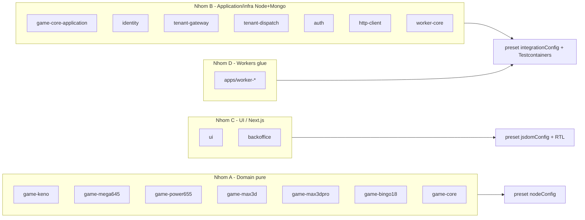

# Monorepo Test Setup — Overview

Chuẩn hoá hạ tầng test Vitest cho toàn monorepo MegaWin. Tài liệu này là điểm vào (index)
cho toàn bộ plan; đọc trước khi thực thi bất kỳ sub-plan nào.

> **SUPERSEDED (17/09/2026):** Runtime connection guard đã retire — integration test dùng
> Testcontainers (`testcontainers-setup/`). Không còn cơ chế mở khóa URI staging. Xem
> `.cursor/rules/test-data-safety.mdc` + `.cursor/plans/testcontainers-setup/`.

> **Cập nhật:** Integration test chạy trên Mongo/Redis **Testcontainers ephemeral** (không
> còn staging chung). Cursor rule `test-data-safety.mdc` vẫn bắt buộc (chống race giữa file
> test song song cùng collection).

---

## 1. Hiện trạng (đã survey toàn bộ `packages/*` + `apps/*`)

### Đã có cấu hình test (Vitest)

| Package/App | Loại | Ghi chú |
|---|---|---|
| `packages/shared` | pure | mẫu unit thuần |
| `packages/cache` | integration | Mongo |
| `packages/data` | integration | Mongo |
| `packages/audit` | integration | Mongo |
| `packages/app-core` | có `test/` + script | chưa có `vitest.config.ts` (dùng chung?) — cần rà |
| `packages/identity-application` | integration | Mongo |
| `packages/player-sdk` | pure | |
| `packages/game-lotto535` | pure domain | mẫu domain test |
| `packages/game-{keno,lotto535,mega645,power655,max3d,max3dpro,bingo18}-application` | integration | mẫu chuẩn = `game-power655-application` |
| `apps/api-player` | integration | |

### Nguồn chân lý dùng chung hiện có

- `@megawin/vitest-config` — [tooling/vitest-config/src/index.ts](../../../tooling/vitest-config/src/index.ts) (hiện chỉ export `sharedConfig` trần).
- Testcontainers global-setup — `@megawin/vitest-config/global-setup-mongo` / `global-setup-redis` (xem `testcontainers-setup/`).
- Root workspace — [vitest.workspace.ts](../../../vitest.workspace.ts) (liệt kê 12 config).
- Turbo task — [turbo.json](../../../turbo.json) task `test` depend `^build` + `@megawin/vitest-config#build`.

---

## 2. Package/App CÒN THIẾU test — phân nhóm theo loại

### Nhóm A — Domain pure (không DB)

`game-keno`, `game-mega645`, `game-power655`, `game-max3d`, `game-max3dpro`, `game-bingo18`, `game-core`.

Test rules/helpers/entities thuần. Mẫu: [packages/game-lotto535/test/rules/combo-key.test.ts](../../../packages/game-lotto535/test/rules/combo-key.test.ts).

### Nhóm B — Application/infra Node + Mongo (RỦI RO DB — ưu tiên cao nhất)

`game-core-application`, `identity`, `tenant-gateway`, `tenant-dispatch`, `auth`, `http-client`, `worker-core`.

> Lưu ý: `identity`, `http-client`, `auth` phần lớn là pure (entities/utils) → có thể chỉ cần
> `nodeConfig`. Nhóm này gộp vì cùng tầng application/infra; sub-plan p0-03 sẽ phân biệt rõ
> package nào cần Mongo (dùng `integrationConfig`) và package nào pure (dùng `nodeConfig`).

Mẫu integration: [packages/game-power655-application/test/use-cases/global-config.test.ts](../../../packages/game-power655-application/test/use-cases/global-config.test.ts).

### Nhóm C — UI / Next.js

`@megawin/ui` (React 19 components), `backoffice` (Next.js 16). Stack: Vitest + React Testing
Library + jsdom (đã chốt với người dùng). Ưu tiên test pure logic (`_lib/adapters`, `use-*` hooks,
`query-keys`, Zod `_lib/schema`, `ui/src/lib/*`), component-render cho form/section quan trọng.

### Nhóm D — Workers (DÙNG DB)

`apps/worker-*` (`worker-power655`, `worker-mega645`, ...). Handler Step Functions gần như 100%
passthrough gọi use-case tầng application. Nhóm D dùng **`integrationConfig`** (giống nhóm B)
khi smoke chạm DB qua Testcontainers; phần lớn worker hiện chỉ có unit glue. Chi tiết:
[p1-02](p1-02-group-d-workers.plan.md).

---

## 3. Thứ tự thực thi (ưu tiên)

1. **p0-01** — Tập trung `@megawin/vitest-config` (3 preset) — nền tảng cho mọi nhóm.
2. **p0-03** — Nhóm B application/infra (integration qua Testcontainers sau này).
3. **p1-02** — Nhóm D workers.
4. **p0-02** — Nhóm A (pure, nhanh, không rủi ro).
5. **p1-01** — Nhóm C (UI/Next.js).

> Lớp chặn lint GritQL (cấm lệnh xoá không-scope trong test) KHÔNG thuộc plan này nữa — đã chuyển
> sang [.cursor/plans/biome-monorepo-migration/p2-01-test-data-safety-guard.plan.md](../biome-monorepo-migration/p2-01-test-data-safety-guard.plan.md).
> Cursor rule `test-data-safety.mdc` vẫn thuộc plan này; runtime connection guard đã retire
> (xem `testcontainers-setup/`).

---

## 4. Quy tắc bảo vệ dữ liệu test (thực thi NGAY, độc lập với scaffold)

Cursor rule `.cursor/rules/test-data-safety.mdc` — enforce "KHÔNG xoá/sửa dữ liệu không do test
sinh ra". Chi tiết ở [p0-03](p0-03-group-b-application-integration.plan.md). Lớp lint GritQL bổ
sung: [biome-monorepo-migration/p2-01](../biome-monorepo-migration/p2-01-test-data-safety-guard.plan.md).
Rule này áp dụng cho mọi file test bất kể nhóm.

---

## 5. Phạm vi từng đợt

- **Đợt này (đã chốt):** plan docs (toàn bộ file trong thư mục này) + Cursor rule `test-data-safety.mdc`.
- **Đợt sau:** scaffold `vitest.config.ts` + `test/` + sample test theo từng sub-plan.

## 6. Cập nhật 17/09/2026 — convention thư mục theo loại test

Quyết định mới, **supersede** cách gom phẳng `test/` mô tả ở mục 2-4 phía trên (không rewrite các
mục đó — giữ nguyên record lịch sử tại thời điểm viết). Từ nay mọi package/app chia `test/` thành
subfolder `unit/` / `integration/` / `e2e/` theo loại — chi tiết, bằng chứng, heuristic phân loại,
và thứ tự migrate ở [p2-01](p2-01-test-type-folder-convention.plan.md).
