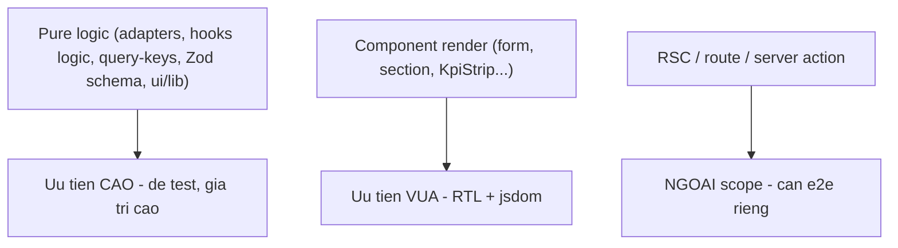

# p1-01 — Nhóm C: UI (`@megawin/ui`) + Next.js (`backoffice`)

Stack đã chốt: **Vitest + React Testing Library + jsdom** (đồng bộ toàn monorepo dùng Vitest).
Không dùng Jest, không Playwright ở đợt này (E2E/route thật ngoài scope).

## Nguyên tắc phân tầng test

## C1 — `@megawin/ui` (React 19 components)

### devDeps

`@megawin/vitest-config`, `vitest`, `vite`, `jsdom`, `@testing-library/react`,
`@testing-library/jest-dom`, `@testing-library/user-event`, `@vitejs/plugin-react`.

### Config

`vitest.config.ts` dùng `jsdomConfig` (p0-01) + plugin `@vitejs/plugin-react`. `include:
["test/**/*.test.{ts,tsx}"]`.

### Sample test (ưu tiên)

1. Pure lib (dễ nhất, cao giá trị) — [packages/ui/src/lib](../../../packages/ui/src/lib):
   `test/lib/format-currency.test.ts`, `format-number.test.ts`, `get-initials.test.ts`,
   `cn.test.ts` (merge tailwind class).
2. Component render — chọn 1-2 component có logic hiển thị: render → assert theo accessible role/
   text, tương tác qua `user-event`. Tránh snapshot brittle.

### Scripts

`"test": "vitest run"`, `"test:watch": "vitest --watch"`. Không cần `pretest` (pure/component,
không phụ thuộc dist backend).

## C2 — `backoffice` (Next.js 16, React 19)

### Chiến lược

Test tập trung vào **logic thuần rút ra khỏi component** — nơi rủi ro sai nghiệp vụ cao nhất và
test rẻ nhất. KHÔNG test RSC/route handler thật (cần môi trường Next runtime + DB → e2e riêng).

### Ứng viên test cao giá trị

- `_lib/adapters.ts` mỗi game operations — pure map snapshot → UI type. Mẫu:
  [apps/backoffice/src/app/(main)/games/power655/operations/_lib/adapters.ts](<../../../apps/backoffice/src/app/(main)/games/power655/operations/_lib/adapters.ts>)
  (`toKpi`, exposure, playtype rows...). Đây là nơi "honest-data" dễ regress.
- `_lib/schema.ts` (Zod) API config/operations mỗi game — test parse/refine (VD power655
  `jackpotSchema.refine()` 3 rule liên field):
  [apps/backoffice/src/app/api/power655/config/_lib/schema.ts](<../../../apps/backoffice/src/app/api/power655/config/_lib/schema.ts>).
- `src/lib/query-keys/*.ts` — key factory ổn định (19 file):
  [apps/backoffice/src/lib/query-keys](../../../apps/backoffice/src/lib/query-keys).
- Component/form render (RTL) — chọn form config quan trọng (VD ops-section) render + validate.

### devDeps

Như C1 + `@types/react`, `@types/react-dom`. Lưu ý backoffice dùng Biome (không ESLint) — file
test phải qua Biome format; cân nhắc includes trong [apps/backoffice/biome.json](../../../apps/backoffice/biome.json).

### Config

`vitest.config.ts` dùng `jsdomConfig` + plugin react. Cần alias `@/` → `src/` (đọc từ
`tsconfig.json` paths). `include: ["test/**/*.test.{ts,tsx}"]` — file test GOM vào thư mục `test/`
(đồng bộ toàn monorepo; đã chốt, KHÔNG co-locate).

### Scripts

Thêm `"test": "vitest run"`, `"test:watch"`. Backoffice hiện KHÔNG có script test.

## Đã chốt cho C2

- Vị trí file test backoffice: GOM vào `test/` (đồng bộ monorepo, không co-locate).
- React Compiler: đảm bảo test env dùng `@vitejs/plugin-react` tương thích React 19; không bắt
  buộc bật `babel-plugin-react-compiler` trong test (test chạy runtime thường).

## Verify

- `pnpm --filter @megawin/ui test`.
- `pnpm --filter @megawin/backoffice test`.
