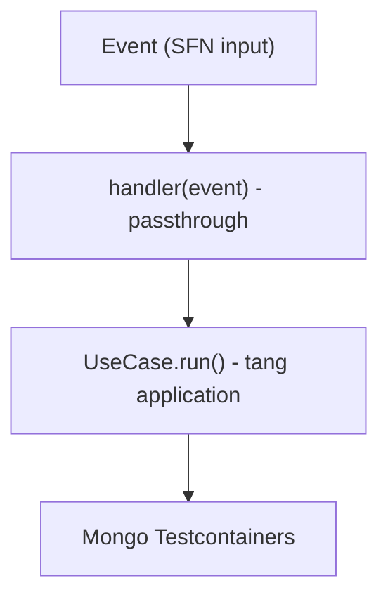

# p1-02 — Nhóm D: Workers (`apps/worker-*`) — GIẢI PHÁP CÓ DB

> **SUPERSEDED (17/09/2026):** Runtime connection guard đã retire — integration test dùng
> Testcontainers (`testcontainers-setup/`). Không còn cơ chế mở khóa URI staging. Xem
> `.cursor/rules/test-data-safety.mdc` + `.cursor/plans/testcontainers-setup/`.

Workers gọi trực tiếp use-case tầng application. Handler gần như 100% là passthrough
(`return useCase.run(event)`). Smoke/integration (nếu chạm DB) dùng **`integrationConfig`** +
Testcontainers; unit glue handler dùng `nodeConfig`.

## Bằng chứng khảo sát

`apps/worker-power655/src/handlers/**` — 23/24 handler có đúng dạng:

```ts
const useCase = new FinalizeSettleUseCase();
export async function handler(event: SettleContextWithFinancials) {
  return useCase.run(event);
}
```

Handler chỉ khởi tạo use-case + forward event. Mọi I/O (Mongo, tenant dispatch) nằm trong use-case.

## Package trong nhóm

`apps/worker-power655`, `worker-mega645`, `worker-lotto535`, `worker-keno`, `worker-bingo18`,
`worker-max3d`, `worker-max3dpro`, `worker-game-core`, `worker-tenant-dispatch`.

## Chiến lược test



- **Smoke/integration qua handler**: seed input + state DB (scoped, có marker), gọi `handler(event)`,
  assert output + hiệu ứng DB, cleanup scoped. Đây là test "handler wiring đúng use-case + event
  shape khớp" — bắt lỗi mà unit test use-case (nhóm B) KHÔNG bắt (VD import sai use-case, map event
  sai field).
- **Không lặp lại** toàn bộ business assertion đã có ở nhóm B; worker test tập trung: (1) handler
  export đúng, (2) event shape → input use-case khớp, (3) happy-path chạy tới cùng không throw.
- Handler nào có logic thuần (parse/guard trước khi gọi use-case) → thêm unit assertion cho phần đó.

## Việc cho MỖI worker

1. devDeps mirror nhóm B (`@megawin/vitest-config`, `vitest`, `vite`, `@types/node`, `next` nếu
   use-case kéo `next`).
2. `vitest.config.ts` dùng `nodeConfig` (unit) hoặc `integrationConfig` + Testcontainers
   `globalSetup` khi smoke chạm DB.
3. `test/global-setup.ts` + sample smoke test cho 1 handler tiêu biểu (VD `settle/finalize-settle`
   hoặc `feed/feed-sync`) + `test/**/helpers/seed-*.ts`.
4. `package.json` scripts: `pretest`=`build:deps`, `test`, `test:watch`.
5. Thêm vào [vitest.workspace.ts](../../../vitest.workspace.ts).

## QUY TẮC BẢO VỆ DỮ LIỆU (bắt buộc khi chạm DB)

Giống nhóm B: mọi record test có MARKER, cleanup SCOPED mirror seed, CẤM filter rỗng. Tuân
`.cursor/rules/test-data-safety.mdc`. DB qua Testcontainers ephemeral.

## Verify

- `pnpm --filter @megawin/worker-power655 test`.
- Xác nhận smoke test tạo/dọn đúng record test (scoped), không `deleteMany({})`.
