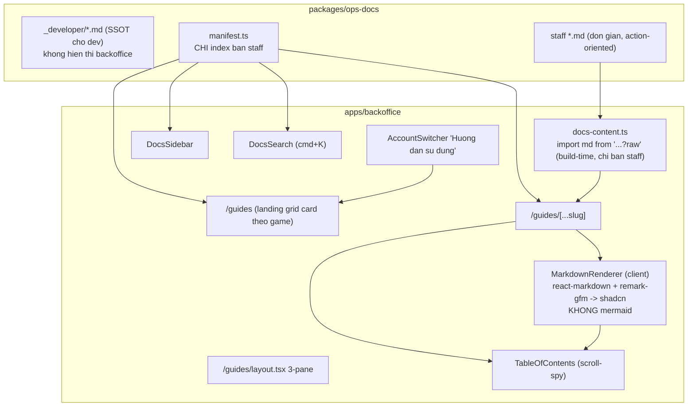

# Operations Runbook trong Backoffice (2 bản: Developer + Staff)

## Quyết định thiết kế cốt lõi

Một tài liệu không phục vụ tốt cho cả dev lẫn staff. Tách **2 bản trong cùng package** `@megawin/ops-docs`:

- **Bản Developer** (`docs/resettle/_developer/{game}/*.md`): kỹ thuật cao, có Mongo commands, ASL flow, guard names, mermaid. Giữ làm SSOT cho dev/code review. **KHÔNG** hiển thị backoffice → không cần lib render cho nó.
- **Bản Staff** (`docs/resettle/{game}/*.md`): viết MỚI, đơn giản, action-oriented. Chỉ: heading, đoạn văn ngắn, danh sách bước đánh số, callout cảnh báo. **KHÔNG mermaid, KHÔNG Mongo command, KHÔNG bảng schema**. Đây là bản duy nhất manifest backoffice trỏ tới.

Hệ quả quan trọng: vì bản staff đơn giản có chủ đích → **bỏ được `mermaid`** (khoản nặng nhất). Backoffice chỉ cần `react-markdown` + `remark-gfm` (~60KB gzip).

## Cấu trúc package

```
packages/ops-docs/
  package.json            (@megawin/ops-docs, private, exports ./manifest)
  docs/
    resettle/
      _developer/         <- bản dev (SSOT, di chuyển từ worker, GIỮ NGUYÊN nội dung)
        power655/{README,type-a,type-b1,type-b2,cycle-ledger,troubleshooting}.md
        lotto535/*.md
        mega645/*.md
      power655/           <- bản staff (viết MỚI, đơn giản)
        type-a.md
        type-b1.md
        type-b2.md
      lotto535/*.md
      mega645/*.md
  src/manifest.ts         <- CHỈ index bản staff
```

## Kiến trúc



## Bước 1 — Package `@megawin/ops-docs`

- `packages/ops-docs/package.json`: `name: "@megawin/ops-docs"`, `private: true`, exports `"./manifest"` -> `./src/manifest.ts`. Source TS thuần, không cần build riêng.
- **Di chuyển bản developer** (giữ nguyên nội dung) từ worker vào `_developer/`:
  - `apps/worker-power655/docs/resettle/*` -> `packages/ops-docs/docs/resettle/_developer/power655/*`
  - `apps/worker-lotto535/docs/resettle/*` -> `_developer/lotto535/*`
  - `apps/worker-mega645/docs/resettle/*` -> `_developer/mega645/*`
  - Xoá `docs/` gốc ở 3 worker (đã verify không có code import).
- `src/manifest.ts`: registry CHỈ trỏ bản staff.

```ts
export interface RunbookDoc { slug: string; title: string; file: string; } // file: "resettle/power655/type-b2.md"
export interface RunbookTopic { key: string; title: string; description: string; docs: RunbookDoc[]; }
export interface RunbookGame { gameKey: string; title: string; topics: RunbookTopic[]; }
export const RUNBOOK_MANIFEST: RunbookGame[] = [ /* power655, lotto535, mega645 - staff docs */ ];
```

## Bước 2 — Viết bản staff (nội dung mới)

Cho mỗi game (power655, lotto535, mega645), mỗi scenario (type-a, type-b1, type-b2) viết 1 file staff rút gọn từ bản developer. Nguyên tắc biên tập:

- **Bỏ hết**: Mongo commands, tên guard/ASL, schema field, lý do kỹ thuật ("tại sao không cần full-DBA").
- **Giữ + diễn giải đời thường**: ai làm (Staff/DBA), bước 1/2/3 làm gì, khi nào chờ, khi nào báo DBA, dấu hiệu hoàn tất.
- **Callout cảnh báo** (`>`): các điểm "đợi hệ thống hoàn tất và Quản trị viên", không chạy kỳ sau khi kỳ trước chưa xong, backup trước khi bắt đầu.
- Mỗi file ngắn (~1 màn hình), dùng danh sách đánh số cho quy trình.

Ví dụ khung type-b2 staff (thay cho ~177 dòng bản dev):

```md
# Resettle Type B2 — Kết sổ lại nhiều kỳ liên tiếp

## Khi nào áp dụng
(2-3 câu mô tả tình huống bằng ngôn ngữ thường)

## Các bước thực hiện
1. Liên hệ Quản trị viên (DBA) sao lưu dữ liệu trước khi bắt đầu.
2. Mở màn Operations của game, bấm "Kết sổ lại" ở kỳ cần sửa...
3. Đợi hệ thống báo hoàn tất.
4. Báo Quản trị viên cập nhật, ĐỢI xác nhận xong mới sang kỳ tiếp theo.
...

> Cảnh báo: KHÔNG kết sổ lại kỳ tiếp theo khi chưa "Đợi hệ thống hoàn tất và Quản trị viên" xác nhận kỳ hiện tại.
```

## Bước 3 — Cấu hình build & dependencies

- [apps/backoffice/next.config.ts](apps/backoffice/next.config.ts): thêm `"@megawin/ops-docs"` vào `transpilePackages` + webpack rule `.md` raw (và turbopack rule tương đương cho dev):

```ts
webpack: (config) => { config.module.rules.push({ test: /\.md$/, type: "asset/source" }); return config; },
turbopack: { rules: { "*.md": { loaders: ["raw-loader"], as: "*.js" } } },
```

- **Dependencies (KHÔNG devDependencies)** trong [apps/backoffice/package.json](apps/backoffice/package.json): `@megawin/ops-docs` (`workspace:*`), `react-markdown`, `remark-gfm`. **BỎ `mermaid`** — bản staff không có diagram.
- Script tiện ích `docs:check` (`tsx src/scripts/check-docs.ts`): validate manifest <-> file staff `.md` khớp (thiếu/thừa), exit !=0 nếu lệch.

## Bước 4 — Content loader (build-time, static)

`guides/_lib/docs-content.ts`: map tường minh `file` -> raw import (CHỈ bản staff, 3 game):

```ts
import p655_b2 from "@megawin/ops-docs/docs/resettle/power655/type-b2.md";
// ...
export const DOC_CONTENT: Record<string, string> = { "resettle/power655/type-b2.md": p655_b2, /* ... */ };
```

Nội dung nằm trong JS chunk -> server trả static, không I/O runtime.

## Bước 5 — Renderer (client, nhẹ)

`guides/_lib/markdown-renderer.tsx` (`"use client"`): `react-markdown` + `remark-gfm` map sang shadcn:
- `table` -> shadcn `Table`; `blockquote` -> `Alert` (variant theo emoji đầu dòng); `code` block -> `<pre>` styled + nút copy; `a` -> `Link` (rewrite link `.md` -> `/guides/...`).
- Heading h1-h3 tự sinh `id` slug + anchor; trích heading cấp cho TOC.
- KHÔNG có nhánh mermaid (đã bỏ). Nếu sau này cần sơ đồ cho staff, dùng ảnh/SVG tĩnh nhúng qua `img`.

## Bước 6 — UI three-pane (chuẩn knowledge base, style theo frontend-design rule)

Tuân thủ skill [frontend-design](.cursor/skills/frontend-design/SKILL.md) + design tokens [globals.css](apps/backoffice/src/app/globals.css) (shadcn vars + `--color-game-*`). Tái dùng shadcn, đồng bộ với toàn app.

- **`guides/layout.tsx`**: 3-pane `DocsSidebar(~280px,border-r)` | `Article(giữa,scroll riêng,max-w~72ch)` | `TableOfContents(~240px, ẩn dưới xl)`. Trong `(main)` giữ auth + app sidebar. Responsive: dưới `lg` sidebar -> `Sheet`, ẩn TOC.
- **`docs-sidebar.tsx`**: cây Game>Topic>Doc từ manifest, `Collapsible`, active highlight màu brand game (`text-game-{gameKey}`/`bg-game-{gameKey}-muted`), icon game theo sidebar chính.
- **`docs-search.tsx`**: `CommandDialog` `cmd+K`, index phẳng mọi doc staff.
- **`table-of-contents.tsx`**: scroll-spy `IntersectionObserver`, slug khớp `id`.
- **`doc-pager.tsx`**: Prev/Next theo thứ tự trong topic.
- **`doc-meta.tsx`**: badge game (màu brand) + topic + reading time.

## Bước 7 — Pages

- `guides/page.tsx`: hero + grid Card theo game (màu brand `border-game-*`, icon, list topic + số doc, link doc đầu). Section "Bắt đầu nhanh" nổi bật resettle.
- `guides/[...slug]/page.tsx`: slug `[game]/[topic]/[doc]`, server resolve `file` từ manifest -> `DOC_CONTENT[file]` -> Article (client) render + cấp heading cho TOC. `generateStaticParams` prerender. Breadcrumb: Hướng dẫn > Game > Topic > Doc.

## Bước 8 — Menu entry

[apps/backoffice/src/components/sidebar/account-switcher.tsx](apps/backoffice/src/components/sidebar/account-switcher.tsx): thêm `DropdownMenuItem` "Hướng dẫn sử dụng" (icon `BookOpen`), `Link href="/guides"`. Mọi user đăng nhập thấy, không gate role.

## Phạm vi & mở rộng

- Bản staff: resettle type-a/b1/b2 cho cả 3 game (power655, lotto535, mega645).
- Bản developer giữ nguyên trong `_developer/` làm SSOT, không render backoffice.
- Mở rộng topic mới (void/settle) hay game mới: thêm `.md` staff + 1 entry manifest + 1 dòng `DOC_CONTENT`.

## Lưu ý kỹ thuật

- Không `mermaid` -> không lo hiệu năng client/Vercel cho diagram; bundle docs rất nhẹ.
- `react-markdown`/`remark-gfm` render client; khung prerender server. Không `fs.readFile`, không `public/`.
- Tất cả deps render vào `dependencies` (chạy trong production bundle), không phải `devDependencies`.
