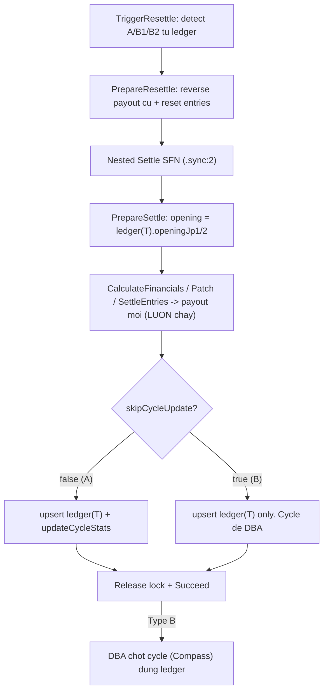

# Power 6/55 Resettle Plan (Cycle Ledger)

> Mirror core từ Max 3D resettle (`max3d-resettle.plan.md`), bổ sung lớp **dual jackpot cycle**. Thay `preSettleCycleSnapshot` (snapshot rời trên mỗi DrawDoc) bằng **Cycle Ledger** — collection `power655JackpotCycleEntries` lưu lịch sử tích luỹ per-draw, làm single source of truth cho opening/closing từng kỳ, audit, pre-flight detection, và DBA restore.

## 1. Vì sao Cycle Ledger thay cho preSettleCycleSnapshot

`JackpotCycleDoc` hiện chỉ lưu **current state** (`jackpot1/2CurrentAmount`, `drawCount`) — lịch sử opening/closing từng kỳ bị mất. `FinalizeSettle` ghi cycle bằng giá trị tuyệt đối từ opening đọc lúc `PrepareSettle` → không idempotent khi resettle kỳ cũ có kỳ sau đã cộng dồn.

Ledger lưu mỗi kỳ 1 entry bất biến (opening/contribution/closing/winner flags). Lợi ích:
- **Resettle**: nested `PrepareSettle` đọc `ledger(T).openingJp1/2` thay vì `activeCycle` → payout JP winner chia pool đúng.
- **DBA restore (B2)**: đọc thẳng `ledger(T).openingJp1/2` + `ledger(T).seq` → restore cycle về trước kỳ T, KHÔNG tính tay.
- **Audit/đối soát Vietlott**: view lịch sử tích luỹ từng kỳ.
- Ghi từ kỳ settle TỪ NAY về sau (sản phẩm mới, không backfill kỳ cũ).

## 2. Quy ước `seq` (tránh off-by-one)

`seq` = số thứ tự kỳ trong cycle, tính CẢ kỳ đó (1-based) = `drawCount` SAU khi settle kỳ này.
- `opening(T) === closing(T-1)` (tích luỹ tuần tự).
- `cycleDrawCountBefore` (drawCount TRƯỚC kỳ T, dùng cho `FinalizeSettle`) = `ledger(T).seq - 1`.
- Kỳ đầu cycle: `seq = 1`, `opening = seedAmount`, `cycleDrawCountBefore = 0` — không cần fallback đặc biệt.

## 3. Đọc opening: `ledger(T).opening` (KHÔNG đọc T-1.closing) — TRỪ cascade B2

Resettle 1 kỳ đơn (A/B1) lẫn DBA restore đọc **trực tiếp `ledger(T).openingJp1/Jp2`** — đại lượng cần chính xác, không edge case kỳ đầu cycle, đồng nhất 1 nguồn 1 field giữa worker và DBA.

**NGOẠI LỆ cascade B2**: với kỳ K trong chain (K > T), `ledger(K).openingJp1/2` cũ đã bị **đóng băng** bởi `$setOnInsert` lúc settle lần đầu → KHÔNG còn đúng sau khi resettle kỳ trước làm đổi pool. Vì vậy `TriggerResettle.resolveOpening` phải lấy `opening(K) = closing(K-1)` từ `ledger(K-1)` (kỳ liền trước theo `seq`) — kỳ này đã được resettle ở bước trước cập nhật closing mới. Khi lấy theo cơ chế này, bật cờ `cascadeOpeningUpdate=true` để `FinalizeSettle` GHI ĐÈ `ledger(K).opening` (xem §6.1 + BÀI HỌC upsert).

DBA Type B2 restore cycle về trước kỳ T:
```
activeCycle.jackpot1CurrentAmount = ledger(T).openingJp1
activeCycle.jackpot2CurrentAmount = ledger(T).openingJp2
activeCycle.drawCount             = ledger(T).seq - 1
```

## 4. Phân loại scenario + PA2 (worker payout / DBA cycle)

- **Type A — Auto (roll-over)**: T là kỳ MỚI NHẤT trong cycle active, kết quả cũ + mới đều KHÔNG có winner JP1/JP2. → Worker recompute trọn (entry/payout + cycle). `skipCycleUpdate = false`.
- **Type B1 — Auto payout + DBA cycle**: T là kỳ MỚI NHẤT, kết quả mới/cũ phát sinh winner JP1/JP2; KHÔNG có kỳ settle sau T (chain rỗng). → Worker auto reverse + re-settle payout (chia pool JP winner theo `ledger(T).opening`), **KHÔNG đụng cycle** (`skipCycleUpdate = true`). DBA chốt cycle SAU.
- **Type B2 — Cascade step-wise (auto payout từng kỳ + DBA checkpoint cycle)**: kết quả T thay đổi VÀ có chain kỳ đã settle sau T trong cùng cycle (`chainLength > 0`), HOẶC chain có winner. → Resettle TUẦN TỰ từng kỳ theo `seq` tăng dần (`T → T+1 → … → T+n`). MỖI kỳ chạy đúng luồng B1 (auto reverse + re-settle payout, `skipCycleUpdate = true`); SAU mỗi kỳ, DBA chốt cycle + xác nhận ledger trước khi resettle kỳ kế. **Kết quả số (winningMain/bonus) của các kỳ T+1..T+n KHÔNG đổi** — chỉ pool tích luỹ dịch chuyển → danh sách winner giữ nguyên, chỉ số tiền nhận được tính lại đúng theo opening mới.

**Vì sao B2 cascade được (không cần full DBA tính tay payout):**
- Sửa T chỉ đổi **pool tích luỹ**, KHÔNG đổi **kết quả số** của T+1..T+n → ai trúng vẫn là người đó, cycle đóng/mở vẫn đúng kỳ cũ.
- `PrepareSettle` đọc opening mỗi kỳ từ `resettleContext.openingJp1/2` (ledger). Khi DBA đã chốt cycle + cập nhật `ledger(T)` đúng sau khi resettle T, thì `opening(T+1) = closing(T mới)` đã đúng trong ledger → resettle T+1 tự tính payout JP winner đúng.
- Worker LUÔN lo entry/payout (dễ sai nếu làm tay), DBA CHỈ chốt cycle giữa các bước → audit trail rõ ràng, rủi ro tài chính được kiểm soát ở từng checkpoint.

**Nguyên tắc PA2**: Worker LUÔN lo entry/payout. Cycle: Type A worker tự ghi; Type B (B1 + B2) worker skip, DBA chốt để có audit trail. **MỘT code path resettle duy nhất** cho cả 3 type — khác biệt duy nhất là cờ `skipCycleUpdate` (A=false, B1/B2=true) và việc B2 lặp lại path đó nhiều lần (mỗi kỳ 1 lần `/trigger-resettle` riêng, DBA checkpoint xen giữa).

> ⚠️ **B2 KHÔNG còn là "full DBA tính tay từng payout"**. Trước đây B2 yêu cầu DBA reset entries + tính tay tiền winner chain → rủi ro cao. Nay B2 = **cascade step-wise**: worker re-settle payout từng kỳ tự động, DBA chỉ chốt **cycle** giữa các bước. `LEDGER_MISSING` chỉ là guard data integrity (ledger writer ghi cho mọi kỳ settle → không xảy ra trong vận hành bình thường); nếu gặp → dừng, báo kỹ thuật, KHÔNG tự xử lý.



> Guard an toàn cuối tại `PrepareSettle`/`FinalizeSettle`: nếu re-match phát sinh winner NHƯNG `skipCycleUpdate = false` → throw `RESETTLE_REQUIRES_DBA`.

## 5. Schema changes

### 5.1 NEW entity `packages/game-power655/src/entities/jackpot-cycle-entry.ts`
```typescript
export interface JackpotCycleEntryDoc {
  _id: unknown;
  cycleNo: number;
  drawId: string;
  drawNo: number;
  seq: number;            // 1-based, = drawCount SAU settle ky nay
  openingJp1: number;     // = closing ky truoc
  openingJp2: number;
  jp1Contribution: number;
  jp2Contribution: number;
  jp1Overflow: number;
  closingJp1: number;     // = opening + contribution
  closingJp2: number;
  hasJp1Winner: boolean;
  hasJp2Winner: boolean;
  jp2DidReset: boolean;
  settledAt: Date;
  updatedAt: Date;
}
```
Thêm `JackpotCycleEntries: "power655JackpotCycleEntries"` vào `Power655Collections` (enums.ts).

### 5.2 `draw.ts` — thêm `cycleNo?` vào `DrawDoc`
Liên kết nhanh draw → cycle (tránh phải lookup ledger để biết cycle). KHÔNG thêm `preSettleCycleSnapshot`.

### 5.3 `entry.ts` — thêm `EntryReversal` + `reversal?`
Copy từ `packages/game-max3d/src/entities/entry.ts` (`reversalTx`, `reversalAmount`, `resettleId`).

### 5.4 `draw-repo.ts` VALID_TRANSITIONS
Thêm `Settled -> Published`.

## 6. Repository changes — `game-power655-application/src/infras/repos/`

### 6.1 NEW `jackpot-cycle-entry-repo.ts`
- `upsertEntry(entry)`: upsert theo `{ cycleNo, drawId }` (idempotent overwrite) — gọi trong `FinalizeSettle`.
  - `openingJp1/2` mặc định nằm trong `$setOnInsert` (bất biến sau lần ghi đầu).
  - **Cờ `allowOpeningUpdate`**: khi `true` (cascade B2), chuyển `openingJp1/2` sang `$set` để GHI ĐÈ — xem BÀI HỌC upsert §6.1 bên dưới.
- `findByDraw(drawId)`: lấy entry kỳ T (nguồn opening cho resettle + DBA).
- `findBySeq(cycleNo, seq)`: lấy entry theo `{cycleNo, seq}` — `TriggerResettle.resolveOpening` dùng để lấy `closing(K-1)` làm `opening(K)` trong cascade.
- `findChainAfter(cycleNo, seq, limit?)`: entries `seq > T.seq` cùng cycle. CHỈ phát hiện B2 (kỳ sau / winner trong chain). KHÔNG dùng phán đoán winner tại chính T — đó là việc của re-match (xem §7.2). Khi T mới nhất, chain rỗng là bình thường (A hoặc B1, phân biệt bằng re-match). **`limit` PHẢI optional** — khi `undefined` lấy TOÀN BỘ chain (đừng default limit, sẽ cắt cụt `chainDrawIds`, xem BÀI HỌC chain-limit).
- `listByCycle(cycleNo)`: audit/UI history.

> ⚠️ **BÀI HỌC — upsert ledger không được khóa `opening` bằng `$setOnInsert` trong cascade (áp dụng MỌI game có jackpot cycle)**
>
> Sai phổ biến: để `openingJp1/2` luôn trong `$setOnInsert`. Lần settle đầu ghi đúng, nhưng khi **cascade resettle kỳ K** (K > T) thì pool tích luỹ đã đổi do resettle kỳ K-1 → `opening(K)` mới ≠ `opening(K)` cũ. `$setOnInsert` KHÔNG ghi đè document đã tồn tại → `ledger(K).opening` giữ giá trị CŨ → `PrepareSettle` đọc opening sai → payout JP winner kỳ K **chia pool sai**. Lỗi âm thầm, không throw.
>
> Fix đúng: thêm cờ `allowOpeningUpdate` (mặc định `false`). `TriggerResettle.resolveOpening` set `cascadeOpeningUpdate=true` khi opening lấy từ `closing(K-1)`; `FinalizeSettle` truyền cờ này xuống `upsertEntry`; repo chuyển `openingJp1/2` từ `$setOnInsert` → `$set`. Settle thường (`allowOpeningUpdate=false`) vẫn bất biến.
>
> ⚠️ **BÀI HỌC chain-limit**: `findChainAfter` từng default `limit=5`. `detect-boundaries` gọi không truyền limit → chỉ trả 5 kỳ → `chainDrawIds` thiếu kỳ khi chain dài > 5 → DBA cascade thiếu bước. Số kỳ trong 1 cycle không quá lớn → bỏ limit (optional, `undefined` = full chain).

### 6.2 NEW `entry-resettle-repo.ts`
Mirror Max 3D: `listCandidatesForReversal`, `bulkSetReversal`, `resetEntriesForResettle` (`$unset payout/outcome/result`), `getEntriesWithReversalForDispatch`, `clearReversalSnapshot`.

### 6.3 `draw-repo.ts` — thêm methods
- `republishResultAfterSettled(drawId, result, vietlottRef?)`: `Settled -> Published` + `$unset financial/stats/settleSummary/jackpot`, giữ `settledAt`.
- `updateVietlottRef(drawId, vietlottRef)`.
- `findChainAfter(drawId)`: draws `drawNo > T.drawNo` đã settled (cross-check redundancy với ledger chain để phát hiện B2). Giống ledger `findChainAfter`: CHỈ tìm kỳ SAU T, KHÔNG phát hiện winner phát sinh tại chính T — winner tại T do re-match ở §7.2 quyết định.

> ⚠️ **Quy ước type signature (áp dụng MỌI game)**: dùng named type chia sẻ từ `@megawin/game-core/types` (re-export qua entity barrel) cho param signature — VD `vietlottRef: DrawVietlottRef`, KHÔNG dùng indexed-access `DrawDoc["vietlottRef"]`. Cũng KHÔNG `Pick<DrawJackpot, ...>` khi đã liệt kê đủ TẤT CẢ field của interface (bằng chính interface đó) — `settleComplete(drawId, jackpot: DrawJackpot, ...)`. Xem `.cursor/rules/code-quality-standards.mdc` §5.1, §5.2.

### 6.4 `line-repo.ts` — `upsertLines` hybrid `$set` + `$setOnInsert`

> ⚠️ **BÀI HỌC — lines PHẢI re-match khi resettle (áp dụng MỌI game có collection lines: Lotto535, Mega645, Power655, Max3D, Max3D Pro)**
>
> Sai phổ biến: `upsertLines` dùng `$setOnInsert: doc` cho TOÀN BỘ document. Lần settle đầu ghi đúng, nhưng khi RESETTLE với kết quả MỚI, `PrepareResettle` chỉ reset *entries* về `Scheduled` — **KHÔNG đụng tới `power655TicketLines`**. `SettleEntriesBatch` chạy lại gọi `upsertLines`, nhưng `(entryId, lineIndex)` đã tồn tại → `$setOnInsert` **skip toàn bộ** → `matchResult` của line giữ nguyên theo kết quả CŨ. Hệ quả:
> - `PatchJackpotPrize.getJackpotWinningLines` query theo `matchResult.tier` từ DB → tìm sai lines trúng JP (theo tier cũ) → chia/patch tiền JP sai.
> - Player view (`getLinesByEntryId` / `get-entry-lines-player`) đọc lines từ DB → hiển thị match/tier/winAmount cũ.
> Lỗi âm thầm, không throw.
>
> Fix đúng (hybrid strategy — chuẩn cho mọi game): tách `createdAt` ra `$setOnInsert`, còn lại `$set`:
> ```typescript
> const { createdAt, ...rest } = doc;
> update: { $set: rest, $setOnInsert: { createdAt } }
> ```
> - `$set rest` (matchResult, main, betCount, …): RESETTLE re-build line theo drawResult mới → overwrite. Bonus: JP lines được re-set `matchResult.winAmount = 0` → `patchJackpotLinesPerUnit` (filter `winAmount: 0`) idempotent đúng cả khi resettle.
> - `$setOnInsert createdAt`: settle retry sau crash (giữa `upsertLines` và `bulkSettleEntries`) gọi lại với `now2 ≠ now1`; `$set` sẽ refresh createdAt, phá semantic "thời điểm tạo line".

## 7. Use cases

### 7.1 `use-cases/draws/publish-result.ts` — orchestrator
Thêm `Settled` vào `PUBLISHABLE_STATUSES`; `settledAt != null` + result đổi + `Settled` → `republishResultAfterSettled`. Cần `isSamePower655Result(a,b)` tại `packages/game-power655/src/rules/draw-result.ts` (so `winningMain[]` exact order + `bonusNumber`).

### 7.2 `use-cases/resettle/detect-boundaries.ts` (NEW)
`DetectResettleBoundariesUseCase`. **3 nguồn tín hiệu độc lập** — `findChainAfter` CHỈ phát hiện B2, KHÔNG dùng để phán đoán winner tại chính kỳ T:

1. **Winner MỚI tại T (nguồn quyết định B1)**: RE-MATCH `proposedWinningMain[]`/`proposedBonusNumber` với selection của tất cả entries kỳ T qua `EntryRepository.existsJpWinnerForDraw` (1 aggregation server-side, xem BÀI HỌC aggregation bên dưới) → biết kết quả mới có phát sinh JP1/JP2 winner không. Đây là điểm mấu chốt: khi T là kỳ mới nhất (chain rỗng), chain query vô nghĩa — phải re-match mới biết.
2. **Winner CŨ tại T**: `ledger(T).hasJp1Winner / hasJp2Winner` (kết quả cũ có winner → sửa đi cũng đổi cycle).
3. **Ảnh hưởng chuỗi (nguồn quyết định B2)**: `findChainAfter(cycleNo, T.seq)` trả entries `seq > T.seq` cùng cycle. Nếu có bất kỳ entry nào (kỳ sau đã settle) HOẶC có entry với `hasJp1Winner/hasJp2Winner/jp2DidReset` → B2.

Quy tắc phân loại (ưu tiên từ trên xuống):
- Có entry sau T trong cycle, HOẶC winner/reset trong chain → **`ResettleScenario.FullDba`** (B2).
- T là kỳ mới nhất NHƯNG (winner mới từ re-match) HOẶC (winner cũ từ ledger) → **`ResettleScenario.DbaCycle`** (B1).
- Còn lại → **`ResettleScenario.Auto`** (A).

> ⚠️ **BÀI HỌC — winner JP phải xét 2 CHIỀU (áp dụng cho TẤT CẢ game có jackpot)**
>
> Điều kiện B1/B2 phải dựa trên `jpWinnerAffected = hasNewJpWinner || hadOldJpWinner`, **KHÔNG** chỉ `hasNewJpWinner`. Bốn trường hợp tại kỳ T (chain rỗng):
>
> | # | Winner cũ | Winner mới | Scenario | Ghi chú |
> |---|:---:|:---:|---|---|
> | 1 | Không | Có | **B1** | Thêm winner mới — cycle phải đóng |
> | 2 | Có | Không | **B1** | **Gỡ winner cũ** — cycle cũ đã đóng oan, phải khôi phục |
> | 3 | Có | Có | **B1** | An toàn — luôn để DBA review cycle |
> | 4 | Không | Không | **A** | Chỉ đổi số liệu tích luỹ, auto hoàn toàn |
>
> Case 2 (gỡ winner cũ) **nguy hiểm ngang** case 1: kết quả cũ có JP1 winner → cycle cũ đã ĐÓNG, JP1 đã reset về seed, cycle mới đã mở. Nếu sửa thành "không winner" mà vẫn auto (TYPE_A), `FinalizeSettle` chạy với `getActiveCycle()` (cycle mới) → reset oan, cycle sai. Vì vậy **chỉ TYPE_A khi cả `hasNewJpWinner=false` VÀ `hadOldJpWinner=false`**.
>
> Trạng thái winner CŨ đọc trực tiếp từ `ledgerEntry.hasJp1Winner/hasJp2Winner` (không cần re-match). Lỗi thường gặp khi port sang game khác: implement thiếu nguồn tín hiệu này → case 2 bị phân loại nhầm thành TYPE_A.

Trả: `{ scenario: ResettleScenario, skipCycleUpdate: boolean, reasons: ResettleReason[], dbaInstructions?: string }`. `skipCycleUpdate = scenario !== ResettleScenario.Auto`.

> ⚠️ **BÀI HỌC — detect JP winner mới phải chạy SERVER-SIDE bằng aggregation, KHÔNG cursor-loop in-memory (áp dụng MỌI game có jackpot + chạy qua API Next.js/Vercel)**
>
> `detect-boundaries` là pre-flight gọi đồng bộ qua BO API route (Next.js) — **không phải** Step Function. Vercel có giới hạn execution time mặc định ngắn (Hobby ~10s, Pro mặc định ~15s, tối đa cấu hình tới ~300s tuỳ plan). Jackpot game khi hot có thể lên **hàng trăm nghìn → 1 triệu entries** mỗi kỳ.
>
> Cursor-loop in-memory (page 500 entries/lần, match từng board bằng JS) → với 1M entries = **2000 round-trip** MongoDB + serialize/parse từng batch → **chắc chắn timeout**. Phiên bản đầu mắc lỗi này (`findEntriesForJpCheck` + vòng `while`).
>
> **Cách đúng**: đẩy toàn bộ match xuống 1 aggregation + `$limit: 1` (`EntryRepository.existsJpWinnerForDraw`). Server chỉ trả 1 doc (có/không), early-stop ngay khi gặp winner đầu tiên. Hit index `{ drawId, status }`.
>
> **Entries hay Lines?** Dùng **`entries`**, KHÔNG dùng `lines`:
> - `lines` (đã expand 6 số/line) đúng luật tuyệt đối nhưng **nở khủng khiếp** — 1 board Bao18 = C(18,6) = **18.564 lines**. Một kỳ dễ lên **hàng chục–trăm triệu line doc** → scan cực đắt.
> - `entries.entrySummary.boards[].mainNumbers` là **selection gốc (5–18 số), bất biến**, không phụ thuộc kết quả → intersect với proposed luôn đúng, số doc nhỏ hơn `lines` 1–3 bậc.
> - `lines.matchResult` lưu theo kết quả CŨ → vô dụng cho re-match proposed (đừng bị cám dỗ đọc field này).
>
> **Luật match trên board selection** (tương đương luật line trong `prize-tiers.ts`), với `inter = |board.mainNumbers ∩ proposedWinningMain|`:
> - Tồn tại line JP1 ⟺ `inter ≥ 6`.
> - Tồn tại line JP2 ⟺ `inter ≥ 5 AND proposedBonus ∈ board.mainNumbers`. **Dùng `≥ 5`, KHÔNG `== 5`** — board vừa JP1 vừa JP2 (vd Bao7 = 6 winning + bonus) vẫn phải bắt đúng JP2. Điều kiện `== 5` chỉ "tình cờ đúng" cho boolean (vì JP1 đã `true`), nhưng port sang game khác dễ sai → luôn dùng mệnh đề chặt.
> - Điều kiện gộp aggregation: `inter ≥ 5 AND (inter ≥ 6 OR bonus ∈ board)`.
>
> Pipeline: `$match {drawId, status ∈ [Settled, Scheduled]}` → `$unwind boards` → `$project { inter: $size($setIntersection), hasBonus: $in }` → `$match` điều kiện gộp → `$limit: 1`.

**Type-safety**: định nghĩa const object + union type tại `packages/game-power655/src/rules/resettle.ts` (hoặc entities), KHÔNG dùng string literal rải rác:
```typescript
export const ResettleScenario = {
  Auto: "auto",
  DbaCycle: "dba-cycle",
  FullDba: "full-dba",
} as const;
export type ResettleScenarioValue = (typeof ResettleScenario)[keyof typeof ResettleScenario];

export const ResettleReason = {
  NewJackpot1Winner: "new_jackpot1_winner",
  NewJackpot2Winner: "new_jackpot2_winner",
  OldJackpot1Winner: "old_jackpot1_winner",
  OldJackpot2Winner: "old_jackpot2_winner",
  HasSettledDrawsAfter: "has_settled_draws_after",
  WinnerInChain: "winner_in_chain",
} as const;
export type ResettleReasonValue = (typeof ResettleReason)[keyof typeof ResettleReason];
```

### 7.3 `use-cases/draws/trigger-resettle.ts` (NEW)
Mirror Max 3D: validate `settledAt != null` + `result.publishedAt > settledAt`; gọi pre-flight lấy `scenario` + `skipCycleUpdate`; `scenario !== ResettleScenario.Auto` chưa `dbaConfirmed` → 422 `RESETTLE_REQUIRES_DBA`; acquire lock `power655:resettle:{drawId}`; `triggerSettle`; `startExecution` Resettle SFN với `resettleContext.skipCycleUpdate`.

Bổ sung cho cascade B2:
- **`resolveOpening(drawId, cycleNo, seq)`** (private): nếu `seq > 1` → lấy `ledger(cycleNo, seq-1).closingJp1/2` (qua `findBySeq`) làm `opening(K)` + set `cascadeOpeningUpdate=true`. Kỳ đầu cycle (`seq=1`) → `opening = ledger(T).opening` (= seed), `cascadeOpeningUpdate=false`. Kết quả đưa vào `resettleContext`.
- **`assertNoPendingPriorDraw(cycleNo, targetSeq, drawId)`** (private, CHỈ B2): guard thứ tự cascade. Nếu tồn tại kỳ `seq < targetSeq` cùng cycle đang ở trạng thái non-settled (`Published`/`Settling` sau republish) → throw `RESETTLE_CASCADE_ORDER`. Đảm bảo resettle ĐÚNG thứ tự `seq` tăng dần — opening kỳ sau phụ thuộc closing kỳ trước.

### 7.4 `use-cases/resettle/` (NEW)
`prepare-resettle.ts`, `enqueue-reversals.ts`, `index.ts` — copy từ Max 3D, đổi `Max3d -> Power655`.

### 7.5 `use-cases/settle/prepare-settle.ts`
Khi `resettleContext` present: opening jackpot đọc từ **`ledgerEntry(T).openingJp1/Jp2`** (via `findByDraw`) thay vì `activeCycle`. `cycleDrawCountBefore = ledger(T).seq - 1`. Guard: winner + `skipCycleUpdate=false` → throw `RESETTLE_REQUIRES_DBA`.

### 7.6 `use-cases/settle/finalize-settle.ts`
- **Mọi settle (thường + resettle)**: `upsertEntry` vào ledger (idempotent) — thay cho ghi `preSettleCycleSnapshot`. Truyền `allowOpeningUpdate = resettleContext?.cascadeOpeningUpdate ?? false` xuống `upsertEntry` (cascade B2 ghi đè opening; còn lại bất biến).
- `resettleContext` present:
  - `skipCycleUpdate=false` (A): chạy `updateCycleStats` roll-over. Nếu lỡ có winner → throw `RESETTLE_REQUIRES_DBA`.
  - `skipCycleUpdate=true` (B): chỉ ghi draw snapshot + payout + upsert ledger, **BỎ QUA `updateCycleStats/closeCycle/resetJp2InCycle`**.
  - Release lock cả 2 nhánh.

### 7.7 `use-cases/settle/types.ts`
`ResettleContext = { resettleId, lockOwnerToken, lockKey, skipCycleUpdate: boolean, openingJp1?, openingJp2?, cascadeOpeningUpdate?: boolean }`; thêm `resettleContext?` vào `SettleContext` + `PrepareSettleInput`. `cascadeOpeningUpdate` = cờ cho `FinalizeSettle` biết được phép ghi đè `ledger.opening` (chỉ true trong cascade B2 khi opening lấy từ closing kỳ trước).

## 8. Worker — `apps/worker-power655/`
- `handlers/resettle/prepare-resettle.ts` + `enqueue-reversals.ts`.
- `step-functions/resettle.ts` + `resettle.asl.json` (5 states, nested Settle SFN `mw-worker-power655-*-settle`).
- `functions/resettle.yml` + update `serverless.yml`.

## 9. Backoffice
### 9.1 API
- `env.ts`: `POWER655_RESETTLE_SFN_ARN`.
- `api/power655/draws/[drawId]/resettle/route.ts` (NEW) — body `{ reason, dbaConfirmed?, dbaOperatorId? }`.
- `api/power655/draws/[drawId]/resettle-preflight/route.ts` (NEW) — GET → `DetectResettleBoundariesUseCase`.
### 9.2 DTO
`draw-selector.dto.ts` + `get-draw-selector.ts`: thêm `settledAt` + `drawResultAt = result.publishedAt`.
### 9.3 UI — `games/power655/operations/_lib/`
- `use-operations.ts`: `useTriggerResettle` + `useResettlePreflight`.
- `draw-command-center.tsx`: `shouldShowResettle`, enable nút "Kết sổ lại".
- `draw-management/index.tsx`: confirm dialog + pre-flight card (Type B → hướng dẫn DBA + checkbox `dbaConfirmed`).

## 10. DBA workflow (Type B) — Compass, dùng ledger
PA2: worker đã ghi payout đúng; DBA CHỈ chốt cycle.
- **B1**: SAU khi SFN Succeed → theo kết quả mới: JP1 winner → `closeCycle` + tạo cycle mới; JP2 winner → push `jackpot2Resets[]` + reset `jackpot2CurrentAmount`; cập nhật `drawCount`/`endDrawId`. Backup trước.
- **B2 — cascade step-wise** (lặp luồng B1 cho từng kỳ theo `seq` tăng dần):
  1. Xác định chain `T, T+1, …, T+n` (theo `seq`) từ `findChainAfter` (full chain, không limit). Backup trước.
  2. **Resettle kỳ T** (staff trigger `/trigger-resettle`, `dbaConfirmed=true`, `skipCycleUpdate=true`). Worker re-settle payout T với opening từ `ledger(T)`.
  3. **DBA checkpoint kỳ T**: chốt **`power655JackpotCycles`** (active cycle) theo kết quả MỚI của T (giống B1). DBA **KHÔNG** sửa `power655JackpotCycleEntries` — worker đã upsert closing(T) mới.
  4. **Resettle kỳ T+1** (staff trigger). `TriggerResettle.resolveOpening` tự lấy `opening(T+1) = closing(T mới)` từ ledger (cờ `cascadeOpeningUpdate=true`, ghi đè `ledger(T+1).opening`). Worker re-settle payout T+1 đúng.
  5. **DBA checkpoint kỳ T+1**: chốt cycle theo winner T+1 (nếu có).
  6. Lặp 4–5 đến hết chain (`T+n`). Sau kỳ cuối, `activeCycle` phản ánh đúng trạng thái hiện tại.
  - Mỗi kỳ phải resettle theo ĐÚNG thứ tự `seq` tăng dần — không nhảy cóc, vì opening kỳ sau phụ thuộc closing kỳ trước. Guard `RESETTLE_CASCADE_ORDER` chặn nếu có kỳ trước chưa resettle xong.
  - **DBA chỉ lo `power655JackpotCycles` (cycle structure); ledger opening/closing do worker tự resolve + ghi.**
- **LEDGER_MISSING**: kỳ trong chain thiếu ledger entry dù đã settled → BẤT THƯỜNG data integrity (không xảy ra trong vận hành bình thường vì ledger writer ghi cho mọi kỳ settle) → dừng, báo kỹ thuật kiểm tra `power655_jackpot_cycle_entries`, KHÔNG tự cascade. Là guard chống crash, không phải quy trình DBA. Xem `type-b2.md` + `troubleshooting.md`.
- Maintenance mode block scheduled settle khi DBA cascade (tùy chọn, tránh kỳ mới settle xen giữa).

## 11. Migration & rollout
- `cycleNo` + `reversal` optional → backward compatible.
- **KHÔNG backfill kỳ cũ** — sản phẩm mới, ledger chỉ ghi từ kỳ settle TỪ NAY về sau (`FinalizeSettle` upsert). Vì go-live từ đầu nên mọi kỳ settled đều có ledger entry; pre-flight vẫn guard `findByDraw(T) == null` → trả `LEDGER_MISSING` (bất thường data integrity, báo kỹ thuật) thay vì crash.
- Index: ledger `{ cycleNo, seq }` unique + `{ drawId }`; `power655_ticket_entries { drawId, status, "payout.payoutAmount" }` + `{ "reversal.reversalTx" }`.
- Rollout phase: (1) ledger writer + repo, (2) pre-flight + Type A/B1 auto, (3) Type B2 DBA mode.

## 12. Tài liệu DBA & staff — `apps/worker-power655/docs/`
Viết tài liệu vận hành chi tiết (Markdown, có mermaid diagram inline để GitHub/IDE render), đặt trong `apps/worker-power655/docs/`:
- `resettle/README.md` — tổng quan: resettle là gì, khi nào dùng, 3 type (A/B1/B2), bảng quyết định scenario, vai trò staff vs DBA, ledger là source of truth.
- `resettle/type-a-auto.md` — Type A (auto hoàn toàn): điều kiện, các bước staff thực hiện qua UI, flow diagram (publish result → trigger → SFN → reverse → re-settle → cycle roll-over), cách verify sau khi xong, troubleshooting (SFN fail giữa chừng → retry an toàn vì idempotent).
- `resettle/type-b1-dba-cycle.md` — Type B1 (auto payout + DBA chốt cycle): điều kiện (winner mới/cũ tại T, T là kỳ mới nhất), bước staff trigger với `dbaConfirmed`, bước DBA chốt cycle SAU khi SFN Succeed (JP1 → closeCycle + tạo cycle mới; JP2 → push jackpot2Resets + reset; cập nhật drawCount/endDrawId), backup checklist, mongo command mẫu, verify.
- `resettle/type-b2-full-dba.md` — Type B2 (cascade step-wise): điều kiện (có kỳ sau đã settle / winner trong chain), nguyên tắc cascade (sửa T chỉ đổi pool, không đổi kết quả số → winner giữ nguyên), quy trình resettle TUẦN TỰ từng kỳ theo `seq` (mỗi kỳ chạy luồng B1 auto payout + DBA checkpoint chốt cycle trước khi sang kỳ kế), mongo command mẫu cho DBA checkpoint, guard data integrity LEDGER_MISSING (dừng + báo kỹ thuật), verify chain ledger liên tục.
- `resettle/cycle-ledger.md` — giải thích Cycle Ledger: schema, ý nghĩa từng field, `seq`/`opening`/`closing`, dùng để audit + restore, query mẫu (`findByDraw`, `findChainAfter`, `listByCycle`).
- `resettle/troubleshooting.md` — các tình huống lỗi: SFN dừng giữa chừng, lock chưa release, LEDGER_MISSING (bất thường data integrity → dừng + báo kỹ thuật), winner mới phát hiện sau khi staff trigger nhầm Type A (guard `RESETTLE_REQUIRES_DBA`), cách recover từng case.
- Mỗi file: bước đánh số rõ ràng + mermaid flowchart/sequence diagram + bảng điều kiện + lệnh mẫu copy-paste được.

## 13. Phạm vi build
- Cycle Ledger (writer + repo, KHÔNG backfill) — nền tảng, build TRƯỚC.
- Type A + Type B1 end-to-end.
- Type B2 cascade step-wise: tái dùng pipeline B1 — mỗi kỳ 1 lần `/trigger-resettle` (`skipCycleUpdate=true`), DBA checkpoint cycle giữa các bước. KHÔNG cần SFN loop/task-token. Guard tại `trigger-resettle` (`assertNoPendingPriorDraw` → `RESETTLE_CASCADE_ORDER`): kỳ T phải là kỳ có `seq` nhỏ nhất CHƯA resettle trong chain (resettle đúng thứ tự). `resolveOpening` tự lấy opening = closing kỳ trước. Tài liệu DBA hướng dẫn checkpoint từng kỳ.
- Tài liệu DBA/staff trong `apps/worker-power655/docs/resettle/` — viết song song khi build từng type.