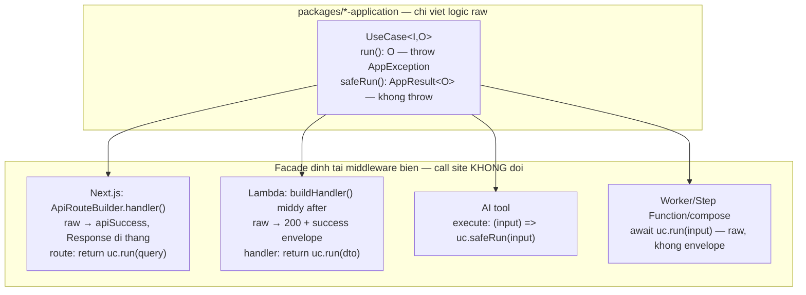

# Thiết kế lại Use-Case Pattern — logic viết 1 lần, mỗi đích gọi 1 func

## Phát hiện then chốt (từ khảo sát hiện trạng)

**1. Cả 2 biên runtime đã tự convert exception → error envelope chuẩn:**

- Next.js: catch block của builder tại `packages/next/src/server/api-route.ts` (dòng 257-259 gọi `catchToApiResponse(err)`).
- Lambda: middy `httpErrorHandlerUseCaseFormat()` tại [packages/app-core/src/lambda/middleware/http-error-handler-use-case.ts](packages/app-core/src/lambda/middleware/http-error-handler-use-case.ts) — mọi handler `.use()` nó qua `buildHandler()` trong [packages/auth/src/handler-wrappers.ts](packages/auth/src/handler-wrappers.ts).

**2. Envelope trung gian `AppResult<O>` (`@megawin/shared/errors`) là runtime-agnostic, và 2 converter từ nó đã tồn tại sẵn:**

- `toNextResponse(result, opts)` — [packages/next/src/server/use-case.ts](packages/next/src/server/use-case.ts) dòng 33
- `toApiGatewayResponse(result, opts)` — [packages/app-core/src/use-cases/api-gateway.ts](packages/app-core/src/use-cases/api-gateway.ts) dòng 43

→ `NextApiUseCase` (349 class) và `ApiGatewayUseCase` (74 class) chỉ là "BaseUseCase + converter" dính cứng vào nhau; pattern dual-class (Internal + bản HTTP delegate) là boilerplate không cần thiết.

## Kiến trúc đích (Hướng B — facade tại middleware biên)

Base class canonical có **đúng 2 method, đều runtime-agnostic** (không kéo dependency runtime nào vào `app-core` — Lambda worker vẫn import sạch):

```typescript
export abstract class UseCase<I = void, O = void> {
  protected abstract execute(input: I): Promise<O>;

  /** Raw output, throw AppException — route/handler/worker/compose đều gọi method này. */
  async run(input: I): Promise<O>;

  /** KHÔNG BAO GIỜ throw — trả AppResult<O>. Cho AI tool execute + aggregate muốn Result-style. */
  async safeRun(input: I): Promise<AppResult<O>>;
}
```

Tên `run`/`safeRun` theo tiền lệ Zod `parse`/`safeParse`. `safeRun` chính là behavior `BaseUseCase.run()` cũ (~8 dòng, tái dùng `handleError`).

**Success envelope do MIDDLEWARE ở biên tự bọc** — đối xứng với error envelope vốn đã implicit ở biên từ trước. Call site route/handler giữ nguyên `return uc.run(x)`:



| Đích | Call site sau migrate | Facade sống ở |
|---|---|---|
| Next.js route | `return useCase.run(query)` — **giống hệt hôm nay từng ký tự** | `ApiRouteBuilder.handler()` (`packages/next`) |
| Lambda API GW (player/agent/company/tenant) | `return useCase.run(dto)` — giống hệt hôm nay | `buildHandler()` (`packages/auth`) + middleware mới ở `app-core/lambda/middleware` |
| AI tool call | `execute: (input) => useCase.safeRun(input)` | không cần — `safeRun` đã đúng shape tool cần |
| Worker / Step Function / compose | `await useCase.run(input)` + `tryLoad` | KHÔNG có facade — Step Function cần raw JSON giữa các step |
| Runtime tương lai (MCP, gRPC…) | middleware/adapter ở package runtime đó | package mới, không đụng base class |

**Vì sao KHÔNG đặt `runNext()`/`runApiGateway()`/`runTool()` trên base class** (đã thảo luận 14/08): (1) `NextResponse` buộc `app-core` depend `next` → kéo Next.js vào bundle Lambda — move `NextApiUseCase` vào `app-core` không giải quyết gì vì vấn đề là hướng dependency, không phải vị trí file; (2) open/closed — mỗi runtime mới phải sửa base class mà 588 class kế thừa; (3) leak HTTP status vào use-case layer; (4) `runTool()` thực chất = `safeRun()`.

**Vì sao chọn B thay vì converter tường minh tại call site (C):** migrate ~600 call site với diff gần 0 (chỉ đổi base class trong package); error path đã implicit ở biên từ trước, B chỉ làm success path đối xứng.

## Quyết định kèm theo: thống nhất status 200, bỏ 201

10 route backoffice dùng `successStatus: 201` (tạo draw ×7 game, `accounts/company`, `accounts/agents`, `tenants`). Đã verify: KHÔNG dòng FE nào check `status === 201` (client chỉ đọc envelope `success`/`data`), và Lambda `api-player` vốn đã trả 200 cho cả place-bet (tạo vé). → Fix luôn trong đợt này: mọi success = 200, auto-envelope phủ 100% route không exception. Escape hatch nếu tương lai thật cần: trả tường minh `apiSuccess(data, { status })` — `instanceof Response` cho đi thẳng.

## Phase 1 — Canonical class + 2 facade middleware

1. **Rename `InternalUseCase` → `UseCase` + thêm `safeRun()`** trong [packages/app-core/src/use-cases/internal-use-case.ts](packages/app-core/src/use-cases/internal-use-case.ts):
   - Đổi tên file thành `use-case.ts`, class `UseCase<I = void, O = void>` — giữ nguyên body `run()` (conditional tuple args) + `handleError`.
   - Thêm `safeRun(...args): Promise<AppResult<O>>` — cùng conditional tuple, try/catch quanh `run()` → `{ success: false, error: exception.toError() }`.
   - Alias tương thích: `/** @deprecated Dùng UseCase */ export { UseCase as InternalUseCase }` — 162 class hiện tại không cần sửa.
   - Cập nhật barrel [packages/app-core/src/use-cases/index.ts](packages/app-core/src/use-cases/index.ts).
2. **Facade Next**: nới `ApiRouteBuilder.handler()` trong [packages/next/src/server/api-route.ts](packages/next/src/server/api-route.ts) (bước 5, dòng ~256):
   - Signature: `handler<T>(fn: (ctx) => Promise<NextResponse | Response | T>): NextRouteHandler`.
   - Runtime: `const res = await fn(ctx); return res instanceof Response ? res : apiSuccess(res);`
   - `Response` đi thẳng → route cũ (`NextResponse` từ `NextApiUseCase`) và streaming route AI panel đều pass tự nhiên — giải luôn workaround nới type ở p0-02 §3.2.
   - JSDoc ghi rõ: raw value tự bọc `{ success: true, data }` status 200; cần status/headers đặc thù → trả `apiSuccess(data, opts)` tường minh.
3. **Facade Lambda**: middleware `successEnvelopeMiddleware()` mới trong `packages/app-core/src/lambda/middleware/` (cạnh `http-error-handler-use-case.ts`):
   - Middy `after` hook: nếu `request.response` KHÔNG phải shape đã format (`statusCode` là number + `body` là string) → bọc `{ statusCode: 200, headers: JSON, body: JSON.stringify({ success: true, data: response }) }`.
   - Gắn vào `buildHandler()` trong [packages/auth/src/handler-wrappers.ts](packages/auth/src/handler-wrappers.ts) — phủ tự động cả 4 wrapper: `withPlayerAuth`/`withAgentAuth`/`withCompanyAuth` (JWT Cognito) và `withTenantAuth` (API key — đi qua `withMiddleware` → cùng `buildHandler`).
   - Ngoại lệ duy nhất tìm thấy: [apps/api-player/src/handlers/auth/refresh-token.ts](apps/api-player/src/handlers/auth/refresh-token.ts) dùng `middy()` trực tiếp (public route) → thêm `.use(successEnvelopeMiddleware())` 1 dòng.
4. **Deprecate cho code mới** (chỉ JSDoc `@deprecated` + pointer, KHÔNG xoá, zero breaking): `NextApiUseCase` ([packages/next/src/server/use-case.ts](packages/next/src/server/use-case.ts)), `ApiGatewayUseCase`, `BaseUseCase`.
5. **Fix 201 → 200**: 10 route backoffice bỏ `{ successStatus: 201 }` — các route này thành `return useCase.run(body)` chuẩn khi migrate.

## Phase 2 — Pilot: AI panel (khớp plan p0-02, thay cách "tách dual class")

6. Convert 3 use-case reports trong `packages/game-core-application/src/use-cases/reports/` (`get-daily-overview.ts`, `get-game-summary.ts`, `get-system-outstanding.ts`) từ `NextApiUseCase` → `UseCase` (giữ nguyên tên class + logic execute + comment). **3 route backoffice tương ứng KHÔNG đổi dòng nào** (`return useCase.run(query)` — giờ trả raw, builder tự envelope). KHÔNG tạo class `*InternalUseCase` mới như plan p0-02 cũ.
7. AI tool trong `tools.ts` của p0-02 dùng thẳng `execute: (input) => useCase.safeRun(input)` — model nhận envelope `AppResult` thống nhất, lỗi không crash turn; p0-03 render từ `result.data`.
8. Cập nhật `.cursor/plans/ai-panel/p0-02-chat-backend.plan.md`: §2 bỏ bước tách dual class; §3.2 bỏ workaround nới type streaming (facade Next đã giải); §3.4 tool execute = `safeRun`.

## Phase 3 — Rules & chính sách migrate

9. Cập nhật `.cursor/rules/app-use-case-layering.mdc`:
   - §3.3 viết lại: canonical là `UseCase` với `run`/`safeRun`; facade tại middleware biên (bảng 4 runtime); "bẫy NextApiUseCase không reject" giữ làm ghi chú lịch sử.
   - Chính sách: use-case MỚI bắt buộc `extends UseCase`; file cũ được sửa vì lý do khác → convert luôn trong cùng PR; status success luôn 200.
10. Ghi chú validation: `UseCase` không có hook `validate()` — input shape do Zod ở biên (route builder / middy validator / tool inputSchema); business rule DB-dependent throw `AppException` trong `execute` (khớp `code-quality-standards.mdc` §8). Duy nhất `create-company-account.ts` override `validate()` thật → chuyển check vào đầu `execute` khi migrate.

## Phase 4 — Migrate diện rộng (sau khi pilot ổn)

Convert theo cụm, mỗi cụm 1 PR (check-types + so sánh envelope trước/sau):

- **NextApiUseCase (349)**: theo domain backoffice (`reports/`, `draws/`, `operations/`, `config/`… per game) — chỉ đổi base class trong package; route files gần như không đổi dòng nào.
- **ApiGatewayUseCase (74)**: theo game trong `api-player`; **`api-tenant` để cụm CUỐI** (consumer là tenant bên ngoài — verify envelope kỹ nhất, vd `GetEntryFeedUseCase`).
- Các cặp dual hiện có (`GetJackpotPlayerInternalUseCase` + bản ApiGateway delegate): gộp về 1 class `UseCase`, bỏ suffix `Internal` (alias export nếu cần).
- Kết thúc: xoá `NextApiUseCase`/`ApiGatewayUseCase`/`BaseUseCase`/alias `InternalUseCase` khi grep = 0 usage; cân nhắc bỏ heuristic shape ở Lambda middleware (mọi handler đã trả raw).

## Rủi ro & giảm thiểu (đã thảo luận 14/08)

- **Heuristic Lambda** (raw output "trông giống" `ApiGatewayResponse`): check chặt `statusCode` là number + `body` là string; không DTO nào trong repo có cặp field này; bỏ heuristic sau Phase 4.
- **Handler trả `undefined`** → `{ success: true }` không có `data` — đúng semantics cho action không output; ghi JSDoc.
- **Mất type khai báo envelope tại route**: chấp nhận — SDK/FE vốn mirror tay, không có compile-time check xuyên HTTP từ trước; type `O` vẫn hiện rõ ở use-case.
- **Transition 2 pattern sống chung**: an toàn tự nhiên — `instanceof Response` (Next) và heuristic shape (Lambda) cho code cũ đi thẳng, không cần flag.
- **Worker/Step Function**: KHÔNG ảnh hưởng — handler là plain function không qua middy/`buildHandler` (đã verify `apps/worker-keno/src/handlers/settle/*`), Step Function cần raw JSON giữa các step; use-case settle đã `extends InternalUseCase` → chỉ đổi tên base qua alias, hành vi giữ nguyên; throw → Lambda error → `Retry`/`Catch` như hiện tại.
- **`withTenantAuth` (API key) vs `withPlayerAuth` (JWT)**: chỉ khác auth middleware; cả 4 wrapper hội tụ về cùng `buildHandler` → facade gắn 1 chỗ phủ hết.

## Verify

- `pnpm --filter @megawin/app-core --filter @megawin/next --filter @megawin/auth --filter @megawin/game-core-application --filter @megawin/backoffice check-types`
- `biome check <paths đã sửa>`
- 3 route reports pilot: so sánh envelope trước/sau (phải giống hệt `{ success: true, data }` status 200).
- 1 route 201 cũ (vd tạo draw keno): confirm flow tạo draw trên UI vẫn hoạt động với status 200.

---

## Trạng thái thực thi — HOÀN TẤT (14/08/2026)

Toàn bộ Phase 1→4 đã ship. Số liệu thực tế: **613 file `.ts`** thay đổi, **572 class** `extends UseCase`,
`extends`/`import` base class cũ **= 0** (verify bằng `rg 'extends\s+(NextApiUseCase|ApiGatewayUseCase|BaseUseCase|InternalUseCase)\b'`).

### File đã XOÁ (không còn consumer)

| File | Lý do |
|---|---|
| `packages/next/src/server/use-case.ts` | `NextApiUseCase` bị `UseCase` thay; `toNextResponse` trùng chức năng `appResultToApiResponse` trong `response.ts` |
| `packages/app-core/src/use-cases/base.ts` | `BaseUseCase` + alias legacy (`UseCaseException`, `isUseCaseError`, `USE_CASE_ERROR_CODES`) |
| `packages/app-core/src/use-cases/internal-use-case.ts` | đổi tên thành `use-case.ts` |
| `packages/app-core/src/lambda/middleware/lambda-timeout-protection.ts` | dead code + bug deadlock (`Promise.race` không clear timer), Middy 5 đã có `timeoutEarlyResponse` native |

`ApiGatewayUseCase` (class) xoá khỏi `packages/app-core/src/use-cases/api-gateway.ts`; file **giữ lại**
`ApiGatewayResponse` + `toApiGatewayResponse` làm escape hatch cho handler cần status/header đặc thù.

### Sai lệch so với thiết kế ban đầu

1. **Alias `@deprecated InternalUseCase` không giữ lại** — xoá luôn trong cùng đợt vì codemod chạy hết 613 file
   một lượt, giữ alias chỉ tạo 2 đường vào cho code mới.
2. **Migrate bằng codemod Node** thay vì per-PR thủ công (`tooling/scratch/codemod-usecase.mjs`, đã xoá sau khi
   xong): tự merge import `@megawin/app-core/use-cases`, dedupe symbol, đổi `extends`. Không đụng comment.
3. **3 test phải viết lại** (`game-power655-application/test/use-cases/`: `get-combo-popularity`,
   `get-ops-snapshot`, `global-config`) — chúng assert trên HTTP envelope (`statusCode`/`body`) của base class cũ.
   Nay dùng `safeRun()` + assert thẳng `AppResult` (`success`/`data`/`errorCode`), bỏ helper `unwrapSuccess`.
   Đây là bằng chứng pattern mới tốt hơn: test use-case không còn parse JSON HTTP.
4. **`packages/audit` đổi dependency**: bỏ `@megawin/next`, thêm `@megawin/app-core` — trước đây depend Next.js
   chỉ để lấy `NextApiUseCase`. Sau migrate, package thuần backend không kéo Next vào nữa.
5. **8 call site `run(undefined as void)`** (api-player `get-current-draw` ×4, `get-jackpot`; backoffice
   `jackpot/current` ×3) sửa thành `run()` — signature `UseCase<void>` dùng conditional tuple args.
6. **4 stub handler `api-tenant`** (`get-reports`, `suspend-player`, `get-player-detail`, `list-players`) bỏ
   `toApiGatewayResponse({ success: true, data })` thủ công → `return data` (envelope do `withTenantAuth` bọc).
7. **`sqs.ts`/`sns.ts`/`kinesis.ts` giữ lại** (theo yêu cầu), đổi sang `extends UseCase` + JSDoc ghi rõ đổi
   semantics `run()` giờ throw. Các parser middleware (`sns/sqs/step-function/kinesis-parser.ts`) cũng giữ dù
   chưa có consumer — làm building block cho worker tương lai.
8. **Barrel `app-core/lambda/middleware/index.ts`** thêm bảng phân loại **HTTP-ONLY vs WORKER-SAFE**:
   `successEnvelopeMiddleware` + `httpErrorHandlerUseCaseFormat` **CẤM** dùng trong worker Lambda —
   error handler không re-throw sẽ nuốt lỗi, phá `Retry`/`Catch` của Step Function.

### Backlog còn lại (KHÔNG chặn, cố ý defer)

- **131 file còn tên class suffix `Internal`** (vd `GetGlobalConfigInternalUseCase`). Chỉ là naming legacy —
  base class đã đúng. Rename tạo churn lớn xuyên nhiều consumer, không mang lại giá trị runtime. Quy tắc:
  file nào sửa vì lý do khác thì bỏ suffix luôn trong PR đó.
- **Heuristic shape ở `successEnvelopeMiddleware`** (`statusCode` number + `body` string) vẫn giữ, dù mọi
  use-case đã trả raw — vì `toApiGatewayResponse` còn là escape hatch hợp lệ.
- **Wrapper middleware cho worker/Step Function**: đã phân tích, quyết định **chờ nhu cầu thật** (worker handler
  hiện là plain function, không qua Middy; thêm wrapper bây giờ = abstraction chưa có use case).

