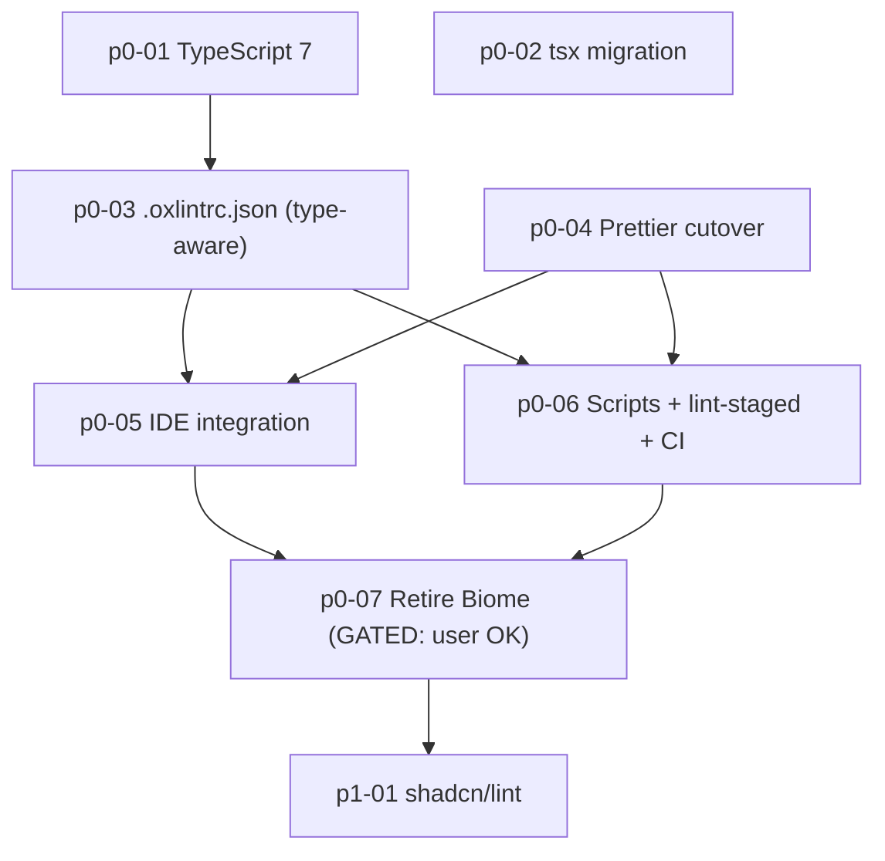

# Oxlint + Prettier Migration — Overview

> Nguồn: [`.cursor/analysis/system-oxlint-migration.analysis.md`](../../analysis/system-oxlint-migration.analysis.md) (17/09/2026) + quyết định chốt thêm trong phiên hỏi-đáp cùng ngày (xem §1 bảng dưới).

Migrate **lint** Biome → Oxlint (viết tay `.oxlintrc.json`, KHÔNG dùng `biome-to-oxc`), migrate
**format** Biome + Prettier(docs) → **Prettier duy nhất** (không dùng Oxfmt vì còn beta), bump
**TypeScript 6→7** (đã verify thật 0 lỗi), đổi `ts-node`→`tsx`, và tích hợp **format-on-save trong
IDE**. Biome chỉ bị **gỡ bỏ ở bước cuối cùng (P0-07)**, sau khi user xác nhận "OK" — mọi phase trước
đó chạy **song song** với Biome (Biome vẫn là nguồn enforce chính thức cho tới khi P0-07 chạy).

## 1. Quyết định đã chốt (khác đề xuất "hoãn" ban đầu trong analysis doc)

| Chủ đề | Quyết định | Bằng chứng đã verify thật |
|---|---|---|
| TypeScript 7 | **Bump ngay**, làm P0 đầu tiên | Cài `typescript@7.0.2` (bản `latest`, không phải nightly `-dev`) vào `/tmp/ts7-test`, chạy `tsc --noEmit` trên **toàn bộ 49 `tsconfig.json`** trong repo — 48/49 sạch; 1 lỗi còn lại (`tooling/vitest-config`) đã xác nhận **xảy ra y hệt với TS6 hiện tại** (thiếu `pnpm install` cho `@testcontainers/mongodb`, không liên quan TS7) |
| `ts-node` → `tsx` | Làm độc lập, không phụ thuộc TS7 | Chỉ 1 chỗ dùng duy nhất trong repo (`apps/backoffice` script `generate:presets`), `tsx@^4.23.13` đã có sẵn devDependency |
| GritQL (`no-unscoped-db-mutation.grit`) | **KHÔNG rewrite — xoá hẳn, plan này sở hữu việc xoá** | Đã đọc lại `testcontainers-setup/p0-05-retire-runtime-db-guard.plan.md` (17/09/2026) — plan đó **CHỈ** xoá runtime `setup-db-guard.ts`, ghi rõ tường minh "Plan Testcontainers KHÔNG thực thi xoá/sửa GritQL" và trỏ trách nhiệm về plan Biome→oxlint (đúng là plan này). `test-data-safety.mdc` §5 hiện đang "Hai lớp phòng thủ" (Cursor rule + Biome GritQL) và ghi "Sẽ được xử lý lại khi migrate Biome → oxlint". User đã xác nhận (17/09/2026): testcontainers đã chạy xong, **plan này giờ chính thức xoá GritQL** — không viết JS plugin thay thế (quyết định cũ vẫn giữ), xoá vật lý ở P0-07 (gắn với việc gỡ `biome.json`, xem chi tiết ở đó) |
| Oxfmt (formatter Oxc) | **KHÔNG dùng** | Đã verify `@ianvs/prettier-plugin-sort-imports@4.7.1` (cập nhật 02/2026) + `prettier-plugin-tailwindcss@0.8.1` (cập nhật 09/2026, chính chủ Tailwind Labs, khai tường minh tương thích với plugin sort-imports) — cả 2 dùng `prettier@^3.9.6` đã có sẵn trong repo. Rủi ro thấp hơn Oxfmt (đang beta) |
| `biome-to-oxc` (tool migrate bên thứ 3) | **KHÔNG dùng** | Viết `.oxlintrc.json` tay, map trực tiếp từ 27 rule + 9 override đã đọc trong `biome.json` |
| Gỡ Biome | **Gated — chỉ chạy P0-07 sau khi user xác nhận OK** | Theo yêu cầu — mọi phase trước chạy song song, không phá Biome đang hoạt động |

## 2. Bảng trạng thái

| Plan | Phase | Status | Ghi chú |
|---|---|---|---|
| [p0-01-typescript-7-upgrade](p0-01-typescript-7-upgrade.plan.md) | P0 | ✅ done | 50/50 `package.json` → `^7.0.2`; `check-types` 48/48 xanh; backoffice build OK; api-player không có script `build` (đã verify `check-types` + worker-keno `build:deps`) |
| [p0-02-tsx-generate-presets](p0-02-tsx-generate-presets.plan.md) | P0 | ✅ done | `ts-node` đã vỡ với TS7; `tsx` chạy OK, `theme.ts` MD5 identical; `ts-node` đã xoá khỏi lockfile |
| [p0-03-oxlintrc-manual-config](p0-03-oxlintrc-manual-config.plan.md) | P0 | ✅ done | `.oxlintrc.json` map 27 rule + overrides; `oxlint . --quiet` 0 error (~4.0s type-aware); triage: barrel off, eqeqeq null ignore, backoffice floating warn, `disallowTypeAnnotations:false`, agent unused warn (evalBypass theo `eve-eval-workflow.mdc`) |
| [p0-04-prettier-format-cutover](p0-04-prettier-format-cutover.plan.md) | P0 | ✅ done | `.prettierrc` + plugins sort-imports/tailwind; bỏ exclude TS khỏi `.prettierignore`; `#lib` đúng group alias; `prettier --check apps|packages|tooling` xanh (~12.8s); ~1419 file format 1 lần |
| [p0-05-ide-editor-integration](p0-05-ide-editor-integration.plan.md) | P0 | ✅ done | `.vscode/settings.json` → Prettier defaultFormatter + `source.fixAll.oxc`; tắt Oxfmt; `oxc.typeAware` + `lint.run=onSave`; xoá `prettier.documentSelectors`; thêm `.vscode/extensions.json` |
| [p0-06-scripts-lint-staged-ci-cutover](p0-06-scripts-lint-staged-ci-cutover.plan.md) | P0 | ✅ done | Scripts → `oxlint`/`prettier`; lint-staged Prettier rồi Oxlint; đổi rule `biome-lint-conventions.mdc` → `oxlint-lint-conventions.mdc`; `lint-staged` test tay pass; Biome vẫn giữ trong repo (rollback tới p0-07) |
| [p0-07-retire-biome](p0-07-retire-biome.plan.md) | P0 | ✅ done | Xoá `biome.json` + `tooling/biome-plugins/`; gỡ `@biomejs/biome`; cập nhật `test-data-safety.mdc` §5; scripts backoffice/ui + `generate:presets` → Prettier; `oxlint . --quiet` 0 error |
| [p1-01-shadcn-lint-integration](p1-01-shadcn-lint-integration.plan.md) | P1 | ✅ done | 5 rule + contracts (warn) trên backoffice + `packages/ui`; palette → `profit`/`loss`/`warning`/`info`/`game-*`; backlog ~1.9k restyle / ~14 raw / ~288 inline — giữ warn |

## 3. Thứ tự phụ thuộc

`p0-02` không chặn gì và không bị chặn — làm bất kỳ lúc nào.

## 4. Nguyên tắc chạy song song với Biome (P0-01..P0-06) — đã kết thúc ở P0-07

> **P0-07 đã chạy:** `biome.json`, `@biomejs/biome`, và GritQL đã xoá. Nguồn enforce duy nhất:
> Oxlint + Prettier (+ Cursor rule `test-data-safety.mdc` cho anti-pattern test DB).

Lịch sử giai đoạn song song (P0-01..P0-06): Biome còn trong repo làm rollback; script đã
cutover ở p0-06; GritQL chỉ còn nếu gọi Biome tay cho tới lúc P0-07 xoá hẳn.
- Mọi lệnh `oxlint`/`prettier` ở P0-01..P0-06 chạy như **lệnh bổ sung**, không thay thế
  `pnpm lint`/`pnpm format` hiện có — trừ P0-06 (cutover scripts) là bước duy nhất đổi
  `package.json` scripts, nhưng vẫn giữ `biome.json` + `@biomejs/biome` cài sẵn làm fallback
  (rollback nhanh nếu Oxlint/Prettier phát sinh vấn đề chưa lường trước sau khi merge).
- Mỗi phase PHẢI có bước verify bằng lệnh thật + review diff bằng mắt (không tin exit code), đúng
  nguyên tắc đã áp dụng khi migrate ESLint→Biome (`biome-monorepo-migration/00-overview.md` §4).
- Nếu bất kỳ phase P0-01..P0-06 phát hiện vấn đề nghiêm trọng → dừng, không tiếp tục phase sau, báo
  cáo user trước khi quyết định rollback hay tiếp tục sửa.

## 5. Verify tổng thể trước khi hỏi user "OK" để chạy P0-07

1. `pnpm check-types` xanh toàn repo (TS7).
2. `oxlint .` (dùng `.oxlintrc.json` mới) chạy 0 error trên toàn repo — mọi diagnostic mới đã triage.
3. `prettier --check .` xanh toàn repo (đã review diff `prettier --write .` chạy 1 lần).
4. `pnpm lint` (Biome, vẫn còn active) **cũng vẫn xanh** — xác nhận 2 bộ công cụ không mâu thuẫn kết
   luận trong giai đoạn song song.
5. IDE format-on-save đã test tay: mở 1 file `.ts`, sửa, save → xác nhận Prettier format + Oxlint
   fix-all chạy đúng thứ tự, không xung đột với Biome extension còn cài.
6. `rg "ts-node"` toàn repo → 0 kết quả ngoài file `.plan.md` lịch sử.
7. So sánh thời gian `pnpm check-types` + `oxlint .` + `prettier --check .` với baseline Biome cũ
   (0.55s→2.1s type-aware theo `biome-monorepo-migration`) — ghi số liệu thật vào mục 6 dưới đây khi
   có kết quả.

## 6. Số liệu đo được (điền khi thực thi)

| Việc | Baseline (Biome, TS6) | Sau migrate (Oxlint+Prettier, TS7) |
|---|---|---|
| `check-types` toàn repo | 1m7.2s (TS6.0.3, 48/48, cold cache) | 35.25s (TS7.0.2, 48/48, cold cache) — ~1.9× nhanh hơn |
| Lint toàn repo | 0.55s→2.1s (Biome, type-aware bật) | 4.02s (`oxlint . --quiet`, type-aware, 0 error) |
| Format check toàn repo | _(đo Biome format)_ | 12.84s (`prettier --check ./apps ./packages ./tooling`, 0 fail) |

## 7. Không làm trong migration này

- Không viết JS plugin thay GritQL (đã quyết bỏ hẳn, xoá vật lý ở P0-07 — xem bảng §1).
- Không tích hợp `@shadcn/lint` (để P1, sau khi Oxlint ổn định).
- Không dùng `biome-to-oxc` ở bất kỳ bước nào.
- Không đụng CI pipeline (`.github/workflows`) — repo chưa có, ngoài phạm vi.
- Không xoá `biome.json`/`@biomejs/biome`/`tooling/biome-plugins/` trước khi P0-07 được user xác
  nhận chạy.
