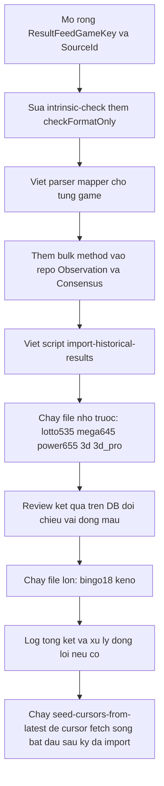

# ResultFeed — Import dữ liệu kết quả lịch sử từ JSONL

Nạp khoảng 176.000 dòng kết quả lịch sử của 7 game từ các file JSONL vào ResultFeed
(observations + consensus + submissions), mở rộng domain để hỗ trợ 5 game mới, và thiết kế lại
intrinsic-check để dùng "đúng format theo luật chơi" làm điều kiện Passed cho các game không có
checksum tự công bố.

## Bối cảnh và phạm vi

Import **chỉ ghi vào DB `megawin-resultfeed`** (collections `observations`, `consensus`,
`submissions`, `source_cursors`) — không đụng core `megawin-game`/`DrawDoc`. Nguồn dữ liệu là
file JSONL lịch sử (không phải fetch HTML sống), publish ngay (`publishedAt = import time`).

7 game, kích thước file:
- `bingo18.jsonl` (~12MB, 87995 dòng), `keno.jsonl` (~12.6MB, 82560 dòng) — đã có
  `ResultFeedGameKey`
- `lotto535.jsonl` (778), `mega645.jsonl` (1358), `power655.jsonl` (1390), `3d.jsonl` (1121),
  `3d_pro.jsonl` (767) — chưa có trong `ResultFeedGameKey`

## 1. Mở rộng domain — packages/resultfeed

### 1.1 ResultFeedGameKey — thêm 5 game

`packages/resultfeed/src/entities/enums.ts` hiện chỉ có `Keno`, `Bingo18`. Thêm `Lotto535`,
`Mega645`, `Power655`, `Max3d`, `Max3dpro` — giống value string với `@megawin/game-core`
`GameProduct` để dễ đối chiếu, nhưng đây vẫn là bảng riêng của ResultFeed (không import từ
game-core, đúng ràng buộc hiện có).

### 1.2 ResultFeedSourceId — thêm nguồn cho import lịch sử

Thêm giá trị mới `HistoricalImport: "historical-import"`. Đây là "nguồn" đại diện cho việc nạp từ
file JSONL — cần vì `ObservationDoc.sourceId` bắt buộc và unique index
`{sourceId, gameKey, drawPeriod, parserVersion}` cần khoá ổn định để idempotent.

Cần 1 doc `SourceDoc` seed cho `historical-import` (role = Authoritative — vì đây là nguồn duy
nhất cho các kỳ lịch sử) trước khi ghi — script import tự gọi `SourceRepository.upsertBySourceId`
nếu chưa tồn tại.

### 1.3 Intrinsic check — "format đúng luật chơi" thay cho checksum

Theo quyết định đã chốt: 5 game mới không có checksum tự công bố, nên coi việc đúng format/miền
số theo luật chơi chính là lớp verify duy nhất (tự nó đóng vai trò checksum). Sửa
`packages/resultfeed/src/rules/intrinsic-check.ts`:

- Thêm hàm `checkFormatOnly` áp dụng theo từng game:
  - Lotto535: 6 số, 5 số main "01"-"35" không trùng + 1 số đặc biệt "01"-"12" (số cuối cùng trong
    mảng, theo lưu ý "số cuối là số đặc biệt").
  - Mega645: 6 số, miền "01"-"45", không trùng.
  - Power655: 7 số (6 main "01"-"55" không trùng + 1 bonus "01"-"55" là số cuối, độc lập miền
    trùng với main).
  - Max3d/Max3dpro: cấu trúc khác — mỗi giải là bộ triplet "000"-"999", đúng số lượng theo giải
    (Đặc biệt 2, Nhất 4, Nhì 6, Ba 8 theo mẫu dữ liệu).
- `checkIntrinsic` (switch exhaustive trên `ResultFeedGameKey`) thêm nhánh cho 5 game mới gọi
  `checkFormatOnly`, trả `Passed` nếu đúng hình thức, `Failed` nếu sai. Không có `NotAvailable`
  cho các game này — luôn validate được format.
- Keno/Bingo18 giữ nguyên logic checksum thật hiện có.
- Mở rộng `ResultFeedGameKey` ở 1.1 khiến TypeScript tự bắt case thiếu trong switch (đúng
  `useExhaustiveSwitchCases`), đảm bảo không quên game nào.

### 1.4 Canonicalize — xác nhận không cần đổi cho 5 game số phẳng

`canonicalizeNumbers` sort tăng dần áp dụng đúng cho Lotto535/Mega645/Power655/Bingo18/Keno.
Max3d/Max3dpro cần xử lý riêng vì mỗi giải là tập số riêng biệt — xem mục 2.4.

## 2. Chuẩn hoá JSONL sang ParsedObservation (per game)

Không viết `SourceAdapter` đầy đủ (đó là cho fetch HTML sống) — viết pure mapper function riêng
cho import, đặt tại `packages/resultfeed-application/src/sources/historical-import/` (ngang hàng
`vietlott/`):
- `parse-simple-numbers.ts` — dùng chung cho Bingo18/Keno/Lotto535/Mega645/Power655 (đều có
  `result: number[]`, chỉ khác cách zero-pad và số đặc biệt).
- `parse-max3d.ts` — riêng cho Max3d/Max3dpro (object nhiều giải).
- `id-to-period.ts` — chuẩn hoá field `id` (string, có thể có prefix `#`) sang `drawPeriod`
  (chuỗi chỉ chữ số, giữ độ dài zero-pad gốc).
- `index.ts` — barrel.

### 2.1 Mapping từng game (từ sample đã đọc)

- Bingo18: `id` đã 7 digit (`"0083123"`); `result: [2,6,1]` (1-6, giữ thứ tự) → numbersDisplay
  `["2","6","1"]`. Có sẵn `total`/`large_small` — map sang
  `claimedChecksums = {sum, bigSmallDraw}` để tái dùng `checkBingo18` (checksum thật, không phải
  format-only, vì dữ liệu tự chứa đủ để verify).
- Keno: `id` có prefix `#` (`"#0110271"`); 20 số 1-80 → zero-pad "01"-"80". Có
  `big_small`/`odd_even` dạng `"Lẻ (11)"`/`"Nhỏ (11)"` — parse ra count để tái dùng `checkKeno`
  checksum thật.
- Lotto535: `id` 5 digit; `result` 6 số, số cuối là đặc biệt → main = `result.slice(0,5)`
  zero-pad "01"-"35", special = `result[5]` zero-pad "01"-"12".
- Mega645: `id` 5 digit; `result` 6 số, tất cả main, zero-pad "01"-"45".
- Power655: `id` 5 digit; `result` 7 số, số cuối là đặc biệt (bonus) → main = `result.slice(0,6)`
  zero-pad "01"-"55", special = `result[6]` zero-pad "01"-"55".
- Max3d/Max3dpro: `id` 5 digit; `result` là object 4 giải (Giải Đặc biệt/Nhất/Nhì/Ba), mỗi giải
  array string "NNN" — xem 2.4.

### 2.2 drawPeriod từ id — BẮT BUỘC chỉ chữ số, áp dụng đồng nhất cho CẢ 7 game

`id-to-period.ts` là 1 hàm DUY NHẤT dùng chung cho tất cả 7 game (không viết riêng cho từng
game) — strip mọi ký tự không phải chữ số (loại `#` như prefix của Keno `"#0110271"`, và bất kỳ
ký tự lạ nào phát sinh ở các game khác), giữ nguyên độ dài zero-pad gốc. Mục tiêu: `drawPeriod`
lưu trong `ObservationDoc`/`ConsensusDoc` của MỌI game phải đồng nhất format (chỉ digit,
không dấu, không prefix) — khớp `parsedObservationSchema.drawPeriod` (regex chỉ chữ số) và đảm
bảo sort/so sánh period nhất quán giữa các game khi hiển thị hoặc query theo range.

### 2.3 drawDateSource

Field `date` trong JSONL đã đúng format `YYYY-MM-DD` cho tất cả 7 game theo mẫu đã đọc — dùng
trực tiếp, được validate lại bởi `parsedObservationSchema` sẵn có.

### 2.4 Max3d/Max3dpro — cấu trúc khác biệt

`ObservationDoc.numbersDisplay: string[]` là 1 mảng phẳng, nhưng Max3d/Max3dpro có 4 giải riêng
biệt. Core (`packages/game-max3d/src/entities/draw-result.ts`) đại diện bằng 4 field riêng
(`special`, `first`, `second`, `third`).

Giải pháp: encode thành 1 mảng phẳng theo thứ tự và số lượng CỐ ĐỊNH biết trước (Đặc biệt 2 +
Nhất 4 + Nhì 6 + Ba 8 = 20 triplet), lưu nguyên vào `numbersDisplay`. Ghi rõ quy ước offset này
trong JSDoc maintainer note của parser mapper (không đưa lên domain layer). `checkFormatOnly` cho
2 game này validate đúng 20 phần tử, mỗi phần tử khớp 3 chữ số.

## 3. Batch import script

### 3.1 Vị trí và cách chạy

Tạo `packages/resultfeed-application/src/scripts/import-historical-results.ts`, chạy bằng `tsx`
(thêm script `import:historical` vào `package.json` của `resultfeed-application`).

### 3.1.1 Env var riêng cho MongoDB URI — tách khỏi `MONGODB_URI` của test suite

`MONGODB_URI` hiện tại là biến của vitest (`.env.test.local`, luôn bị `setup-db-guard.ts` ép
local-only trừ khi `ALLOW_DB_TESTS=true`) — không phù hợp để script import (không chạy qua
vitest, không có guard đó) dùng chung, và dễ nhầm lẫn khi user đổi giá trị cho mục đích khác.

Thêm biến MỚI riêng cho import: `RESULTFEED_IMPORT_MONGODB_URI`. Script fail-fast ngay đầu nếu
thiếu (`throw new Error("Missing env RESULTFEED_IMPORT_MONGODB_URI")`), sau đó gán
`process.env.MONGODB_URI = process.env.RESULTFEED_IMPORT_MONGODB_URI` TRƯỚC khi gọi bất kỳ repo
nào — nhờ vậy `ObservationRepository`/`ConsensusRepository`/`SubmissionRepository`/`SourceRepository`
(kế thừa `ResultFeedRepo` ở `@megawin/data`, mặc định đọc key `MONGODB_URI`) hoạt động không cần
sửa gì ở package `@megawin/data` — không thêm tham số `mongoEnvKey` mới vào base repo dùng chung.

Thêm khai báo biến (rỗng, chỉ comment hướng dẫn) vào
`packages/resultfeed-application/.env.test.example` — theo đúng quy tắc hiện có của file này
(khai tên biến, để giá trị thật ở `.env.test.local`, không commit giá trị thật). User tự điền
giá trị thật vào `.env.test.local` (chạy trên DB test) — khi cần đưa lên production CHỈ cần đổi
giá trị của `RESULTFEED_IMPORT_MONGODB_URI` (hoặc tạo file env riêng khác rồi nạp bằng
`tsx --env-file=<file>`), KHÔNG đổi code script.

### 3.2 Xử lý file lớn — streaming

File `bingo18.jsonl`/`keno.jsonl` (~12MB, 82-88k dòng) đọc bằng Node `readline` +
`fs.createReadStream`, không load hết vào RAM bằng `readFileSync`.

### 3.3 Batch write — thêm bulk method vào repo, PHẢI ghi đè đầy đủ (không chỉ insert-if-missing)

Hiện `ObservationRepository`/`ConsensusRepository` chỉ có method single-doc (`upsertObservation`,
`ensurePendingDoc` + `applyMachineDecision`) — với 175k dòng sẽ rất chậm nếu mỗi dòng 1
round-trip. Thêm method bulk MỚI (không sửa API single-doc hiện có, giữ nguyên cho pipeline fetch
sống):

- `ObservationRepository.bulkUpsertObservations(docs)` — dùng `bulkWrite` (đã có sẵn ở base
  `MongoRepository`) với các `updateOne` upsert theo unique key
  `{sourceId, gameKey, drawPeriod, parserVersion}`, `ordered: false` để 1 lỗi không chặn cả
  batch. Theo ĐÚNG pattern `$set` full-field + `$setOnInsert: {createdAt}` đã có ở
  `upsertObservation` (xem code hiện tại) — KHÔNG dùng `$setOnInsert` cho field dữ liệu
  (`numbersDisplay`, `numbersCanonical`, `claimedChecksums`, `intrinsicState`, …). Đây là điều
  kiện BẮT BUỘC vì script có thể chạy lại nhiều lần sau khi sửa file JSONL nguồn (data lỗi được
  fix) — `$set` đảm bảo lần chạy lại ghi đè giá trị MỚI, `$setOnInsert` sẽ bỏ sót update và giữ
  giá trị SAI cũ nếu doc đã tồn tại.
- `ConsensusRepository.bulkUpsertPublished(docs)` — ghi thẳng
  `state=Agreed, decidedBy=Machine, publishedAt=now` theo unique key `{gameKey, drawPeriod}`,
  cũng dùng `$set` full-field (numbers, payoutHash, displayHash, agreeing, appliedPolicy,
  decidedAt, publishedAt, updatedAt) — set CỨNG `version: 0` mỗi lần (không `$inc`), vì nhánh
  này ghi thẳng bỏ qua optimistic-lock của pipeline sống (`applyMachineDecision`) — không có
  writer khác cạnh tranh trên các kỳ lịch sử nên không cần cơ chế lock, và việc set cứng giúp
  script idempotent tuyệt đối bất kể chạy bao nhiêu lần. Đây ghi thẳng, KHÔNG chạy qua
  `ConsensusTickUseCase`/`decideConsensus` (đã xác nhận: script tự tính rồi ghi thẳng, không
  đụng thuật toán sống dùng cho fetch real-time).

### 3.4 Pseudo-submission

`ObservationDoc.submissionId` bắt buộc. Cho import lịch sử, tạo 1 submission "batch" duy nhất mỗi
file (không phải 1 submission/dòng) chứa metadata (tên file, số dòng, thời điểm import) qua
`SubmissionRepository.upsertSubmission` gọi 1 lần đầu file, dùng `submissionId` đó cho toàn bộ
observation của file. `requestUrl` dùng dạng `file://<path>` để phân biệt fetch HTTP thật.

### 3.5 Luồng xử lý 1 dòng JSONL

Đọc dòng, parse JSON, map sang `ParsedObservation` theo game, validate bằng
`parsedObservationSchema` (Zod có sẵn), chạy `checkIntrinsic` (checksum thật cho Keno/Bingo18,
format-only cho 5 game mới), tính `canonicalizeNumbers` + `computePayoutHash` +
`computeDisplayHash`, build `ObservationDoc` và `ConsensusDoc` tương ứng, đẩy vào buffer. Buffer
đủ 500 dòng thì gọi `bulkUpsertObservations` + `bulkUpsertPublished` rồi xoá buffer.

Dòng lỗi (JSON hỏng, sai format) log ra file lỗi riêng theo game, KHÔNG throw dừng cả batch — in
tổng kết cuối cùng (số dòng thành công/lỗi).

### 3.6 Idempotent — chạy lại nhiều lần an toàn, kể cả khi đổi môi trường DB

Dùng upsert theo unique key + `$set` full-field (mục 3.3) nên chạy lại script trên CÙNG file
nhiều lần là an toàn — kể cả khi:
- File JSONL nguồn được sửa (data lỗi được fix) — lần chạy sau ghi đè đúng giá trị mới.
- Đổi `RESULTFEED_IMPORT_MONGODB_URI` từ DB test sang DB production (mục 3.1.1) — script không
  có logic phân biệt "môi trường test" hay "production" nào khác ngoài giá trị của biến này, nên
  hành vi giống nhau ở cả 2 môi trường; script an toàn để chạy lần đầu ở DB test, xác nhận kết
  quả, rồi chạy lại ĐÚNG NGUYÊN script (chỉ đổi giá trị env) để nạp vào DB production.

## 4. Trình tự triển khai

### 4.1 Seed cursor fetch sống bắt đầu từ kỳ mới nhất đã import

`source_cursors` (dùng bởi `FetchAndParseUseCase` — pipeline HTML sống, xem
`02-fetch-parse.plan.md`) là collection HOÀN TOÀN KHÁC với dữ liệu import ở plan này —
import chỉ ghi `observations`/`consensus`, KHÔNG tự đụng `source_cursors`. Nếu không seed,
cursor của `vietlott-detail` (Keno/Bingo18/Lotto535 — 3 game vừa có adapter HTML sống) sẽ ở
trạng thái cold-start (`lastConfirmedPeriod = null`) và outcome mỗi tick là `awaiting_seed`
(không tự fetch được gì) dù `consensus` đã có sẵn hàng trăm nghìn kỳ lịch sử.

Script `packages/resultfeed-application/src/scripts/seed-cursors-from-latest.ts`
(`pnpm --filter @megawin/resultfeed-application seed:cursors`) giải quyết việc này: với mỗi
`(sourceId, gameKey)` đang đăng ký trong `SOURCE_ADAPTERS` (`sources/registry.ts`), tìm kỳ
`drawPeriod` lớn nhất đã có trong `consensus` (`ConsensusRepository.findLatestPublishedPeriod`
— sort theo `drawPeriod` DESC, KHÔNG theo `publishedAt` vì import ghi `publishedAt = giờ
chạy script`, không phản ánh thứ tự kỳ quay thật) rồi gọi
`SourceCursorRepository.seedAnchor` để neo `lastConfirmedPeriod` = kỳ đó.

An toàn khi chạy lại nhiều lần: script CHỈ seed cursor đang `lastConfirmedPeriod === null`
(cold-start) — cursor đã có tiến độ (đã tự fetch sống ít nhất 1 lần) bị BỎ QUA, tránh vô
tình lùi/ghi đè tiến độ đang chạy. Dùng chung env `RESULTFEED_IMPORT_MONGODB_URI` với
`import-historical-results.ts`. Game KHÔNG có adapter HTML sống (Mega645/Power655/Max3d/
Max3dpro — hiện chỉ nạp qua JSONL, xem §1) không nằm trong `SOURCE_ADAPTERS.gameKeys` nên
không cần và không bị seed.

Chạy SAU bước 9 (import xong toàn bộ 7 game), TRƯỚC khi bật lại/triển khai Lambda
fetch sống lần đầu cho môi trường đó.

## 5. Việc KHÔNG làm (theo xác nhận)

- Không ghi/đồng bộ ngược vào core DrawDoc của từng game — phạm vi chỉ ResultFeed.
- Không chạy qua ConsensusTickUseCase/thuật toán consensus sống cho import — script tự quyết
  Agreed trực tiếp.
- Không thêm field `source` vào 5 game core còn thiếu — không cần cho việc chỉ ghi vào
  ResultFeed.

## Các file cần tạo hoặc sửa

Sửa:
- `packages/resultfeed/src/entities/enums.ts` — thêm 5 `ResultFeedGameKey`, thêm
  `ResultFeedSourceId.HistoricalImport`
- `packages/resultfeed/src/rules/intrinsic-check.ts` — thêm `checkFormatOnly` và case mới trong
  switch
- `packages/resultfeed-application/src/infras/repos/observation-repo.ts` — thêm
  `bulkUpsertObservations`
- `packages/resultfeed-application/src/infras/repos/consensus-repo.ts` — thêm
  `bulkUpsertPublished`
- `packages/resultfeed-application/package.json` — thêm script `import:historical`
- `packages/resultfeed-application/.env.test.example` — thêm khai báo biến
  `RESULTFEED_IMPORT_MONGODB_URI` (rỗng, kèm comment hướng dẫn)

Tạo mới:
- `packages/resultfeed-application/src/sources/historical-import/parse-simple-numbers.ts`
- `packages/resultfeed-application/src/sources/historical-import/parse-max3d.ts`
- `packages/resultfeed-application/src/sources/historical-import/id-to-period.ts`
- `packages/resultfeed-application/src/sources/historical-import/index.ts`
- `packages/resultfeed-application/src/scripts/import-historical-results.ts`
- `packages/resultfeed-application/src/scripts/seed-cursors-from-latest.ts` — seed
  `source_cursors` của các game có adapter fetch sống (`vietlott-detail`) tới kỳ mới nhất đã
  import, xem §4.1

## Todo

- [ ] Mở rộng `ResultFeedGameKey` (5 game mới) và `ResultFeedSourceId.HistoricalImport` trong
      `packages/resultfeed/src/entities/enums.ts`
- [ ] Thêm `checkFormatOnly` cho 5 game mới vào `packages/resultfeed/src/rules/intrinsic-check.ts`,
      mở rộng switch case
- [ ] Viết `parse-simple-numbers.ts`, `parse-max3d.ts`, `id-to-period.ts` (1 hàm chung 7 game,
      luôn strip `#` và ký tự non-digit) trong `sources/historical-import/`
- [ ] Thêm `bulkUpsertObservations` vào `ObservationRepository` và `bulkUpsertPublished` vào
      `ConsensusRepository` — dùng `$set` full-field (không `$setOnInsert` cho field dữ liệu) để
      đảm bảo chạy lại ghi đè đúng
- [ ] Thiết kế pseudo-submission 1 per file qua `SubmissionRepository.upsertSubmission`
- [ ] Thêm biến `RESULTFEED_IMPORT_MONGODB_URI` vào `.env.test.example`; script gán sang
      `process.env.MONGODB_URI` trước khi gọi repo
- [ ] Viết script `import-historical-results.ts` với streaming readline, buffer batch 500, log
      lỗi riêng
- [ ] Seed `SourceDoc` cho `historical-import` (role Authoritative) trước khi ghi
      observation/consensus
- [ ] Chạy import trên 5 file nhỏ (lotto535/mega645/power655/3d/3d_pro) trước, đối chiếu vài dòng
      mẫu
- [ ] Chạy import trên 2 file lớn (bingo18/keno), theo dõi log lỗi và tổng kết
- [ ] Xác nhận chạy lại script trên cùng file (idempotent) không tạo doc trùng, không bỏ sót
      update field
- [ ] Thêm `ConsensusRepository.findLatestPublishedPeriod` (sort theo `drawPeriod` DESC, không
      phải `publishedAt`) và viết `seed-cursors-from-latest.ts`, xem §4.1
- [ ] Chạy `pnpm --filter @megawin/resultfeed-application seed:cursors` sau khi import xong toàn
      bộ 7 game — xác nhận `source_cursors` của Keno/Bingo18/Lotto535 đã neo đúng
      `lastConfirmedPeriod` = kỳ mới nhất trong `consensus`
