# ResultFeed — Tự lấy kết quả Vietlott điền form nhập kết quả (7 game)

Tách từ `04-backoffice-api.plan.md` §4. Phạm vi: API "lấy kết quả" (mục 4 gốc) sống trong app Lambda
riêng `apps/api-resultfeed` (kéo sớm hạng mục G7 của `00-overview.md` vì backoffice cần ngay) + thêm
nút "Lấy kết quả" tự động điền form nhập/sửa kết quả ở cả 7 form `publish-result-action.tsx` trong
`apps/backoffice`.

> Đổi tên app (02/09/2026): `apps/resultfeed-worker` → `apps/worker-resultfeed`,
> `apps/resultfeed-api` (tên dự kiến ban đầu) → `apps/api-resultfeed` — đồng bộ convention
> `worker-<domain>`/`api-<domain>` dùng cho toàn bộ app core (`worker-keno`, `api-player`, …). Xem
> `00-overview.md` §1 (đã cập nhật). `apps/worker-resultfeed` là rename thư mục của app **đã tồn tại
> thật trong code**, không phải app mới.

Quyết định đã chốt qua câu hỏi xác nhận với user (02/09/2026):
- API key: **1 biến env duy nhất** `RESULTFEED_API_KEY` trong `apps/api-resultfeed` — không xây danh
  sách nhiều consumer ngay, để dành mở rộng sau (VD MegaWin core PULL ở G5).
- `RESULTFEED_CLIENT_MODE` (biến env của `apps/backoffice`) mặc định **`"direct"`** — gọi
  `PullResultsUseCase` trong tiến trình (nhanh, cùng `MONGODB_URI`/cluster). `"http"` là lựa chọn
  thay thế khi cần đi qua đúng contract HTTP thật (2 hệ thống tách cluster/deploy độc lập).
- Code auth (API key check + middy compose) đặt **hoàn toàn cục bộ** trong `apps/api-resultfeed` —
  chỉ app này dùng, không tạo abstraction dùng chung/generic builder (§2).

## 0. Ràng buộc kiến trúc bắt buộc — Domain boundary D7

`packages/game-*`/`packages/game-*-application` **KHÔNG được import** `@megawin/resultfeed*`
(`00-overview.md` §6, D7: *"resultfeed không biết gì về MegaWin, ngược lại core PULL qua HTTP"*).
Tính năng "lấy kết quả" ở form game **PHẢI** gọi qua interface `VietlottResultClient` (§4) — mỗi
game không biết implementation nào đang chạy phía sau interface đó.

`apps/backoffice` **không** nằm trong danh sách "core" bị chặn ở lint boundary D7 (chỉ chặn
`packages/game-*`, `apps/api-*`, `apps/worker-<game>`) — backoffice là BFF vận hành, được phép import
`@megawin/resultfeed-application` trực tiếp. Vì vậy implementation của `VietlottResultClient` có 2
lựa chọn (§4): gọi HTTP tới `apps/api-resultfeed`, hoặc gọi thẳng use-case trong tiến trình — cả 2
đều KHÔNG vi phạm D7 vì vi phạm chỉ xảy ra nếu `game-*`/`game-*-application` tự import resultfeed.

## 1. Kiến trúc luồng gọi

```mermaid
flowchart LR
  form["publish-result-action.tsx (7 game)"] -->|"GET drawPeriod"| route["/api/{game}/draws/[drawId]/vietlott-result"]
  route --> usecase["GetVietlottResultUseCase (game-{game}-application)"]
  usecase --> client["VietlottResultClient (game-core interface)"]
  client -->|"mode=http"| httpImpl["resultfeed-client-http.ts"]
  client -->|"mode=direct (default)"| directImpl["resultfeed-client-direct.ts"]
  httpImpl -->|"GET + x-resultfeed-api-key"| api["apps/api-resultfeed — GET /results"]
  directImpl -->|"import trực tiếp, cùng tiến trình"| pullUsecase["PullResultsUseCase (resultfeed-application)"]
  api --> pullUsecase
  pullUsecase --> consensusRepo["ConsensusRepository"]
```



`apps/backoffice` **không** host route `/api/resultfeed/results` — route đó sống trong app Lambda
riêng `apps/api-resultfeed` (§2). `game-{game}-application` chỉ biết interface `VietlottResultClient`
(§4), không biết implementation nào đang chạy phía sau — đổi `RESULTFEED_CLIENT_MODE` không cần sửa
gì ở `game-*-application`.

## 2. App mới — `apps/api-resultfeed`

Đặt tên theo quyết định đổi tên app (02/09/2026, `00-overview.md` §1): **runtime prefix đứng trước**
(`api-resultfeed`), đồng bộ convention `api-player`/`api-tenant`/`worker-keno` dùng cho toàn bộ app
core — thay cho tên dự kiến ban đầu `resultfeed-api`. Mirror cấu trúc
[`apps/worker-resultfeed`](../../../apps/worker-resultfeed) (`package.json` + `serverless.yml` +
`esbuild.config.mjs` + `tsconfig.json`), khác ở chỗ dùng `httpApi` (event HTTP) thay vì `schedule`.

Toàn bộ code auth (API key check + middy compose) **thiết kế riêng, cục bộ trong
`apps/api-resultfeed/src/lib/`** — chỉ app này dùng, KHÔNG tạo package/abstraction dùng chung, KHÔNG
tái dùng builder của `packages/auth` (đó là builder cho API core, gắn với ngữ nghĩa `tenant`/B2B —
resultfeed độc lập, không biết gì về identity của MegaWin core, đúng D7).

File mới:
- `apps/api-resultfeed/package.json` — deps: `@megawin/resultfeed`, `@megawin/resultfeed-application`,
  `@megawin/app-core` (lambda middleware), `@middy/core`, `zod`. **KHÔNG** thêm
  `@megawin/auth`/`@megawin/identity*` — resultfeed giữ độc lập, không biết gì về hệ thống identity
  của MegaWin core (đúng triết lý D7).
- `apps/api-resultfeed/serverless.yml` — service `mw-api-resultfeed`, `provider.environment` gồm
  `MONGODB_URI`, `RESULTFEED_API_KEY` (SSM param theo đúng pattern `worker-resultfeed/serverless.yml`),
  `httpApi.cors` cho phép header `x-resultfeed-api-key`.
- `apps/api-resultfeed/esbuild.config.mjs` — copy nguyên từ `worker-resultfeed`.
- `apps/api-resultfeed/src/functions/results.yml`:
  ```yaml
  get-results:
    handler: src/handlers/results/get-results.handler
    events:
      - httpApi:
          path: /results
          method: get
  ```
- `apps/api-resultfeed/src/lib/api-key-auth.ts` — middy middleware tự viết **cục bộ cho app này**,
  KHÔNG tái dùng `tenantApiKeyAuthMiddleware` của `@megawin/auth` (tránh va chạm ngữ nghĩa "tenant" —
  đó là khái niệm B2B core, resultfeed có consumer riêng của nó). Đọc header `x-resultfeed-api-key`,
  so trực tiếp với `process.env.RESULTFEED_API_KEY`, sai → `earlyResponse` 401 theo đúng format
  `ApiErrorResponse` (`@megawin/shared/api-types`).
- `apps/api-resultfeed/src/lib/build-handler.ts` — compose middy tối giản **cục bộ cho app này**, tái
  dùng `validatorZodMiddleware`/`successEnvelopeMiddleware`/`httpErrorHandlerUseCaseFormat` từ
  `@megawin/app-core/lambda/middleware` (những middleware generic, dùng chung mọi Lambda app) +
  `apiKeyAuthMiddleware()` cục bộ ở trên. Export `withResultFeedApiKeyAuth` — hàm compose duy nhất,
  chỉ dùng trong `apps/api-resultfeed`, không export ra ngoài app. Khai 2 type helper nhỏ
  `WithSchema`/`InferSchema` **copy rút gọn** (không import) từ `packages/auth/src/handler-wrappers.ts`
  — chủ đích không import package đó để tránh kéo theo dependency `identity` vào bundle
  `api-resultfeed`.
- `apps/api-resultfeed/src/handlers/results/get-results.ts`:
  ```typescript
  const querySchema = z.object({
    gameKey: z.string().min(1),
    drawPeriod: z.string().min(1).optional(),
    since: z.string().optional(),
    size: z.coerce.number().int().positive().max(200).optional(),
  });

  const pullResultsUseCase = new PullResultsUseCase();

  export const handler = withResultFeedApiKeyAuth(
    async (event) => pullResultsUseCase.run(event.schema.query),
    { schemas: { query: querySchema } },
  );
  ```

## 3. Use-case mới — `PullResultsUseCase`

File mới: `packages/resultfeed-application/src/use-cases/results/pull-results.ts`. Input đã validate
ở tầng route (Zod, không validate lại — đúng §8 `code-quality-standards.mdc`), dispatch 2 nhánh:

- `drawPeriod` có mặt → `ConsensusRepository.findByGameKeyAndPeriod(gameKey, drawPeriod)`, chỉ trả
  khi `publishedAt != null` (kể cả state là `Agreed`/`HumanVerified`, miễn đã publish).
- Ngược lại (`since`+`size`) → `ConsensusRepository.findPublished(gameKey, size)`, sort `publishedAt`
  giảm.

Output mỗi item: `{ gameKey, drawPeriod, drawDateSource, numbers, payoutHash, state, publishedAt }`.
**Không trả `drawId`** — đúng D7, `resultfeed` không biết quy ước `drawId` của MegaWin core. Thêm
export `./use-cases/results` vào `packages/resultfeed-application/package.json` (mirror
`./use-cases/consensus`).


Use-case này được dùng ở **2 chỗ**: Lambda handler của `api-resultfeed` (§2) VÀ implementation
"direct" của `VietlottResultClient` trong backoffice (§4.1) — cùng 1 nguồn logic, không trùng lặp.

## 4. Env mới

### `apps/api-resultfeed` — chỉ 1 biến mới

```typescript
/** API key duy nhất cho mọi consumer hiện tại (chỉ backoffice). Mở rộng thành danh sách nhiều
 * key/consumer khi có consumer thứ 2 (VD MegaWin core PULL, G5). */
RESULTFEED_API_KEY: <string, đọc trực tiếp qua process.env, không dùng @t3-oss/env — app Lambda
  không có convention env.ts như Next.js>
```

### `apps/backoffice/src/env.ts` — 3 biến mới

```typescript
/** "direct" (mặc định) = gọi PullResultsUseCase (resultfeed-application) trong tiến trình — nhanh,
 * cùng MONGODB_URI/cluster. "http" = luôn đi qua apps/api-resultfeed + API key (đúng contract HTTP
 * thật, dùng khi 2 hệ thống tách cluster/deploy độc lập). */
RESULTFEED_CLIENT_MODE: z.enum(["direct", "http"]).default("direct"),
/** Chỉ cần khi RESULTFEED_CLIENT_MODE="http". */
RESULTFEED_API_URL: z.url().optional(),
RESULTFEED_API_KEY: z.string().min(1).optional(),
```

Không tạo/ghi `.env*` (theo rule `no-env-file-modification.mdc`) — user tự điền giá trị thật.
`apps/backoffice/package.json` cần thêm dependency `@megawin/resultfeed-application` (cho nhánh
"direct") — KHÔNG vi phạm D7 (D7 chỉ chặn phía `game-*`/`api-*`/`worker-*`, không chặn backoffice).

## 5. `VietlottResultClient` — interface chung + 2 implementation + factory theo env

Interface đặt ở `packages/game-core/src/types/vietlott-result-client.ts`. `gameKey` khai **string
thuần** (không import `ResultFeedGameKey`) để giữ boundary D7 — mỗi game tự truyền literal string
khớp giá trị `ResultFeedGameKey` tương ứng (xác nhận bằng test, không cần import type).

```typescript
export interface VietlottResultLookup {
  gameKey: string;
  drawPeriod: string;
}

export interface VietlottResultRecord {
  numbers: string[];
  drawDateSource: string;
  publishedAt: string;
}

export interface VietlottResultClient {
  getResult(lookup: VietlottResultLookup): Promise<VietlottResultRecord | null>;
}
```

### 5.1 2 implementation + factory — `apps/backoffice/src/lib/`

- `resultfeed-client-http.ts` — dùng `createHttpClient` (`@megawin/http-client`), gọi
  `GET {RESULTFEED_API_URL}/results` kèm header `x-resultfeed-api-key: {RESULTFEED_API_KEY}`.
- `resultfeed-client-direct.ts` — import trực tiếp `PullResultsUseCase` từ
  `@megawin/resultfeed-application/use-cases/results`, gọi trong tiến trình, không qua HTTP.
- `resultfeed-client.ts` — factory, chọn implementation theo `env.RESULTFEED_CLIENT_MODE`:
  ```typescript
  export const resultFeedClient: VietlottResultClient =
    env.RESULTFEED_CLIENT_MODE === "http" ? resultFeedClientHttp : resultFeedClientDirect;
  ```

Mọi nơi khác (7 `GetVietlottResultUseCase`) chỉ import `resultFeedClient` từ file factory này, không
biết đang chạy mode nào.

## 6. Use-case mới mỗi game — mirror `get-vietlott-suggestion.ts`

`packages/game-{game}-application/src/use-cases/draws/get-vietlott-result.ts` —
`GetVietlottResultUseCase`:

```typescript
export class GetVietlottResultUseCase extends UseCase<GetVietlottResultInput, GetVietlottResultOutput> {
  private readonly resultFeedClient: VietlottResultClient;

  constructor(resultFeedClient: VietlottResultClient) {
    super();
    this.resultFeedClient = resultFeedClient; // field + gán trong body, KHÔNG parameter property
  }

  protected async execute(input: GetVietlottResultInput): Promise<GetVietlottResultOutput> {
    const record = await this.resultFeedClient.getResult({
      gameKey: "keno", // literal riêng từng game — KHÔNG import ResultFeedGameKey
      drawPeriod: input.drawPeriod,
    });
    return {
      found: record !== null,
      numbers: record?.numbers ?? null,
      drawDateSource: record?.drawDateSource ?? null,
      publishedAt: record?.publishedAt ?? null,
    };
  }
}
```

7 file cần tạo (1/game, cùng cấu trúc, chỉ khác literal `gameKey`):
`game-keno-application`, `game-bingo18-application`, `game-lotto535-application`,
`game-mega645-application`, `game-power655-application`, `game-max3d-application`,
`game-max3dpro-application`.

## 7. API route mới mỗi game — mirror `vietlott-suggestion/route.ts`

`apps/backoffice/src/app/api/{game}/draws/[drawId]/vietlott-result/route.ts`:

```typescript
import { GetVietlottResultUseCase } from "@megawin/game-keno-application/use-cases/draws";
import { CompanyRole } from "@megawin/identity/entities";
import { z } from "zod";

import { resultFeedClient } from "@/lib/resultfeed-client";
import { withApi } from "@/lib/api";

const getVietlottResultUseCase = new GetVietlottResultUseCase(resultFeedClient);

export const GET = withApi()
  .auth({ roles: [CompanyRole.Staff] })
  .query(z.object({ drawPeriod: z.string().min(1) }))
  .handler(async ({ query }) => getVietlottResultUseCase.run({ drawPeriod: query.drawPeriod }));
```

`drawId` trong path hiện KHÔNG dùng trong use-case (chỉ cần `drawPeriod` từ query) — giữ trong path
để đồng bộ REST convention với `vietlott-suggestion` (route theo draw), không phải vì use-case cần.

## 8. Frontend — 7 file `publish-result-action.tsx`, cùng pattern

### 8.1 Hook mới — mirror `useVietlottSuggestion`

Trong mỗi `use-operations.ts` (7 game):

```typescript
export function useVietlottResult(drawId: string | undefined, drawPeriod: string, enabled: boolean) {
  return useQuery({
    queryKey: kenoKeys.vietlottResult(drawId ?? "", drawPeriod),
    queryFn: () => apiClient.get<GetVietlottResultOutput>(`/keno/draws/${drawId}/vietlott-result`, {
      params: { drawPeriod },
    }),
    enabled: !!drawId && !!drawPeriod && enabled,
    staleTime: 30_000,
  });
}
```

`queryKey` gồm `drawPeriod` — đổi mã kỳ (user tự sửa ô input) tự động tạo query khác, tự refetch.

### 8.2 Trigger tự động + nút "Lấy lại kết quả"

- Dialog mở + có `drawPeriod` hợp lệ (từ suggestion hoặc giá trị cũ của `vietlottRef`) →
  `enabled = true`, tự gọi.
- Nếu số đang **rỗng** (chưa nhập) → tự động điền khi có kết quả (found = true).
- Nếu form **đã có số** (đang sửa tay/đã điền trước) → **KHÔNG tự ghi đè** — chỉ hiện gợi ý "có kết
  quả tự động, bấm để dùng" kèm nút áp dụng.
- Nút riêng **"Lấy lại kết quả"** đặt cạnh input Mã kỳ Vietlott — luôn `refetch()`, cho phép ghi đè
  sau khi user xác nhận (không tự ghi đè âm thầm).

### 8.3 Component hiển thị trạng thái — `VietlottResultStatus`

File mới, dùng chung 7 game: `apps/backoffice/src/app/(main)/games/_lib/operations/vietlott-result-status.tsx`.

Đặt ngay cạnh `VietlottReminderNote` — vị trí xác nhận trong
[`apps/backoffice/src/app/(main)/games/keno/operations/_lib/sections/draw-management/draw-actions/publish-result-action.tsx`](../../../apps/backoffice/src/app/(main)/games/keno/operations/_lib/sections/draw-management/draw-actions/publish-result-action.tsx)
dòng 469-470 (vị trí y hệt ở 6 form còn lại — mega645, power655, max3d, max3dpro, bingo18, lotto535):

```tsx
<VietlottResultStatus
  isLoading={vietlottResultQuery.isLoading}
  found={vietlottResultQuery.data?.found}
  onApply={() => applyResult(vietlottResultQuery.data)}
  alreadyApplied={hasAppliedAutoResult}
/>
<VietlottReminderNote />
```

Trạng thái hiển thị:
- **loading** → spinner "Đang lấy kết quả tự động…"
- **found, chưa áp dụng** → "Đã lấy được kết quả tự động — đối chiếu kỹ trước khi lưu." + nút "Dùng kết quả này"
- **found, đã áp dụng** → dòng xác nhận nhỏ, không nút (đã điền rồi)
- **not found** → cảnh báo (dùng style giống `VietlottReminderNote`, icon `AlertTriangle` màu amber
  hoặc đậm hơn): "Chưa có kết quả tự động cho kỳ này — vui lòng tự nhập." (đúng yêu cầu user)

## 9. Bảng mapping `numbers[]` (flat, resultfeed) → field form từng game

Thực hiện ở **frontend** (mỗi component tự map vào state cục bộ) — không mapping ở backend, để giữ
DTO `GetVietlottResultOutput` đồng nhất 1 kiểu (`numbers: string[]`) cho cả 7 game.

| Game | Nguồn (`numbers[]`) | Field form đích (`PublishResultCurrentValues`) |
| --- | --- | --- |
| Keno | 20 phần tử | `winningNumbers = numbers` |
| Bingo18 | 3 phần tử, giữ thứ tự quay | `diceNumbers = numbers.map(Number)` (khớp `[number,number,number]`) |
| Lotto535 | 6 phần tử, phần tử cuối = đặc biệt (đã xác nhận `parse-lotto535.ts` — "số đặc biệt LUÔN ở vị trí CUỐI") | `winningMain = numbers.slice(0,5)`, `winningSpecial = numbers[5]` |
| Mega645 | 6 phần tử | `winningNumbers = numbers` |
| Power655 | 7 phần tử, cuối = bonus | `winningMain = numbers.slice(0,6)`, `bonusNumber = numbers[6]` |
| Max3d / Max3dpro | 20 phần tử, thứ tự cố định ĐB(2)+Nhất(4)+Nhì(6)+Ba(8) (khớp comment có sẵn trong form: "Flat index 0-19 ... ĐB → Nhất → Nhì → Ba", và quy ước `06-historical-import.plan.md` §2.4) | `special = numbers.slice(0,2)`, `first = numbers.slice(2,6)`, `second = numbers.slice(6,12)`, `third = numbers.slice(12,20)` |

## 10. Giới hạn phạm vi thực tế — ghi rõ để không kỳ vọng sai

- **Chỉ Keno/Bingo18/Lotto535 có fetch sống** hiện tại (xem
  `packages/resultfeed-application/src/sources/vietlott/vietlott-detail/urls.ts` — 4 game còn lại
  throw `"chỉ nạp qua historical-import"`).
- 4 game còn lại (Mega645/Power655/Max3d/Max3dpro) hiện chỉ có dữ liệu **lịch sử** (qua
  `06-historical-import.plan.md`, JSONL) — không phải kỳ MỚI đang chờ quay. Nút "Lấy kết quả" cho 4
  game này **sẽ thường trả "chưa có"** cho kỳ mới, cho tới khi có adapter fetch sống mới — đây là
  hành vi **fallback warning đúng như yêu cầu**, không phải bug.
- Không xây thêm adapter fetch sống mới cho 4 game này — ngoài phạm vi plan này.

## 11. Checklist

- [ ] Rename `apps/resultfeed-worker` → `apps/worker-resultfeed`: đổi thư mục, `package.json`
      (`name`), `README.md`, mọi comment/reference nội bộ (`test/`, `src/sources/registry.ts`) —
      **không** đổi `service:` trong `serverless.yml` (đã là `mw-worker-resultfeed`, khớp sẵn).
- [ ] `apps/api-resultfeed` — app Lambda mới, `GET /results` hỗ trợ cả mode `drawPeriod` (single)
      và `since+size` (batch), xác thực bằng `x-resultfeed-api-key` so với `RESULTFEED_API_KEY`.
- [ ] Code auth (`api-key-auth.ts`, `build-handler.ts`, `withResultFeedApiKeyAuth`) đặt cục bộ trong
      `apps/api-resultfeed/src/lib/` — không tách package chung, không import `packages/auth`.
- [ ] `PullResultsUseCase` đặt ở `packages/resultfeed-application/src/use-cases/results/`, dùng lại
      ở cả Lambda handler và `resultfeed-client-direct.ts`.
- [ ] `apps/backoffice/src/env.ts` có `RESULTFEED_CLIENT_MODE` (default `"direct"`),
      `RESULTFEED_API_URL`/`RESULTFEED_API_KEY` optional — không tạo/ghi `.env*`.
- [ ] `resultfeed-client.ts` (factory) chọn đúng implementation theo `RESULTFEED_CLIENT_MODE`.
- [ ] `VietlottResultClient` đặt ở `game-core`, không import enum từ `@megawin/resultfeed`.
- [ ] 7 `GetVietlottResultUseCase` — constructor field + gán trong body, không parameter property.
- [ ] 7 route `/api/{game}/draws/[drawId]/vietlott-result` — role `Staff` (không cần Admin, đây là
      tác vụ vận hành thường ngày).
- [ ] 7 form: tự động fetch khi có `drawPeriod`, không tự ghi đè số đã nhập, có nút "Lấy lại kết quả".
- [ ] `VietlottResultStatus` hiện đúng 3 trạng thái (loading/found/not-found), đặt cạnh `VietlottReminderNote`.
- [ ] Bảng mapping số áp dụng đúng cho từng game (đặc biệt thứ tự Lotto535/Power655/Max3d/Max3dpro).
- [ ] Không import `@megawin/resultfeed*` ở bất kỳ package `game-*`/`game-*-application`.
- [ ] `00-overview.md` §1/§6 và các plan `01`–`05` đã cập nhật hết reference `resultfeed-worker` →
      `worker-resultfeed` (đã làm trong lần cập nhật plan này — xem checklist sync bên dưới).

## Việc KHÔNG làm

- Không xây danh sách nhiều API key/consumer ngay — 1 biến env `RESULTFEED_API_KEY` là đủ hiện tại;
  mở rộng sau khi có consumer thứ 2 (VD MegaWin core PULL ở G5).
- Không thêm Lambda authorizer riêng ở API Gateway — check API key ngay trong middy middleware.
- Không thêm site/nguồn fetch mới cho 4 game chưa có fetch sống.
- Không thay đổi thuật toán consensus hay `ConflictPolicy`.
