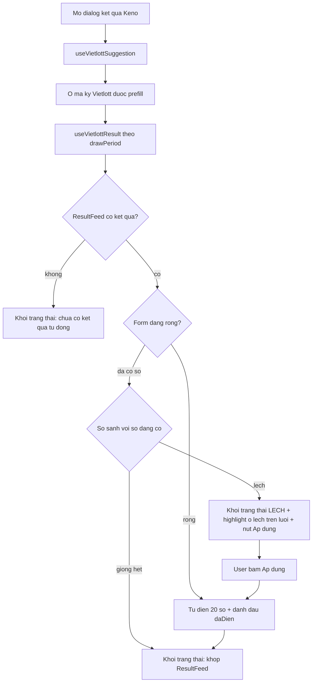
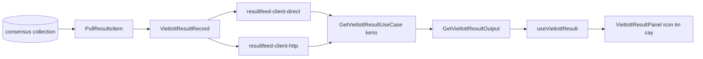

# ResultFeed P09 — Redesign UX "Lấy kết quả Vietlott" (Keno trước, mở rộng 7 game sau)

> Trạng thái: **Giai đoạn 1 (Keno) ĐÃ XONG** — bao gồm §4-§8 (bản gốc) + §7b (vòng 2 tinh
> chỉnh sau review UI thật). Giai đoạn 2 (6 game còn lại, §11-§14) — CHƯA làm.
> Tiền đề: P08 (`08-vietlott-result-autofill.plan.md`) đã implement xong và chạy được.

---

## 1. Vấn đề hiện tại (từ feedback user + 2 ảnh chụp)

Dialog `publish-result-action.tsx` của Keno đã có chức năng tự lấy kết quả từ ResultFeed,
nhưng UX còn 4 lỗ hổng nghiêm trọng:

### V1 — Nút "Lấy lại kết quả" không truyền tải được giá trị "diệu kỳ"

Hiện tại là 1 `<button>` trần với icon `RefreshCw` + chữ "Lấy lại kết quả", nằm lẫn vào
label `Mã kỳ Vietlott`, màu `text-muted-foreground`. Đây là tính năng tiết kiệm nhiều nhất
thời gian vận hành (thay vì gõ tay 20 số) nhưng trông như 1 link phụ trợ.

### V2 — "Đối chiếu kỹ trước khi lưu" nhưng KHÔNG có gì để đối chiếu

Ảnh 1: box emerald ghi *"Đã lấy được kết quả tự động — đối chiếu kỹ trước khi lưu"* kèm
nút "Dùng kết quả này". Nhưng ResultFeed trả về 20 số nào thì user **không thấy được** —
muốn so sánh phải bấm "Dùng kết quả này" (ghi đè mất số đang có) rồi mới biết đã khác gì.
Nút này gần như vô ích, và nguy hiểm: ghi đè không hoàn tác được.

### V3 — Vùng dưới "Tham chiếu Vietlott" xếp 3 khối rời rạc, không phân cấp

Ảnh 2 cho thấy 3 phần tử độc lập stack dọc, mỗi cái 1 style khác nhau:
1. Box amber (cảnh báo lệch mã kỳ) — box đầy đủ, `text-sm`
2. Dòng emerald "Đã điền kết quả tự động từ ResultFeed" — dòng trần, `text-xs`
3. Dòng amber "Luôn đối chiếu mã kỳ..." (`VietlottReminderNote`) — dòng trần, `text-xs`

3 thứ này thuộc 3 nhóm ngữ nghĩa khác nhau (cảnh báo cấu hình / trạng thái autofill /
nhắc nhở tĩnh) nhưng trộn lẫn, không có thứ bậc thị giác. Kể cả khi chỉ hiện 1 trong 3
thì vẫn rối vì style không nhất quán.

### V4 — Mở dialog sửa kết quả đã có, số lệch ResultFeed nhưng im lặng

Logic hiện tại (`publish-result-action.tsx` dòng ~231):

```typescript
// Tự động điền — CHỈ khi form đang rỗng
if (data?.found && data.numbers && numbers.every((n) => n.trim() === "") && !hasAppliedAutoResult) {
```

Đúng ở chỗ không ghi đè số staff đang gõ. **Sai ở chỗ** khi form đã có số (mở lại kỳ đã
publish để sửa) và ResultFeed có số KHÁC — hệ thống không nói gì. Đây chính là trường hợp
cần cảnh báo nhất: 1 trong 2 bên đang sai, và đó là tiền thật.

---

## 2. Nguyên tắc thiết kế

| Nguyên tắc | Diễn giải |
|---|---|
| **N1 — Không bao giờ ghi đè âm thầm** | Mọi thay đổi 20 số phải do user chủ động bấm. Autofill chỉ chạy khi form RỖNG (giữ nguyên hành vi hiện tại). |
| **N2 — So sánh tại chỗ, không mở thêm cửa sổ** | Diff highlight thẳng trên lưới 20 số đang có (quyết định của user: phương án `inline_grid`). Không dialog lồng, không panel gập. |
| **N3 — Icon thay text** | Metadata độ tin cậy (người duyệt / máy chốt) thể hiện bằng icon + tooltip, KHÔNG thêm dòng text vào dialog (quyết định của user). |
| **N4 — 1 khối trạng thái duy nhất** | Gộp 3 khối rời ở V3 thành 1 component có phân cấp rõ, mỗi trạng thái 1 dạng hiển thị nhất quán. |
| **N5 — Keno trước, nhưng code chia sẻ được** | Component mới đặt ở `games/_lib/operations/` (dùng chung 7 game), logic diff generic theo `string[]`. Chỉ `publish-result-action.tsx` của Keno được sửa ở giai đoạn 1. |
| **N6 — Không phá domain boundary D7** | Không có `game-*` nào import `@megawin/resultfeed*`. Metadata mới đi qua interface `VietlottResultClient` bằng type nguyên thuỷ. |

---

## 3. Tổng quan luồng sau redesign



---

## 4. Thay đổi 1 — Nút "Kết quả" mang tính phép thuật

### 4.1 Yêu cầu user

- Icon mang tính "pháp thuật như cây gậy biến hoá"
- Text: `Kết quả` (không phải "Lấy lại kết quả")
- Tooltip: `Lấy kết quả tham khảo từ Vietlott`

### 4.2 Icon đã xác minh có sẵn

Đã kiểm tra `lucide-react@1.24.0` trong `apps/backoffice/node_modules`:

- `WandSparkles` — CÓ (cây gậy phép + tia lấp lánh) ← **chọn cái này**
- `Wand`, `Sparkles`, `Sparkle`, `Zap` — đều có (dự phòng)
- `Wand2` — KHÔNG có ở version này, đừng dùng

### 4.3 File mới: `magic-fetch-result-button.tsx`

Đặt tại `apps/backoffice/src/app/(main)/games/_lib/operations/magic-fetch-result-button.tsx`
để cả 7 game dùng chung (N5).

Đặc tả:

- Dùng `Button variant="ghost" size="sm"` theo tiền lệ `RandomFillButton` ở
  [apps/backoffice/src/components/draws/random-draw-result.tsx](apps/backoffice/src/components/draws/random-draw-result.tsx),
  nhưng thêm màu violet để tách khỏi nút phụ trợ khác — báo hiệu "hành động đặc biệt":
  `text-violet-600 hover:bg-violet-50 hover:text-violet-700 dark:text-violet-400`
- Icon `WandSparkles` size `3.5`. Khi `isFetching` đổi sang `Loader2 animate-spin`
  (KHÔNG spin cây gậy — cây gậy quay trông như lỗi render).
- Bọc `TooltipProvider delayDuration={200}` + `Tooltip`/`TooltipTrigger asChild`/`TooltipContent`
  theo pattern đã dùng ở
  [entry-detail-dialog.tsx](<apps/backoffice/src/app/(main)/games/keno/reports/settle/_lib/sections/entry-detail-dialog.tsx>)
  — `TooltipProvider` KHÔNG mount global trong repo này, mỗi usage tự bọc.
- Props: `onFetch: () => void`, `isFetching: boolean`, `disabled: boolean`.
- Khi `disabled` (chưa có mã kỳ) tooltip đổi thành `Cần nhập mã kỳ Vietlott trước` — không
  để nút mờ vô cớ.

### 4.4 Vị trí đặt nút — CHUYỂN CHỖ

Hiện nút nằm cạnh label `Mã kỳ Vietlott` (dòng ~442 của
[publish-result-action.tsx](<apps/backoffice/src/app/(main)/games/keno/operations/_lib/sections/draw-management/draw-actions/publish-result-action.tsx>)).
Vấn đề: chật, và ngữ nghĩa sai — nút điền vào **lưới 20 số**, không tác động ô mã kỳ.

Chuyển lên header khối "20 số trúng", cạnh `RandomFillButton`:

```tsx
<div className="flex items-center gap-2">
  <div className="flex size-6 ...">
    <Dice5 className="size-3.5 ..." />
  </div>
  <Label className="text-sm font-semibold">20 số trúng (theo thứ tự quay)</Label>
  <div className="ml-auto flex items-center gap-1">
    <MagicFetchResultButton
      onFetch={handleMagicFetch}
      isFetching={vietlottResultQuery.isFetching}
      disabled={!trimmedPeriod}
    />
    <RandomFillButton onFill={fillRandom} />
  </div>
</div>
```

Nút đứng ngay trên vùng nó tác động, `ml-auto` đẩy sang phải nên không chật.

### 4.5 Hành vi `handleMagicFetch`

```typescript
function handleMagicFetch() {
  // Reset cờ đã-áp-dụng để effect autofill (chỉ chạy khi form rỗng) có thể chạy lại,
  // và để khối trạng thái quay về mode "vừa lấy xong".
  setHasAppliedAutoResult(false);
  void vietlottResultQuery.refetch();
}
```

Giữ nguyên logic hiện tại: **KHÔNG** tự ghi đè số sau khi fetch (N1). Form đã có số mà lệch
thì khối trạng thái hiện diff + nút "Áp dụng".

---

## 5. Thay đổi 2 — So sánh trực quan trên lưới 20 số

User chọn phương án `inline_grid`: highlight trực tiếp trên lưới + panel tóm tắt gọn.
Không dialog lồng, không panel gập.

### 5.0 Quy tắc bất biến — auto-fill và so sánh ô rỗng/thiếu (chốt theo feedback user)

Đây là 2 quy tắc **bất biến (invariant)**, áp dụng cho mọi implementer, không được nới lỏng
khi tối ưu code sau này:

**Quy tắc A — Auto-fill CHỈ chạy khi TẤT CẢ 20 ô đang rỗng.**

```typescript
const isFormCompletelyEmpty = numbers.every((n) => n.trim() === "");
```

- `isFormCompletelyEmpty === true` (cả 20 ô rỗng) → auto-fill được phép chạy.
- `isFormCompletelyEmpty === false` — **BAO GỒM CẢ trường hợp form đang ĐIỀN DỞ** (VD 5/20 ô
  đã có số, 15 ô còn rỗng) — auto-fill **KHÔNG được chạy**, dù các ô rỗng còn lại có thể
  điền được. Đây là làm rõ theo yêu cầu user: *"nếu có kết quả nhưng không đủ thì cũng không
  được fill"*. Lý do: không đoán được ý định của staff — có thể họ đang gõ tay và tạm dừng,
  tự động điền phần còn thiếu có thể tạo ra 1 kết quả LAI (nửa tay, nửa nguồn) mà không ai
  chủ động xác nhận toàn bộ.
- Quy tắc này đã đúng ở code hiện tại (`numbers.every((n) => n.trim() === "")` ở dòng ~231
  của `publish-result-action.tsx`) — implementer **KHÔNG được đổi** điều kiện này thành
  `.some()` hay bất kỳ dạng "điền phần thiếu" nào, dù nghe hợp lý (VD "chỉ điền 15 ô rỗng còn
  lại, giữ 5 ô đã có") — điều đó VẪN là ghi đè một phần không được xác nhận rõ ràng, vi phạm
  N1.
- Khi form KHÔNG rỗng hoàn toàn (dù đầy đủ hay dở), luồng đi vào diff (§5.1) → user tự thấy
  lệch ở đâu → tự bấm "Áp dụng" nếu muốn ghi đè toàn bộ 20 ô bằng số nguồn. "Áp dụng" luôn
  ghi đè **toàn bộ**, không có "áp dụng từng ô".

**Quy tắc B — So sánh diff phải coi ô rỗng (chưa nhập) là LỆCH, không phải "chưa biết".**

Form có thể ở trạng thái hỗn hợp: 1 số ô đã có số do staff gõ tay, số ô khác vẫn rỗng
(chưa động tới). Khi so với 20 số đầy đủ từ nguồn, diff phải xử lý đúng theo vị trí:

| Vị trí | `current[i]` | `incoming[i]` | Kết quả |
|---|---|---|---|
| Đã nhập, khớp | `"23"` | `"23"` | Khớp — viền thường |
| Đã nhập, khác | `"23"` | `"27"` | **Lệch** — viền amber, hiện `"27"` dưới ô |
| Chưa nhập (rỗng) | `""` | `"27"` | **Lệch** — viền amber, hiện `"27"` dưới ô (ô rỗng KHÔNG được coi là "match" hay bỏ qua) |

Ví dụ cụ thể (20 ô, chỉ ô 1 và ô 3 đã nhập, còn lại rỗng):

```
current  = ["05", "",   "23", "",   "",   ... ]  // ô 2,4,5,...  vẫn rỗng (staff chưa gõ tới)
incoming = ["05", "15", "23", "27", "32", ... ]  // 20 số đầy đủ từ ResultFeed
diff     =  {}    {1}    {}    {3}   {4}  ...    // ô 2,4,5,... đều tính LỆCH vì current rỗng
```

`diffCount` trong ví dụ trên đếm CẢ những ô còn rỗng — không chỉ những ô đã nhập nhưng sai.
Điều này giúp panel trạng thái báo đúng số lượng "còn thiếu/khác" (§6.3, ví dụ
`"17/20 số khác Vietlott"` khi mới nhập 3 ô đúng) — không đánh lừa user rằng "chỉ 1 ô sai"
trong khi thực ra còn 17 ô chưa nhập.

Helper `diffResultNumbers` (§5.1) hiện thực đúng bảng trên bằng cách chuẩn hoá
`current[i]?.trim() ?? ""` rồi so `!==` trực tiếp — KHÔNG có nhánh đặc biệt bỏ qua chuỗi rỗng.

### 5.1 Helper diff — file mới `result-numbers-diff.ts`

Đặt tại `apps/backoffice/src/app/(main)/games/_lib/operations/result-numbers-diff.ts`.
So theo **vị trí**, cùng cách tiếp cận với `diffIndices` đã có ở
[period-detail-content.tsx](<apps/backoffice/src/app/(main)/resultfeed/_components/period-detail-content.tsx>)
nhưng generic cho 2 mảng và trả thêm summary:

```typescript
/** Kết quả so sánh số đang nhập với số ResultFeed trả về. */
export interface ResultNumbersDiff {
  /** Tập index (0-based) có giá trị khác nhau giữa 2 mảng. */
  diffIndices: Set<number>;
  /** Số ô lệch — dùng hiện "3/20 số khác". */
  diffCount: number;
  /** `true` khi 2 mảng khớp hoàn toàn mọi vị trí. */
  isIdentical: boolean;
  /**
   * `true` khi cùng TẬP số nhưng khác THỨ TỰ — lệch NHẸ: Keno tính giải theo tập số,
   * thứ tự chỉ ảnh hưởng hiển thị.
   */
  sameSetDifferentOrder: boolean;
}

export function diffResultNumbers(current: string[], incoming: string[]): ResultNumbersDiff;
```

Ghi chú kỹ thuật cho implementer:

- Chuẩn hoá 2 bên bằng `padStart(2, "0")` trước khi so — ô input có thể chứa `"5"` chưa pad.
- Ô rỗng ở `current` tính là **lệch** (không bỏ qua) — form nửa vời phải thấy rõ.
- `sameSetDifferentOrder` = `diffCount > 0` VÀ 2 mảng sau `toSorted()` bằng nhau. Dùng
  `toSorted()` không `sort()` (react-best-practices §7.12 — `sort()` mutate mảng props).
- Early length check trước khi so từng phần tử (§7.7).

### 5.2 Highlight trên lưới — sửa phần render input

Lưới hiện tại (dòng ~356) render 20 `Input` trong `grid-cols-5`. Bổ sung 2 thứ cho mỗi ô lệch:

1. **Viền + nền amber** trên `Input` — phân biệt với `border-destructive` đang dùng cho lỗi
   validate (lệch ResultFeed KHÔNG phải lỗi nhập, chỉ khác nguồn tham chiếu):
   `border-amber-400 bg-amber-50/50 dark:bg-amber-900/20`
2. **Số của ResultFeed hiện nhỏ ngay dưới ô đó**: `text-[10px] font-mono tabular-nums
   text-center text-amber-700 dark:text-amber-400`

```tsx
<div key={i} className="flex flex-col gap-1">
  <span className="text-center text-xs font-medium text-muted-foreground">{i + 1}</span>
  <Input ... className={cn(baseClass, fieldError && "border-destructive", isDiff && "border-amber-400 bg-amber-50/50 dark:bg-amber-900/20")} />
  {/* Số ResultFeed cho ô lệch — chiếm chỗ cố định để lưới không giật khi bật/tắt diff */}
  {showDiff && (
    <span className={cn("h-3.5 text-center font-mono text-[10px] tabular-nums", isDiff ? "text-amber-700 dark:text-amber-400" : "text-transparent")}>
      {isDiff ? incomingNumbers[i] : "—"}
    </span>
  )}
</div>
```

**Chi tiết quan trọng:** khi `showDiff` bật, dòng dưới render cho **mọi** ô (ô khớp thì
`text-transparent`). Nếu chỉ render ở ô lệch, các ô cùng hàng lệch chiều cao, lưới răng cưa.

`fieldError` ưu tiên cao hơn `isDiff` về màu viền — validate chặn submit, diff không chặn.

### 5.3 Điều kiện bật diff

```typescript
const incomingNumbers = vietlottResultQuery.data?.found ? vietlottResultQuery.data.numbers : null;
const diff = useMemo(
  () => (incomingNumbers ? diffResultNumbers(numbers, incomingNumbers) : null),
  [numbers, incomingNumbers],
);
// Chỉ highlight khi: có kết quả nguồn + form đã có ít nhất 1 số + thực sự lệch.
// Form rỗng thì autofill tự điền, không có gì để so.
const showDiff = !!diff && !diff.isIdentical && numbers.some((n) => n.trim() !== "");
```

---

## 6. Thay đổi 3 — Kiến trúc lại khối trạng thái

### 6.1 Vấn đề component hiện tại

[vietlott-result-status.tsx](<apps/backoffice/src/app/(main)/games/_lib/operations/vietlott-result-status.tsx>)
có 4 nhánh return với 4 style khác nhau (dòng trần `text-xs` / box amber `text-sm` / dòng
emerald `text-xs` / box emerald `text-sm`). Cộng `VietlottReminderNote` (dòng amber `text-xs`)
và box cảnh báo lệch mã kỳ (box amber `text-sm`) → 3 khối rời rạc như ảnh 2.

### 6.2 Giải pháp — 1 component thống nhất `VietlottResultPanel`

File mới: `apps/backoffice/src/app/(main)/games/_lib/operations/vietlott-result-panel.tsx`.

Giai đoạn 1 chỉ Keno dùng cái mới, 6 game còn lại vẫn dùng `vietlott-result-status.tsx`
→ **2 file cùng tồn tại tạm thời**. Ghi rõ trong JSDoc của file cũ là deprecated, xoá sau
khi cả 7 game đã chuyển (§9).

Dùng **1 khung box duy nhất**, đổi màu + icon + nội dung theo state. Mọi state đều
`rounded-lg border px-3.5 py-2.5` và layout `flex items-start gap-2.5` — nhất quán tuyệt đối.

### 6.3 Bảng đặc tả 6 state

| State | Điều kiện | Màu | Icon | Nội dung | Action |
|---|---|---|---|---|---|
| `hidden` | chưa có `drawPeriod` (`found === undefined`) | — | — | không render | — |
| `loading` | `isLoading` | muted | `Loader2` spin | `Đang tìm kết quả từ Vietlott…` | — |
| `not-found` | `found === false` | amber | `TriangleAlert` | `Chưa có kết quả cho kỳ này — nhập tay bên trên.` | — |
| `filled` | `found` + vừa autofill/áp dụng | emerald | `WandSparkles` | `Đã điền 20 số từ Vietlott.` + icon tin cậy | — |
| `match` | `found` + form có số + `isIdentical` | emerald | `CheckCircle2` | `Số đang nhập khớp Vietlott.` + icon tin cậy | — |
| `conflict` | `found` + form có số + lệch | amber | `GitCompareArrows` | `{n}/20 số khác Vietlott — xem ô viền vàng bên trên` hoặc `Cùng tập số, khác thứ tự quay` nếu `sameSetDifferentOrder` | nút **Áp dụng** |

### 6.4 Nút "Áp dụng"

User yêu cầu: text ngắn `Áp dụng`, đẹp hơn, có màu.

- `Button size="sm"` solid màu amber khớp khối conflict:
  `bg-amber-600 text-white hover:bg-amber-700 dark:bg-amber-600` — không phải `outline`
  nhạt như hiện tại.
- Icon `WandSparkles` size `3.5` bên trái chữ — nối mạch "phép thuật" với nút fetch.
- `shrink-0` để không bị co.
- Chỉ xuất hiện ở state `conflict`. State `filled`/`match` không cần nút.

### 6.5 Icon metadata độ tin cậy (N3)

User chốt **phương án B (minimal)**: chỉ 2 field mới `verifiedByHuman` + `sourceCount`,
thể hiện bằng **icon + tooltip**, không thêm text vào dialog.

1 icon nhỏ cuối dòng nội dung ở state `filled` và `match`:

| Trường hợp | Icon | Tooltip |
|---|---|---|
| `verifiedByHuman === true` | `ShieldCheck` (emerald) | `Đã được người duyệt xác nhận` |
| `false`, `sourceCount >= 2` | `Bot` (blue) | `Máy tự chốt — {n} nguồn khớp nhau` |
| `false`, `sourceCount === 1` | `Bot` (amber) | `Máy tự chốt — chỉ 1 nguồn, chưa có nguồn thứ 2 đối chiếu` |

Icon size `3.5`, bọc `TooltipProvider delayDuration={200}`. Không chữ kèm theo.

### 6.6 Xử lý `VietlottReminderNote` và cảnh báo lệch mã kỳ

- **Cảnh báo lệch mã kỳ** (box amber, dòng ~491) — GIỮ NGUYÊN vị trí và style. Nó thuộc
  ngữ nghĩa "cấu hình mã kỳ sai", khác hoàn toàn "kết quả số lệch nguồn". Không gộp.
- **`VietlottReminderNote`** — CHUYỂN xuống cuối, sau `VietlottResultPanel`, giảm còn
  `text-[11px] text-muted-foreground/80` và **bỏ icon**. Lý do: nhắc nhở tĩnh luôn hiện,
  phải nhẹ nhất về thị giác, không tranh attention với khối trạng thái động. Icon
  `TriangleAlert` amber hiện tại làm nó "nặng" ngang cảnh báo thật.

Thứ tự cuối cùng trong khối "Tham chiếu Vietlott":

```
[Ngày Vietlott]  [Mã kỳ Vietlott]        <- grid 2 cột (nút fetch đã chuyển lên trên)
[Box info: không suy được mã kỳ]          <- conditional, giữ nguyên
[Box amber: lệch mã kỳ gợi ý]             <- conditional, giữ nguyên
[VietlottResultPanel]                     <- MỚI, thay VietlottResultStatus
[Dòng nhắc tĩnh, text-[11px], no icon]    <- nhẹ nhất, luôn hiện
```

---

## 7b. Thay đổi 5 — Vòng 2: tinh chỉnh UI sau khi user review UI thật (ĐÃ áp dụng cho Keno)

Sau khi §4-§7 lên UI thật, user review và yêu cầu 5 tinh chỉnh tiếp — đã implement cho Keno,
**PHẢI port đồng bộ sang 6 game còn lại ở §11**, không chỉ port §4-§7 gốc.

### 7b.1 Vị trí `VietlottResultPanel` — chuyển lên ngay dưới lưới số

§6.6 bản gốc đặt `VietlottResultPanel` ở cuối khối "Tham chiếu Vietlott" (sau 2 box cảnh báo
mã kỳ). User feedback: thông báo lệch SỐ phải nằm gần nơi user nhìn (lưới số), không nằm xa
tận cuối dialog sau cả 2 box không liên quan. **Vị trí mới:** ngay sau `</div>` đóng khối
lưới N số (grid + Chẵn/Lẻ + Lớn/Nhỏ, hoặc tương đương của game khác), TRƯỚC
`pasteNotice`/`validation.messages`:

```
[Header: label + RandomFillButton + MagicFetchResultButton]
[Khối lưới số + thống kê phụ (Chẵn/Lẻ/Lớn/Nhỏ nếu game có)]
[VietlottResultPanel]                     <- CHUYỂN LÊN ĐÂY (không còn ở cuối)
[pasteNotice / validation.messages]
─────────────────────────────────────────
[Tham chiếu Vietlott: Ngày + Mã kỳ]
[Box info: không suy được mã kỳ]
[Box amber: lệch mã kỳ gợi ý]
[VietlottReminderNote]                    <- vẫn ở cuối, không đổi
```

Lý do tách khỏi §6.6 gốc: "lệch SỐ kết quả" (đối tượng: lưới số) và "lệch MÃ KỲ" (đối tượng:
ô input mã kỳ Vietlott) là 2 ngữ nghĩa khác nhau, mỗi khối trạng thái nên nằm ngay cạnh đối
tượng nó mô tả — không gộp chung 1 khu vực dưới cùng như bản gốc.

### 7b.2 Gate "not-found" theo hành động chủ động — thêm state `hasManualFetch`

§6.3 bản gốc: state `not-found` hiện ngay khi `found === false`, bất kể user đã bấm nút
"Kết quả" hay chưa. Vấn đề: query `useVietlottResult` tự fetch ngay lúc mở dialog (để phục
vụ autofill §5.0 Quy tắc A + phát hiện lệch §7 khi `found === true`) — nên nếu kỳ chưa có
kết quả, dialog vừa mở là user đã thấy ngay cảnh báo "Chưa có kết quả cho kỳ này", tạo cảm
giác báo lỗi giả trước khi họ làm gì.

**State mới:** `hasManualFetch: boolean`, khởi tạo `false`, reset `false` khi dialog đóng
(cùng effect reset chung với `hasAppliedAutoResult`), set `true` trong `handleMagicFetch`.

```typescript
const [hasManualFetch, setHasManualFetch] = useState(false);

function handleMagicFetch() {
  setHasAppliedAutoResult(false);
  setHasManualFetch(true);
  void vietlottResultQuery.refetch();
}

// found chỉ được "lộ" ra panel khi: user đã chủ động bấm nút, HOẶC found === true (autofill/
// phát hiện lệch tự động lúc mở dialog §7 vẫn phải hiện ngay, không chờ user bấm gì).
const displayFound =
  hasManualFetch || vietlottResultQuery.data?.found === true ? vietlottResultQuery.data?.found : undefined;
```

`VietlottResultPanel` nhận `found={displayFound}` (không phải `vietlottResultQuery.data?.found`
trực tiếp). `isLoading` truyền vào panel cũng gate theo `hasManualFetch` — tránh spinner
"Đang tìm kết quả…" xuất hiện ngay lúc mở dialog khi user chưa yêu cầu gì:
`isLoading={hasManualFetch && vietlottResultQuery.isLoading}`.

**Không đổi** hành vi autofill (§5.0 Quy tắc A) và phát hiện lệch tự động (§7) — cả 2 vẫn
chạy ngầm dựa trên `vietlottResultQuery.data` thật, chỉ riêng UI hiển thị state `not-found`
là bị gate lại.

### 7b.3 Nút "Kết quả" — bỏ viền, đồng bộ style với "Ngẫu nhiên"

§4.3 bản gốc dùng `variant="outline"` kèm `border-violet-300`. User feedback: nút nên
"giống Ngẫu nhiên" (nút cạnh nó, `variant="ghost"`, không viền) — chỉ phân biệt bằng màu.

**Đổi:** `variant="outline"` → `variant="ghost"`, bỏ hết class `border-*`, giữ màu chữ/icon
violet:

```tsx
<Button
  type="button"
  size="sm"
  variant="ghost"
  onClick={onFetch}
  disabled={disabled || isFetching}
  className="gap-1.5 text-violet-700 hover:bg-violet-50 hover:text-violet-800 dark:text-violet-400 dark:hover:bg-violet-950/40"
>
```

Layout header cũng đổi: 2 nút gộp vào 1 `<div className="ml-auto flex items-center gap-1">`
(trước đó `RandomFillButton` đứng riêng, `MagicFetchResultButton` có `ml-auto` riêng) — để
cả 2 cùng đẩy sát phải, cạnh nhau, cùng 1 style họ hàng.

### 7b.4 Icon "Ngẫu nhiên" — đổi `Shuffle` → `Dices`

[random-draw-result.tsx](apps/backoffice/src/components/draws/random-draw-result.tsx):
đổi import và JSX từ `Shuffle` sang `Dices` (`lucide-react`). Component này dùng chung mọi
game nên tự động lan sang cả 7 game, không cần sửa gì thêm ở từng game.

### 7b.5 Redesign ô số lệch trên lưới — badge thứ tự quay vs chip Vietlott (thay §5.2 gốc)

**Vấn đề với §5.2 bản gốc:** cả 2 loại số nhỏ quanh ô input đều là dòng text đơn thuần, chỉ
khác vị trí trên/dưới (`<span className="text-xs ...">{i+1}</span>` phía trên, số ResultFeed
`text-[10px]` phía dưới) — dễ nhìn lẫn, đặc biệt khi cả 2 đều là số 1-2 chữ số ở gần ô input.

**Thiết kế mới — tách bạch HÌNH DẠNG, không chỉ vị trí:**

| Loại số | Hình dạng | Vị trí | Style |
|---|---|---|---|
| Thứ tự quay/vị trí (1-N) | Badge **tròn** nhỏ (`size-4`, `rounded-full`) | Đè lên góc trên-trái ô input (`absolute -top-1.5 -left-1.5`) | `bg-muted text-muted-foreground ring-2 ring-background` — trung tính, luôn hiện bất kể có diff hay không |
| Số/chip nguồn Vietlott (ô lệch) | Chip **bầu dục** (pill, `rounded-full`, `h-4.5`) | Nằm hẳn dưới ô, tách khỏi input (không đè) | `bg-amber-100 text-amber-800 dark:bg-amber-900/50 dark:text-amber-300` — chỉ hiện ở ô lệch, ô khớp dùng `invisible` (giữ chỗ, không giật layout) |

```tsx
<div className="rounded-lg border bg-muted/30 p-3" onPaste={handleGridPaste}>
  {/* Legend — CHỈ hiện khi showDiff, dùng lại đúng hình dạng thật (KHÔNG kèm số mẫu — số mẫu
      như "05" dễ bị đọc nhầm thành số lượng "5 số khác" thay vì minh hoạ hình dạng). */}
  {showDiff && (
    <div className="mb-2.5 flex items-center gap-3 text-[11px] text-muted-foreground">
      <span className="inline-flex items-center gap-1.5">
        <span className="size-4 rounded-full bg-muted ring-1 ring-border" />
        Thứ tự quay
      </span>
      <span className="inline-flex items-center gap-1.5">
        <span className="h-4 w-6 rounded-full bg-amber-100 dark:bg-amber-900/50" />
        Gợi ý Vietlott (ô lệch)
      </span>
    </div>
  )}

  <div className="grid grid-cols-5 gap-x-2 gap-y-3">
    {Array.from({ length: N }, (_, i) => {
      const isDiff = showDiff && diff?.diffIndices.has(i);
      return (
        <div key={i} className="flex flex-col items-center gap-1">
          <div className="relative w-full">
            <span className="absolute -top-1.5 -left-1.5 z-10 flex size-4 items-center justify-center rounded-full bg-muted text-[9px] font-semibold text-muted-foreground ring-2 ring-background">
              {i + 1}
            </span>
            <Input
              ...
              className={cn(
                "w-full text-center font-mono text-sm font-semibold tabular-nums",
                validation.fieldErrors.has(i) && "border-destructive",
                !validation.fieldErrors.has(i) && isDiff && "border-amber-400 bg-amber-50/50 dark:bg-amber-900/20",
              )}
            />
          </div>
          {showDiff && (
            <span
              className={cn(
                "inline-flex h-4.5 items-center rounded-full px-1.5 font-mono text-[10px] font-semibold tabular-nums",
                isDiff ? "bg-amber-100 text-amber-800 dark:bg-amber-900/50 dark:text-amber-300" : "invisible",
              )}
            >
              {incomingNumbers?.[i] ?? "00"}
            </span>
          )}
        </div>
      );
    })}
  </div>
</div>
```

**Chi tiết quan trọng khi port sang game khác:**

- `gap-y-3` (không phải `gap-2` như bản gốc §5.2) — chip pill bên dưới cần thêm khoảng trống
  theo chiều dọc so với dòng text mảnh trước đây.
- Badge thứ tự **LUÔN hiện** (không phụ thuộc `showDiff`) — khác chip Vietlott (chỉ hiện khi
  `showDiff`). Đây là khác biệt có chủ đích: số thứ tự là thông tin tĩnh của ô, số Vietlott
  là thông tin diff tạm thời.
- Legend chỉ hiện khi `showDiff === true` — tránh chiếm chỗ vô ích lúc form chưa có gì để so.
- Với game nhiều nhóm giải (lotto535, power655, max3d, max3dpro — xem bảng cắt lát §11.3),
  mỗi nhóm giải render `grid` riêng nhưng dùng CHUNG 1 legend duy nhất đặt trên khối lưới đầu
  tiên (không lặp legend cho mỗi nhóm) — chỉ cần bật khi BẤT KỲ nhóm nào có `showDiff`.
- Số thứ tự badge với game nhiều nhóm: đánh số theo cách hiện tại của từng game (VD max3d
  "Đặc biệt" đánh 1-2, "Nhất" đánh 1-4...) — giữ nguyên NỘI DUNG số đang đánh, chỉ đổi HÌNH
  DẠNG hiển thị (badge tròn đè góc) thay vì dòng text phía trên.

---

## 7. Thay đổi 4 — Cảnh báo lệch khi mở dialog lần đầu (V4)

### 7.1 Yêu cầu user

> "Lần đầu load về mà đã có kết quả user đã nhập rồi mà thấy khác kết quả cũng nên thông báo
> có kết quả gợi ý như lúc bấm nút lấy kết quả và cho user so sánh chi tiết để biết sự khác
> nhau như nào."

### 7.2 Điểm mấu chốt: KHÔNG cần code mới

Cơ chế ở §5.3 **đã tự xử lý trường hợp này** nếu 2 điều kiện dưới đúng:

1. `useVietlottResult` chạy ngay khi dialog mở và đã có `drawPeriod` — ĐÚNG hiện tại
   (`enabled: !!drawId && !!drawPeriod && enabled`). Với kỳ đã publish, `currentResult.vietlottRef
   .drawPeriod` được prefill đồng bộ lúc mở dialog nên query chạy ngay.
2. `showDiff` không phụ thuộc vào việc user có bấm nút hay không — chỉ phụ thuộc
   `numbers` (số đang có) vs `incomingNumbers`. ĐÚNG theo thiết kế §5.3.

Nên: mở dialog kỳ đã publish, ResultFeed có số khác → lưới tự highlight amber + khối
trạng thái vào state `conflict` + nút "Áp dụng" — **không cần bấm gì**.

### 7.3 Việc PHẢI kiểm tra khi implement

Effect autofill hiện tại có bug tiềm ẩn về thứ tự: nó phụ thuộc `numbers` trong deps
(dòng ~238), nghĩa là mỗi lần user gõ 1 ký tự thì effect chạy lại. Với `hasAppliedAutoResult`
làm cờ chặn thì OK, nhưng cần verify lại tình huống:

- Mở dialog kỳ ĐÃ publish (form có 20 số) → effect KHÔNG được tự điền (vì
  `numbers.every(n => n.trim() === "")` false) → đúng.
- Mở dialog kỳ CHƯA publish (form rỗng) → effect tự điền → `hasAppliedAutoResult = true`
  → state `filled` → không hiện diff (vì vừa điền nên `isIdentical`) → đúng.
- User bấm "Áp dụng" ở state `conflict` → set `numbers` = incoming + `hasAppliedAutoResult
  = true` → chuyển sang `filled` → đúng.

### 7.4 Đổi tên `applyAutoResult` → `applyIncomingNumbers`

Hàm hiện tại (dòng ~219) đặt tên `applyAutoResult` nhưng giờ nó dùng cho cả nút "Áp dụng"
ở state conflict, không chỉ "auto". Đổi tên cho khớp ngữ nghĩa mới. Nội dung giữ nguyên:

```typescript
function applyIncomingNumbers() {
  const data = vietlottResultQuery.data;
  if (!data?.found || !data.numbers) {
    return;
  }
  setNumbers(data.numbers.map((n) => n.padStart(2, "0")).slice(0, KENO_DRAW_COUNT));
  setValidation(VALID);
  setHasAppliedAutoResult(true);
}
```

---

## 8. Backend — nới 2 field metadata qua 4 tầng

User chốt phương án B: chỉ thêm `verifiedByHuman: boolean` + `sourceCount: number`.
Data đã có sẵn trong collection `consensus` — đây thuần là mở rộng projection, **không đổi
schema DB, không sửa worker**.

### 8.1 Nguồn dữ liệu

[packages/resultfeed/src/entities/consensus.ts](packages/resultfeed/src/entities/consensus.ts)
đã lưu đủ:

- `state: ConsensusState` — có giá trị `human_verified`
- `humanVerify: ConsensusHumanVerify | null` — chỉ ghi bởi use-case của người, máy KHÔNG chạm
- `agreeing: ConsensusAgreement[]` — danh sách nguồn đồng ý

Suy 2 field mới:

```typescript
verifiedByHuman: doc.state === ConsensusState.HumanVerified  // hoặc doc.humanVerify !== null
sourceCount: doc.agreeing.length
```

Dùng `state === HumanVerified` (không dùng `humanVerify !== null`) vì `state` là field
quyết định, `humanVerify` là metadata kèm theo — nhất quán với `decidedBy`.

### 8.2 Tầng 1 — `PullResultsItem`

[packages/resultfeed-application/src/use-cases/results/pull-results.ts](packages/resultfeed-application/src/use-cases/results/pull-results.ts)

Thêm 2 field vào interface + 2 dòng vào `toItem()`. Cả `runSingle` và `runBatch` dùng chung
`toItem` nên tự động có.

```typescript
export interface PullResultsItem {
  gameKey: ResultFeedGameKey;
  drawPeriod: string;
  drawDateSource: string;
  numbers: string[];
  payoutHash: string;
  publishedAt: string;
  /** `true` ⇔ `state = human_verified` — người đã duyệt, không phải máy tự chốt. */
  verifiedByHuman: boolean;
  /** Số nguồn ĐỒNG Ý với kết quả này (`agreeing.length`). 1 = chỉ 1 nguồn, chưa đối chiếu. */
  sourceCount: number;
}
```

### 8.3 Tầng 2 — `VietlottResultRecord` (boundary D7)

[packages/game-core/src/types/vietlott-result-client.ts](packages/game-core/src/types/vietlott-result-client.ts)

Thêm 2 field. **PHẢI** dùng type nguyên thuỷ (`boolean`/`number`) — KHÔNG import
`ConsensusState` từ `@megawin/resultfeed*`, đó là lý do chọn phương án B thay vì đưa cả
`state` enum vào (giữ D7).

### 8.4 Tầng 3 — 2 implementation client

- [apps/backoffice/src/lib/resultfeed-client-direct.ts](apps/backoffice/src/lib/resultfeed-client-direct.ts)
  — thêm 2 field vào object return.
- [apps/backoffice/src/lib/resultfeed-client-http.ts](apps/backoffice/src/lib/resultfeed-client-http.ts)
  — thêm 2 field vào `ResultFeedApiItem` **và** object return. Lưu ý interface local này
  hiện đã khai `payoutHash` nhưng không map — không cần sửa chỗ đó.

### 8.5 Tầng 4 — DTO + use-case Keno

- [packages/game-keno-application/src/use-cases/draws/dto/draw.dto.ts](packages/game-keno-application/src/use-cases/draws/dto/draw.dto.ts)
  `GetVietlottResultOutput`: thêm `verifiedByHuman: boolean | null` và `sourceCount: number | null`
  (nullable vì `found = false` thì không có giá trị — nhất quán với `numbers`/`publishedAt`
  đang là nullable).
- [packages/game-keno-application/src/use-cases/draws/get-vietlott-result.ts](packages/game-keno-application/src/use-cases/draws/get-vietlott-result.ts)
  thêm 2 dòng map `record?.verifiedByHuman ?? null`.

**Giai đoạn 1 CHỈ sửa Keno.** 6 game còn lại giữ DTO cũ — không lỗi compile vì tầng 1-3 chỉ
THÊM field (mở rộng tương thích ngược), 6 use-case kia đơn giản không đọc field mới.

### 8.6 Sơ đồ luồng metadata



### 8.7 Test cần cập nhật

- [apps/api-resultfeed/test/handlers/results/get-results.test.ts](apps/api-resultfeed/test/handlers/results/get-results.test.ts)
  — mock `PullResultsUseCase` đang trả object thiếu 2 field mới. Bổ sung để assertion khớp.
- Nếu `resultfeed-application` có test cho `PullResultsUseCase`, thêm case verify
  `verifiedByHuman`/`sourceCount` suy đúng từ `state`/`agreeing`.

---

## 9. Danh sách file thay đổi (giai đoạn 1 — Keno)

### File mới (4)

| File | Nội dung |
|---|---|
| `apps/backoffice/src/app/(main)/games/_lib/operations/magic-fetch-result-button.tsx` | Nút `WandSparkles` + tooltip (§4.3) |
| `apps/backoffice/src/app/(main)/games/_lib/operations/result-numbers-diff.ts` | `diffResultNumbers()` + type `ResultNumbersDiff` (§5.1) |
| `apps/backoffice/src/app/(main)/games/_lib/operations/vietlott-result-panel.tsx` | Khối trạng thái 6 state + icon tin cậy (§6) |
| `apps/backoffice/src/app/(main)/games/_lib/operations/vietlott-trust-badge.tsx` | Icon `ShieldCheck`/`Bot` + tooltip (§6.5) — tách riêng để `vietlott-result-panel` gọn |

### File sửa — Frontend (3)

| File | Thay đổi |
|---|---|
| `.../games/keno/operations/_lib/.../publish-result-action.tsx` | Chuyển nút lên header lưới, thêm diff highlight (badge/chip §7b.5), thay `VietlottResultStatus` → `VietlottResultPanel` (vị trí mới §7b.1), thêm `hasManualFetch` (§7b.2), đổi tên `applyAutoResult`, bỏ import `RefreshCw` |
| `.../games/_lib/operations/vietlott-reminder-note.tsx` | Bỏ icon, giảm còn `text-[11px] text-muted-foreground/80`, bỏ `mt-3` cứng (để caller tự spacing vì thứ tự đã đổi) |
| `.../games/_lib/operations/vietlott-result-status.tsx` | Thêm JSDoc `@deprecated` trỏ sang `vietlott-result-panel.tsx`. KHÔNG xoá (6 game còn dùng) |
| `apps/backoffice/src/components/draws/random-draw-result.tsx` | Đổi icon `Shuffle` → `Dices` (§7b.4) — DÙNG CHUNG 7 game, tự lan không cần sửa thêm |

### File sửa — Backend (5)

| File | Thay đổi |
|---|---|
| `packages/resultfeed-application/src/use-cases/results/pull-results.ts` | +2 field `PullResultsItem` + `toItem()` |
| `packages/game-core/src/types/vietlott-result-client.ts` | +2 field `VietlottResultRecord` |
| `apps/backoffice/src/lib/resultfeed-client-direct.ts` | +2 field mapping |
| `apps/backoffice/src/lib/resultfeed-client-http.ts` | +2 field `ResultFeedApiItem` + mapping |
| `packages/game-keno-application/src/use-cases/draws/dto/draw.dto.ts` + `get-vietlott-result.ts` | +2 field DTO + mapping (CHỈ Keno) |

### File sửa — Test (1)

`apps/api-resultfeed/test/handlers/results/get-results.test.ts` — bổ sung 2 field vào mock.

---

## 10. Thứ tự thực hiện

1. **Backend trước** (§8.2 → §8.5) — 5 file, thuần thêm field. Chạy `check-types` cho
   `resultfeed-application`, `game-core`, `game-keno-application`, `backoffice`,
   `api-resultfeed`. Sửa test mock.
2. **Helper diff** (§5.1) — thuần logic, không UI. Dễ verify bằng mắt.
3. **3 component mới** (§4.3, §6, §6.5) — dựng UI, chưa nối vào dialog.
4. **Nối vào `publish-result-action.tsx` của Keno** (§4.4, §5.2, §6.6, §7.4).
5. **Sửa `vietlott-reminder-note.tsx`** — cẩn thận: file này 7 game đang dùng, bỏ `mt-3`
   sẽ ảnh hưởng 6 game kia. Giải pháp: giữ `mt-3` mặc định, thêm prop `className` optional
   để Keno override thành `mt-2`. KHÔNG breaking 6 game.
6. **`check-types` + `biome check`** trên toàn bộ file đã sửa.
7. **User review UI thật** trên Keno → duyệt xong mới sang §11.

---

## 11. Mở rộng 6 game còn lại (giai đoạn 2 — CHƯA làm)

Sau khi user duyệt UI Keno. Với mỗi game trong
`lotto535`, `mega645`, `power655`, `max3d`, `max3dpro`, `bingo18`:

**Phạm vi port = §4-§8 (bản gốc) + §7b (vòng 2 tinh chỉnh) — GỘP LẠI THÀNH 1 STYLE DUY NHẤT.**
Không port §4-§8 rồi để UI giống bản Keno "trước review" — Keno hiện tại (đã qua §7b) LÀ bản
tham chiếu chuẩn duy nhất. Cụ thể phải mang theo:

- Vị trí `VietlottResultPanel` ngay dưới lưới số, không phải cuối dialog (§7b.1).
- `hasManualFetch` gate state `not-found`/`loading` (§7b.2) — không phải fetch tự động lộ
  hết mọi state ra UI ngay lúc mở dialog.
- Nút "Kết quả" `variant="ghost"` không viền, gộp `ml-auto` chung với `RandomFillButton`
  (§7b.3).
- Badge thứ tự tròn đè góc + chip Vietlott bầu dục (§7b.5) — **không** dùng lại kiểu 2 dòng
  text đơn thuần của §5.2 bản gốc (đã bị thay thế hoàn toàn ở Keno).
- Legend không kèm số mẫu (§7b.5) — mỗi game render legend riêng nếu game đó có nhiều khối
  lưới (nhóm giải), theo đúng nguyên tắc "1 legend dùng chung, bật theo `showDiff` tổng" ở
  §7b.5.

### 11.0 Quy tắc A/B (§5.0) là bất biến GAME-AGNOSTIC — PHẢI port nguyên vẹn, không "chỉnh lại cho phù hợp"

User nhấn mạnh: 2 quy tắc bất biến ở §5.0 (auto-fill chỉ chạy khi form rỗng hoàn toàn; ô rỗng
tính là lệch khi diff) **không phải quy tắc riêng của Keno** — đây là hợp đồng chung cho toàn
bộ tính năng "Vietlott Result Autofill" ở mọi game. Khi mở rộng sang 6 game còn lại, đây là
điểm PHẢI port **1:1, y nguyên logic**, không diễn giải lại hay "tối ưu thêm" theo đặc thù
từng game:

- **Quy tắc A** (`numbers.every((n) => n.trim() === "")` mới cho auto-fill chạy) áp dụng cho
  mảng `numbers` state của TỪNG game, bất kể độ dài mảng đó là bao nhiêu (6, 7, 20...) hay
  có chia nhóm giải (max3d/max3dpro/lotto535/power655). Điều kiện luôn là: **toàn bộ các ô
  input số của form đang rỗng** thì mới cho autofill; chỉ 1 ô có số (ở bất kỳ nhóm giải nào)
  là chặn autofill toàn bộ form đó. Không có ngoại lệ "game này có nhiều nhóm nên cho phép
  autofill riêng từng nhóm" — autofill vẫn là hành động toàn-form (ghi cả mảng `numbers` 1
  lần), y như Keno.
- **Quy tắc B** (ô rỗng ở `current` luôn tính là lệch khi diff, không có nhánh bỏ qua) áp
  dụng cho **từng lần gọi `diffResultNumbers`**, dù game gọi helper 1 lần (bingo18, mega645,
  keno) hay nhiều lần theo nhóm giải (lotto535: 2 lần — 5 số chính + 1 số đặc biệt; power655:
  2 lần — 6 số chính + 1 bonus; max3d/max3dpro: 4 lần — 4 hạng giải). Mỗi lần gọi, helper vẫn
  coi ô rỗng trong slice đó là lệch — không truyền "toàn bộ mảng phẳng" và cũng không tự chế
  logic bỏ qua rỗng riêng cho game có nhiều nhóm.
- Vì `diffResultNumbers` (§5.1) đã được thiết kế **generic, không biết gì về `gameKey`** và
  không có tham số đặc biệt nào cho "bỏ qua rỗng" — bản chất kỹ thuật của Quy tắc A/B đã tự
  động đúng khi port sang game khác, miễn là **implementer KHÔNG thêm tham số/flag mới** vào
  helper hay đổi điều kiện autofill khi làm 6 game còn lại. Checklist review khi port mỗi
  game: xác nhận điều kiện autofill trong `publish-result-action.tsx` của game đó vẫn dùng
  đúng `.every(...)` (không phải `.some(...)` hay biến thể "điền phần thiếu"), và mọi lệnh
  gọi `diffResultNumbers` không truyền thêm option nào khác Keno.

1. Thêm 2 field vào `GetVietlottResultOutput` + mapping trong `get-vietlott-result.ts`.
2. Trong `publish-result-action.tsx`: chuyển nút (§7b.3), thay `VietlottResultStatus` →
   `VietlottResultPanel` đặt NGAY DƯỚI lưới số (§7b.1), thêm `hasManualFetch` (§7b.2), thêm
   diff highlight kiểu badge/chip (§7b.5) — GIỮ NGUYÊN Quy tắc A/B như §11.0.
3. **Mỗi game cắt lát `numbers` khác nhau** — bảng nguồn chân lý ở
   [consensus.ts](packages/resultfeed/src/entities/consensus.ts) dòng ~52. Diff phải so
   **đúng slice** của game đó, không so cả mảng phẳng:

| gameKey | Số phần tử | Cắt lát cho diff |
|---|---|---|
| `keno` | 20 | dùng nguyên |
| `bingo18` | 3 | dùng nguyên, giữ thứ tự (3 xúc xắc có thể trùng giá trị) |
| `lotto535` | 6 | `slice(0,5)` = 5 số chính, `[5]` = số đặc biệt |
| `mega645` | 6 | dùng nguyên |
| `power655` | 7 | `slice(0,6)` = 6 số chính, `[6]` = bonus |
| `max3d`/`max3dpro` | 20 | 4 hạng giải: `slice(0,2)` Đặc biệt, `slice(2,6)` Nhất, `slice(6,12)` Nhì, `slice(12,20)` Ba |

Hệ quả: `diffResultNumbers` nhận 2 mảng **đã cắt sẵn** do caller truyền vào — helper
không biết gì về `gameKey` (giữ generic). Game nhiều nhóm số (lotto535, power655, max3d)
gọi helper nhiều lần, mỗi nhóm 1 lần.

5. Áp dụng redesign badge/chip (§7b.5) cho MỌI khối lưới của game đó — kể cả game nhiều
   nhóm giải (mỗi nhóm 1 khối `grid` riêng, mỗi ô trong khối đều có badge thứ tự đè góc +
   chip Vietlott dưới ô khi lệch). Legend (§7b.5) chỉ đặt 1 lần trên khối lưới ĐẦU TIÊN của
   dialog, bật khi bất kỳ nhóm nào có `showDiff`.
6. Đổi icon `RandomFillButton` đã tự áp dụng qua §7b.4 (component chung) — không cần sửa gì
   riêng ở bước này, chỉ cần verify UI hiện đúng icon `Dices` khi review.
7. Sau khi cả 7 game xong: **xoá** `vietlott-result-status.tsx`.

---

## 12. Rủi ro và cách chặn

| Rủi ro | Chặn bằng |
|---|---|
| Ghi đè mất số staff đang gõ | Giữ nguyên điều kiện autofill `numbers.every(n => n.trim() === "")`. Nút "Áp dụng" là hành động chủ động duy nhất ghi đè. |
| Lưới giật/răng cưa khi bật diff | Render dòng số phụ cho MỌI ô khi `showDiff` (ô khớp dùng `invisible`, §7b.5). |
| Nhầm màu lỗi validate với lệch nguồn | Validate = `border-destructive` (đỏ, chặn submit). Lệch nguồn = `border-amber-400` (vàng, không chặn). Validate ưu tiên khi trùng ô. |
| Sửa `vietlott-reminder-note.tsx` phá 6 game | Giữ `mt-3` default, thêm prop `className` optional (§10 bước 5). |
| Diff so sai slice ở game nhiều nhóm số | Helper generic, caller tự cắt (§11.3). Ghi rõ trong JSDoc của helper. |
| `sourceCount = 1` nhưng user tưởng đã đối chiếu 2 nguồn | Icon `Bot` màu amber (không phải blue) + tooltip nói rõ "chỉ 1 nguồn" (§6.5). |
| `payoutHash` đã có trên wire nhưng bị drop | Không thuộc scope này. Giữ nguyên — không cần cho UI hiện tại. |
| Khi port sang 6 game còn lại, ai đó "tối ưu lại" Quy tắc A/B cho hợp đặc thù game (VD cho autofill từng nhóm giải riêng, hoặc bỏ qua ô rỗng khi diff nhóm bonus) | Quy tắc A/B là bất biến chung, không phải quyết định riêng của Keno — ghi rõ ở §11.0, review PR của 6 game còn lại phải đối chiếu đúng §11.0 trước khi merge. |
| Port 6 game còn lại chỉ theo §4-§8 gốc, bỏ sót 5 tinh chỉnh vòng 2 (§7b) → 7 game lệch style, phải sửa lại lần 2 | §11 mở đầu bằng yêu cầu rõ "port §4-§8 + §7b gộp lại", liệt kê từng điểm khác biệt với bản gốc phải mang theo. |
| Lưới nhiều nhóm giải (lotto535/power655/max3d/max3dpro) lặp legend cho mỗi nhóm → rối mắt hơn cả trước khi có legend | §7b.5 + §11 bước 5 chốt rõ: chỉ 1 legend cho toàn dialog, đặt ở khối lưới đầu tiên, bật theo `showDiff` tổng (OR của mọi nhóm), không lặp theo từng khối. |

---

## 13. Định nghĩa "xong" cho giai đoạn 1

- [ ] Nút `WandSparkles` + text `Kết quả` + tooltip `Lấy kết quả tham khảo từ Vietlott`,
      đặt ở header lưới 20 số, `variant="ghost"` không viền (§7b.3), màu chữ/icon violet,
      disabled khi chưa có mã kỳ.
- [ ] Mở dialog kỳ đã publish có số lệch ResultFeed → lưới tự highlight amber các ô lệch,
      hiện chip số nguồn dưới ô (§7b.5), KHÔNG cần bấm gì.
- [ ] `VietlottResultPanel` đặt NGAY DƯỚI khối lưới số (§7b.1), không phải cuối dialog.
- [ ] State `not-found`/`loading` của panel chỉ hiện SAU KHI user bấm nút "Kết quả"
      (`hasManualFetch`, §7b.2) — không hiện ngay lúc mở dialog nếu chưa có kết quả.
- [ ] Khối trạng thái 1 khung duy nhất, 6 state đúng bảng §6.3, nút `Áp dụng` solid amber
      chỉ hiện ở state conflict.
- [ ] Icon tin cậy (`ShieldCheck`/`Bot`) + tooltip hiện ở state `filled`/`match`, không có
      text kèm.
- [ ] Ô số lệch dùng badge tròn (thứ tự quay) đè góc trên-trái + chip bầu dục vàng (số
      Vietlott) nằm dưới ô, KHÔNG dùng 2 dòng text đơn thuần (§7b.5). Legend không kèm số
      mẫu, chỉ hiện khi `showDiff`.
- [ ] Icon `RandomFillButton` ("Ngẫu nhiên") đã đổi từ `Shuffle` sang `Dices` (§7b.4).
- [ ] Dòng nhắc tĩnh xuống cuối, `text-[11px]`, không icon.
- [ ] `check-types` pass: `resultfeed-application`, `game-core`, `game-keno-application`,
      `backoffice`, `api-resultfeed`.
- [ ] `biome check` 0 error trên mọi file đã sửa/tạo.
- [ ] Test `api-resultfeed` pass sau khi cập nhật mock.
- [ ] 6 game còn lại KHÔNG bị ảnh hưởng (build pass, UI cũ giữ nguyên) — TRỪ icon
      `RandomFillButton` (`Dices`, component chung, tự lan sang cả 7 game — có chủ đích).
- [ ] Quy tắc A/B (§5.0) đã ghi rõ trong JSDoc của điều kiện autofill và của
      `diffResultNumbers` để người port sang 6 game còn lại (§11.0) không thể bỏ sót hay
      diễn giải lại.

## 14. Định nghĩa "xong" cho giai đoạn 2 (6 game còn lại)

- [ ] Cả 6 game (`lotto535`, `mega645`, `power655`, `max3d`, `max3dpro`, `bingo18`) áp
      dụng ĐẦY ĐỦ style §4-§8 + §7b — không chỉ bản gốc trước review.
- [ ] Vị trí `VietlottResultPanel`, gate `hasManualFetch`, style nút "Kết quả"/"Ngẫu nhiên",
      badge/chip lệch số — giống Keno 100% (chỉ khác số lượng ô/số nhóm giải).
- [ ] Game nhiều nhóm giải chỉ có 1 legend chung cho toàn dialog, không lặp theo từng nhóm.
- [ ] Quy tắc A/B (§11.0) áp dụng đúng, đã review theo checklist ở §11.0.
- [ ] `vietlott-result-status.tsx` đã xoá sau khi cả 7 game chuyển xong.
- [ ] `check-types` + `biome check` pass cho toàn bộ 6 package `game-*-application` liên quan
      + `backoffice`.
