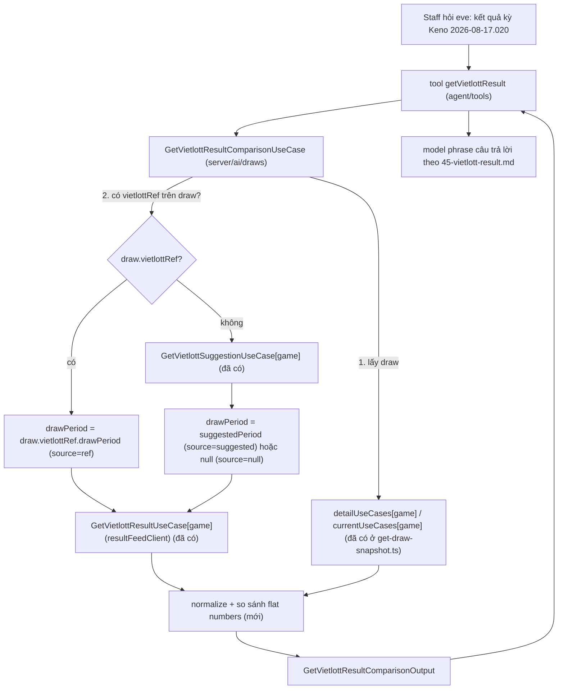

# eve tool `getVietlottResult` — đối chiếu kết quả draw ↔ ResultFeed theo mã kỳ Vietlott

Tích hợp cho `apps/backoffice` (eve agent). Mục tiêu: cho phép staff hỏi eve về kết quả một kỳ quay
bất kỳ (kể cả kỳ đang xem trên trang vận hành) và luôn nhận **đủ 2 nguồn dữ liệu** — kết quả đã
publish trên `DrawEntity` (nếu có) và kết quả ResultFeed tra theo mã kỳ Vietlott (nếu có) — kèm so
sánh khi cả hai cùng tồn tại.

Toàn bộ phần backend đọc kết quả (per-game `GetVietlottSuggestionUseCase`/`GetVietlottResultUseCase`,
interface `VietlottResultClient`, `resultFeedClient` singleton) **đã có sẵn** — xem
`08-vietlott-result-autofill.plan.md`. Việc còn lại là ghép 7 game này lại thành 1 use-case dispatcher
tầng AI (giống `get-draw-snapshot.ts`), 1 tool eve, evals tool-choice, và hướng dẫn phrasing.

## 0. Yêu cầu gốc (từ user, giữ nguyên để đối chiếu khi implement)

1. Nếu đang ở trang vận hành (đã có `clientContext.page.operations.drawId`) → cho hỏi thẳng "kết quả
   kỳ này" mà không cần nhắc `drawId`.
2. Dùng Vietlott suggestion (đã có `suggestVietlottPeriod`) để suy mã kỳ Vietlott, rồi tra ResultFeed
   bằng mã đó.
3. Chưa có kết quả ở ResultFeed → báo đúng câu: `Hiện chưa có kết quả của kỳ "{MegaWin drawId
   YYYY-MM-DD.NNN}" - Kỳ Vietlott "{mã kỳ Vietlott}"`.
4. Draw đã có kết quả (publish rồi) → trả kết quả của draw đó.
5. Draw khác ResultFeed → cung cấp CẢ HAI kết quả, nêu khác biệt ngắn gọn (kể cả trường hợp một bên
   thiếu số, một bên đủ số).
6. Mỗi lần hỏi kết quả → luôn cung cấp đủ dữ liệu đang có ở draw VÀ ở ResultFeed (không chỉ trả 1
   nguồn rồi im lặng về nguồn kia).

## 1. Kiến trúc luồng gọi



Không có file/package nào mới ở tầng `game-*`/`game-*-application`/`resultfeed*` — toàn bộ việc mới
nằm trong `apps/backoffice` (`server/ai/draws/`, `agent/tools/`, `agent/instructions/`,
`evals/tool-choice/`), đúng ranh giới D7 vì backoffice được phép import cả `game-*-application` và
`resultfeed-application` (chỉ core game packages mới bị chặn).

## 2. Tận dụng lại — KHÔNG viết mới

Đã verify tồn tại và đồng nhất input/output cho **cả 7 game** (`keno`, `lotto535`, `mega645`,
`power655`, `max3d`, `max3dpro`, `bingo18`):

| Thành phần | Vị trí | Input | Output |
| --- | --- | --- | --- |
| `GetVietlottSuggestionUseCase` | `game-{game}-application/use-cases/draws/get-vietlott-suggestion.ts` | `{ drawId }` | `{ suggestedPeriod, reason, suggestedDrawDate }` |
| `GetVietlottResultUseCase` | `game-{game}-application/use-cases/draws/get-vietlott-result.ts` | ctor: `VietlottResultClient`; `.run({ drawPeriod })` | `{ found, numbers, drawDateSource, publishedAt, verifiedByHuman, sourceCount }` |
| `resultFeedClient` | `apps/backoffice/src/lib/resultfeed-client.ts` | — | implement `VietlottResultClient` (mode `direct`/`http` qua `RESULTFEED_CLIENT_MODE`) |
| `detailUseCases`/`currentUseCases` map theo `GameProduct` | `apps/backoffice/src/server/ai/draws/get-draw-snapshot.ts` | — | dùng lại NGUYÊN, không tạo map thứ 2 |
| `draw.vietlottRef?: DrawVietlottRef` | `packages/game-core/src/types/draw.ts`, có mặt trên `DrawEntity` cả 7 game | — | `{ drawPeriod, drawDate }`, set khi publish kèm ref |
| `GAME_LABELS` | `@megawin/game-core/labels` | — | nhãn tiếng Việt cho `meta.gameLabel` |

Cả 7/7 game (`keno`, `bingo18`, `lotto535`, `power655`, `mega645`, `max3d`, `max3dpro`) ĐỀU đã có
adapter fetch SỐNG qua `vietlottDetailAdapter` (`packages/resultfeed-application/src/sources/vietlott/
vietlott-detail/adapter.ts`) — verify trực tiếp từ `gameKeys: [Keno, Bingo18, Lotto535, Power655,
Mega645, Max3d, Max3dpro]` và switch `parse()` có đủ nhánh cho cả 7 (`parse-keno.ts`,
`parse-bingo18.ts`, `parse-lotto535.ts`, `parse-power655.ts`, `parse-mega645.ts`,
`parse-max3d-family.ts` → `parseMax3d`/`parseMax3dpro`). Plan trước đây (bản cũ của file này) ghi
"chỉ 4/7 game có adapter sống, Mega645/Max3d/Max3dpro chỉ có lịch sử qua import" — **ĐÃ LỖI THỜI**,
09-power-mega-max3d-family.plan.md đã bổ sung xong 3 game còn lại. `GetVietlottResultUseCase` của
TẤT CẢ 7 game (`packages/game-{game}-application/src/use-cases/draws/get-vietlott-result.ts`) đều có
khả năng trả `found: true` cho kỳ mới, miễn cursor của game đó đã seed và tick worker đang chạy đúng
lịch — `found: false` giờ chỉ còn ý nghĩa "chưa tới lượt fetch/cursor chưa bắt kịp mép live", KHÔNG
còn ý nghĩa "game chưa có adapter". Frontend cũng đã xác nhận: `VietlottResultPanel`/
`VietlottTrustBadge` (`apps/backoffice/src/app/(main)/games/_lib/operations/`) ghi rõ "Dùng CHUNG cho
dialog công bố/sửa kết quả của cả 7 game" — không còn phân biệt game nào có/không có autofill.

## 3. File mới — `server/ai/draws/get-vietlott-result-comparison.ts`

Dispatcher gộp 7 game, cùng chỗ với `get-draw-snapshot.ts` (`server/ai/draws/`), theo đúng khuôn
`switch`/map-theo-`GameProduct` + `assertKnownGame` đã dùng ở đó — KHÔNG `Record<GameProduct, any>`
trần để giữ type thật từng game qua từng nhánh.

### 3.1 Input/Output — thêm vào `server/ai/draws/types.ts`

```typescript
import type { VietlottSuggestionUnavailableReason } from "@megawin/game-core/utils";

export interface GetVietlottResultComparisonInput {
  game: GameProduct;
  /** Bỏ trống → kỳ hiện hành (đang mở/sắp mở gần nhất), giống `GetDrawSnapshotInput`. */
  drawId?: string;
}

/** Nguồn của `vietlott.drawPeriod` — quyết định độ tin cậy khi phrase câu trả lời. */
export const VietlottPeriodSource = {
  /** Lấy từ `draw.vietlottRef.drawPeriod` — staff đã publish kèm mã kỳ Vietlott xác nhận. */
  Ref: "ref",
  /** Suy từ neo + lịch quay qua `suggestVietlottPeriod` — CHƯA xác nhận, chỉ là gợi ý. */
  Suggested: "suggested",
} as const;
export type VietlottPeriodSource = (typeof VietlottPeriodSource)[keyof typeof VietlottPeriodSource];

export interface GetVietlottResultComparisonOutput {
  meta: DrawDispatchMeta & { isCurrent: boolean };

  /** `null` CHỈ khi `isCurrent=true` và game hiện KHÔNG có kỳ nào đang mở/sắp mở (§3.6). */
  draw: {
    drawId: string;
    drawDate: string;
    status: string;
    hasResult: boolean;
    /**
     * Dàn số kết quả của DRAW, đã flatten theo đúng thứ tự quy ước từng game (bảng §3.4) —
     * CÙNG shape với `resultFeed.numbers` để model/so sánh không cần biết field gốc mỗi game.
     * `null` khi draw chưa publish kết quả.
     */
    numbers: string[] | null;
    /** RAW draw entity đầy đủ (WireType<DrawEntity>) — model cần chi tiết khác (bigCount, tiers...) đọc ở đây. */
    raw: unknown;
  } | null;

  vietlott: {
    /** Mã kỳ Vietlott dùng để tra ResultFeed. `null` nếu không có `vietlottRef` VÀ không suy được. */
    drawPeriod: string | null;
    source: VietlottPeriodSource | null;
    /** Lý do không suy được mã kỳ — chỉ có giá trị khi `source === null`. */
    unavailableReason: VietlottSuggestionUnavailableReason | null;
  };

  resultFeed: {
    /** `false` khi `vietlott.drawPeriod === null` — không có gì để tra, KHÔNG gọi ResultFeed. */
    queried: boolean;
    found: boolean;
    /** Dàn số ResultFeed, CÙNG thứ tự flatten với `draw.numbers` (bảng §3.4). `null` khi `found=false`. */
    numbers: string[] | null;
    drawDateSource: string | null;
    publishedAt: string | null;
    verifiedByHuman: boolean | null;
    sourceCount: number | null;
  };

  comparison: {
    /**
     * `true` = cả 2 nguồn có `numbers` VÀ giống nhau hoàn toàn (cùng độ dài, cùng thứ tự).
     * `false` = cả 2 có nhưng khác nhau (lệch giá trị hoặc lệch độ dài — xem `detail`).
     * `null` = KHÔNG đủ 2 nguồn để so sánh (một trong hai — hoặc cả hai — chưa có `numbers`).
     */
    identical: boolean | null;
    /** Chỉ điền khi `identical === false`. */
    detail: {
      /** Độ dài kỳ vọng theo game (20 cho Keno/Max3d/Max3dpro, 6 cho Mega645, 7 cho Power655...). */
      expectedLength: number;
      drawLength: number;
      resultFeedLength: number;
      /** Vị trí (0-based, theo thứ tự flatten) có giá trị khác nhau giữa 2 nguồn, hoặc thiếu 1 bên. */
      positionsDiffer: Array<{ index: number; draw: string | null; resultFeed: string | null }>;
    } | null;
  };
}
```

### 3.2 ⚠️ Khác biệt BẮT BUỘC so với `get-draw-snapshot.ts` — luôn cần `DrawEntity` ĐẦY ĐỦ

`get-draw-snapshot.ts` trả nguyên `draw: unknown` cho model tự đọc, nên KHÔNG cần quan tâm 2 use-case
trả 2 shape khác nhau: `GetDrawDetailUseCase.run({drawId})` → `{ draw: WireType<DrawEntity> }` (đầy đủ
field, có `vietlottRef`/`result`), còn `GetCurrentDrawUseCase.run()` → `{ currentDraw: CurrentDrawInfo
| null, activeDraws }` — `CurrentDrawInfo` là **projection RÚT GỌN, KHÔNG có `vietlottRef`**.

Dispatcher mới thì CẦN `vietlottRef` và `result` đầy đủ dù đang ở đường "kỳ hiện hành" hay "kỳ cụ
thể" — nên PHẢI luôn resolve về `DrawEntity` đầy đủ qua `GetDrawDetailUseCase`, bất kể input có
`drawId` hay không:

1. Có `input.drawId` → dùng thẳng.
2. Không có (`isCurrent`) → gọi `currentUseCases[game].run()` **chỉ để lấy `drawId`** của
   `currentDraw` (nếu `currentDraw === null` → không có kỳ nào đang mở/sắp mở, trả sớm với
   `draw: null` — xem §3.6 case biên).
3. LUÔN gọi `detailUseCases[game].run({ drawId })` sau đó để lấy `DrawEntity` đầy đủ — đây là nguồn
   DUY NHẤT dùng cho `vietlottRef`/`result`/`status`. Chấp nhận thêm 1 lần gọi cho đường current (2
   use-case call thay vì 1) — đổi lại dữ liệu đồng nhất, không phải giữ 2 codepath xử lý field khác
   nhau cho cùng 1 output shape.

### 3.3 Logic `execute()`

```typescript
protected async execute(input: GetVietlottResultComparisonInput): Promise<GetVietlottResultComparisonOutput> {
  const { game, drawId: inputDrawId } = input;
  assertKnownGame(game); // tái dùng đúng map/guard của get-draw-snapshot.ts

  const isCurrent = inputDrawId === undefined;

  // Bước 1 — resolve drawId cụ thể khi đang ở đường "kỳ hiện hành" (§3.2).
  let drawId = inputDrawId;
  if (isCurrent) {
    const { currentDraw } = await currentUseCases[game].run();
    if (!currentDraw) {
      return buildNoActiveDrawOutput(game, isCurrent); // case biên §3.6 — không gọi gì thêm
    }
    drawId = currentDraw.drawId;
  }

  // Bước 2 — LUÔN lấy DrawEntity đầy đủ qua detail use-case (§3.2) — nguồn duy nhất cho vietlottRef/result.
  const { draw } = await detailUseCases[game].run({ drawId });

  // Bước 3 — xác định mã kỳ Vietlott: ƯU TIÊN vietlottRef đã publish (nguồn xác nhận), chỉ suy
  // (suggestVietlottPeriod) khi draw CHƯA có ref — tránh gọi suggestion vô ích khi đã biết chắc.
  let drawPeriod: string | null = null;
  let source: VietlottPeriodSource | null = null;
  let unavailableReason: VietlottSuggestionUnavailableReason | null = null;

  if (draw.vietlottRef?.drawPeriod) {
    drawPeriod = draw.vietlottRef.drawPeriod;
    source = VietlottPeriodSource.Ref;
  } else {
    const suggestion = await suggestionUseCases[game].run({ drawId: draw.drawId });
    if (suggestion.suggestedPeriod) {
      drawPeriod = suggestion.suggestedPeriod;
      source = VietlottPeriodSource.Suggested;
    } else {
      unavailableReason = suggestion.reason;
    }
  }

  // Bước 3 — tra ResultFeed CHỈ khi có drawPeriod. resultUseCases[game] đã bind `resultFeedClient`
  // (singleton, factory theo RESULTFEED_CLIENT_MODE) lúc khởi tạo module — KHÔNG tạo mới mỗi call.
  const feedResult = drawPeriod ? await resultUseCases[game].run({ drawPeriod }) : null;

  // Bước 4 — flatten theo bảng §3.4, rồi so sánh.
  const drawNumbers = flattenDrawResult(game, draw.result); // null nếu draw.result undefined
  const feedNumbers = feedResult?.found ? feedResult.numbers : null;
  const comparison = compareVietlottNumbers(game, drawNumbers, feedNumbers);

  return {
    meta: { game, gameLabel: GAME_LABELS[game], fetchedAt: new Date().toISOString(), isCurrent },
    draw: { drawId: draw.drawId, drawDate: draw.drawDate, status: draw.status, hasResult: drawNumbers !== null, numbers: drawNumbers, raw: draw },
    vietlott: { drawPeriod, source, unavailableReason },
    resultFeed: {
      queried: drawPeriod !== null,
      found: feedResult?.found ?? false,
      numbers: feedNumbers,
      drawDateSource: feedResult?.drawDateSource ?? null,
      publishedAt: feedResult?.publishedAt ?? null,
      verifiedByHuman: feedResult?.verifiedByHuman ?? null,
      sourceCount: feedResult?.sourceCount ?? null,
    },
    comparison,
  };
}
```

`suggestionUseCases`/`resultUseCases` là 2 map mới theo `GameProduct`, khai cạnh `detailUseCases`/
`currentUseCases` đã có trong `get-draw-snapshot.ts` — hoặc đặt trong file mới này và import
`resultFeedClient` 1 lần để `new {Game}GetVietlottResultUseCase(resultFeedClient)` cho cả 7 game,
giống hệt cách 7 route `vietlott-result/route.ts` đang làm.

### 3.4 Bảng flatten số — dùng lại nguyên từ `08-vietlott-result-autofill.plan.md` §9

`flattenDrawResult(game, result)` và chính `resultFeed.numbers` (đã sẵn flat từ ResultFeed) PHẢI quy
về CÙNG một thứ tự để so sánh vị trí có ý nghĩa:

| Game | Field trên `DrawEntity.result` | Flatten (thứ tự so sánh) | Độ dài |
| --- | --- | --- | --- |
| Keno | `winningNumbers: string[]` | chính nó | 20 |
| Bingo18 | `numbers: number[]` | `numbers.map(String)` | 3 |
| Lotto535 | `winningMain: string[]`, `winningSpecial: string` | `[...winningMain, winningSpecial]` | 6 |
| Mega645 | `winningNumbers: string[]` | chính nó | 6 |
| Power655 | `winningMain: string[]`, `bonusNumber: string` | `[...winningMain, bonusNumber]` | 7 |
| Max3d / Max3dpro | `special/first/second/third: Triplet[]` (2+4+6+8) | `[...special, ...first, ...second, ...third]` | 20 |

`resultFeed.numbers` (từ `GetVietlottResultUseCase`) đã là flat `string[]` theo ĐÚNG thứ tự này (đây
chính là hợp đồng mà form `publish-result-action.tsx` đang dựa vào để map ngược — bảng ở §9 file 08).
Trước khi implement, verify lại bằng cách đọc 1 bản ghi `resultfeed` thật (`ConsensusEntity.numbers`)
cho Keno và Lotto535 (2 game có adapter sống) để chắc thứ tự khớp — KHÔNG giả định suông.

**Lưu ý zero-padding khi so sánh:** `draw.result` lưu số dạng zero-padded string ("01"–"80" Keno,
"01"–"45" Mega645...) trừ Bingo18 (số nguyên 1-6, không zero-pad). `resultFeed.numbers` là string
nhưng nguồn gốc parse từ HTML Vietlott — PHẢI verify cùng convention zero-pad trước khi so sánh bằng
`===` string thuần (nếu lệch padding, ví dụ `"5"` vs `"05"`, phải normalize 2 bên về cùng dạng trước
so sánh, không so sánh string thô). Đặt việc này thành 1 dòng trong checklist §7.

### 3.5 `compareVietlottNumbers()` — hàm thuần, đặt cạnh dispatcher

```typescript
function compareVietlottNumbers(
  game: GameProduct,
  draw: string[] | null,
  resultFeed: string[] | null,
): GetVietlottResultComparisonOutput["comparison"] {
  if (draw === null || resultFeed === null) {
    return { identical: null, detail: null };
  }

  const positionsDiffer: Array<{ index: number; draw: string | null; resultFeed: string | null }> = [];
  const maxLen = Math.max(draw.length, resultFeed.length);
  for (let i = 0; i < maxLen; i++) {
    const a = draw[i] ?? null;
    const b = resultFeed[i] ?? null;
    if (a !== b) {
      positionsDiffer.push({ index: i, draw: a, resultFeed: b });
    }
  }

  if (positionsDiffer.length === 0) {
    return { identical: true, detail: null };
  }

  return {
    identical: false,
    detail: {
      expectedLength: EXPECTED_LENGTH[game],
      drawLength: draw.length,
      resultFeedLength: resultFeed.length,
      positionsDiffer,
    },
  };
}
```

`EXPECTED_LENGTH` là const map theo bảng §3.4 (20/3/6/6/7/20/20) — dùng để model biết "draw có 18/20
số" là ĐANG THIẾU so với chuẩn, không phải variant hợp lệ.

### 3.6 Case biên — không có kỳ hiện hành (`isCurrent === true` nhưng `currentDraw === null`)

Xảy ra khi game tạm không có kỳ nào đang mở/sắp mở (VD ngoài giờ hoạt động, hoặc lỗi vận hành chưa
tạo kỳ kế tiếp). Trả sớm, KHÔNG gọi suggestion/ResultFeed (không có gì để tra):

```typescript
function buildNoActiveDrawOutput(game: GameProduct, isCurrent: boolean): GetVietlottResultComparisonOutput {
  return {
    meta: { game, gameLabel: GAME_LABELS[game], fetchedAt: new Date().toISOString(), isCurrent },
    draw: null,
    vietlott: { drawPeriod: null, source: null, unavailableReason: null },
    resultFeed: { queried: false, found: false, numbers: null, drawDateSource: null, publishedAt: null, verifiedByHuman: null, sourceCount: null },
    comparison: { identical: null, detail: null },
  };
}
```

Đổi `draw` trong `GetVietlottResultComparisonOutput` (§3.1) thành `draw: DrawSection | null` (thay vì
luôn non-null) để phản ánh case này — model đọc `draw === null` sẽ tự biết "hiện chưa có kỳ nào để
tra", khác với "có kỳ nhưng chưa publish kết quả" (`draw.numbers === null`).

## 4. Tool eve mới — `agent/tools/getVietlottResult.ts`

Theo khuôn `getDrawDetail.ts`/`getGameJackpot.ts` — 1 dòng gọi `toToolResult(useCase.safeRun(...))`,
toàn bộ mô tả nghiệp vụ nằm trong `description` để model chọn đúng tool.

```typescript
/**
 * Tool eve: `getVietlottResult` — kết quả kỳ quay ĐỐI CHIẾU giữa draw nội bộ và ResultFeed
 * (nguồn Vietlott độc lập, tra theo mã kỳ Vietlott).
 *
 * KHÔNG chạm repo/DB trực tiếp — chỉ gọi qua use-case (`app-use-case-layering.mdc` §3), dispatcher
 * `GetVietlottResultComparisonUseCase` (`server/ai/draws/`) tái dùng `detailUseCases`/
 * `currentUseCases` của `getDrawDetail` + `GetVietlottSuggestionUseCase`/`GetVietlottResultUseCase`
 * của từng game (đã có sẵn cho autofill form publish-result).
 *
 * `safeRun()` KHÔNG BAO GIỜ throw. `toToolResult` lo biên Date→ISO + log lỗi.
 */

import { GameProduct } from "@megawin/game-core/entities";
import { defineTool } from "eve/tools";
import { z } from "zod";

import { toToolResult } from "@/server/ai";
import { GetVietlottResultComparisonUseCase } from "@/server/ai/draws/get-vietlott-result-comparison";

const useCase = new GetVietlottResultComparisonUseCase();
const GAME_VALUES = Object.values(GameProduct) as [GameProduct, ...GameProduct[]];

export default defineTool({
  description:
    "Kết quả 1 kỳ quay, ĐỐI CHIẾU giữa kết quả đã publish trên hệ thống VÀ kết quả tham khảo tra " +
    "được từ Vietlott (nguồn độc lập bên ngoài, tra theo mã kỳ Vietlott suy/xác nhận từ kỳ này). " +
    "Dùng cho câu hỏi 'kết quả kỳ X là gì', 'kết quả kỳ này đúng chưa', 'so kết quả với Vietlott'. " +
    "Bỏ trống `drawId` để lấy KỲ HIỆN HÀNH — ưu tiên lấy từ `clientContext.page.operations.drawId` " +
    "nếu người dùng đang xem 1 kỳ cụ thể trên trang vận hành. LUÔN trả về CẢ 2 nguồn (draw + " +
    "resultFeed) dù khớp hay không — không tự chọn 1 nguồn để trả lời. KHÔNG dùng chữ 'ResultFeed' " +
    "hay bất kỳ thuật ngữ kỹ thuật nào khi trả lời user — chỉ gọi 2 nguồn này là 'kết quả đang có " +
    "trong draw' và 'kết quả tham khảo từ Vietlott' (xem `45-vietlott-result.md`). Nguồn tham khảo " +
    "Vietlott chưa có dữ liệu cho kỳ này (`resultFeed.found=false`) là BÌNH THƯỜNG với kỳ vừa " +
    "đóng/gần mép hiện tại — worker cập nhật nền chưa tới lượt, KHÔNG phải lỗi tool (đã phủ đủ cả 7 " +
    "game). Chỉ cần xem chi tiết 1 kỳ (không cần đối chiếu Vietlott) → dùng `getDrawDetail` (rẻ hơn, " +
    "không tra nguồn tham khảo).",
  inputSchema: z.object({
    game: z.enum(GAME_VALUES).describe("Game cần xem (keno, lotto535, mega645, power655, max3d, max3dpro, bingo18)."),
    drawId: z.string().optional().describe("Mã kỳ quay MegaWin, format YYYY-MM-DD.NNN. Bỏ trống → kỳ hiện hành."),
  }),
  execute: async (input) => toToolResult(await useCase.safeRun(input), "getVietlottResult"),
});
```

Nhớ export ở `server/ai/index.ts` (giống `GetGameJackpotUseCase`) nếu dispatcher cần payload gắn
nhãn — ở đây KHÔNG cần `ConfigItem` (dữ liệu sự kiện, không phải cấu hình), nên chỉ cần export type
`GetVietlottResultComparisonInput/Output` nếu muốn dùng lại ở nơi khác; tool import trực tiếp class từ
`server/ai/draws/get-vietlott-result-comparison.ts`, không nhất thiết phải qua barrel.

## 5. Hướng dẫn phrasing cho model — thêm instructions

Tạo file mới `agent/instructions/45-vietlott-result.md` (giữa `40-tool-policy.md` và
`50-answer-shape.md`, theo số thứ tự có sẵn) — vì đây là quy tắc RIÊNG cho 1 tool, khác quy tắc chọn
tool chung ở `40-tool-policy.md`. Nội dung bám sát đúng 5 yêu cầu gốc (§0).

### 5.0 ⚠️ Quy tắc bắt buộc: KHÔNG lộ thuật ngữ kỹ thuật khi nói với user

"ResultFeed" (và các thuật ngữ liên quan: "adapter", "consensus", "observation", "cursor",
"parser"...) là tên NỘI BỘ của hệ thống thu thập dữ liệu — chỉ dùng trong code/JSDoc/tên field
output (`resultFeed.numbers`, `resultFeed.found`...) để lập trình viên đọc. **Model KHÔNG BAO GIỜ
được nói ra chữ "ResultFeed" hay các thuật ngữ trên với user** — user chỉ cần biết có 2 nguồn kết
quả để so, không cần biết tên/cơ chế nội bộ.

Khi phrase câu trả lời, LUÔN dịch 2 nguồn dữ liệu trong output tool (`draw.*` và `resultFeed.*`)
thành 2 cách gọi cố định sau — dùng NHẤT QUÁN, không đổi từ giữa các câu trả lời:

| Field trong output tool | Cách gọi với user |
| --- | --- |
| `draw.numbers` / `draw.hasResult` | "kết quả đang có trong draw" (hoặc "kết quả hệ thống đang lưu cho kỳ này") |
| `resultFeed.numbers` / `resultFeed.found` | "kết quả tham khảo từ Vietlott" |
| `comparison.identical` | so sánh 2 kết quả trên — KHÔNG cần gọi tên riêng, chỉ nói "khớp"/"khác" |

Quy tắc này chỉ áp dụng cho **văn nói với user** (câu trả lời cuối). Việc gọi tool, đọc field JSON
trong output (`resultFeed.found`, `resultFeed.numbers`...) vẫn dùng tên field như bình thường — đó
là dữ liệu nội bộ giữa model và tool, không phải câu nói ra với user.

```markdown
# Kết quả kỳ quay & đối chiếu với Vietlott

⚠️ KHÔNG dùng chữ "ResultFeed" hay bất kỳ thuật ngữ kỹ thuật nào (adapter, consensus, cursor,
observation, parser...) khi nói với user. Chỉ dùng 2 cách gọi cố định: **"kết quả đang có trong
draw"** (dữ liệu hệ thống, field `draw.*`) và **"kết quả tham khảo từ Vietlott"** (field
`resultFeed.*`). Xem bảng đối chiếu đầy đủ ở `45-vietlott-result.md` §5.0 (nội bộ, không lên đây).

- Câu hỏi "kết quả kỳ này/kỳ đang xem là gì", "kết quả kỳ X" → dùng `getVietlottResult`, KHÔNG dùng
  `getDrawDetail` nếu người dùng có ý so/đối chiếu với Vietlott hoặc không nói rõ chỉ cần xem nội bộ.
  Không có `drawId` rõ ràng → ưu tiên `clientContext.page.operations.drawId` (rule 8 ở
  `20-time-context.md`) trước khi hỏi lại.

- **Luôn trình bày CẢ 2 nguồn** mọi khi trả lời câu hỏi kết quả — kết quả đang có trong draw VÀ kết
  quả tham khảo từ Vietlott — dù chúng khớp nhau. Không tự chọn 1 nguồn rồi im lặng về nguồn còn lại,
  kể cả khi 2 nguồn giống nhau (khi đó nói ngắn: "khớp với kết quả tham khảo từ Vietlott").

- **Chưa có kết quả tham khảo từ Vietlott** (`resultFeed.queried=true` nhưng `found=false`) → trả
  đúng câu mẫu: `Hiện chưa có kết quả của kỳ "{draw.drawId}" - Kỳ Vietlott "{vietlott.drawPeriod}"`.
  Nếu `vietlott.drawPeriod=null` (không suy được mã kỳ) → nói rõ chưa xác định được mã kỳ Vietlott
  cho kỳ này (kèm lý do ngắn nếu có `unavailableReason`), KHÔNG bịa mã kỳ.

- **Draw đã publish kết quả** (`draw.hasResult=true`) → trả kết quả đang có trong draw là câu trả
  lời CHÍNH, kèm kết quả tham khảo từ Vietlott (nếu có) làm đối chiếu.

- **2 nguồn khác nhau** (`comparison.identical=false`) → nêu CẢ HAI kết quả và điểm khác biệt NGẮN
  GỌN theo vị trí (`comparison.detail.positionsDiffer`) — không diễn giải dài dòng. Nếu độ dài 2
  nguồn khác nhau (`drawLength` ≠ `resultFeedLength`, so `expectedLength`) → nói rõ bên nào đang
  THIẾU số so với chuẩn (VD "kết quả tham khảo từ Vietlott có đủ 20 số, kết quả đang có trong draw
  mới có 18/20").

- **2 nguồn giống nhau** (`comparison.identical=true`) → xác nhận ngắn, không liệt lại từng số (bảng
  kết quả đã hiển thị sẵn qua thẻ hệ thống — xem `50-answer-shape.md`).

- `resultFeed.verifiedByHuman=false` → là "máy tự chốt theo đối chiếu nhiều nguồn", không phải "chưa
  kiểm tra" — không dùng từ "chưa xác minh" gây hiểu lầm kết quả tham khảo từ Vietlott không đáng tin.
```

## 6. Evals tool-choice — file mới `evals/tool-choice/vietlott-result.eval.ts`

Theo khuôn `draw-detail.eval.ts`/`disambiguation.eval.ts`. Phủ đủ các nhánh nêu ở §0, cộng 1 case
phân biệt với `getDrawDetail` (cặp dễ nhầm, giống style `disambiguation.eval.ts`):

```typescript
import { defineEval } from "eve/evals";

export default [
  defineEval({
    description: "Hỏi kết quả kỳ cụ thể, có ý so Vietlott → getVietlottResult, không phải getDrawDetail.",
    async test(t) {
      const turn = await t.send("Kết quả kỳ Keno 2026-08-17.001 so với Vietlott có khớp không?");
      turn.succeeded();
      turn.requireToolCall("getVietlottResult", { input: { game: "keno", drawId: "2026-08-17.001" } });
      turn.notCalledTool("getDrawDetail");
    },
  }),
  defineEval({
    description: "Đang xem trang vận hành (có page.operations.drawId) hỏi 'kết quả kỳ này' → dùng đúng drawId từ context, không hỏi lại.",
    async test(t) {
      const turn = await t.send("Kết quả kỳ này là gì?", {
        clientContext: { page: { operations: { drawId: "2026-08-17.030" } } },
      });
      turn.succeeded();
      turn.requireToolCall("getVietlottResult", { input: { game: (v) => typeof v === "string", drawId: "2026-08-17.030" } });
    },
  }),
  defineEval({
    description: "Không nêu drawId, không ở trang vận hành → lấy kỳ hiện hành (drawId undefined).",
    async test(t) {
      const turn = await t.send("Kỳ Bingo 18 hiện tại kết quả ra sao?");
      turn.succeeded();
      turn.requireToolCall("getVietlottResult", { input: { game: "bingo18", drawId: (v) => v === undefined } });
    },
  }),
  defineEval({
    description: "Chỉ cần xem chi tiết kỳ (không nhắc Vietlott/đối chiếu) → getDrawDetail vẫn hợp lệ, không GATE getVietlottResult.",
    async test(t) {
      const turn = await t.send("Xem chi tiết kỳ Mega 6/45 2026-08-17.001 — đã đóng bán chưa, doanh thu bao nhiêu?");
      turn.succeeded();
      turn.requireToolCall("getDrawDetail", { input: { game: "mega645", drawId: "2026-08-17.001" } });
    },
  }),
];
```

Case 2 (đọc `clientContext`) đã verify được hỗ trợ đúng qua API thật: `EvalSessionDriver.send(message,
options)` nhận `options: SendTurnOptions` (`apps/backoffice/node_modules/eve/dist/src/client/types.d.ts`
§`SendTurnOptions.clientContext: string | readonly string[] | JsonObject`) — truyền object
`{ page: { operations: { drawId } } }` là hợp lệ, JSON-serialize thành 1 user-role context message,
đúng cơ chế `clientContext` mà `agent/instructions/20-time-context.md` mô tả.

## 7. Checklist trước khi coi plan này DONE

- [ ] Verify thứ tự flatten `resultFeed.numbers` khớp bảng §3.4 bằng dữ liệu `ConsensusEntity` thật —
      giờ có thể verify đủ CẢ 7 game (không chỉ Keno/Lotto535 như bản plan cũ) vì
      `vietlottDetailAdapter` đã phủ hết `gameKeys`. Không giả định, đọc dữ liệu thật qua MongoDB MCP
      hoặc `find` trực tiếp trên collection `resultfeed_consensus`.
- [ ] Verify convention zero-pad giữa `draw.result` và `resultFeed.numbers` trước khi so sánh bằng
      `===` (đặc biệt Bingo18: draw dùng số nguyên không zero-pad).
- [ ] `server/ai/draws/types.ts`: thêm `GetVietlottResultComparisonInput/Output`, `VietlottPeriodSource`.
- [ ] `server/ai/draws/get-vietlott-result-comparison.ts`: dispatcher 7 game + `flattenDrawResult` +
      `compareVietlottNumbers` + `buildNoActiveDrawOutput`.
- [ ] `agent/tools/getVietlottResult.ts`: tool mới, theo khuôn `getDrawDetail.ts`.
- [ ] `agent/instructions/45-vietlott-result.md`: file mới, đúng 5 quy tắc phrasing ở §5 — ĐẶC BIỆT
      quy tắc §5.0 (không lộ chữ "ResultFeed"/thuật ngữ kỹ thuật, chỉ dùng "kết quả đang có trong
      draw" / "kết quả tham khảo từ Vietlott" khi nói với user).
- [ ] `evals/tool-choice/vietlott-result.eval.ts`: ≥4 case theo §6 (cơ chế `clientContext` trong eval
      đã verify ở §6, dùng thẳng).
- [ ] Đọc thử vài turn thật (không phải chỉ check tool-choice) để xác nhận câu trả lời model KHÔNG
      chứa chữ "ResultFeed"/"adapter"/"consensus"/"cursor" — evals ở §6 chỉ assert tool-choice, KHÔNG
      assert nội dung văn nói; cần review thủ công ít nhất 1 lần cho case "2 nguồn khác nhau" và case
      "chưa có kết quả tham khảo" trước khi coi §5.0 đã đạt.
- [ ] Chạy `pnpm lint` cho các file mới/sửa (Biome), không hạ rule, không `biome-ignore` tuỳ tiện.
- [ ] Chạy thật `eve eval` (bật tạm `evalBypass()` trong `agent/channels/eve.ts` theo hướng dẫn có
      sẵn trong comment file đó, nhớ tắt lại sau khi xong — theo `eve-eval-workflow.mdc`).
- [ ] KHÔNG có import mới từ `apps/backoffice` vào `@megawin/resultfeed*` ngoài những gì
      `resultfeed-client-direct.ts` đã có — dispatcher mới chỉ gọi qua `GetVietlottResultUseCase`
      (đã bind `resultFeedClient`), không tự import `PullResultsUseCase`/`ConsensusRepository`.
