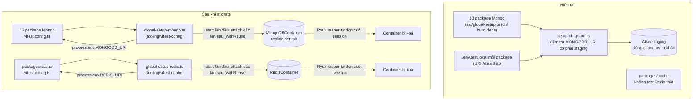

# Testcontainers cho Integration Test — Overview

Thay MongoDB Atlas thật + Redis thật (nếu có) trong 14 package integration test bằng
Testcontainers (container ephemeral, dùng chung qua 1 lần `turbo run test`), sau đó xoá runtime
`db-guard` vì lý do tồn tại của nó (chặn ghi/xoá lên DB staging chung) không còn áp dụng khi
test không còn đường nào chạm URI thật.

## Vì sao — bằng chứng đã xác minh trên máy hiện tại

- 9 package (`game-{bingo18,keno,power655,lotto535,mega645,max3d,max3dpro}-application`,
  `identity-application`, `resultfeed-application`) có file `.env.test.local` chứa **connection
  string Atlas thật** (user/password thật — KHÔNG trích dẫn giá trị cụ thể trong bất kỳ tài liệu
  nào, kể cả plan này). File này bị gitignore nhưng vẫn là secret sống nằm trên đĩa — đúng dạng rủi
  ro mà `db-guard` sinh ra để chặn, và đúng dạng rủi ro Testcontainers loại bỏ được tận gốc (không
  còn đọc URI thật để mà chặn).
- 15 package đang khai `integrationConfig`
  ([tooling/vitest-config/src/index.ts](../../../tooling/vitest-config/src/index.ts)), nhưng đọc
  thẳng test file thì **chỉ 13 package thực sự chạm MongoDB**:
  `game-{keno,lotto535,mega645,power655,max3d,max3dpro,bingo18}-application`,
  `game-core-application`, `resultfeed-application`, `identity-application`, `tenant-gateway`,
  `tenant-dispatch`, `audit`.
  - `packages/auth` ([test/check-authorization.test.ts](../../../packages/auth/test/check-authorization.test.ts))
    và `packages/worker-core`
    ([test/lock-taken-over-error.test.ts](../../../packages/worker-core/test/lock-taken-over-error.test.ts))
    có comment đầu file **"PURE — không DB"** — bị gán `integrationConfig` dư thừa. Hạ về
    `nodeConfig` (phase [p0-04](p0-04-downgrade-auth-worker-core.plan.md)).
- `packages/cache` hiện dùng `nodeConfig`, test chỉ cover `MemoryCacheStore`/`NoopCacheStore`/
  `TieredCache` ([test/stores.test.ts](../../../packages/cache/test/stores.test.ts)) —
  **`RedisCacheStore` (`src/stores/redis-store.ts`) và `RedisRepository` (`src/redis/repository.ts`)
  chưa có test nào cả**, real hoặc mock. Đây là gap Testcontainers Redis lấp vào
  (phase [p0-03](p0-03-cache-redis-integration.plan.md)), không phải "migrate" test cũ.
- Không package nào hiện gọi AWS SDK (`@aws-sdk/client-{sqs,sfn,kinesis,cognito}`) hay
  `aws-sdk-client-mock` trong test (`rg` toàn repo → 0 match). **Không cần LocalStack cho phase
  này** — ghi rõ là extension point để dành, không xây trước.
- `dbName` mỗi loại repo Mongo là hằng số cố định trong
  [`packages/data/src/mongo/constants.ts`](../../../packages/data/src/mongo/constants.ts)
  (`megawin`, `megawin-game`, `megawin-identity`, `megawin-tenant`, `megawin-report`,
  `megawin-audit`, `megawin-resultfeed`) — không đọc từ env. 13 package trỏ vào CÙNG 1 container
  Mongo vẫn tự nhiên tách theo các DB name này, khớp topology thật, không cần tự nghĩ scheme
  cách ly nào khác.
- Redis chỉ có 1 env key mặc định `REDIS_URI`
  ([constants.ts](../../../packages/cache/src/constants.ts) `DEFAULT_REDIS_ENV_KEY`) — không có
  multi-instance nào cần test riêng ở phase này.

## Kiến trúc

## Các phase

| Phase | Nội dung |
|---|---|
| [p0-01](p0-01-vitest-config-testcontainers.plan.md) | `tooling/vitest-config`: thêm `testcontainers` + `@testcontainers/mongodb` + `@testcontainers/redis`, 2 module container singleton, 2 global-setup (Mongo, Redis), xoá `setup-db-guard.ts` |
| [p0-02](p0-02-migrate-mongo-packages.plan.md) | Migrate 13 package Mongo: đổi `globalSetup`, bỏ `loadEnv`, xoá file/env thừa |
| [p0-03](p0-03-cache-redis-integration.plan.md) | `packages/cache` chuyển sang `integrationConfig` + Redis Testcontainers, viết test mới cho `RedisCacheStore`/`RedisRepository` |
| [p0-04](p0-04-downgrade-auth-worker-core.plan.md) | `packages/auth`, `packages/worker-core` hạ về `nodeConfig` |
| [p0-05](p0-05-retire-runtime-db-guard.plan.md) | Xoá lý do tồn tại của `db-guard` runtime, cập nhật phần liên quan trong `test-data-safety.mdc`. GritQL KHÔNG thuộc phạm vi plan này — xem `system-oxlint-migration.analysis.md` |

## Yêu cầu vận hành mới

- Máy dev **phải có Docker daemon chạy** (Docker Desktop/Colima/Podman) để chạy `pnpm test` cho
  14 package trên (13 Mongo + `cache`) — trước đây không cần vì test nối thẳng Atlas.
- CI (khi thiết lập sau này) trên GitHub Actions `ubuntu-latest` đã có Docker sẵn — không cần
  cấu hình thêm.
- Image version cụ thể (Mongo, Redis) cần đối chiếu với version thật đang chạy trên Atlas/Redis
  instance production trước khi chốt tag trong `mongo-container.ts`/`redis-container.ts`.

## Không làm trong plan này

- Không đụng Playwright/E2E UI (để nghiên cứu sau, theo yêu cầu).
- Không xây ClickHouse/Postgres/LocalStack Testcontainers — chưa có test nào cần.
- Không sửa `.env.test.local` thật (theo `no-env-file-modification.mdc`) — chỉ khuyến nghị user
  tự xoá/rotate credential trong đó.
- Không đổi `turbo.json` (task `test` vẫn depend đúng như hiện tại).

## Ràng buộc bắt buộc — container start 1 lần/suite, seed data tách biệt

Chốt 17/09/2026, áp dụng cho MỌI phase dưới đây, không chỉ [p0-01](p0-01-vitest-config-testcontainers.plan.md):

1. **Container (Mongo/Redis) CHỈ được start trong Vitest `globalSetup`** — hàm `setup()` của
   `global-setup-mongo.ts`/`global-setup-redis.ts` ([p0-01](p0-01-vitest-config-testcontainers.plan.md)
   mục 5-6). `globalSetup` là cơ chế NATIVE của Vitest chạy đúng **1 lần cho toàn bộ lần `vitest run`**
   của 1 process (trước khi bất kỳ file test nào chạy) — khác `setupFiles` (chạy lại mỗi test file).
   **CẤM TUYỆT ĐỐI** gọi `new MongoDBContainer().start()`/`new RedisContainer().start()` trực tiếp
   trong `beforeAll`/`beforeEach`/`it()` của bất kỳ file `*.test.ts` nào — nếu cần container, luôn
   đi qua `getSharedMongoContainer()`/`getSharedRedisContainer()` (singleton, xem
   `testcontainers/mongo-container.ts`), và hàm đó chỉ được gọi từ `global-setup-*.ts`.
2. **13 package Mongo dùng CHUNG 1 container** trong 1 lần `turbo run test` qua cơ chế
   `.withReuse()` của Testcontainers (label-based, hoạt động across-process — không phải chỉ
   in-process singleton) — package chạy sau **attach** vào container đã chạy, không start container
   mới. **Không phải nguồn rủi ro cross-package**: mỗi game có DB/collection tên riêng
   (`power655_draws` ≠ `keno_draws`, `audit`/`identity`/`tenant-gateway` mỗi package còn có DB
   riêng hẳn — xem [`packages/data/src/mongo/constants.ts`](../../../packages/data/src/mongo/constants.ts)),
   nên 1 package không thể "lỡ" xoá data package khác dù chung container. Rủi ro race còn lại
   nằm ở tầng cross-file-cùng-package — mitigant: convention `test-data-safety.mdc`
   (sentinel/scoped filter) + GritQL hiện còn enforce (việc retire GritQL thuộc plan
   Biome→oxlint, không thuộc plan này).
3. **Seed data (fixture nghiệp vụ) là concern TÁCH BIỆT khỏi lifecycle container** — không gộp
   logic 2 việc vào cùng 1 file:
   - Container lifecycle (`start`/`getConnectionString`) → sống trong
     `tooling/vitest-config/src/testcontainers/*-container.ts` (dùng chung, generic, không biết
     gì về nghiệp vụ game).
   - Seed data (nghiệp vụ, VD `DEFAULT_POWER655_CONFIG`) → sống trong `test/**/helpers/seed-*.ts`
     riêng của MỖI package (đã đúng convention hiện có, VD
     [`game-power655-application/test/use-cases/helpers/seed-global-config.ts`](../../../packages/game-power655-application/test/use-cases/helpers/seed-global-config.ts)) —
     giữ nguyên khi migrate, KHÔNG gộp seed vào `global-setup-mongo.ts` (mỗi package cần fixture
     khác nhau, `@megawin/vitest-config` không nên biết về domain của 7 game).
4. **Seed helper gọi 1 lần bằng `beforeAll`, KHÔNG bằng `it()`** — pattern đã đúng ở toàn bộ test
   hiện có ([`global-config.test.ts`](../../../packages/game-power655-application/test/use-cases/global-config.test.ts)
   dòng `beforeAll(async () => { await insertDefaultGlobalConfig(); })`) — giữ nguyên khi migrate
   sang Testcontainers, KHÔNG đổi thành `beforeEach`/inline trong `it()`.
   - **Phân biệt với `beforeEach(cleanup)`** (VD `resultfeed-application`) — đó là dọn + seed lại
     DATA (cấp document Mongo, rẻ, việc bình thường để đảm bảo test không phụ thuộc thứ tự chạy),
     KHÁC hoàn toàn với khởi động lại CONTAINER (cấp infra, đắt, tuyệt đối không lặp per-test).
     Ràng buộc #1 chỉ áp dụng cho container, không cấm `beforeEach` seed/cleanup data.
5. **Verify bắt buộc khi thực thi [p0-01](p0-01-vitest-config-testcontainers.plan.md)/[p0-02](p0-02-migrate-mongo-packages.plan.md):**
   chạy `pnpm --filter <package> test` 2 lần liên tiếp, `docker ps` sau lần 2 phải thấy **CÙNG 1**
   container (không tăng số lượng) — nếu thấy container mới mỗi lần chạy hoặc mỗi test file, đó là
   vi phạm ràng buộc #1/#2, phải sửa trước khi merge.

## Cấu trúc thư mục — theo convention chung của monorepo

13 package Mongo + `cache` khi migrate ĐỒNG THỜI áp dụng convention `test/unit/` `test/integration/`
đã chốt ở [`monorepo-test-setup/p2-01`](../monorepo-test-setup/p2-01-test-type-folder-convention.plan.md)
— test chạm Testcontainers vào `test/integration/**`, test pure (mapper/classifier/codec hiện đang
nằm phẳng lẫn trong `test/`) tách ra `test/unit/**`, KHÔNG cần Docker để chạy. Chi tiết bằng chứng +
danh sách file cần tách nằm ở plan đó, không lặp lại ở đây.

## Ghi chú — GritQL đã retire (oxlint-migration P0-07)

GritQL (`tooling/biome-plugins/no-unscoped-db-mutation.grit`) **đã bị xoá** cùng Biome tại
[`oxlint-migration/p0-07-retire-biome.plan.md`](../oxlint-migration/p0-07-retire-biome.plan.md).
Lớp phòng thủ còn lại: Cursor rule `test-data-safety.mdc` (không còn lint/CI GritQL).
Plan Testcontainers không sở hữu việc xoá này — chỉ ghi nhận trạng thái sau migration.
