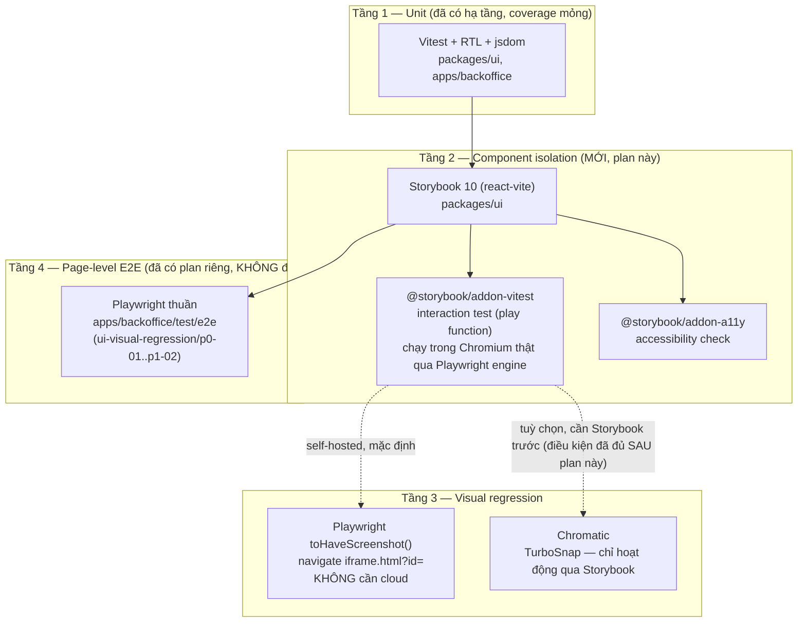

# Component Testing cho `packages/ui` (Storybook) — Overview

> Research 17/09/2026, trả lời trực tiếp yêu cầu: "test UI một cách chuyên nghiệp và đầy đủ nhất,
> cả `apps/backoffice` lẫn `packages/ui`". Bổ sung — KHÔNG thay thế —
> [`.cursor/plans/ui-visual-regression/`](../ui-visual-regression/00-overview.md), vốn ghi rõ ở
> mục "Không làm": *"Không mở rộng ngoài `apps/backoffice`"*. Đó là khoảng trống thật: plan đó test
> **trang** (page-level, qua route Next.js), không test **component** trong `packages/ui` — nơi
> `apps/backoffice` chỉ có 2 component thật (`MoneyInput`, `Toaster`) + `lib`/`hooks` thuần, còn
> **51 component shadcn primitive** (`Button`, `Card`, `Table`...) hiện sống cục bộ trong
> `apps/backoffice/src/components/ui/`, KHÔNG phải trong `packages/ui`.

## Hiện trạng đo được (không suy diễn)

| Lớp | Hạ tầng | Coverage thật |
|---|---|---|
| Unit (Vitest+RTL, jsdom) | `@megawin/vitest-config` `jsdomConfig` — đã có, dùng ở cả `packages/ui` và `apps/backoffice` | `packages/ui/test/unit/`: **1 file** (`get-initials.test.ts`). `apps/backoffice/test/unit/`: 7 file (hooks/format/component nhỏ) |
| Component isolation (Storybook) | **Không có** — `rg -iname "*storybook*"` toàn repo → 0 kết quả | 0 |
| Visual regression trang (Playwright) | Plan đã viết ở `ui-visual-regression/`, **chưa triển khai** (`test/e2e/` chỉ có `.gitkeep`) | 0 |
| Visual regression component | Không có | 0 |
| Integration (Testcontainers Mongo/Redis) | **ĐÃ XONG** — `tooling/vitest-config/src/testcontainers/*`, 13 package Mongo + `cache` đã migrate (xem `testcontainers-setup/`) | N/A cho UI (không chạm DB) |

**Ràng buộc kỹ thuật quan trọng phát hiện khi research:** `packages/ui` component (`money-input.tsx`)
dùng class Tailwind semantic (`bg-input`, `text-foreground`, `focus-visible:ring-ring/50`...) nhưng
**không tự định nghĩa token** — toàn bộ `@theme` CSS variable nằm ở
[`apps/backoffice/src/app/globals.css`](../../../apps/backoffice/src/app/globals.css). `packages/ui/src/styles/`
chỉ có `toast.css`. Nghĩa là Storybook chạy độc lập cho `packages/ui` **phải import globals.css của
backoffice** vào `.storybook/preview.ts` để render đúng — nếu không, mọi component hiện màu/border
sai (token resolve về giá trị rỗng). Đây KHÔNG phải bug cần sửa trong plan này (tách token ra khỏi
app tiêu dùng là quyết định kiến trúc riêng, ngoài scope) — chỉ là điều kiện kỹ thuật khi setup.

## Research: Playwright vs Storybook vs Chromatic — không phải "chọn 1", là 3 tầng khác nhau

**Không có tool nào "thắng" cả — mỗi tool đúng 1 tầng:**

| Câu hỏi | Tầng | Tool đúng | Vì sao KHÔNG dùng tool khác |
|---|---|---|---|
| Component `MoneyInput` có render đúng, format số đúng khi user gõ? | Unit/interaction | Vitest+RTL **hoặc** Storybook play function | Playwright E2E phải mount cả page Next.js — chậm, không cần |
| `MoneyInput` isolated (không phụ thuộc page nào) có đổi pixel ngoài ý muốn? | Component visual | Playwright chụp story qua Storybook | Chromatic OK nhưng cần Storybook trước (đệ quy) — Playwright tự chụp không cần thêm gì |
| Trang Keno Ops Hub (nhiều component ghép + data thật) có đổi layout ngoài ý muốn? | Page visual | Playwright thuần (`ui-visual-regression`) | Storybook không dựng nổi 1 trang Next.js đầy đủ (route, RSC, React Query) |
| Muốn cross-browser (Safari/Firefox) + dashboard usage cho *cả 2 tầng trên* mà không tự host? | Cả 2 | Chromatic (trả phí ngoài free tier) | Tự host Playwright screenshot chỉ chạy Chromium mặc định (đủ cho backoffice — internal tool nội bộ) |

### Playwright Component Testing — ĐÃ BỊ REMOVE, không phải lựa chọn nữa

Research xác nhận (17/09/2026): `@playwright/experimental-ct-react` **đã bị xoá khỏi npm từ Playwright
1.62** (PR [microsoft/playwright#42168](https://github.com/microsoft/playwright/pull/42168)), thay
bằng mô hình "story + gallery" dùng `@playwright/test` thuần (`mount()` fixture built-in). Model mới
**tự tay dựng gallery page + story exports** — đúng việc Storybook đã làm sẵn (bundler config, CSF,
docs, addon ecosystem). Chính người maintain Playwright xác nhận trong issue #42139: *"tất cả những
gì Storybook làm cho bạn (tích hợp bundler, hỗ trợ framework hiện tại/tương lai...) — nếu bạn đã dùng
Storybook, KHÔNG khuyến khích đổi qua model mới."* → **Không có lý do chọn Playwright CT thay
Storybook** cho `packages/ui` — dùng Storybook (đã trưởng thành hơn cho đúng use-case này), Playwright
vẫn giữ vai trò page-level E2E (Tầng 4, đã có plan).

### Chromatic — số liệu verify lại (pricing 09/2026)

- Free tier: **5.000 billed snapshot/tháng**, tương đương **~25.000 turbosnap** (turbosnap = 0.2
  billed snapshot/story nhờ TurboSnap). Nguồn: [chromatic.com/pricing](https://www.chromatic.com/pricing).
- Thay đổi MỚI (Chromatic changelog 08/2026): build **không đổi UI** (không story nào bị ảnh hưởng
  bởi diff dependency graph) giờ tính **0 billed snapshot** ("bypassed build") — trước đây vẫn tính
  0.2/story. Cải thiện thêm biên an toàn cho free tier so với lúc viết `ui-visual-regression/p2-01`.
- **Điều kiện TurboSnap vẫn y nguyên: chỉ hoạt động qua Storybook stories**, KHÔNG áp dụng khi chạy
  Chromatic qua `@chromatic-com/playwright` (tính 1:1, không giảm) — đúng lý do `ui-visual-regression/p2-01`
  chặn Chromatic cho `apps/backoffice` (chưa có Storybook ở đó, và **không có kế hoạch thêm** — trang
  Next.js đầy đủ route/data không hợp với model Storybook).
- **Sau plan này, `packages/ui` CÓ Storybook** → điều kiện mở khoá của `ui-visual-regression/p2-01`
  được thoả **cho riêng `packages/ui`** (không phải cho `apps/backoffice`). Xem [p2-01](p2-01-chromatic-for-packages-ui.plan.md)
  cho số liệu cụ thể — vẫn là quyết định CÓ ĐIỀU KIỆN, cần user tự chốt trả phí/vendor lock-in, không
  tự triển khai.

## Quyết định kiến trúc đã chốt cho plan này

1. **Storybook 10.x (`@storybook/react-vite`)** cho `packages/ui` — package đã có Vite +
   `@vitejs/plugin-react` sẵn (dùng cho Vitest), tận dụng lại, không thêm builder mới.
2. **`@storybook/addon-vitest` làm lớp interaction test** (play function chạy trong Chromium thật
   qua Playwright engine mà addon tự quản lý) — KHÔNG viết riêng 1 bộ Vitest component test trùng
   lặp với story đã có (story = test, đúng triết lý Storybook 9+ "Component Test").
3. **Visual regression component tự host bằng Playwright trước (`toHaveScreenshot` trên
   `iframe.html?id=`), KHÔNG Chromatic ngay** — nhất quán triết lý đã chọn ở `ui-visual-regression`
   (tool built-in trước, cloud có điều kiện sau). Chromatic cho `packages/ui` là lựa chọn Ở CUỐI
   ([p2-01](p2-01-chromatic-for-packages-ui.plan.md)), không phải bước bắt buộc.
4. **KHÔNG động tới 51 component shadcn primitive trong `apps/backoffice/src/components/ui/`.**
   Việc có nên "nâng" chúng lên `packages/ui` để dùng chung (VD cho `operator-web` tương lai theo
   [`operator-monorepo-structure.mdc`](../../rules/operator-monorepo-structure.mdc)) là quyết định
   kiến trúc riêng, KHÔNG phải quyết định của plan testing — nêu ra để user biết, không tự làm.
5. **KHÔNG tạo `.github/workflows/`** — lý do giống `ui-visual-regression/00-overview.md`: repo
   chưa có CI, quyết định đó vượt phạm vi 1 plan testing.

## Các phase

| Plan | Phase | Ghi chú |
|---|---|---|
| [p0-01](p0-01-storybook-foundation.plan.md) | P0 | Cài Storybook 10 vào `packages/ui`, config Tailwind theme import, story đầu tiên cho `MoneyInput`/`Toaster` |
| [p0-02](p0-02-component-tests-vitest-addon.plan.md) | P0 | `@storybook/addon-vitest` + `@storybook/addon-a11y`, viết interaction test (play function) |
| [p1-01](p1-01-visual-regression-self-hosted.plan.md) | P1 | Visual regression tự host: Playwright chụp từng story qua `iframe.html`, threshold giống `ui-visual-regression` |
| [p2-01](p2-01-chromatic-for-packages-ui.plan.md) | P2 — CÓ ĐIỀU KIỆN | Chromatic scoped CHỈ `packages/ui` (điều kiện TurboSnap đã đủ) — cần user tự chốt |

## Thứ tự phụ thuộc

`p0-01` chặn `p0-02` và `p1-01` (cần Storybook cài xong + có story trước khi viết test/screenshot lên
story đó). `p0-02` và `p1-01` độc lập nhau (test hành vi và test pixel không phụ thuộc), làm song
song được. `p2-01` phụ thuộc `p0-01` xong (điều kiện Storybook tồn tại) — KHÔNG phụ thuộc `p0-02`/`p1-01`.

## Quan hệ với các plan khác — cập nhật ghi chú, KHÔNG rewrite quyết định cũ

- **`ui-visual-regression/00-overview.md`** mục "Không làm" ghi *"Không mở rộng ngoài
  `apps/backoffice`"* — quyết định đó **vẫn đúng cho page-level Playwright** (không port sang
  `packages/ui`, vì package đó không có "trang"). Plan này lấp khoảng trống ở TẦNG KHÁC (component),
  không mâu thuẫn. Đã thêm 1 dòng cross-link vào file đó (xem diff kèm).
- **`ui-visual-regression/p2-02`** mục 1 (chuyển seed sang Testcontainers) — điều kiện tiên quyết
  *"`testcontainers-setup/00-overview.md` phải hoàn thành"* **giờ ĐÃ ĐÚNG** (đã verify: 13 package
  Mongo + `cache` đã migrate `integrationConfig` + `global-setup-mongo`/`global-setup-redis`, xem
  bảng "Hiện trạng" ở trên). Điều kiện còn thiếu duy nhất của `p2-02` mục 1 là **mở rộng seed script
  riêng cho `apps/backoffice`** (chưa viết) — không thuộc plan này, chỉ ghi nhận là đã unblock 1 nửa.
- **`monorepo-test-setup/p1-01`** (Nhóm C UI/Next.js, Vitest+RTL) — vẫn còn khoảng trống thật ở
  `packages/ui` (1 test file so với 7 của `apps/backoffice`). Khuyến nghị hoàn thiện SONG SONG với
  plan này (không phụ thuộc nhau — Storybook không thay thế unit test thuần cho `src/lib/*`).

## Không làm trong plan này

- Không viết story cho 51 shadcn primitive của `apps/backoffice` (chúng không nằm trong `packages/ui`).
- Không tự chuyển `apps/backoffice/src/components/ui/*` vào `packages/ui` — quyết định kiến trúc
  riêng, nêu ở mục 4 trên, không tự làm.
- Không cài Chromatic (đó là `p2-01`, có điều kiện, cần user chốt).
- Không tạo CI.
- Không đụng `ui-visual-regression/p0-01..p1-02` (page-level Playwright của `apps/backoffice`) —
  plan độc lập, chạy song song được.
