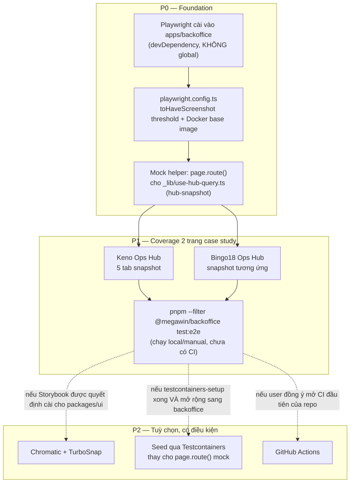

# UI Visual Regression cho Backoffice — Overview

> Nguồn: nghiên cứu UI QA architecture (canvas `ui-qa-architecture-for-agents`, 15-16/09/2026) +
> case study [`ui-review-2026-09-07.md`](../keno-bingo18-ops-hub/ui-review-2026-09-07.md).
> Chốt scope: 16/09/2026.

Trước đây `.cursor/plans/monorepo-test-setup/00-overview.md` ghi rõ "E2E/route thật ngoài scope" —
quyết định có chủ đích, không phải thiếu sót. Plan này là bước **sau** đó: thêm lớp visual
regression (screenshot diff) cho `apps/backoffice`, KHÔNG đụng lại phần Vitest+RTL đã chốt ở
`monorepo-test-setup/`.

## Vì sao cần lớp này (bằng chứng, không suy diễn)

`ui-review-2026-09-07.md` tìm 3 bug UI thật bằng cách đọc code + mở browser — 2 trong 3 bug
(hardcode gradient màu sai game, thiếu cột `Exposure` so với plan) là loại **pixel/layout lệch
so với baseline đã duyệt** — đúng loại bug screenshot diff bắt tự động được, nếu đã có baseline
cho đúng trang đó. Review thủ công bắt được lần này nhưng không lặp lại tự động cho lần sửa sau.

## Quyết định kiến trúc đã chốt

1. **Playwright thuần trước, KHÔNG Chromatic ngay từ đầu.** Free tier Chromatic (5.000 billed
   snapshot/tháng) đủ hạn mức về số lượng, nhưng ưu điểm lớn nhất của nó (TurboSnap — quota thực tế
   ~25k) chỉ có khi chạy qua **Storybook**, mà `apps/backoffice` hiện có **0 file `*.stories.tsx`**.
   Chạy Chromatic qua adapter Playwright thuần (`@chromatic-com/playwright`) tính đúng 1:1 mỗi
   screenshot — không có hệ số giảm, dễ vượt quota hơn ước lượng ban đầu. Xem `p2-01` cho phân tích
   đầy đủ + điều kiện nên xét lại.
2. **Mock data ở tầng HTTP (`page.route()`) trước, KHÔNG chờ Testcontainers.**
   `.cursor/plans/testcontainers-setup/00-overview.md` (16/09/2026) đang tách DB test khỏi Atlas
   staging — nhưng đó là plan cho **14 package Vitest** (application/repo layer), KHÔNG target
   `apps/backoffice`. Plan đó hiện cũng mới ở mức `00-overview.md`, 5 phase file `p0-01..p0-05`
   **chưa được tạo**. Nếu chờ nó xong + mở rộng sang backoffice mới bắt đầu viết Playwright test,
   sẽ trễ vô thời hạn cho 1 dependency ngoài scope. Mock ở `page.route()` hoạt động ngay hôm nay,
   không phụ thuộc quyết định đó.
3. **Ưu tiên 2 trang case study trước (Keno + Bingo18 Ops Hub), KHÔNG rollout 54 trang game cùng
   lúc.** Đây là 2 trang đã có bug thật + đã có guideline tham chiếu
   ([`ops-hub-page-layout.guideline.md`](../keno-bingo18-ops-hub/ops-hub-page-layout.guideline.md))
   để biết "đúng" là gì — điều kiện cần để viết baseline có ý nghĩa.
4. **KHÔNG tạo CI/GitHub Actions trong plan này.** Repo hiện **chưa có `.github/workflows/` nào** —
   đây sẽ là pipeline CI đầu tiên của monorepo. Việc đó tác động toàn repo (không chỉ visual
   regression), cần quyết định riêng của user, không tự thêm kèm plan này. `p1-02` chỉ chuẩn bị
   script chạy local + để sẵn hook, CI thật là bước tách riêng nếu user đồng ý.

## Kiến trúc

## Các phase

| Plan | Phase | Status | Ghi chú |
|---|---|---|---|
| [p0-01](p0-01-playwright-foundation.plan.md) | P0 | ⏳ pending | Cài Playwright vào `apps/backoffice`, config, mock helper tái dùng |
| [p1-01](p1-01-ops-hub-coverage.plan.md) | P1 | ⏳ pending | Viết test cho Keno + Bingo18 Ops Hub — 2 trang case study |
| [p1-02](p1-02-review-workflow-and-agent-guardrail.plan.md) | P1 | ⏳ pending | Quy trình review diff (diffscope) + rule agent không tự update baseline |
| [p2-01](p2-01-chromatic-evaluation.plan.md) | P2 | ⏳ pending — cần quyết định team | Chromatic có điều kiện: chỉ khi Storybook được chốt cho `packages/ui` |
| [p2-02](p2-02-testcontainers-and-rollout.plan.md) | P2 | ⏳ pending — phụ thuộc `testcontainers-setup` | Chuyển seed sang Testcontainers (nếu mở rộng sang backoffice) + rollout game còn lại |

## Thứ tự phụ thuộc

`p0-01` chặn `p1-01` và `p1-02` (cần Playwright + mock helper trước khi viết test cụ thể).
`p1-01`/`p1-02` KHÔNG chặn nhau (viết test và viết quy trình review độc lập, nên làm song song).
`p2-01` phụ thuộc quyết định Storybook — KHÔNG chặn bởi `p1-*`, có thể làm bất kỳ lúc nào sau khi
team quyết định, kể cả trước `p1-01` nếu muốn đổi thứ tự.
`p2-02` phụ thuộc `testcontainers-setup` (external plan) hoàn thành **và** mở rộng sang
`apps/backoffice` — hiện chưa có timeline, coi là "chờ tín hiệu", không lên kế hoạch thời gian cụ
thể.

## Không làm trong plan này

- Không đụng `.cursor/plans/monorepo-test-setup/` (Vitest+RTL đã chốt scope riêng).
- Không tự cài Storybook — đó là quyết định riêng (`p2-01` chỉ đánh giá điều kiện).
- Không tự tạo `.github/workflows/` — CI đầu tiên của repo cần quyết định user, không tự thêm.
- Không mở rộng ngoài `apps/backoffice` (không làm cho `operator-web` tương lai — game B2C khác
  stack, khác rủi ro, xét riêng khi package đó tồn tại).

## Cập nhật 17/09/2026 — khoảng trống `packages/ui` đã có plan riêng

Plan này chỉ test **trang** (page-level, qua route Next.js) — KHÔNG test **component** cô lập trong
`packages/ui`. Khoảng trống đó (Storybook + interaction test + visual regression per-component) được
lấp bởi [`.cursor/plans/ui-component-testing-storybook/`](../ui-component-testing-storybook/00-overview.md),
plan bổ sung, độc lập, KHÔNG đổi bất kỳ quyết định nào ở đây. `p2-01` (Chromatic) của plan đó
(`ui-component-testing-storybook/p2-01`) là phân tích RIÊNG cho `packages/ui` — điều kiện "chưa có
Storybook" ở `p2-01` của CHÍNH FILE NÀY vẫn đúng cho `apps/backoffice`, không bị ảnh hưởng.
