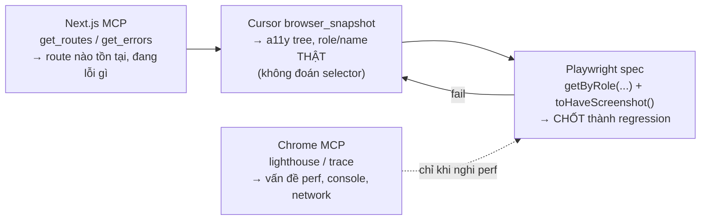
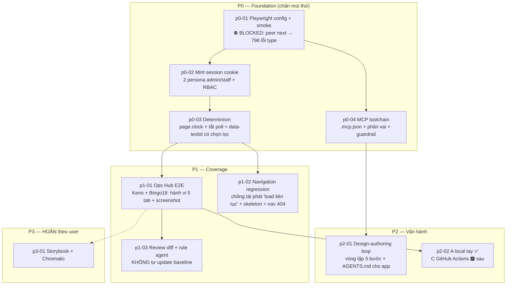

# E2E Testing cho Backoffice (Playwright + MCP toolchain) — Overview

> Cập nhật 18/09/2026 — **đổi scope theo yêu cầu user**: plan này giờ là **E2E test**
> (hành vi + screenshot), KHÔNG còn chỉ "visual regression". Storybook + Chromatic **hoãn**
> (xem [p3-01](p3-01-deferred-storybook-chromatic.plan.md)).
> Nguồn trước đó: canvas `ui-qa-architecture-for-agents` (15-16/09) + case study
> [`ui-review-2026-09-07.md`](../keno-bingo18-ops-hub/ui-review-2026-09-07.md).

**Tên thư mục `ui-visual-regression/` giữ nguyên** dù scope đã rộng hơn — 2 plan khác đang trỏ tới
đường dẫn này ([`monorepo-test-setup/p2-01`](../monorepo-test-setup/p2-01-test-type-folder-convention.plan.md)
dòng 38/137, [`ui-component-testing-storybook/00-overview.md`](../ui-component-testing-storybook/00-overview.md)).
Đổi tên = sửa link ở 2 plan ngoài scope. Không đáng.

---

## 1. Đổi gì so với bản 17/09 (và VÌ SAO)

| Bản cũ | Bản này | Lý do |
|---|---|---|
| Chỉ screenshot diff | **E2E hành vi + screenshot** (screenshot là 1 assertion, không phải mục đích) | Screenshot chỉ bắt pixel lệch. Không bắt được "bấm Đóng bán không gọi API", "tab không lọc đúng" |
| Chromatic đánh giá ở P2 | **Hoãn** → `p3-01` | User chốt: để sau |
| Không nhắc MCP | **`p0-04` + `p2-01`**: Next.js MCP, Chrome DevTools MCP, Cursor browser | Next.js 16.3.5 có MCP server **built-in** tại `/_next/mcp` — đã verify trên đĩa |
| — | **`p0-02` auth mint cookie + 2 persona** | Bản cũ **bỏ sót hoàn toàn**: `src/proxy.ts` chặn mọi route → mọi test cũ sẽ redirect `/login`. Đã verify `setSessionCookie` + `auth.$context` dùng được; thêm RBAC admin/staff |
| — | **`p0-03` determinism** | Bản cũ không biết `interval-registry.ts` ghi `textContent` mỗi 1s → 100% flaky |
| — | **`p1-02` navigation regression** | Khoá lại thành quả `backoffice-nav-performance` (sự cố "load liên tục" 04/09 chỉ được sửa bằng 1 dòng config, **không có test nào bảo vệ**) |
| `?tab=needs_action` "Cần xử lý" | `?gate=pending_open` "Chờ mở bán" | Tab "Cần xử lý" **đã bị xoá** (p1-08 §7). Giá trị cũ là **sai**, đã verify |
| Port `3100`, không set env | Port `3100` + **`webServer.env.NEXT_PUBLIC_SITE_URL`** khớp port | `apiClient` fallback **hardcode** `http://localhost:3000/api` → không truyền env thì mọi React Query fail |

## 2. Sáu phát hiện chặn (đo trên code, không suy diễn)

Đây là các fact khiến bản cũ **không thể chạy được nếu thực thi nguyên văn**. Đọc trước khi viết
dòng test đầu tiên.

### 2.0 ✅ ĐÃ GỠ (18/09): cài `@playwright/test` không còn vỡ type

Sáng 18/09: `pnpm add` → 2 instance `next` → **798 lỗi type**. Chiều cùng ngày gỡ bằng
override `"next>@playwright/test": "-"` + sửa tay `package.json` + `pnpm install` full
(không `pnpm add`). Đo sau fix: 19 package cùng 1 instance, `tsc` 0, smoke e2e xanh 2 lần.
Chi tiết: [p0-01](p0-01-playwright-foundation.plan.md) §1. Hardening `packages/next` **không
làm** ở lượt này (tùy chọn).


### 2.1 Auth chặn 100% route — bản cũ không có bước login

[`apps/backoffice/src/proxy.ts`](../../../apps/backoffice/src/proxy.ts) matcher phủ mọi path trừ
`_next/static`, `_next/image`, `favicon.ico`, `robots.txt`, `sitemap.xml`, `eve/`. Public route chỉ
có `/login`, `/api/auth`, `/auth/error`, `/unauthorized`. Không có `session_token` →
`redirectToLogin()`. Cookie bắt buộc: **`better-auth.session_token`** (`getSessionCookie()`);
`better-auth.session_data` chỉ là cache optional.

→ `page.goto("/games/keno/operations-hub")` trong bản cũ sẽ chụp screenshot **trang login**.
Giải: [p0-02](p0-02-auth-storage-state.plan.md).

### 2.2 `apiClient` dùng URL TUYỆT ĐỐI, fallback cứng port 3000

[`packages/next/src/client/api-client.ts`](../../../packages/next/src/client/api-client.ts)
`getDefaultBaseUrl()`:

```typescript
if (process.env?.NEXT_PUBLIC_SITE_URL) {
  return `${process.env.NEXT_PUBLIC_SITE_URL.replace(/\/+$/, "")}/api`;
}
return "http://localhost:3000/api";   // ← fallback CỨNG
```

Bản cũ chọn `webServer` port **3100** để "không giết dev server của người khác". Nhưng nếu
`NEXT_PUBLIC_SITE_URL` không set, browser fetch `localhost:3000/api/...` trong khi server ở `3100`
→ **mọi query fail**, và `page.route("**/api/...")` cũng khớp sai host.

Giải: [p0-01](p0-01-playwright-foundation.plan.md) §3 — dùng `webServer.env` (KHÔNG tạo `.env*`,
tuân [`no-env-file-modification.mdc`](../../rules/no-env-file-modification.mdc)). **Đã thi hành** —
config đã tạo với `webServer.env.NEXT_PUBLIC_SITE_URL`.

### 2.3 Ops Hub có đồng hồ chạy 1 giây/tick → flaky tuyệt đối

[`_lib/interval-registry.ts`](<../../../apps/backoffice/src/app/(main)/games/keno/operations-hub/_lib/interval-registry.ts>)
gom **1 `setInterval(tick, 1000)`** cấp trang; [`relative-duration.tsx`](<../../../apps/backoffice/src/app/(main)/games/keno/operations-hub/_lib/relative-duration.tsx>)
ghi thẳng `el.textContent` (bypass React) mỗi tick → `"treo 47ph12s"` → `"treo 47ph13s"`.

Cộng thêm 2 nguồn nữa:
- [`use-hub-context.tsx:184`](<../../../apps/backoffice/src/app/(main)/games/keno/operations-hub/_lib/use-hub-context.tsx>):
  `clockOffsetMsRef.current = Date.parse(serverNowIso) - Date.now()` — mọi thời lượng neo vào
  đồng hồ thật.
- [`use-hub-query.ts`](<../../../apps/backoffice/src/app/(main)/games/keno/operations-hub/_lib/use-hub-query.ts>):
  `refetchInterval` = `pollSeconds` server (fallback `DEFAULT_POLL_SECONDS = 10`).

Bản cũ chỉ đề xuất `mask` 1 `data-testid="live-countdown"` — không đủ, vì đồng hồ nằm rải trên
**mọi dòng** bảng 5A. Giải: `page.clock` (Playwright ≥1.45) — [p0-03](p0-03-determinism-and-testids.plan.md).

### 2.4 Toàn app có ĐÚNG 0 `data-testid`

`grep -rn "data-testid" apps/backoffice/src` → **0 match**. Bản cũ giả định có selector ổn định để
`mask`. Không có. Phải thêm — nhưng **có chọn lọc**, không rải bừa: [p0-03](p0-03-determinism-and-testids.plan.md) §3.

### 2.5 Giá trị tab trong bản cũ là SAI

Nguồn chân lý: [`_lib/sections/queue/queue-types.ts`](<../../../apps/backoffice/src/app/(main)/games/bingo18/operations-hub/_lib/sections/queue/queue-types.ts>)
`HubGateTab`. Param URL là **`gate`** (không phải `tab`) — xem
[`use-hub-url-params.ts`](<../../../apps/backoffice/src/app/(main)/games/keno/operations-hub/_lib/use-hub-url-params.ts>).

| `gate` | Label (`HUB_GATE_TAB_LABELS`) | Bản cũ ghi |
|---|---|---|
| `pending_open` | Chờ mở bán | `needs_action` / "Cần xử lý" ← **tab đã bị XOÁ** |
| `ended` | Chờ đóng bán | `ended` / "Hết giờ cược" ← label cũ |
| `awaiting_result` | Chưa có KQ | ✅ đúng |
| `awaiting_settle` | Chờ kết sổ | ✅ đúng |
| `all` | Tất cả | ✅ đúng |

`queue-types.ts` §header ghi rõ: bỏ tab "Cần xử lý" vì nó gộp 4 điều kiện **không cùng action** →
bulk rất dễ áp sai. Đây chính là loại bug E2E hành vi bắt được mà screenshot thì không.

## 3. Bốn công cụ — phân vai, KHÔNG trùng nhau

Đây là câu trả lời trực tiếp cho *"tích hợp sức mạnh của Playwright, Cursor Chrome, Next.js MCP và
Chrome MCP"*. Nguyên tắc: **MCP để TÌM và THIẾT KẾ (một lần, tương tác); Playwright để CHỐT
(lặp lại, tự động).** Trộn lẫn là nguồn lãng phí lượt tool lớn nhất.

| Công cụ | Bản chất | Dùng ĐỂ | KHÔNG dùng để |
|---|---|---|---|
| **Next.js MCP** (`next-devtools-mcp`, built-in `/_next/mcp`) | Góc nhìn **framework** | `get_errors` (build/runtime/type), `get_routes` (thay vì `find page.tsx`), `get_compilation_issues`, `compile_route` (khỏi `next build`), `get_page_metadata` | Xác nhận UI đúng pixel. Nó không thấy DOM |
| **Chrome DevTools MCP** (`user-chrome-devtools`) | Góc nhìn **hiệu năng/audit** | `lighthouse_audit`, `performance_start_trace` + `performance_analyze_insight`, `list_network_requests`, `list_console_messages` | Regression lặp lại. Không có baseline, không có assertion |
| **Cursor IDE Browser** (`cursor-ide-browser`) | Góc nhìn **DOM/a11y tương tác** | `browser_snapshot` (a11y tree → tìm ĐÚNG selector/role trước khi viết test), `browser_cdp`, `browser_take_screenshot` khi khảo sát | Chạy suite. Không headless, không parallel, không baseline |
| **Playwright** (`@playwright/test` + `@next/playwright`) | **Regression** | Assertion hành vi, `toHaveScreenshot()`, `instant()`, chạy CI, parallel | Khảo sát lần đầu (chậm hơn `browser_snapshot`) |

**Vòng lặp chuẩn** (`p2-01` chính thức hoá thành quy trình):



Điểm mấu chốt: `browser_snapshot` trả a11y tree → lấy được `getByRole("tab", { name: "Chờ mở bán" })`
**đúng ngay lần đầu**. Bản cũ phải ghi *"đọc `param` thật từ code trước khi commit — CHƯA xác nhận"*
và **đã đoán sai** (§2.5). Đó là chi phí thật của việc không dùng snapshot.

## 4. Kiến trúc phase



## 5. Bảng phase

| Plan | Phase | Status | Chặn bởi | Nội dung |
|---|---|---|---|---|
| [p0-01](p0-01-playwright-foundation.plan.md) | P0 | ✅ **done** | — | Config + smoke + `@playwright/test@1.63.0`; blocker peer đã gỡ (override + full install); baseline `login-chromium-darwin.png`; e2e xanh 2 lần |
| [p0-02](p0-02-auth-storage-state.plan.md) | P0 | ✅ **done** | p0-01 | Mint session cookie (không qua Cognito) + 2 persona `admin`/`staff` + RBAC spec |
| [p0-03](p0-03-determinism-and-testids.plan.md) | P0 | ✅ **done** | p0-02 | `page.clock`, `mockOpsHubSnapshot`, fixture + `data-testid` (`hub-zone-queue`, `kpi-*`, `hub-bulk-action-bar`) |
| [p0-04](p0-04-mcp-toolchain.plan.md) | P0 | ✅ **done** | p0-01 | `.mcp.json` + `next-devtools-mcp`, phân vai 4 tool, guardrail agent |
| [p1-01](p1-01-ops-hub-e2e.plan.md) | P1 | ✅ **done** | p0-03 | Keno + Bingo18 Ops Hub: behaviour + zone screenshot (10 baseline) |
| [p1-02](p1-02-navigation-regression-e2e.plan.md) | P1 | ✅ **done** | p0-03 | Request storm / skeleton / nav 404 (Keno+Bingo18) |
| [p1-03](p1-03-review-workflow-and-guardrail.plan.md) | P1 | ✅ **done** | p0-01 | Quy trình review diff + rule chặn agent tự `--update-snapshots` |
| [p2-01](p2-01-design-authoring-loop.plan.md) | P2 | ✅ **done** | p0-04 | Vòng lặp 5 bước + `apps/backoffice/AGENTS.md` |
| [p2-02](p2-02-rollout-and-ci.plan.md) | P2 | ✅ **A done** / 🅿️ **C sau** | C: user nâng cấp GHA các ngày tới | Chốt **A** (local tay). **B** loại. **C** GitHub Actions + mở rộng §5 để sau |
| [p3-01](p3-01-deferred-storybook-chromatic.plan.md) | P3 | 🅿️ **hoãn** | quyết định user | Storybook/Chromatic — ghi lại điều kiện, KHÔNG thực thi |

## 6. Ranh giới với plan khác

- **`test/e2e/` là gốc đúng** theo [`monorepo-test-setup/p2-01`](../monorepo-test-setup/p2-01-test-type-folder-convention.plan.md)
  (`test/unit/` `test/integration/` `test/e2e/`). Hiện `test/unit/` có 8 file, `test/e2e/` chỉ có
  `.gitkeep`. Bản cũ trỏ sai tên file plan đó (`p2-01-unit-integration-e2e-convention`) — đã sửa.
- **Không đụng `pnpm test`** — `test:e2e` là script riêng (cần browser + dev server, không gộp).
- **Không đụng `packages/ui`** — đó là [`ui-component-testing-storybook/`](../ui-component-testing-storybook/00-overview.md).
- **Testcontainers**: `page.route()` mock đủ cho P0/P1. Seed Mongo thật chưa cần — plan
  `testcontainers-setup` target 14 package Vitest, **không** có app Next.js. Nếu sau này cần, đó là
  việc riêng, không nằm trong `p2-02`.

## 7. Không làm trong plan này

- Không cài Storybook, không đăng ký Chromatic (`p3-01` chỉ ghi điều kiện).
- Không tạo `.github/workflows/` ở lượt này — user đã chốt **A** (local); **C** (GHA) làm sau
  (`p2-02` §2–§3).
- Không tạo/ghi đè `.env*` — dùng `webServer.env` trong `playwright.config.ts`.
- Không mở rộng sang `operator-web` (chưa tồn tại).
- Không tự chạy `playwright test --update-snapshots` (`p1-03` §3).
