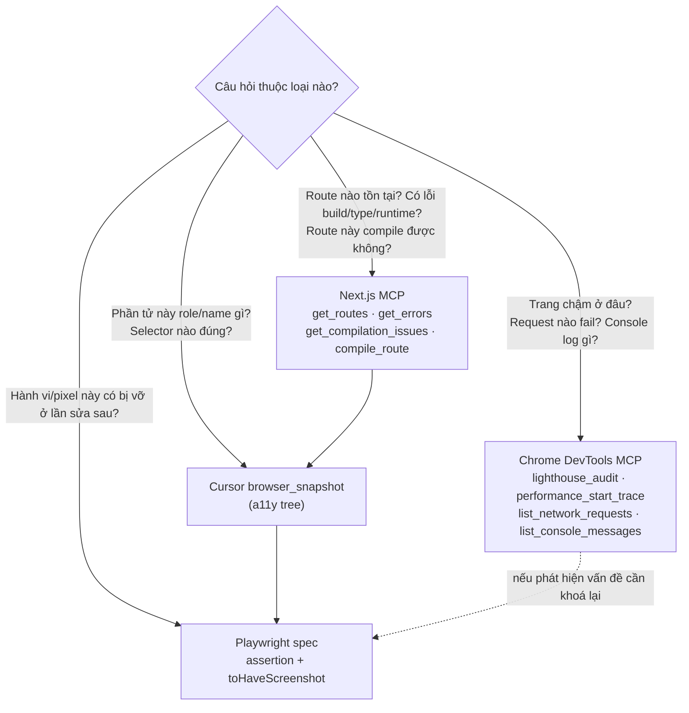

# p0-04 — MCP Toolchain: Next.js MCP + Chrome DevTools MCP + Cursor Browser + Playwright

Trả lời trực tiếp yêu cầu user (18/09): *"nghiên thêm MCP của Next.js v16 có thiết lập và giúp dễ
dàng test hoặc tìm vấn đề không? … tích hợp sức mạnh của Playwright, Cursor Chrome, Next.js MCP và
Chrome MCP"*.

**Kết luận ngắn: CÓ, đáng thiết lập — nhưng chỉ tốn 1 file `.mcp.json` 6 dòng.** Next.js 16 đã có MCP
server **built-in**, không phải cài thêm runtime. Phần đáng viết plan là **phân vai** 4 công cụ —
nếu không, agent sẽ dùng sai tool và tốn gấp 3 số lượt.

Phụ thuộc [p0-01](p0-01-playwright-foundation.plan.md) (cần dev server chạy được).

---

## 1. Next.js MCP có thật — bằng chứng đo trên đĩa, không theo tài liệu online

`apps/backoffice` dùng `next@^16.3.5`. Kiểm tra trong `node_modules`:

```
apps/backoffice/node_modules/next/dist/server/mcp/
├── get-or-create-mcp-server.js
├── get-mcp-middleware.js
└── mcp-telemetry-tracker.js
apps/backoffice/node_modules/next/dist/compiled/@modelcontextprotocol/sdk/server/mcp.js
apps/backoffice/node_modules/next/dist/docs/01-app/02-guides/mcp.md
```

Tài liệu **bundled cùng version** tại
`apps/backoffice/node_modules/next/dist/docs/01-app/02-guides/mcp.md`. Nội dung xác nhận:

> *Next.js 16+ includes a built-in MCP endpoint at `/_next/mcp` that runs within your development
> server.*

`next-devtools-mcp` (npm, `0.4.0` tại 18/09/2026) là **stdio bridge** nối Cursor tới endpoint đó —
nó tự discover dev server đang chạy (kể cả nhiều port).

### 1.1 Tool có sẵn — liệt kê từ SOURCE, không từ docs

`ls apps/backoffice/node_modules/next/dist/server/mcp/tools/` → **10 file**, tức đây là danh sách
đầy đủ của đúng version đang dùng:

| Tool | Trả về | Thay thế việc gì hiện đang làm bằng shell |
|---|---|---|
| `get_errors` | build error + runtime error + **type error**, gom theo browser session | Đọc log terminal bằng mắt |
| `get_routes` | mọi route (appRouter/pagesRouter), dynamic segment hiện `[param]`/`[...slug]` | `find src/app -name page.tsx` (86 file) |
| `get_compilation_issues` | warning/error toàn project từ bundler (**Turbopack only**) | `pnpm build` (chậm) |
| `compile_route` | compile 1 route theo `routeSpecifier`/`path`, **không cần HTTP request** | `pnpm build` để biết 1 route có compile |
| `get_page_metadata` | route/component/rendering info của 1 page | Đọc code suy ra |
| `get_project_metadata` | cấu trúc project + **dev server URL** | `cat next.config.ts` + đoán port |
| `get_server_action_by_id` | map Server Action ID → file + tên hàm | Không có cách nào khác |
| `get_logs` | đường dẫn file log (console browser + server output) | Copy tay từ terminal |
| `get_request_insights` | timeline request App Router: **slow render, server fetch, cache behavior** — cần opt-in, xem §1.2 | OTEL collector ngoài |
| (`next_instance_error_state`) | trạng thái lỗi nội bộ của instance | — |

**`get_compilation_issues` + `compile_route` là Turbopack-only** — app này dùng Turbopack cho cả
`dev` và `build` (`next.config.ts` có `turbopack.rules` cho `*.md`) → **dùng được**.

### 1.2 `get_request_insights` — CHƯA bật, và đáng bật (tuỳ chọn)

Đọc source `tools/get-request-insights.js`, nó fail sớm với message:

> *Request Insights is not enabled. Set `experimental.requestInsights = true` in `next.config.js` and
> restart `next dev`.*

`apps/backoffice/next.config.ts` hiện có `experimental.instantInsights` (**khác option**, phục vụ
Instant Navigation — xem [p1-02](p1-02-navigation-regression-e2e.plan.md)), **không** có
`requestInsights`.

Description của tool: *"Useful for debugging slow renders, server fetches, cache behavior, and
request timelines without an external OTEL collector."* — với app có `cacheComponents: true` và mỗi
trang Ops Hub bơm 1 snapshot lớn, đây là công cụ đúng để trả lời *"chậm ở render hay ở fetch?"*.

**Đề xuất (không bắt buộc, cần user đồng ý vì sửa `next.config.ts`):**

```typescript
experimental: {
  instantInsights: { validationLevel: "manual-warning" },  // đang có, giữ nguyên
  requestInsights: true,                                   // THÊM — dev-only, chỉ để debug
},
```

Rủi ro: option `experimental`, có overhead ghi span. **Chỉ thêm nếu thực sự cần debug perf**, và cân
nhắc gate theo `process.env.NODE_ENV !== "production"`. Nếu không bật, `get_request_insights` chỉ
trả error string — vô hại, không phải lỗi thiết lập.

### 1.3 Giá trị thật cho repo này (không phóng đại)

| Việc | Cách cũ | Với MCP |
|---|---|---|
| Xác nhận route Ops Hub tồn tại + đúng dynamic segment | `find` 86 `page.tsx`, đọc tay | `get_routes` |
| Kiểm 1 route có compile sau khi sửa | `pnpm build` (kéo 7 game package, rất chậm) | `compile_route` |
| Bắt lỗi runtime chỉ xuất hiện trong browser | Mở browser, xem console bằng mắt | `get_errors` |
| Type error | `pnpm check-types` (vẫn nên chạy) | `get_errors` gộp luôn |

**Không thay được `pnpm check-types` và `pnpm lint`** — MCP chỉ thấy những gì dev server biết.
Rule [`gitnexus-code-graph.mdc`](../../rules/gitnexus-code-graph.mdc) §4 đã chốt: `tsc` là nguồn chân
lý cho type, `oxlint` cho lint. Nguyên tắc đó áp dụng y nguyên ở đây.

## 2. Thiết lập — 1 file, không sửa gì trong app

### 2.1 `.mcp.json` ở **root repo** — MỚI

Repo hiện **chưa có** `.mcp.json` (đã kiểm: chỉ có `.cursor/mcp.json` khai `gitnexus`).

```json
{
  "mcpServers": {
    "next-devtools": {
      "command": "npx",
      "args": ["-y", "next-devtools-mcp@latest"]
    }
  }
}
```

**Đặt ở root, không phải `apps/backoffice/`** — `next-devtools-mcp` tự discover dev server qua port,
không cần đứng cùng thư mục. Đặt ở root thì mọi session Cursor (mở ở root như hiện tại) đều thấy.

**Vì sao `.mcp.json` mà không thêm vào `.cursor/mcp.json`:** `.mcp.json` là convention được chính
Next.js docs chỉ định và **cross-tool** (Claude Code, Codex, Copilot đều đọc) — file này phục vụ cả
team dùng tool khác nhau. `.cursor/mcp.json` giữ nguyên cho `gitnexus` (Cursor-specific). Không gộp.

### 2.2 KHÔNG cần sửa `next.config.ts`

Endpoint `/_next/mcp` bật sẵn ở `next dev`, không có flag nào phải thêm. Điều duy nhất cần: **dev
server phải đang chạy** (`pnpm --filter @megawin/backoffice dev`).

### 2.3 Điều kiện đã thoả sẵn — không phải làm gì

- `AGENTS.md` + `CLAUDE.md` của `apps/backoffice` **đã được `next dev` tự sinh** (khối
  `<!-- BEGIN:nextjs-agent-rules -->`, trỏ agent tới docs bundled). Không cần tạo tay.
- `agentRules` **không** bị tắt trong `next.config.ts` → giữ nguyên.
- Docs bundled đã có tại `node_modules/next/dist/docs/` → agent đọc trực tiếp được, không cần network.

## 3. Phân vai 4 công cụ — quy tắc CHỌN, không phải danh sách

Đây là phần có giá trị nhất của phase. Nguyên tắc một dòng:

> **MCP để TÌM và THIẾT KẾ (một lần, tương tác). Playwright để CHỐT (lặp lại, tự động).**

### 3.1 Cây quyết định



### 3.2 Bảng chống dùng sai

| Đừng làm | Làm thay thế | Vì sao |
|---|---|---|
| Viết Playwright spec để "xem trang có gì" | `browser_snapshot` | Spec cần chạy dev server + compile; snapshot trả a11y tree ngay |
| Đoán selector rồi chạy `test:e2e` sửa dần | `browser_snapshot` **trước**, viết đúng 1 lần | Bản plan cũ đoán `?tab=needs_action` → sai (`00-overview.md` §2.5) |
| `find src/app -name page.tsx` | `get_routes` | 86 file, và `find` không biết route group `(main)` map thế nào |
| `pnpm build` để check 1 route | `compile_route` | Build kéo 7 game package + Mongo driver |
| Dùng `lighthouse_audit` để test regression | Playwright + assertion | Lighthouse không có baseline, điểm số dao động |
| Dùng `browser_take_screenshot` (Cursor) làm baseline | `toHaveScreenshot()` | Không có diff engine, không lưu baseline, không chạy CI |
| Hỏi agent "trang có lỗi gì" rồi tự đọc terminal | `get_errors` | Lỗi runtime browser không có trong terminal (trừ khi `browserToTerminal`) |

### 3.3 Vòng lặp chuẩn khi viết 1 spec mới

```
1. get_routes                     → xác nhận route + dynamic segment THẬT
2. compile_route                  → route compile sạch chưa (rẻ hơn build)
3. browser_navigate + browser_snapshot → lấy role/name/testid THẬT của phần tử cần assert
4. get_errors                     → trang có lỗi runtime/hydration nào đang ẩn không
5. Viết spec: getByRole(...) + expect + toHaveScreenshot()
6. test:e2e --repeat-each=3        → chứng minh không flaky (p0-03)
```

Bước 4 hay bị bỏ qua nhưng quan trọng: nếu trang đang có hydration error, screenshot có thể chụp
đúng nhưng hành vi sai — và baseline sẽ "hợp lệ hoá" trạng thái lỗi đó.

## 4. Guardrail cho agent — tránh 3 lỗi tốn lượt

Ghi vào rule ở [p1-03](p1-03-review-workflow-and-guardrail.plan.md) §3 (cùng file rule, không tạo
rule thứ hai):

1. **Không tự chạy `pnpm dev`/`next dev` rồi để chạy nền vô thời hạn.** `next dev` của app này kéo
   Mongo driver + 7 game package — tiến trình nặng. Playwright `webServer` đã tự quản
   (`reuseExistingServer`). Nếu cần dev server cho MCP: **nói user chạy**, hoặc chạy có thời hạn rồi
   dừng. Đây là mirror của [`gitnexus-code-graph.mdc`](../../rules/gitnexus-code-graph.mdc) §5
   ("Agent KHÔNG tự chạy `analyze`/`--watch`").
2. **MCP không khả dụng → NÓI RÕ, đừng lặng lẽ fallback.** Nếu `next-devtools` không kết nối (dev
   server chưa chạy / `.mcp.json` chưa load), báo user thay vì âm thầm `find`/`grep` rồi kết luận
   như thể đã dùng graph. Cùng nguyên tắc `gitnexus-code-graph.mdc` §2.
3. **Kết quả MCP không thay `pnpm check-types` / `oxlint`.** `get_errors` là **bổ sung**, không phải
   thay thế. Checklist kết thúc task vẫn theo
   [`oxlint-lint-conventions.mdc`](../../rules/oxlint-lint-conventions.mdc) §g.

## 5. Ranh giới với GitNexus — KHÔNG trùng

Repo đã có `project-0-megawin-gitnexus` (17 tool). Hai MCP này trả lời **hai loại câu hỏi khác nhau**:

| Câu hỏi | Dùng |
|---|---|
| "Sửa `HubGateTab` thì vỡ những đâu?" (quan hệ symbol, blast radius) | **GitNexus** `impact`/`cypher` |
| "Route `/games/keno/operations-hub` có tồn tại, compile được, đang lỗi gì?" | **Next.js MCP** |
| "Component nào gọi API route này?" | **Grep** — `gitnexus-code-graph.mdc` §3 ghi rõ `route_map` có `consumers` **rỗng ở cả 347 route** |

Next.js MCP **không** thay được GitNexus cho câu hỏi quan hệ code, và GitNexus **không** thấy runtime
state. Dùng đúng chỗ.

## Verify

1. Restart Cursor sau khi tạo `.mcp.json` → `GetDynamicTools` thấy namespace `next-devtools`
   (hoặc tên tương đương). **Nếu không thấy → báo user, đừng bỏ qua.**
2. `pnpm --filter @megawin/backoffice dev` đang chạy, gọi `get_project_metadata` → trả đúng dev
   server URL (`http://localhost:3000`).
3. `get_routes` → xác nhận thấy `/games/keno/operations-hub` và `/games/bingo18/operations-hub`.
   **Đây là bằng chứng phase này hữu ích thật**, không chỉ "cài được".
4. `compile_route` với `path: "/games/keno/operations-hub"` → trả về compilation issue (hoặc sạch).
5. `get_errors` khi trang đang mở → so với những gì thấy trong DevTools console. Nếu lệch, ghi lại
   giới hạn vào plan này.
6. `browser_snapshot` trên `/login` → lấy được accessible name thật của nút đăng nhập, đối chiếu
   với giả định ở [p0-01](p0-01-playwright-foundation.plan.md) §5.

## Không làm

- Không sửa `next.config.ts` (endpoint MCP bật sẵn ở dev; `agentRules` đang mặc định = đúng).
- Không commit sửa đổi vào khối `<!-- BEGIN:nextjs-agent-rules -->` của `AGENTS.md`/`CLAUDE.md` —
  `next dev` tự ghi lại, sửa tay là tạo diff vô nghĩa lặp lại.
- Không cài `next-devtools-mcp` vào `package.json` — `npx -y` là cách dùng đúng (tool dev, không
  phải dependency của app).
- Không cài `agent-browser` (vercel-labs) hay skill `next-dev-loop` ở phase này — repo đã có
  `cursor-ide-browser` + `user-chrome-devtools` phủ cùng nhu cầu (DOM/console/network/perf). Thêm
  nữa là 3 công cụ chồng vai. Ghi nhận để xét lại nếu 2 tool hiện có tỏ ra thiếu.
- Không dùng MCP thay cho `pnpm check-types`/`oxlint` (§4.3).
- Không để agent tự bật dev server chạy nền dài hạn (§4.1).
