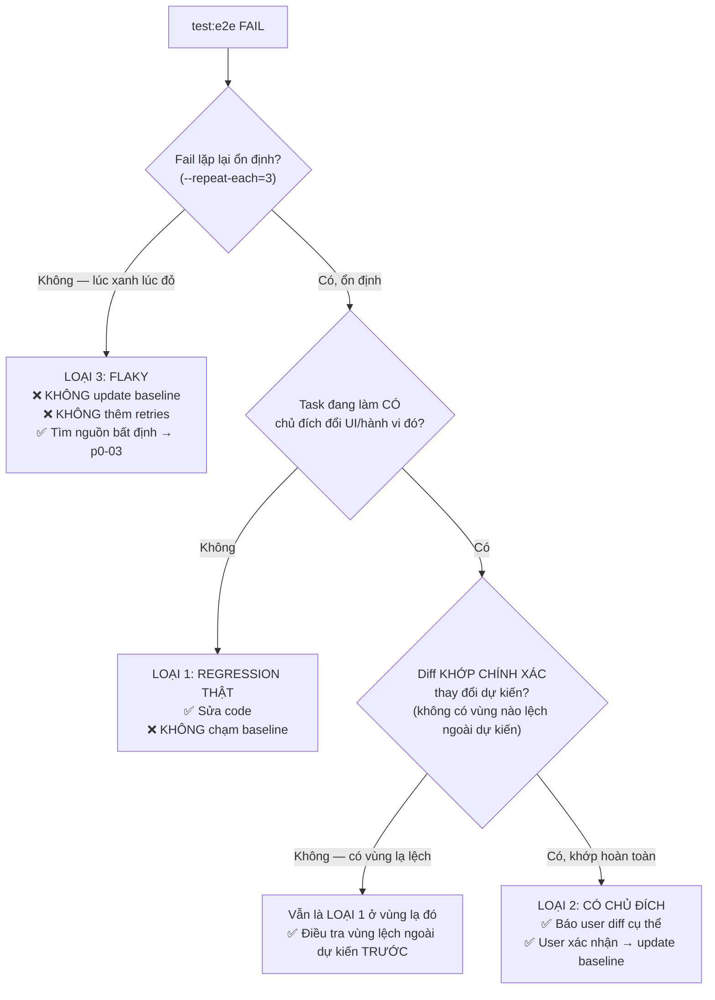

# p1-03 — Review Workflow (diff) + Agent Guardrail

Định nghĩa quy trình xem/duyệt diff khi `test:e2e` fail, và rule chặn agent "sửa" fail bằng cách
update baseline. Không phụ thuộc [p1-01](p1-01-ops-hub-e2e.plan.md) (làm song song được) nhưng nên
xong **trước khi** baseline đầu tiên được review thật.

Phụ thuộc [p0-01](p0-01-playwright-foundation.plan.md).

---

## 1. Xem diff — dùng report có sẵn, KHÔNG cài thêm gì

`playwright.config.ts` ([p0-01](p0-01-playwright-foundation.plan.md) §2) đã cấu hình
`reporter: [["html", …], ["list"]]` + `trace: "retain-on-failure"`. Khi fail:

```bash
pnpm --filter @megawin/backoffice exec playwright show-report playwright-report
```

HTML report có sẵn 3 ảnh side-by-side (expected / actual / diff) cho mỗi test fail, **cộng trace
viewer** (timeline DOM + network + console tại thời điểm fail). Đây là flow mặc định — không
dependency ngoài.

Với test **hành vi** (không có ảnh), trace viewer là công cụ chính: xem được DOM snapshot từng bước
và request thật.

UI mode cho vòng lặp debug nhanh hơn:

```bash
pnpm --filter @megawin/backoffice test:e2e:ui
```

## 2. Cây quyết định khi fail — 3 loại fail, 3 cách xử khác nhau

Bản 17/09 chỉ phân biệt "regression thật" vs "đổi có chủ đích". Thiếu loại thứ ba, và đó chính là
loại phổ biến nhất ở trang Ops Hub.



**Loại 3 (flaky) là loại dễ xử sai nhất.** Phản xạ tự nhiên là `--update-snapshots` (ảnh mới "đúng"
hơn) hoặc `retries: 1`. Cả hai đều **che** vấn đề: lần sau baseline lại lệch, và lần đó có thể trùng
với một bug thật. Nguồn bất định ở trang này đã được liệt kê ở
[p0-03](p0-03-determinism-and-testids.plan.md) §1 — quay lại đó trước.

## 3. Rule guardrail — `.cursor/rules/e2e-baseline-and-flaky.mdc` (MỚI)

Mở rộng so với bản cũ: thêm mục flaky và mục MCP/dev-server (từ
[p0-04](p0-04-mcp-toolchain.plan.md) §4). **Một rule duy nhất**, không tách nhiều file.

```markdown
---
description: Quy tắc khi Playwright E2E fail — không tự update baseline, không che flaky, không tự bật dev server.
globs:
  - "apps/backoffice/test/e2e/**"
  - "apps/backoffice/playwright.config.ts"
alwaysApply: false
---

# E2E Backoffice — Baseline, Flaky & Dev Server

## 1. KHÔNG tự update baseline

Khi `pnpm --filter @megawin/backoffice test:e2e` fail vì screenshot lệch:

1. **KHÔNG tự chạy `test:e2e:update`** để làm fail biến mất. Baseline là "bản đã được NGƯỜI duyệt";
   agent tự update = tự duyệt hộ, và sẽ hợp lệ hoá luôn cả bug nếu đó là bug.
2. Phân loại theo cây quyết định (`.cursor/plans/ui-visual-regression/p1-03-review-workflow-and-guardrail.plan.md` §2):
   regression thật / có chủ đích / flaky. Ba loại xử khác nhau.
3. Nếu **có chủ đích**: báo user diff cụ thể (đường dẫn ảnh actual/expected), đề xuất
   `test:e2e:update`, **để user tự chạy hoặc xác nhận tường minh** trước khi agent chạy hộ.
4. Nếu **không chắc** → dừng, báo user. KHÔNG đoán rồi update.

## 2. KHÔNG che flaky

- **KHÔNG** thêm `retries` vào `playwright.config.ts` để làm xanh test lúc xanh lúc đỏ.
- **KHÔNG** nới `maxDiffPixelRatio` / thêm `mask` tràn lan để "cho qua".
- **KHÔNG** thêm `waitForTimeout(n)` để chờ cho chắc.
- Chứng minh flaky bằng `test:e2e --repeat-each=5`, rồi sửa **nguyên nhân**: đóng băng thời gian
  (`page.clock`), mock network (`page.route`), web-first assertion thay vì `networkidle`.
  Xem `p0-03-determinism-and-testids.plan.md`.

## 3. KHÔNG sửa code production để test dễ hơn

Không đổi cấu trúc DOM/class/logic chỉ để selector dễ viết. Ngoại lệ duy nhất: thêm
`data-testid`/`role`/`aria-*` khi không có selector semantic — và phải nêu lý do trong PR.
`interval-registry.ts`, `use-hub-query.ts`, `proxy.ts` là code đã tối ưu/bảo mật có chủ đích:
test phải thích ứng, không ngược lại.

## 4. KHÔNG tự bật dev server chạy nền dài hạn

`next dev` của backoffice kéo Mongo driver + 7 game package — tiến trình nặng. Playwright
`webServer` tự quản (`reuseExistingServer`). Nếu cần dev server cho Next.js MCP: nói user chạy,
hoặc chạy có thời hạn rồi dừng.

## 5. MCP không thay `check-types` / `oxlint`

`get_errors` của Next.js MCP là **bổ sung**. Checklist kết thúc task vẫn theo
`oxlint-lint-conventions.mdc` §g: `oxlint <paths>` + `prettier --write <paths>` + `check-types`.
```

Đây là mirror đúng pattern đã có ở [`test-data-safety.mdc`](../../rules/test-data-safety.mdc) (agent
không tự xoá dữ liệu không scope) — cùng nguyên tắc: **agent không tự "duyệt" thay người**.

## 4. Quy ước commit baseline

- Baseline (`test/e2e/**/*-snapshots/*.png`) **PHẢI commit** cùng PR với spec sinh ra nó.
- PR đổi baseline **phải nói rõ vì sao** từng ảnh đổi. PR kiểu *"update snapshots"* không có giải
  thích → reviewer trả lại.
- PR **chỉ** đổi baseline mà không đổi code UI nào là **dấu hiệu đỏ**: nghĩa là có gì đó lệch mà
  không ai biết nguồn (thường là flaky hoặc môi trường khác nhau — VD chạy trên macOS vs Linux,
  font khác). Điều tra trước khi merge.

**Cảnh báo về font/OS:** screenshot phụ thuộc font rendering. Baseline chụp trên macOS **sẽ** lệch
khi chạy trên Linux CI. Đây là vấn đề phải giải ở [p2-02](p2-02-rollout-and-ci.plan.md) §4 (chạy
trong Docker image giống CI để sinh baseline) — ghi nhận ở đây để không ai ngạc nhiên.

## 5. `diffscope` — ghi nhận, KHÔNG cam kết

[`bricebdht/diffscope`](https://github.com/bricebdht/diffscope): web app tĩnh (không backend, không
npm package) đọc `playwright-report/index.html` bằng drag-and-drop, duyệt side-by-side + phím tắt
Approve/Needs Changes/Skip, lưu tiến trình vào `localStorage`.

**Repo rất nhỏ (1 star, mới)** — coi là thử nghiệm cá nhân, **KHÔNG** phải dependency của quy trình.
Muốn thử: clone về máy, mở local, kéo-thả folder `playwright-report/`. Không thêm vào `package.json`.

HTML report gốc của Playwright đã đủ cho 10 baseline của `p1-01`. Xét lại nếu số baseline lên hàng
trăm sau `p2-02`.

## Verify

1. Sửa 1 style trong Ops Hub (VD đổi padding của KPI card) → `test:e2e` fail, mở report thấy diff
   đúng vùng đó. Revert → xanh lại.
2. Sửa 1 **hành vi** (VD đổi label 1 tab trong `HUB_GATE_TAB_LABELS`) → behaviour spec fail với
   message đọc được ngay (không cần mở ảnh). Revert.
3. Rule mới: `glob` chỉ khớp `apps/backoffice/test/e2e/**` + `playwright.config.ts` — **không** khớp
   `test/unit/` (Vitest, khác mục đích, không có baseline).
4. Đọc lại rule bằng mắt: mỗi mục có nêu **lý do**, không chỉ "cấm". Rule không giải thích lý do
   thì agent sẽ bỏ qua khi thấy bất tiện.

## Không làm

- Không cài `diffscope` như dependency chính thức (§5).
- Không tạo bot GitHub tự comment PR — cần CI trước ([p2-02](p2-02-rollout-and-ci.plan.md) §3).
- Không tạo nhiều file rule cho cùng chủ đề — 1 file `e2e-baseline-and-flaky.mdc`.
- Không đặt `alwaysApply: true` cho rule này — nó chỉ liên quan khi làm việc trong `test/e2e/`;
  `alwaysApply: true` sẽ tốn context của mọi task không liên quan.
