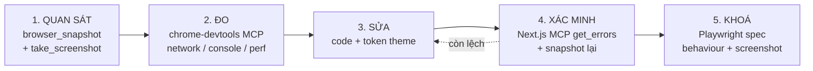

# p2-01 — Vòng lặp thiết kế sản phẩm có MCP hỗ trợ

Đây là phần user yêu cầu tường minh: *"tích hợp sức mạnh của playwright, cursor chrome, nextjs mcp và
chrome mcp hãy lên plan chi tiết hỗ trợ **viết thiết kế sản phẩm** và test tốt nhất"*.

`p0-04` mô tả **tool nào làm gì**. File này mô tả **quy trình làm việc**: khi thiết kế/sửa một trang
backoffice, dùng 4 tool đó theo thứ tự nào, kiểm chứng ra sao, và output là gì.

Phụ thuộc [p0-04](p0-04-mcp-toolchain.plan.md). Không phụ thuộc `p1-*` (có thể dùng ngay, kể cả khi
chưa có test nào).

---

## 1. Vấn đề đang giải: agent thiết kế UI mà **không nhìn thấy** UI

Hiện tại khi agent sửa 1 trang backoffice, nó chỉ đọc `.tsx` rồi suy ra kết quả. Hệ quả đã xảy ra
thật trong repo này:

| Sự cố thật | Vì sao đọc code không bắt được |
|---|---|
| "Load liên tục" 04/09 (xem `backoffice-nav-performance/01-analysis.md`) | Hành vi mạng khi hover — chỉ thấy khi quan sát network runtime |
| Ops Hub tab `needs_action` bị xoá mà plan cũ vẫn tham chiếu | Agent viết plan từ ký ức, không mở trang xem tab thật |
| Selector `?tab=` vs `?gate=` trong plan cũ | Đọc code không kỹ; mở trang là thấy ngay URL thật |

Vòng lặp dưới đây buộc agent **quan sát trước khi khẳng định**.

## 2. Vòng lặp 5 bước



Nguyên tắc: **bước 1–4 là interactive, một lần, có người xem. Bước 5 là tự động, lặp mãi.** Đừng
dùng MCP cho việc lặp lại (chậm, cần dev server, không chạy được trên CI); đừng dùng Playwright cho
việc khám phá (viết spec để "xem thử" là ngược).

### Bước 1 — Quan sát (Cursor IDE browser)

```
browser_navigate → http://localhost:3000/games/keno/operations-hub
browser_snapshot   → cây accessibility: role, accessible name, ref
browser_take_screenshot → ảnh để agent tự nhìn
```

`browser_snapshot` trả về **đúng** accessible name mà `getByRole` cần. Đây là nguồn chân lý cho
selector — không đoán từ `.tsx`.

`browser_take_screenshot` trả ảnh mà agent **nhìn được** (không phải JSON). Dùng để tự đánh giá khoảng
trắng, thứ tự thị giác, chỗ tràn chữ.

### Bước 2 — Đo (chrome-devtools MCP)

| Câu hỏi thiết kế | Tool |
|---|---|
| Trang có request thừa / storm không? | `list_network_requests` |
| Có warning React / hydration mismatch? | `list_console_messages` |
| Vào trang chậm ở đâu? | `performance_start_trace` → `performance_analyze_insight` |
| Hỏng ở mobile/tablet? | `resize_page` → `take_screenshot` |
| Tính đúng layout/CLS? | `lighthouse_audit` |

Đây là phần **Playwright không thay được**: Playwright cho pass/fail, chrome-devtools cho *vì sao*.

### Bước 3 — Sửa, theo token theme (KHÔNG tự phát minh màu)

`apps/backoffice/src/app/globals.css` đã định nghĩa đủ token semantic — **dùng lại, không hardcode**:

| Ý nghĩa | Token | Sai nếu viết |
|---|---|---|
| Lãi / số dương | `text-profit` `bg-profit` | `text-emerald-600` |
| Lỗ / số âm | `text-loss` `bg-loss` | `text-red-500` |
| Cảnh báo | `text-warning` | `text-amber-600` |
| Thông tin | `text-info` | `text-blue-500` |
| Màu theo game | `bg-game-keno` `bg-game-keno-muted` (7 game) | `bg-sky-700` |

`oxlint` rule `@shadcn/no-raw-colors` + `no-arbitrary-values` đã chặn ở tầng lint
([`oxlint-lint-conventions.mdc`](../../rules/oxlint-lint-conventions.mdc) §f). Biết trước để không
viết sai rồi phải sửa.

> **Lưu ý lịch sử:** skill `frontend-design` từng tồn tại ở `.cursor/skills/` và **đã bị xoá**
> (18/09). Nó khuyến khích *"font độc đáo, màu bold, gradient mesh, noise texture, custom cursor"* và
> `description` của nó khớp cả *"dashboards, React components, styling any web UI"* → tự kích hoạt khi
> sửa backoffice, nơi đã chốt shadcn + token và `oxlint` chặn raw color. Nếu sau này làm
> `apps/operator-web` (B2C player-facing, chưa có design system) mà cần lại, thêm skill MỚI có
> `description` giới hạn đúng app đó — **không** phục hồi bản cũ. Với backoffice: theo
> [`shadcn/SKILL.md`](../../skills/shadcn/SKILL.md) + token có sẵn.

### Bước 4 — Xác minh (Next.js MCP + snapshot lại)

```
get_errors      → build/type/runtime error của trang vừa sửa
browser_snapshot → so cây accessibility trước/sau: có mất role nào không?
browser_take_screenshot → tự nhìn lại
```

Rồi **luôn** chạy tool thật (MCP không thay được):

```bash
pnpm --filter @megawin/backoffice check-types
pnpm exec oxlint apps/backoffice/src/<paths-đã-sửa>
pnpm exec prettier --write apps/backoffice/src/<paths-đã-sửa>
```

### Bước 5 — Khoá bằng Playwright

Chỉ khoá **quyết định thiết kế** đáng bảo vệ, không khoá mọi pixel:

- Thứ tự & nhãn tab, nhãn cột bảng → behaviour spec.
- Layout tổng thể của trang → 1 screenshot full-page.
- Empty state / error state → screenshot riêng (dễ bị bỏ quên khi refactor).
- KHÔNG khoá từng card, từng badge riêng lẻ — 30 baseline nhỏ tạo 30 chỗ vỡ.

## 3. Prompt mẫu — copy thẳng

**Khảo sát trang trước khi sửa:**

```
Mở http://localhost:3000/games/keno/operations-hub bằng cursor-ide-browser.
Chạy browser_snapshot + browser_take_screenshot.
Liệt kê: (a) tất cả role=tab kèm accessible name, (b) tất cả cột của bảng,
(c) mọi chỗ text bị tràn/cắt.
Rồi dùng chrome-devtools list_console_messages báo warning nếu có.
Chưa sửa gì — chỉ báo cáo.
```

**Kiểm tra responsive:**

```
resize_page 1280x800 → take_screenshot, rồi 768x1024 → take_screenshot.
Chỉ ra phần nào vỡ ở 768px. Đề xuất sửa bằng class layout Tailwind
(KHÔNG raw color, KHÔNG arbitrary value).
```

**Điều tra chậm:**

```
performance_start_trace, điều hướng /dashboard → /games/keno/operations-hub,
performance_stop_trace, rồi performance_analyze_insight cho insight nặng nhất.
Nêu rõ: kết luận nào từ trace, kết luận nào từ đọc code.
```

## 4. Bổ sung `AGENTS.md` cho backoffice — chống trôi kiến thức

Next.js 16 đọc `AGENTS.md` để trỏ agent tới docs đúng version. Root `AGENTS.md` **đã bị GitNexus
chiếm** (auto-generated, gitignored — xem
[`gitnexus-code-graph.mdc`](../../rules/gitnexus-code-graph.mdc)). Vì vậy tạo file **riêng cho app**:
`apps/backoffice/AGENTS.md`.

```markdown
# Backoffice — Agent Notes

## Trước khi sửa UI
1. Mở trang bằng `cursor-ide-browser` (`browser_navigate` + `browser_snapshot`) — lấy accessible
   name thật, không đoán từ `.tsx`.
2. Màu/spacing: dùng token trong `src/app/globals.css` (`profit`, `loss`, `warning`, `info`,
   `game-<key>`). KHÔNG raw Tailwind palette — `oxlint` chặn.
3. KHÔNG áp skill `frontend-design` vào app này (đã có design system shadcn).

## Sau khi sửa
`pnpm --filter @megawin/backoffice check-types` + `oxlint <paths>` + `prettier --write <paths>`.
Nếu có spec E2E liên quan: `pnpm --filter @megawin/backoffice test:e2e`.
Fail vì screenshot → đọc `.cursor/rules/e2e-baseline-and-flaky.mdc`, KHÔNG tự update baseline.

## Cấu hình dễ hiểu sai
- `staleTimes: { dynamic: 1800 }` trong `next.config.ts` là **có chủ đích** — sửa xuống 0 sẽ tái phát
  sự cố "load liên tục" 04/09. Xem `.cursor/plans/backoffice-nav-performance/`.
- Ops Hub dùng query param `?gate=` (không phải `?tab=`); giá trị theo `HubGateTab`.
- Dev server nặng (Mongo driver + 7 game package) — đừng bật chạy nền vô hạn.
```

**Xác minh trước khi tạo:** `ls apps/backoffice/AGENTS.md` — nếu đã tồn tại (GitNexus sinh), **bổ
sung vào chứ không ghi đè**; và kiểm tra `git check-ignore apps/backoffice/AGENTS.md` để biết file có
bị gitignore hay không (nếu bị, chuyển nội dung sang `.cursor/rules/` thay vì `AGENTS.md`).

## 5. Ranh giới — không để MCP lấn việc của tool thật

| Việc | Dùng | KHÔNG dùng |
|---|---|---|
| Tìm lỗi type | `pnpm check-types` | `get_errors` làm bằng chứng duy nhất |
| Lint/format | `oxlint` / `prettier` | MCP |
| Đổi tên symbol | TS rename của IDE | find-replace, MCP |
| Callers của symbol | GitNexus `cypher` → **rồi Grep xác nhận** | chỉ graph (lower-bound) |
| Regression lặp lại | Playwright spec | chạy MCP tay mỗi lần |
| Khám phá selector | `browser_snapshot` | đoán từ `.tsx` |

Khi MCP không khả dụng (chưa chạy `next dev`, MCP server chết): **nói rõ với user**, đừng lặng lẽ
chuyển sang đọc code rồi khẳng định như đã quan sát.

## Verify

1. Chạy trọn vòng lặp 5 bước trên **một** trang thật (đề xuất: `/games/keno/operations-hub`) — ghi
   lại từng bước mất bao lâu, bước nào vướng.
2. Xác nhận `browser_snapshot` trả accessible name **khớp** selector dùng trong
   [p1-01](p1-01-ops-hub-e2e.plan.md). Lệch → sửa spec, không sửa snapshot.
3. `apps/backoffice/AGENTS.md`: kiểm tra `git check-ignore` trước khi commit.
4. Thử prompt "Kiểm tra responsive" ở §3 → agent có thực sự `resize_page` rồi chụp, hay chỉ đọc code
   rồi đoán? Nếu đoán, prompt chưa đủ ép buộc — thêm câu *"KHÔNG kết luận trước khi có screenshot"*.

## Không làm

- Không viết Storybook story chỉ để "xem component" — dev server + browser MCP đã đủ
  ([p3-01](p3-01-deferred-storybook-chromatic.plan.md) giữ nguyên trạng thái deferred).
- Không áp `frontend-design` skill vào backoffice (§3).
- Không tạo screenshot baseline trong bước khám phá — baseline chỉ sinh ở bước 5, sau khi thiết kế
  đã chốt.
- Không thêm MCP server thứ 5. Bốn tool hiện tại đã phủ: Next.js MCP, chrome-devtools, cursor
  browser, Playwright.
