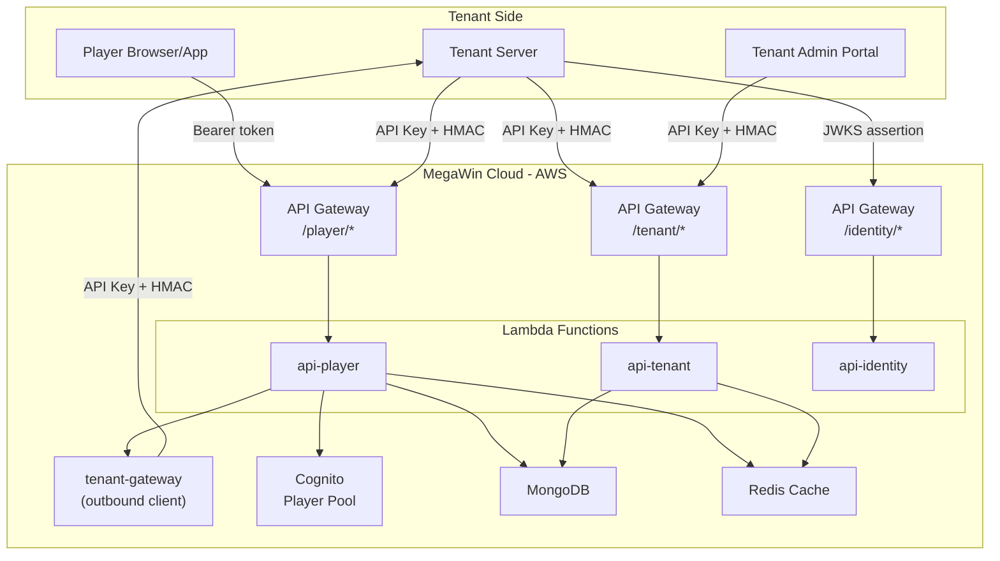
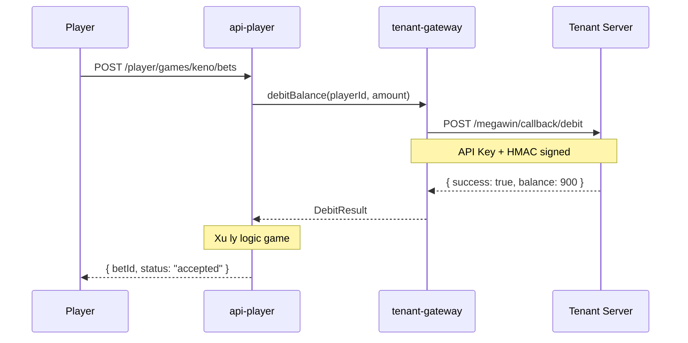
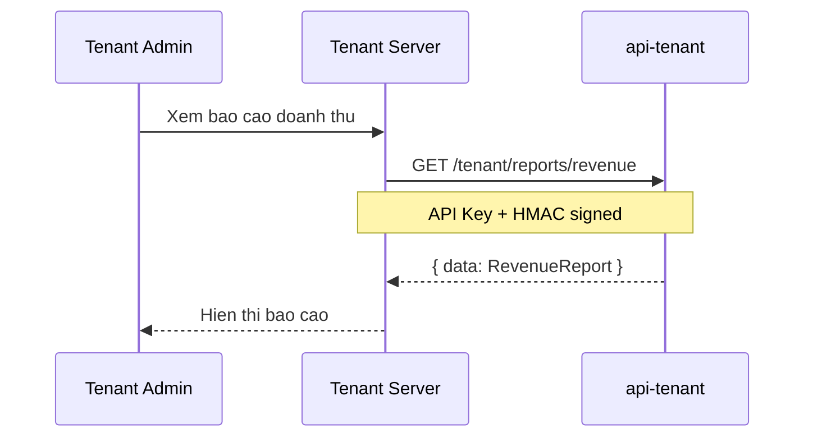

# Kiến trúc API Platform cho MegaWin

## 1. Tổng quan hệ thống



## 2. Ba API Packages mới

### 2a. `apps/api-player` -- Player-facing API

Nhận request từ player (đã auth qua Cognito) hoặc từ tenant server (đại diện player).

```
apps/api-player/
  serverless.yml
  src/
    handlers/
      place-bet.ts              # POST /player/games/{gameId}/bets
      get-game-session.ts       # GET  /player/games/{gameId}/session
      get-balance.ts            # GET  /player/balance
      get-bet-history.ts        # GET  /player/bets
      get-game-result.ts        # GET  /player/games/{gameId}/results/{roundId}
    functions/
      game-endpoint.yml
      balance-endpoint.yml
      bet-endpoint.yml
    middleware/
      player-auth.ts            # Cognito JWT authorizer
      tenant-server-auth.ts     # API Key + HMAC cho server-to-server
```

**Auth model kep:**

- Player truc tiep: Bearer token (Cognito JWT) qua API Gateway Authorizer
- Tenant server thay mat player: API Key header + HMAC signature + player ID trong body

### 2b. `apps/api-tenant` -- Tenant Backoffice API

API cho tenant admin (quản lý player, xem báo cáo, cấu hình game).

```
apps/api-tenant/
  serverless.yml
  src/
    handlers/
      list-players.ts           # GET    /tenant/players
      get-player-detail.ts      # GET    /tenant/players/{playerId}
      suspend-player.ts         # PATCH  /tenant/players/{playerId}/status
      get-reports.ts            # GET    /tenant/reports/revenue
      get-game-config.ts        # GET    /tenant/games/{gameId}/config
      update-game-config.ts     # PUT    /tenant/games/{gameId}/config
    functions/
      player-management-endpoint.yml
      report-endpoint.yml
      game-config-endpoint.yml
    middleware/
      tenant-auth.ts            # API Key + HMAC
```

**Auth model:** Chi API Key + HMAC (khong co player JWT o day).

### 2c. `packages/tenant-gateway` -- Outbound Client goi sang tenant

Package noi bo de MegaWin goi API cua tenant (tru tien, cong tien, gui bao cao...).

```
packages/tenant-gateway/
  package.json
  src/
    index.ts
    client.ts                   # TenantGatewayClient factory
    types.ts                    # Request/Response DTOs
    operations/
      debit-balance.ts          # Trừ tiền player trên hệ thống tenant
      credit-balance.ts         # Cộng tiền khi thắng
      submit-report.ts          # Gửi báo cáo (bet settlement, round result)
      verify-player.ts          # Verify player status trước khi cho chơi
    security/
      hmac-signer.ts            # Ký HMAC cho outbound request
    retry/
      retry-policy.ts           # Exponential backoff + idempotency
```

## 3. Security Layer -- Multi-layer Defense

### Thiết kế lấy cảm hứng từ:

- **Stripe**: API Key + HMAC webhook signatures + idempotency keys
- **AWS**: Signature V4 (HMAC-SHA256 trên canonical request)
- **Twilio**: Account SID + Auth Token + request signing

### 3a. Layer 1 -- Transport Security

- TLS 1.3 bat buoc (API Gateway enforce)
- Certificate pinning khuyen nghi cho tenant-gateway

### 3b. Layer 2 -- API Key Authentication

Moi tenant da co `apiKey` trong `TenantEntity.apiKey`. Dung lam authentication co ban.

```
Header: X-Tenant-Id: {tenantId}
Header: X-Api-Key: {apiKey}
```

### 3c. Layer 3 -- HMAC Request Signing (quan trong nhat)

Chong replay attack, chong tampering. Giong Stripe webhook signature.

**Canonical string:**

```
StringToSign = HTTP_METHOD + "\n"
             + PATH + "\n"
             + SORTED_QUERY_STRING + "\n"
             + SHA256(REQUEST_BODY) + "\n"
             + TIMESTAMP + "\n"
             + NONCE
```

**Signature:**

```
Signature = HMAC-SHA256(apiKey, StringToSign)

Header: X-Signature: sha256={hex_signature}
Header: X-Timestamp: {unix_seconds}
Header: X-Nonce: {uuid}
```

**Verify phia server:**

1. Check `X-Timestamp` trong khoang cho phep (vd: 5 phut) -- chong replay
2. Check `X-Nonce` chua dung (Redis SET EX) -- chong replay
3. Tinh lai HMAC tu request va so sanh -- chong tampering
4. Dung timing-safe comparison

### 3d. Layer 4 -- IP Allowlist (optional)

Tenant co the dang ky danh sach IP duoc phep goi API. Kiem tra o API Gateway level (WAF) hoac middleware.

### 3e. Layer 5 -- Rate Limiting

- Per-tenant rate limit (token bucket, Redis)
- Per-player rate limit (cho api-player)
- Burst protection

### 3f. Tong ket security cho tung luong

| Luong                                     | Auth method                                 |
| ----------------------------------------- | ------------------------------------------- |
| Player truc tiep -> api-player            | Cognito Bearer JWT                          |
| Tenant server -> api-player (thay player) | API Key + HMAC + Player ID                  |
| Tenant admin -> api-tenant                | API Key + HMAC                              |
| MegaWin -> Tenant server                  | API Key + HMAC (signing boi tenant-gateway) |
| Tenant -> api-identity (player login)     | JWKS assertion (da lam)                     |

## 4. Quy tac giao tiep API

### 4a. Request/Response format thong nhat

Da co `ApiResponse<T>` trong `@megawin/shared/api-types`. Tat ca API deu dung chung:

```typescript
// Success
{ "success": true, "data": T, "meta"?: { total, page, ... } }

// Error
{ "success": false, "error": { "code": "...", "message": "...", "details"?: ... } }
```

### 4b. Headers chuan

```
Content-Type: application/json
X-Tenant-Id: {tenantId}              # Bat buoc
X-Api-Key: {apiKey}                  # Bat buoc (server-to-server)
X-Signature: sha256={hmac}           # Bat buoc (server-to-server)
X-Timestamp: {unix_seconds}          # Bat buoc (server-to-server)
X-Nonce: {uuid}                      # Bat buoc (server-to-server)
X-Request-Id: {uuid}                 # Tuy chon, dung cho tracing
X-Idempotency-Key: {uuid}           # Cho mutation requests (POST/PUT)
Authorization: Bearer {jwt}          # Chi player truc tiep
```

### 4c. Idempotency (chong duplicate)

Moi mutation request (dat cuoc, tru/cong tien) phai gui `X-Idempotency-Key`.
Server luu key + response trong Redis (TTL 24h). Request trung key tra response cu.

### 4d. Error codes chuan hoa

Dung `APP_ERROR_CODES` da co, bo sung them cho game domain:

```typescript
// Bo sung vao shared/errors
INSUFFICIENT_BALANCE; // Player khong du tien
GAME_NOT_AVAILABLE; // Game chua mo hoac da dong
ROUND_CLOSED; // Het thoi gian dat cuoc
BET_REJECTED; // Cuoc bi tu choi (limit, rules)
PLAYER_BLOCKED; // Player bi chan
TENANT_DISABLED; // Tenant bi vo hieu hoa
CALLBACK_FAILED; // Goi sang tenant that bai
IDEMPOTENCY_CONFLICT; // Request trung idempotency key nhung body khac
```

## 5. Callback hai chieu

### 5a. MegaWin goi Tenant (qua tenant-gateway)



### 5b. Tenant goi MegaWin (server-to-server)



### 5c. Tenant Callback Endpoint Specification

Tenant phai implement cac endpoint sau de MegaWin goi:

```
POST /megawin/callback/debit         # Trừ tiền
POST /megawin/callback/credit        # Cộng tiền
POST /megawin/callback/rollback      # Hoàn tiền khi lỗi
GET  /megawin/callback/balance       # Kiểm tra số dư
POST /megawin/callback/report        # Nhận báo cáo
```

Tat ca phai verify HMAC signature tu MegaWin.

## 6. Shared Packages can tao/mo rong

### Moi:

- `**packages/tenant-gateway**` -- Outbound HTTP client goi tenant (da mo ta o muc 2c)
- `**packages/security**` -- HMAC signing/verification, nonce management, rate limiter -- dung chung cho ca inbound (middleware) va outbound (tenant-gateway)

### Mo rong:

- `**packages/app-core/src/lambda/middleware/**` -- Them `tenant-hmac-auth.ts` middleware
- `**packages/shared/src/errors/error-codes.ts**` -- Them game domain error codes

## 7. Environment Variables moi can bo sung

```
# Tenant Gateway
TENANT_CALLBACK_TIMEOUT_MS=10000
TENANT_CALLBACK_RETRY_MAX=3

# Security
HMAC_CLOCK_SKEW_SEC=300
NONCE_TTL_SEC=600

# Rate Limiting
RATE_LIMIT_PER_TENANT_RPM=1000
RATE_LIMIT_PER_PLAYER_RPM=100
```

## 8. Monorepo structure tong quat sau khi hoan thanh

```
megawin/
  apps/
    api-identity/          # Da co -- login, account management
    api-player/            # MOI -- Player-facing game API
    api-tenant/            # MOI -- Tenant backoffice API
    backoffice/            # Da co -- MegaWin internal admin (Next.js)
  packages/
    app-core/              # Da co -- Shared Lambda infra, Cognito, middleware
    cache/                 # Da co -- Redis
    data/                  # Da co -- MongoDB
    game-core/             # Da co -- Game logic shared
    game-keno/             # Da co
    game-5_35/             # Da co
    game-max3d/            # Da co
    http-client/           # Da co -- HTTP client
    identity-application/  # Da co -- Identity use cases
    identity-domain/       # Da co -- Identity domain models
    player-sdk/            # Da co -- SDK cho tenant tich hop
    security/              # MOI -- HMAC, nonce, rate limit
    shared/                # Da co -- Errors, types, utils
    tenant-gateway/        # MOI -- Outbound client goi tenant
    ui/                    # Da co
```
