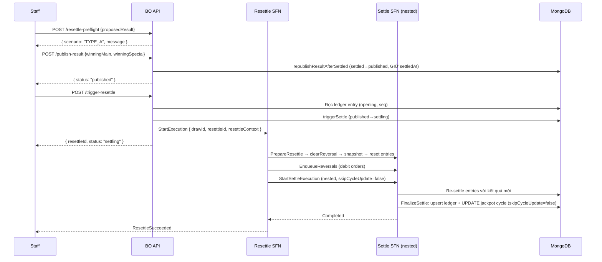

# TYPE_A — Resettle Tự Động Hoàn Toàn

## Điều kiện

- **Chain RỖNG** (`chainLength = 0`) — không có kỳ **đã kết sổ** nào sau T (theo `drawId`, xuyên cycle). **VÀ**
- Trạng thái JP/Split tại kỳ T **KHÔNG thay đổi** (`jpOrSplitAffected = false`): cả kết quả cũ lẫn mới đều **KHÔNG** có winner Jackpot **VÀ** không đổi trạng thái Split (cũ & mới đều roll-over).

> **Có chain ⇒ KHÔNG BAO GIỜ là TYPE_A**: nếu có bất kỳ kỳ đã kết sổ nào sau T (theo `drawId`, xuyên cycle, `chainLength > 0`), luôn là **TYPE_B2** — vì sửa kết quả T đổi `closing(T)` → opening các kỳ sau đổi dây chuyền → split có thể chuyển kỳ. Xem [README](./README.md) mục "Có chain ⇒ LUÔN TYPE_B2". TYPE_A chỉ áp dụng khi `chainLength === 0`.

> **Quan trọng — JP/Split phải KHÔNG đổi cả 2 chiều**: nếu kết quả cũ CÓ winner JP / đã split mà kết quả mới không còn (hoặc ngược lại), đó **KHÔNG** phải TYPE_A mà là TYPE_B1 — vì cycle cũ đã đóng dựa trên winner/split cũ. TYPE_A chỉ áp dụng khi `hasNewJpWinner = false` VÀ `hadOldJpWinner = false` VÀ `newWouldSplit = false` VÀ `hadOldSplit = false`.

## Luồng



## Chi tiết từng bước

### 1. Pre-flight (Staff)

```
POST /api/lotto535/draws/{drawId}/resettle-preflight
{
  "proposedWinningMain": ["05", "12", "23", "34", "35"],
  "proposedWinningSpecial": "07"
}
→ { scenario: "TYPE_A", message: "Kết quả mới không thay đổi Jackpot/Split state (cũ & mới đều roll-over) và không có kỳ settle sau. Có thể resettle tự động." }
```

### 2. Publish kết quả mới (Staff)

```
POST /api/lotto535/draws/{drawId}/publish-result
{
  "winningMain": ["05", "12", "23", "34", "35"],
  "winningSpecial": "07"
}
```

Sau bước này: draw status = `published`, kết quả mới được ghi, `financial`/`stats`/`settleSummary` bị `$unset`. **`settledAt` được GIỮ NGUYÊN** (high-water mark — dùng cho resettle token + check `publishedAt > settledAt`).

### 3. Trigger resettle (Staff)

```
POST /api/lotto535/draws/{drawId}/trigger-resettle
→ { resettleId: "01J...", status: "settling" }
```

Hệ thống tự động thực hiện toàn bộ, không cần thêm hành động từ Staff hay DBA.

### 4. Kết quả

- Entries cũ được reset về `Scheduled`.
- Debit orders (hoàn tiền payout cũ) được enqueue vào outbox.
- Settle SFN re-settle với kết quả mới.
- Jackpot cycle được cập nhật tự động (ledger upsert + cycle update).
- Draw status = `settled`.

## Theo dõi

Kiểm tra trạng thái qua draw detail:

```
GET /api/lotto535/draws/{drawId}
→ { status: "settled", settledAt: "...", ... }
```

Nếu sau 15 phút draw vẫn ở `settling`, kiểm tra CloudWatch Logs của Resettle SFN.
