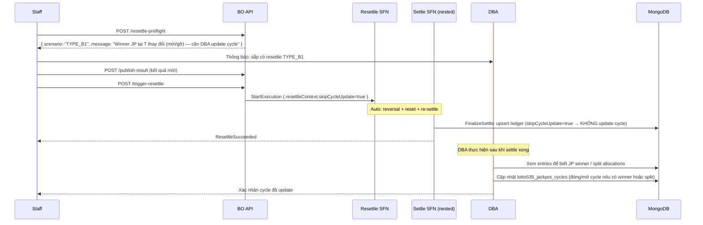

# TYPE_B1 — Auto Payout + DBA Cycle

## Điều kiện

- Chain rỗng (`chainLength = 0`) — kỳ T là kỳ **đã kết sổ mới nhất** trong ledger, không có kỳ đã kết sổ nào sau T (theo `drawId`, xuyên cycle). **VÀ**
- Trạng thái JP/Split tại kỳ T **THAY ĐỔI** (`jpOrSplitAffected = true`), theo bất kỳ chiều nào:
  - **Winner**: chưa có → CÓ winner JP / CÓ → không còn / vẫn có (khác số người/pool).
  - **Split**: không split → split (`newWouldSplit`) / đã split → không còn (`hadOldSplit`).

> **Gỡ winner/split cũ cũng là TYPE_B1**: nếu kết quả cũ có winner JP **hoặc** đã split thì cycle cũ đã **đóng** (closeReason = winner/split) và một cycle mới đã mở. Khi sửa kết quả thành "không winner / không split", cycle cũ đáng lẽ **không được đóng** → DBA phải **mở lại / khôi phục** cycle cũ thay vì đóng/tạo mới. Đây là chiều ngược của Trường hợp đóng cycle.

> **Lưu ý**: điều kiện "chain rỗng" chỉ xét các kỳ **đã kết sổ** (có ledger entry). Trường hợp T đổi JP/split và phía sau còn nhiều kỳ **đang chạy chưa kết sổ** vẫn là TYPE_B1 — vì các kỳ đó chưa có ledger entry, chưa đọc jackpot pool từ T. Sau khi DBA cập nhật cycle, các kỳ đó sẽ tự đọc đúng cycle/pool mới khi đến lượt kết sổ.

## Nguyên tắc

Hệ thống tự động:
- Reversal payout cũ → reset entries → re-settle với kết quả mới.
- `FinalizeSettle` **BỎ QUA** bước `updateJackpotCycle` (`skipCycleUpdate=true`).

DBA can thiệp thủ công:
- Sau khi re-settle xong, DBA cập nhật `lotto535_jackpot_cycles` để phản ánh đúng winner và cycle structure.

## Luồng



## Bước thực hiện

### Staff

1. Gọi `/resettle-preflight` xác nhận TYPE_B1.
2. Thông báo DBA để DBA chuẩn bị.
3. Gọi `/publish-result` với kết quả mới.
4. Gọi `/trigger-resettle`.
5. Theo dõi draw status → `settled`.
6. Báo DBA đã settle xong để DBA update cycle.

### DBA (sau khi settle xong)

#### Bước 1: Xác nhận settle đã hoàn tất

```js
// Kiểm tra draw đã settled
db.lotto535Draws.findOne(
  { drawId: "<DRAW_ID>" },
  { status: 1, settledAt: 1, "jackpot.openingAmount": 1, "jackpot.closingAmount": 1, "jackpot.isSplitCycle": 1 }
)
```

#### Bước 2: Đọc ledger entry mới nhất của kỳ T

```js
db.lotto535JackpotCycleEntries.findOne({ drawId: "<DRAW_ID>" })
// → { cycleNo, seq, opening, contribution, closing, hasJpWinner, didSplit, isSplitCycleAtSettle }
```

#### Bước 3: Đọc active cycle hiện tại

```js
db.lotto535JackpotCycles.findOne({ status: "active" })
// → { cycleNo, currentAmount, totalContribution, drawCount, seedAmount, config, ... }
```

#### Bước 4: Cập nhật cycle

**Trường hợp A — Kết quả mới có winner JP HOẶC split (đóng cycle):**

Cả winner và split đều **đóng cycle hiện tại** và mở cycle mới từ seed. Khác nhau ở `closeReason` và `finalAmount`/`splitDetail`.

```js
// Đóng cycle cũ (đang active)
db.lotto535JackpotCycles.updateOne(
  { cycleNo: <CYCLE_NO> },
  {
    $set: {
      status: "closed",
      closedAt: new Date(),
      endDrawId: "<DRAW_ID>",
      // closeReason = "winner" nếu hasJpWinner, "split" nếu didSplit
      closeReason: ledgerEntry.hasJpWinner ? "winner" : "split",
      // finalAmount = pool đã trao: winner = opening + contribution; split = currentAmount lúc chia
      // winners[] (nếu winner) hoặc splitDetail (nếu split) — đọc từ FinalizeSettle đã ghi
      updatedAt: new Date()
    }
  }
)

// Tạo cycle mới (next cycle) bắt đầu từ seed
db.lotto535JackpotCycles.insertOne({
  cycleNo: <CYCLE_NO + 1>,
  status: "active",
  startDrawId: "<NEXT_DRAW_ID>",
  startedAt: new Date(),
  seedAmount: <seedAmount>,        // từ config
  currentAmount: <seedAmount>,
  peakAmount: <seedAmount>,
  totalContribution: 0,
  drawCount: 0,
  config: { splitThreshold: <splitThreshold>, splitRatios: <splitRatios> },
  createdAt: new Date(),
  updatedAt: new Date()
})
```

**Trường hợp B — Gỡ bỏ winner/split cũ (kết quả cũ CÓ winner/split → mới KHÔNG, chiều ngược):**

Đây là chiều **ngược** với Trường hợp A. Cycle cũ đã bị đóng oan (và cycle mới đã mở oan) dựa trên winner/split cũ — cần khôi phục lại.

```js
// Bối cảnh: ledgerEntry kỳ T cũ có hasJpWinner=true HOẶC didSplit=true → cycle <CYCLE_NO>
// đã bị đóng, cycle <CYCLE_NO + 1> đã được mở với seed. Giờ kết quả mới không còn winner/split.

// 1. Xoá / vô hiệu cycle mới đã mở oan (nếu chưa có kỳ nào khác settle vào nó).
db.lotto535JackpotCycles.deleteOne({ cycleNo: <CYCLE_NO + 1>, drawCount: 0 })
// LƯU Ý: nếu drawCount > 0 (đã có kỳ khác settle vào cycle mới) → KHÔNG xoá được,
// tình huống này thực chất là TYPE_B2 (có chain sau T) — dừng lại, theo type-b2.md.

// 2. Mở lại cycle cũ: status active, khôi phục amount = closing kỳ T MỚI (sau re-settle).
db.lotto535JackpotCycles.updateOne(
  { cycleNo: <CYCLE_NO> },
  {
    $set: {
      status: "active",
      // closing lấy từ ledger entry kỳ T MỚI (sau re-settle, không còn winner/split)
      currentAmount: <ledgerEntry.closing>,
      drawCount: <ledgerEntry.seq>,
      lastSettledDrawId: "<DRAW_ID>",
      updatedAt: new Date()
    },
    $unset: { closedAt: "", endDrawId: "", closeReason: "", splitDetail: "", winners: "" }
  }
)
```

> **Cảnh báo**: nếu cycle mới (`<CYCLE_NO + 1>`) đã có kỳ khác settle vào (`drawCount > 0`), thì pre-flight đã phải phân loại thành **TYPE_B2** (chain sau T không rỗng), không phải B1. Nếu vẫn gặp `drawCount > 0` ở đây, **DỪNG LẠI** và xử lý theo [type-b2.md](./type-b2.md).

**Trường hợp C — Vẫn winner/split nhưng đổi số người/pool (no cycle structure change):**

Cycle vẫn đóng như cũ, chỉ cần cập nhật lại `finalAmount` / `winners` / `splitDetail` cho khớp kết quả mới (FinalizeSettle đã ghi đúng vào cycle đóng — DBA chỉ verify).

#### Bước 5: Xác nhận

```js
db.lotto535JackpotCycles.findOne({ status: "active" })
// Kiểm tra currentAmount, drawCount đúng không
```

## Lưu ý quan trọng

- **KHÔNG** update cycle trước khi settle xong — `FinalizeSettle` đã upsert ledger với giá trị đúng, DBA chỉ cần update active cycle.
- Kiểm tra `ledgerEntry.closing` để biết chính xác số tiền pool cần khôi phục/roll-over.
- **Split**: khi `didSplit=true`, cycle đóng với `closeReason="split"` và `splitDetail` (đã được FinalizeSettle ghi). DBA verify `splitDetail.splitAmount` khớp `ledgerEntry.closing` trước khi split.
