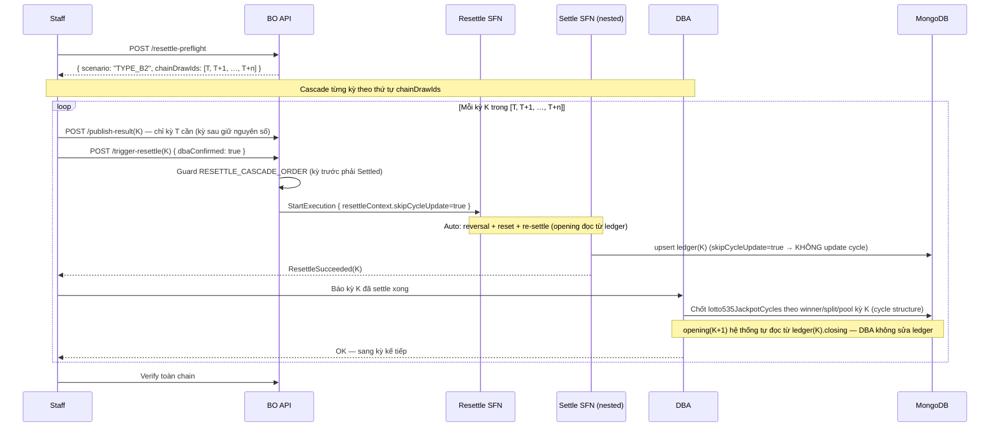

# TYPE_B2 — Cascade Step-wise (Auto Payout + DBA Cycle từng kỳ)

## Điều kiện

**Kỳ T có chain kỳ đã kết sổ sau nó (theo `drawId`, xuyên cycle, `chainLength > 0`) ⇒ LUÔN TYPE_B2.** Không phụ thuộc winner/split tại T có đổi hay không.

Khác TYPE_B1 ở chỗ: B1 chain rỗng (T là kỳ mới nhất, chỉ 1 kỳ cần xử lý). B2 có **chuỗi kỳ đã kết sổ sau T** — sửa kết quả T làm đổi pool tích luỹ của mọi kỳ phía sau.

### Vì sao luôn cascade khi có chain?

Split Lotto 5/35 phụ thuộc **pool**:

```
split(K) = drawNo(K) === Evening && opening(K) >= splitThreshold && !hasJpWinner(K)
opening(K) = closing(K-1)
```

Khi sửa kết quả kỳ T, `closing(T)` **gần như luôn đổi** — kể cả khi T là roll-over→roll-over (không winner, không split), chỉ cần số vé trúng các tier đổi thì `jackpotContribution(T)` đã đổi → `closing(T) = opening(T) + contribution(T)` đổi.

`closing(T)` đổi → `opening(T+1)` đổi → `closing(T+1)` đổi → … lan truyền **dây chuyền** xuống toàn chain. Hệ quả: **một kỳ Evening trong chain có thể vượt/tụt ngưỡng split DÙ số quay của nó không đổi** — split "chuyển kỳ".

Ta **không thể tiền-kiểm** `closing(T)` mới mà không re-settle, nên không có heuristic buffer nào an toàn tuyệt đối (luôn có rủi ro biên khi `opening` sát ngưỡng). → Có chain = bắt buộc cascade tuần tự để re-settle tính lại `opening`/`split` đúng cho từng kỳ.

> **Khác bản chất Power 6/55**: winner Power655 chỉ phụ thuộc số quay → pool đổi không sinh winner mới ở kỳ sau, nên Power655 ngầm an toàn. Split Lotto 5/35 **phụ thuộc pool** → pool đổi CÓ thể sinh/mất split ở kỳ sau → bắt buộc cascade.

## Tại sao KHÔNG cần full-DBA tính tay?

Insight quan trọng: **sửa kết quả chỉ ở kỳ T**. Các kỳ T+1, T+2, … **không đổi số quay** → **danh tính người trúng các tier không đổi**, chỉ **số tiền nhận** và **trạng thái split** có thể thay đổi (do JP pool tích luỹ khác đi).

Mà tính lại số tiền + split cho từng kỳ chính là việc `Settle` đã làm tự động — miễn là `opening` của mỗi kỳ đúng. Cycle Ledger lưu `closing` từng kỳ, và hệ thống áp **bất biến `opening(K) = closing(K-1)`**: khi resettle kỳ K, `trigger-resettle` đọc `closing` của kỳ K-1 (vừa resettle xong) làm opening của K, rồi `PrepareSettle` tính lại `isSplitCycle` theo opening mới, `FinalizeSettle` ghi đè lại `opening` trong ledger(K) cho liên tục. Vì vậy ta **cascade tuần tự**:

- Worker lo **payout + kết sổ lại + tính lại split** cho TỪNG kỳ (giống hệt luồng B1, `skipCycleUpdate=true`), tự lấy opening đúng từ closing kỳ trước.
- DBA chỉ **chốt jackpot cycle** (`lotto535JackpotCycles`) sau mỗi kỳ — checkpoint cho cycle structure (đóng/mở cycle khi có/gỡ JP winner hoặc khi split thực tế xảy ra). DBA **không** phải sửa `opening` trong ledger — hệ thống tự lo.

→ DBA **không** debit/credit thủ công, **không** tính payout tay. Khối lượng việc của DBA giảm còn đúng phần cycle.

> **`LEDGER_MISSING` không phải scenario vận hành.** Ledger writer ghi entry cho mọi kỳ settle từ go-live → kỳ đã settled luôn có entry. Nếu gặp `LEDGER_MISSING` nghĩa là **bất thường data integrity** (entry bị mất/xoá) → dừng, báo đội kỹ thuật. Xem mục cuối tài liệu này.

## Nguyên tắc cascade

Resettle tuần tự theo `seq` tăng dần: `T → T+1 → … → T+n`. Với MỖI kỳ:

1. **Worker (auto)**: reversal payout cũ → reset entries → re-settle với pool đúng (opening kỳ K = closing kỳ K-1, hệ thống tự đọc từ ledger; `PrepareSettle` tính lại `isSplitCycle` theo opening mới) → upsert ledger (`skipCycleUpdate=true` → KHÔNG tự update cycle; nhưng GHI ĐÈ `opening/closing/didSplit` ledger(K) cho chuỗi liên tục).
2. **DBA (checkpoint)**: cập nhật `lotto535JackpotCycles` phản ánh đúng winner/split/pool kỳ vừa rồi (đóng/mở cycle khi JP winner hoặc split thực tế thay đổi). KHÔNG cần sửa `opening` trong ledger — worker đã tự ghi đúng.
3. Sang kỳ tiếp theo. **Guard backend** (`RESETTLE_CASCADE_ORDER`) chặn nếu cố resettle kỳ sau khi kỳ trước chưa hoàn tất.

Vì opening kỳ K đọc trực tiếp từ `ledger(K-1).closing` (worker tự resolve trong `trigger-resettle`), miễn cascade chạy đúng thứ tự thì mọi payout + split state đều được tính lại đúng — không phụ thuộc DBA sửa ledger tay.

## Luồng



## Bước thực hiện

### Trước khi bắt đầu (DBA)

1. **Backup MongoDB**: `lotto535Draws`, `lotto535TicketEntries`, `lotto535JackpotCycles`, `lotto535JackpotCycleEntries`.
2. **Lấy thứ tự cascade** từ `/resettle-preflight` → field `chainDrawIds` (đã sort theo `seq` ASC, gồm cả T).
3. **Tránh settle kỳ MỚI** trong lúc đang cascade (đợi cascade xong rồi mở bán kỳ mới).

### Vòng lặp cascade — lặp cho từng kỳ K theo `chainDrawIds`

#### Bước A — Resettle kỳ K (Staff)

- **Kỳ T (kỳ đầu)**: đã `/publish-result` với kết quả mới (số quay sửa). Gọi `/trigger-resettle` với `dbaConfirmed: true`.
- **Kỳ T+1…T+n**: số quay KHÔNG đổi → **không** cần `/publish-result`. Nhưng để hệ thống cho phép re-settle, kỳ phải ở trạng thái resettle-able.

**Cách 1 (khuyến nghị) — UI / endpoint `resettle-reopen`:**

Trên màn hình Vận hành, kỳ T+n (đã settled, số không đổi) hiện mục **"Mở để kết sổ lại"** trong menu ⋮ (góc phải trên khung kỳ). Chọn mục này → gọi:

```
POST /api/lotto535/draws/<DRAW_ID_K>/resettle-reopen
Body: { "dbaConfirmed": true }
```

`ReopenForCascadeUseCase` re-stamp `result.publishedAt = now` (GIỮ NGUYÊN `winningMain` + `winningSpecial`), chuyển `settled → published`, `$unset financial/stats/settleSummary` — y hệt Cách 2 nhưng idempotent + có guard (`DRAW_NEVER_SETTLED`, `DRAW_INVALID_TRANSITION`, `RESETTLE_REQUIRES_DBA`). Sau khi mở, bấm **"Kết sổ lại"**.

**Cách 2 (fallback thủ công) — sửa trực tiếp DB** nếu endpoint không khả dụng:

```js
// Chỉ áp dụng cho kỳ chain (T+1…), result KHÔNG đổi — chỉ để mở luồng resettle.
// GIỮ NGUYÊN settledAt (high-water mark): trigger-resettle cần settledAt để
// (1) qua guard DRAW_NEVER_SETTLED, (2) build resettle token, (3) check
// publishedAt > settledAt. Chỉ set result.publishedAt mới hơn settledAt là đủ.
db.lotto535Draws.updateOne(
  { drawId: "<DRAW_ID_K>", status: "settled" },
  {
    $set: {
      status: "published",
      "result.publishedAt": new Date(), // > settledAt để qua check DRAW_NO_NEW_RESULT
      updatedAt: new Date()
    }
    // KHÔNG $unset settledAt — giữ làm high-water mark.
  }
)
```

> **Lưu ý**: chỉ set `result.publishedAt = new Date()` (mới hơn `settledAt` cũ) là đủ để `publishedAt > settledAt` → `trigger-resettle` không reject `DRAW_NO_NEW_RESULT`. **KHÔNG** được `$unset settledAt`: nếu xoá, `trigger-resettle` sẽ reject `DRAW_NEVER_SETTLED` (guard `if (!draw.settledAt)`) và mất resettle token. Sau khi re-settle xong, `settledAt` được `FinalizeSettle` ghi đè giá trị mới.

Sau đó:

```
POST /api/lotto535/draws/<DRAW_ID_K>/trigger-resettle
Body: { "dbaConfirmed": true }
```

Hệ thống tự: reversal payout cũ → reset entries → re-settle. `opening` của kỳ K được `trigger-resettle` resolve = `closing` của kỳ K-1 trong ledger (kỳ trước vừa resettle xong). `PrepareSettle` tính lại `isSplitCycle` theo opening mới. `FinalizeSettle` upsert lại `ledger(K)` với opening (ghi đè) + closing + didSplit mới, **không** đụng cycle.

#### Bước B — DBA chốt cycle cho kỳ K

Sau khi kỳ K `settled`. **Chỉ cập nhật `lotto535JackpotCycles`** (cycle structure) — KHÔNG đụng `lotto535JackpotCycleEntries` (worker đã ghi đúng opening/closing ledger).

```js
// 1. Đọc ledger entry mới của kỳ K (chỉ để THAM CHIẾU số liệu, không sửa)
const ledgerK = db.lotto535JackpotCycleEntries.findOne({ drawId: "<DRAW_ID_K>" })
// → { cycleNo, seq, opening, contribution, closing, hasJpWinner, didSplit, isSplitCycleAtSettle }

// 2. Cập nhật active cycle (lotto535JackpotCycles) theo winner/split/pool kỳ K —
//    quy tắc GIỐNG type-b1.md Bước 4:
//    - Có JP winner   → đóng cycle hiện tại, mở cycle mới (seed).
//    - didSplit=true  → đóng cycle hiện tại (split), mở cycle mới (seed).
//    - Gỡ winner/split cũ → khôi phục cycle (chiều ngược), xem type-b1.md Trường hợp C.
//    - Không winner, không split → currentAmount = closing, drawCount = seq (roll-over).
```

Chi tiết các trường hợp đóng/mở cycle: dùng nguyên **type-b1.md → Bước 4 (A/B/C)**. B2 chỉ khác là lặp lại cho từng kỳ.

> **Không cần sửa ledger opening**: opening kỳ K+1 sẽ do `trigger-resettle` tự đọc từ `ledger(K).closing` khi resettle kỳ K+1. DBA chỉ lo `lotto535JackpotCycles`.

#### Bước C — Verify liên tục trước khi sang kỳ sau

```js
// Verify chuỗi opening/closing ledger liên tục tới kỳ K (worker đã tự ghi).
// Đây là bước KIỂM TRA an toàn, không phải DBA tự sửa.
db.lotto535JackpotCycleEntries.find(
  { cycleNo: ledgerK.cycleNo },
  { sort: { seq: 1 } }
).toArray()
// Đảm bảo chuỗi opening/closing liên tục tới kỳ K.
```

Xác nhận xong → báo Staff sang kỳ K+1. Guard `RESETTLE_CASCADE_ORDER` sẽ chặn nếu kỳ K chưa `settled`.

### Sau khi cascade xong

```js
// Toàn bộ chain liên tục, cycle active đúng amount cuối cùng
db.lotto535JackpotCycles.findOne({ status: "active" })
db.lotto535JackpotCycleEntries.find(
  { cycleNo: <CYCLE_NO> }, { sort: { seq: 1 } }
).toArray()
// Verify opening(T+1)===closing(T), opening(T+2)===closing(T+1), …
```

Mở bán kỳ mới trở lại. Notify staff verify trên UI.

## Guard thứ tự (backend)

`trigger-resettle` chặn cascade sai thứ tự: nếu còn kỳ TRƯỚC K (theo `drawId`, xuyên cycle) đang dở (đã republish nhưng chưa re-settle xong, `status != settled`) → throw `RESETTLE_CASCADE_ORDER`. Bắt buộc hoàn tất kỳ trước (gồm DBA chốt/tái cấu trúc cycle) rồi mới sang kỳ này → opening luôn đúng.

## Lưu ý quan trọng

- **KHÔNG** bỏ qua bước DBA chốt cycle (`lotto535JackpotCycles`) giữa các kỳ — cycle structure (đóng/mở khi JP winner hoặc split thực tế thay đổi) cần đúng để báo cáo/jackpot hiển thị chính xác.
- Opening kỳ sau do **hệ thống tự resolve** từ `ledger(kỳ trước).closing` — DBA KHÔNG cần sửa `opening` trong `lotto535JackpotCycleEntries`. Worker ghi đè opening/closing/didSplit ledger mỗi kỳ.
- Worker **không tự update cycle** trong suốt cascade (`skipCycleUpdate=true` cho mọi kỳ B2). Cycle structure do DBA chốt tay từng bước.
- Số quay các kỳ T+1… **không đổi** — không `/publish-result` lại số mới cho chúng, chỉ mở trạng thái resettle. **Lưu ý**: dù số quay không đổi, **split state của chúng vẫn có thể đổi** do opening (= closing kỳ trước) thay đổi — đây chính là lý do bắt buộc cascade.
- Cascade phải đúng thứ tự `seq` tăng dần (guard `RESETTLE_CASCADE_ORDER`) — sai thứ tự → opening lấy từ closing kỳ trước CHƯA resettle → payout/split sai.
- Backup TRƯỚC khi bắt đầu cascade.

## `LEDGER_MISSING` — guard data integrity (không phải quy trình vận hành)

Nếu kỳ T (hoặc kỳ trong chain) **không có ledger entry** (`findByDraw` trả null) dù đã `settled`, hệ thống reject `LEDGER_MISSING`.

**Tình huống này KHÔNG xảy ra trong vận hành bình thường**: ledger writer (`FinalizeSettle.upsertEntry`) ghi entry cho mọi kỳ settle kể từ go-live. Entry null ⟹ bất thường data integrity (bị xoá nhầm, migration lỗi, ghi sai `cycleNo/drawId`).

Xử lý: **dừng resettle, không tự tái tính**. Báo đội kỹ thuật kiểm tra `lotto535_jackpot_cycle_entries` + log `FinalizeSettle` của kỳ T. Chỉ resettle lại sau khi entry đã được khôi phục đúng. Guard này chủ yếu phòng crash (đọc `seq`/opening trên `null`). Xem [troubleshooting.md](./troubleshooting.md).
