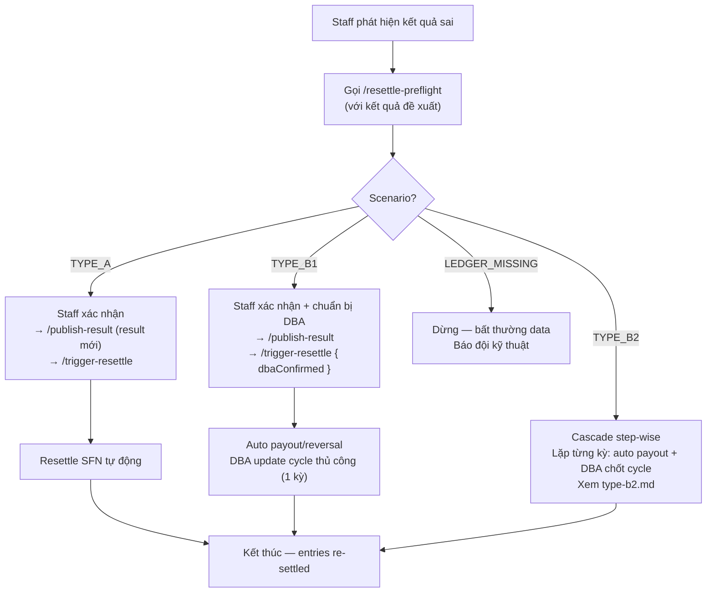

# Power 6/55 — Hướng dẫn Resettle (Kết sổ lại)

## Tổng quan

Resettle là quy trình kết sổ lại một kỳ quay sau khi phát hiện kết quả công bố sai. Hệ thống phân loại thành 3 scenario:

| Scenario | Mô tả | Xử lý |
|---|---|---|
| **TYPE_A** | Winner JP tại T **không đổi** (cũ & mới đều không có winner); chain các kỳ **đã kết sổ** sau T không có winner | Tự động hoàn toàn |
| **TYPE_B1** | Winner JP tại T **thay đổi** (xuất hiện mới HOẶC bị gỡ bỏ); T là kỳ **đã kết sổ mới nhất** trong cycle (chain rỗng) | Auto payout + DBA update cycle |
| **TYPE_B2** | Winner JP tại T thay đổi VÀ có chain kỳ **đã kết sổ** sau T (theo `drawId`, **xuyên cycle**); hoặc chain đó có winner | **Cascade step-wise** — auto payout từng kỳ + DBA chốt/tái cấu trúc cycle giữa mỗi bước |
| **LEDGER_MISSING** | Ledger entry null dù kỳ đã settled (bất thường data integrity) | Dừng resettle — báo đội kỹ thuật |

> ### ✅ Cross-cycle (gỡ JP1 winner) ⇒ vẫn là TYPE_B2
>
> Power 6/55 là **dual jackpot**: **chỉ JP1 winner mới ĐÓNG cycle** (JP2 chỉ reset-only, không đổi ranh giới cycle). Khi kỳ T có JP1 winner, cycle T đóng và cycle `cycleNo + 1` mở ngay.
>
> **Tình huống:** kỳ T cũ có **JP1 winner** (đã đóng cycle), nhưng kết quả mới **gỡ bỏ JP1 winner** — TRONG KHI cycle kế đã có ≥1 kỳ kết sổ. Lúc này cycle T đáng lẽ **không đóng** → các kỳ đã kết sổ ở cycle kế phải **gộp ngược** vào cycle T.
>
> Chain được phát hiện theo `drawId` (`findSettledChainAfterDraw`, **xuyên cycle**) nên các kỳ ở cycle kế **vẫn nằm trong chain B2** → cascade tuần tự. Worker tự re-settle entries + payout từng kỳ; **DBA chỉ tái cấu trúc cycle metadata** (gộp/đổi `cycleNo`, reopen cycle T) giữa mỗi bước, dựa trên ledger. `opening` mỗi kỳ đọc từ `closing` kỳ liền trước theo thời gian (`findClosingStateBeforeDraw`), per-jackpot theo winner flags — đúng cả khi JP1/JP2 reset xuyên cycle.

> ### ⚠️ Định nghĩa "Winner JP thay đổi" — 2 CHIỀU
>
> Cycle bị ảnh hưởng khi winner JP tại kỳ T thay đổi theo **BẤT KỲ chiều nào**. Không chỉ "thêm winner mới", mà cả "gỡ bỏ winner cũ" đều nguy hiểm ngang nhau.
>
> | # | Kết quả CŨ | Kết quả MỚI | Cycle ảnh hưởng? | Scenario (chain rỗng) |
> |---|---|---|:---:|---|
> | 1 | không có | **CÓ** winner | ✅ Có | **TYPE_B1** |
> | 2 | **CÓ** winner | không có | ✅ Có | **TYPE_B1** |
> | 3 | **CÓ** winner | **CÓ** winner | ✅ Có (an toàn) | **TYPE_B1** |
> | 4 | không có | không có | ❌ Không | **TYPE_A** |
>
> **Vì sao case 2 (gỡ winner cũ) cũng phải B1/B2?**
> Khi kết quả cũ có winner JP1, cycle cũ đã **ĐÓNG** và JP1 đã **reset về seed**, một cycle mới đã mở. Nếu sửa thành "không winner" mà vẫn auto (TYPE_A), `FinalizeSettle` sẽ chạy với `getActiveCycle()` hiện tại (cycle mới sau khi đóng) → tính sai: jackpot bị **reset oan**, cycle structure sai. Đáng lẽ cycle cũ **không được đóng** và JP1 phải tiếp tục tích luỹ.
>
> Trạng thái winner CŨ đọc từ `ledgerEntry.hasJp1Winner/hasJp2Winner` (đã ghi lúc settle trước). Trạng thái winner MỚI lấy từ pre-flight re-match.

> ### ⚠️ Định nghĩa "chain sau T" — ĐỌC KỸ
>
> "Chain sau T" **tính các kỳ ĐÃ KẾT SỔ (settled) sau T theo thời gian** (`drawId > T`, **xuyên cycle**), KHÔNG tính các kỳ đang chạy / chưa kết sổ.
>
> Lý do: chain được tra qua **Cycle Ledger** (`findSettledChainAfterDraw`), mà ledger entry chỉ sinh ra khi một kỳ đã `FinalizeSettle`. Kỳ chưa kết sổ chưa có ledger entry → không nằm trong chain. Vì tra theo `drawId` (không khoá `cycleNo`), chain bắt được cả kỳ ở cycle kế khi T từng đóng cycle.
>
> **Ý nghĩa nghiệp vụ**: kỳ chưa kết sổ thì chưa "đọc" jackpot pool từ T, nên việc sửa T không gây sai dây chuyền cho chúng — khi đến lượt, chúng sẽ tự đọc đúng cycle/pool mới đã được sửa.

### Bốn trường hợp tại kỳ T (giả định chain rỗng / không winner)

| Tình huống tại T | Winner cũ | Winner mới | → Scenario |
|---|:---:|:---:|---|
| Chưa có winner → giờ trúng JP | Không | Có | **TYPE_B1** |
| Đang có winner → giờ không còn (gỡ bỏ) | Có | Không | **TYPE_B1** |
| Vẫn trúng JP (có thể khác số người/pool) | Có | Có | **TYPE_B1** |
| Không trúng cả trước lẫn sau | Không | Không | **TYPE_A** |

### Khi chain (kỳ đã kết sổ sau T) không rỗng

| Tình huống | Chain (kỳ đã kết sổ sau T) | Winner JP tại T đổi? | → Scenario |
|---|---|---|---|
| T đổi winner, nhưng đã có kỳ **đã kết sổ** sau T | không rỗng (`chainLength > 0`) | Có | **TYPE_B2** |
| Chain đã kết sổ sau T có winner | có winner trong chain | bất kỳ | **TYPE_B2** |

> **TYPE_B2 không còn là "full DBA tính tay".** Vì sửa kết quả chỉ ở kỳ T, các kỳ T+1… **không đổi số quay** → danh tính người trúng không đổi, chỉ **số tiền** đổi (pool tích luỹ khác). Worker re-settle tự động từng kỳ (auto payout, `skipCycleUpdate=true`); DBA chỉ **chốt cycle** sau mỗi kỳ — cascade tuần tự `T → T+1 → … → T+n`. Chi tiết: [type-b2.md](./type-b2.md). `LEDGER_MISSING` không phải scenario vận hành — chỉ là guard data integrity (xem dưới).

> ### ℹ️ LEDGER_MISSING — không xảy ra trong vận hành bình thường
>
> Ledger writer (`FinalizeSettle`) ghi entry cho **mọi** kỳ settle kể từ go-live → mọi kỳ đã `settled` đều có ledger entry. `LEDGER_MISSING` chỉ phát sinh khi entry **bị mất/xoá/migration lỗi** — tức bất thường về data integrity. Khi gặp: **dừng resettle, không tự xử lý**, báo đội kỹ thuật kiểm tra collection `power655_jackpot_cycle_entries`. Đây là guard phòng vệ (chống crash NPE khi đọc opening/seq), không phải quy trình DBA.

## Cycle Ledger

Collection `power655_jackpot_cycle_entries` lưu lịch sử tích luỹ Jackpot theo từng kỳ.

```
{ cycleNo, drawId, drawNo, seq, openingJp1, openingJp2, jp1Contribution, jp2Contribution, jp1Overflow, closingJp1, closingJp2, hasJp1Winner, hasJp2Winner, jp2DidReset, settledAt, updatedAt }
```

- `seq` = số thứ tự kỳ trong cycle (1-based = drawCount sau settle).
- `openingJp1/2` = giá trị JP đầu kỳ T (trước khi cộng contribution).
- `closingJp1/2` = giá trị JP cuối kỳ T (sau settle).

**Quy tắc**: KHÔNG backfill kỳ cũ. Chỉ có kỳ settle từ khi Cycle Ledger triển khai mới có entry.

## Luồng tổng quát



## Quy trình cho Staff

### Bước 1: Pre-flight analysis

Gọi API `/resettle-preflight` với kết quả đề xuất để xác định scenario:

```
POST /api/power655/draws/{drawId}/resettle-preflight
{
  "proposedWinningMain": ["05", "12", "23", "34", "45", "51"],
  "proposedBonusNumber": "07"
}
```

**Response**: `{ scenario, message, hasNewJpWinner, hadOldJpWinner, chainLength, lastAffectedDrawId, chainDrawIds }`

- `chainDrawIds` chỉ có giá trị khi **TYPE_B2** — danh sách kỳ cần cascade resettle theo thứ tự `seq` ASC (gồm cả T). Staff/DBA chạy lần lượt đúng thứ tự này.

### Bước 2: Publish kết quả mới

Sau khi đã xác nhận scenario. Với **TYPE_B2**, chỉ publish kết quả mới cho **kỳ T**; các kỳ T+1… giữ nguyên số quay (xem [type-b2.md](./type-b2.md)):

```
POST /api/power655/draws/{drawId}/publish-result
{
  "winningMain": ["05", "12", "23", "34", "45", "51"],
  "bonusNumber": "07",
  "vietlottRef": { "drawPeriod": "00123", "drawDate": "2026-06-03" }
}
```

### Bước 3: Trigger resettle

```
POST /api/power655/draws/{drawId}/trigger-resettle
{
  "dbaConfirmed": true   // BẮT BUỘC cho TYPE_B1 + TYPE_B2; bỏ qua với TYPE_A
}
```

**Response**: `{ drawId, status: "settling", resettleId, lockOwnerToken }`

Hệ thống tự động chạy:
1. **PrepareResettle**: Clear reversal cũ → snapshot reversal mới → reset entries.
2. **EnqueueReversals**: Enqueue debit orders để hoàn tiền payout cũ.
3. **Settle SFN** (nested): Re-settle với kết quả mới.

> **TYPE_B1 / TYPE_B2** thiếu `dbaConfirmed: true` → reject `RESETTLE_REQUIRES_DBA`. Với **TYPE_B2**, backend còn guard thứ tự cascade (`RESETTLE_CASCADE_ORDER`): kỳ trước trong chain phải `settled` xong (DBA đã chốt cycle) mới cho resettle kỳ sau.

## Xem thêm

- [Type A — Tự động hoàn toàn](./type-a.md)
- [Type B1 — Auto payout + DBA cycle](./type-b1.md)
- [Type B2 — Cascade step-wise (auto payout + DBA cycle từng kỳ)](./type-b2.md)
- [Cycle Ledger](./cycle-ledger.md)
- [Troubleshooting](./troubleshooting.md)
