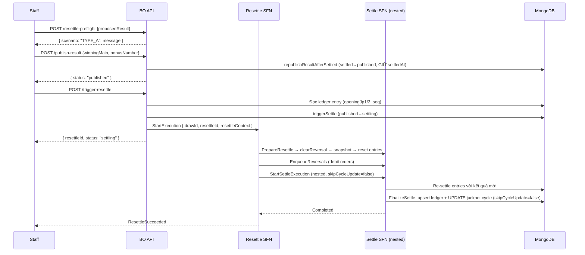

# TYPE_A — Resettle Tự Động Hoàn Toàn

## Điều kiện

- Winner JP tại kỳ T **KHÔNG thay đổi**: cả kết quả cũ lẫn kết quả mới đều **KHÔNG** có ai trúng Jackpot 1 hoặc Jackpot 2 (case 4 trong bảng 2 chiều).
- Chain các kỳ **đã kết sổ (settled)** sau T (theo `drawId`, xuyên cycle; nếu có) cũng **không** có ai trúng Jackpot.

> **Quan trọng — winner phải KHÔNG đổi cả 2 chiều**: nếu kết quả cũ CÓ winner JP mà kết quả mới không còn (gỡ bỏ), đó **KHÔNG** phải TYPE_A mà là TYPE_B1/B2 — vì cycle cũ đã đóng/reset dựa trên winner cũ. Xem bảng "Winner JP thay đổi 2 chiều" trong [README](./README.md). TYPE_A chỉ áp dụng khi `hasNewJpWinner = false` VÀ `hadOldJpWinner = false`.

> **Trường hợp "cũ & mới ĐỀU có winner" KHÔNG phải TYPE_A** (đây là case 3 → **TYPE_B1**). Dù danh tính winner JP có vẻ "không đổi", số người trúng / pool / seed đóng cycle vẫn có thể khác sau khi sửa kết quả → bắt buộc DBA review + chốt cycle. Nguyên tắc: **bất kỳ kỳ T nào có winner JP (cũ hoặc mới) đều phải qua B1/B2**, không bao giờ auto. TYPE_A là trường hợp DUY NHẤT không động chạm winner JP nào.

> **Lưu ý "chain sau T"**: chỉ tính các kỳ **đã kết sổ** (có ledger entry), KHÔNG tính các kỳ đang chạy / chưa kết sổ. Vì vậy trường hợp T không trúng JP nhưng phía sau còn nhiều kỳ **đang chơi chưa kết sổ** vẫn là TYPE_A — các kỳ đó chưa đọc jackpot pool từ T nên không bị ảnh hưởng dây chuyền.

## Luồng



## Chi tiết từng bước

### 1. Pre-flight (Staff)

```
POST /api/power655/draws/{drawId}/resettle-preflight
{
  "proposedWinningMain": ["05", "12", "23", "34", "45", "51"],
  "proposedBonusNumber": "07"
}
→ { scenario: "TYPE_A", message: "Kết quả mới không thay đổi người trúng Jackpot (cũ & mới đều không có). Có thể resettle tự động." }
```

### 2. Publish kết quả mới (Staff)

```
POST /api/power655/draws/{drawId}/publish-result
{
  "winningMain": ["05", "12", "23", "34", "45", "51"],
  "bonusNumber": "07"
}
```

Sau bước này: draw status = `published`, kết quả mới được ghi, `financial`/`stats`/`settleSummary` bị `$unset`. **`settledAt` được GIỮ NGUYÊN** (high-water mark — dùng cho resettle token + check `publishedAt > settledAt`).

### 3. Trigger resettle (Staff)

```
POST /api/power655/draws/{drawId}/trigger-resettle
→ { resettleId: "01J...", status: "settling" }
```

Hệ thống tự động thực hiện toàn bộ, không cần thêm hành động từ Staff hay DBA.

### 4. Kết quả

- Entries cũ được reset về `Scheduled`.
- Debit orders (hoàn tiền payout cũ) được enqueue vào outbox.
- Settle SFN re-settle với kết quả mới.
- Jackpot cycle được cập nhật tự động (ledger upsert + cycle update).
- Draw status = `settled`.

## Theo dõi

Kiểm tra trạng thái qua draw detail:

```
GET /api/power655/draws/{drawId}
→ { status: "settled", settledAt: "...", ... }
```

Nếu sau 15 phút draw vẫn ở `settling`, kiểm tra CloudWatch Logs của Resettle SFN.
