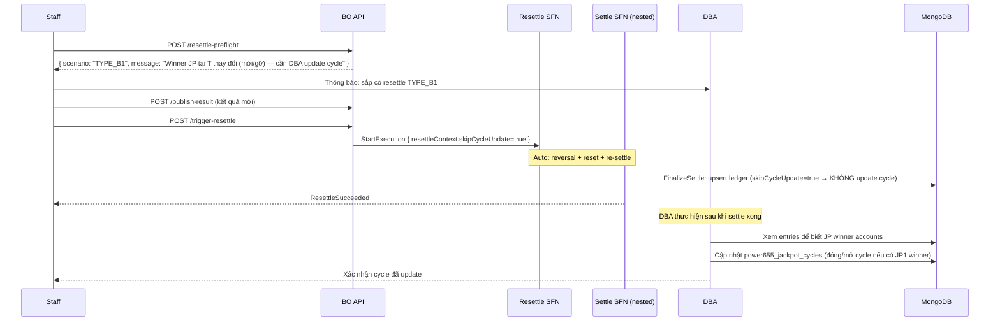

# TYPE_B1 — Auto Payout + DBA Cycle

## Điều kiện

- Winner JP tại kỳ T **THAY ĐỔI** theo bất kỳ chiều nào (xem bảng "Winner JP thay đổi 2 chiều" trong [README](./README.md)):
  - **Case 1** — chưa có → **CÓ** winner (xuất hiện mới).
  - **Case 2** — **CÓ** winner → không còn (gỡ bỏ winner cũ).
  - **Case 3** — vẫn có winner (có thể khác số người/pool).
- Kỳ T là kỳ **đã kết sổ mới nhất** trong ledger — tức không có kỳ nào **đã kết sổ** sau T (theo `drawId`, xuyên cycle; chain rỗng, `chainLength = 0`).

> **Case 2 quan trọng — gỡ winner cũ cũng là TYPE_B1**: nếu kết quả cũ có JP1 winner thì cycle cũ đã **đóng** và một cycle mới đã mở. Khi sửa kết quả thành "không winner", cycle cũ đáng lẽ **không được đóng** → DBA phải **mở lại / khôi phục** cycle cũ thay vì đóng/tạo mới. Đây là chiều ngược của Trường hợp A.

> **Lưu ý**: điều kiện "chain rỗng" chỉ xét các kỳ **đã kết sổ** (có ledger entry). Trường hợp T đổi winner và phía sau còn nhiều kỳ **đang chạy chưa kết sổ** vẫn là TYPE_B1 — vì các kỳ đó chưa có ledger entry, chưa đọc jackpot pool từ T. Sau khi DBA cập nhật cycle, các kỳ đó sẽ tự đọc đúng cycle/pool mới khi đến lượt kết sổ.

## Nguyên tắc

Hệ thống tự động:
- Reversal payout cũ → reset entries → re-settle với kết quả mới.
- `FinalizeSettle` **BỎ QUA** bước `updateJackpotCycle` (`skipCycleUpdate=true`).

DBA can thiệp thủ công:
- Sau khi re-settle xong, DBA cập nhật `power655_jackpot_cycles` để phản ánh đúng winner và cycle structure.

## Luồng



## Bước thực hiện

### Staff

1. Gọi `/resettle-preflight` xác nhận TYPE_B1.
2. Thông báo DBA để DBA chuẩn bị.
3. Gọi `/publish-result` với kết quả mới.
4. Gọi `/trigger-resettle`.
5. Theo dõi draw status → `settled`.
6. Báo DBA đã settle xong để DBA update cycle.

### DBA (sau khi settle xong)

#### Bước 1: Xác nhận settle đã hoàn tất

```js
// Kiểm tra draw đã settled
db.power655Draws.findOne({ drawId: "<DRAW_ID>" }, { status: 1, settledAt: 1, "jackpot.closingJackpot1": 1, "jackpot.closingJackpot2": 1 })
```

#### Bước 2: Đọc ledger entry mới nhất của kỳ T

```js
db.power655JackpotCycleEntries.findOne({ drawId: "<DRAW_ID>" })
// → { cycleNo, seq, openingJp1, openingJp2, closingJp1, closingJp2, hasJp1Winner, hasJp2Winner, jp2DidReset }
```

#### Bước 3: Đọc active cycle hiện tại

```js
db.power655JackpotCycles.findOne({ status: "active" })
// → { cycleNo, jackpot1CurrentAmount, jackpot2CurrentAmount, drawCount, ... }
```

#### Bước 4: Cập nhật cycle

**Trường hợp A — Kết quả mới có JP1 winner (đóng cycle):**

```js
// Cycle cũ (đang active): close nó
db.power655JackpotCycles.updateOne(
  { cycleNo: <CYCLE_NO> },
  {
    $set: {
      status: "closed",
      closedAt: new Date(),
      // hasJackpot1Winner đã đúng từ FinalizeSettle
      updatedAt: new Date()
    }
  }
)

// Tạo cycle mới (next cycle)
// nextCycleNo = cycleNo + 1, jackpot1CurrentAmount = seedAmount, jackpot2CurrentAmount = seedAmount
db.power655JackpotCycles.insertOne({
  cycleNo: <CYCLE_NO + 1>,
  status: "active",
  jackpot1CurrentAmount: <seedAmount>,  // từ config
  jackpot2CurrentAmount: <seedAmount>,  // từ config
  drawCount: 0,
  createdAt: new Date(),
  updatedAt: new Date()
})
```

**Trường hợp B — Chỉ có JP2 winner (JP2 reset, JP1 tích luỹ tiếp):**

```js
// Cycle vẫn active, chỉ reset jackpot2
db.power655JackpotCycles.updateOne(
  { cycleNo: <CYCLE_NO> },
  {
    $set: {
      // JP2 reset về seed, JP1 giữ nguyên closingJp1 từ ledger
      jackpot2CurrentAmount: <jp2SeedAmount>,
      updatedAt: new Date()
    }
  }
)
```

**Trường hợp C — Gỡ bỏ winner cũ (kết quả cũ CÓ winner → mới KHÔNG, case 2):**

Đây là chiều **ngược** với Trường hợp A. Cycle cũ đã bị đóng oan (và cycle mới đã mở oan) dựa trên winner cũ — cần khôi phục lại.

```js
// Bối cảnh: ledgerEntry kỳ T cũ có hasJp1Winner=true → cycle <CYCLE_NO> đã bị đóng,
// cycle <CYCLE_NO + 1> đã được mở với seed. Giờ kết quả mới không còn winner.

// 1. Xoá / vô hiệu cycle mới đã mở oan (nếu chưa có kỳ nào khác settle vào nó).
db.power655JackpotCycles.deleteOne({ cycleNo: <CYCLE_NO + 1>, drawCount: 0 })
// LƯU Ý: nếu drawCount > 0 (đã có kỳ khác settle vào cycle mới) → KHÔNG xoá được,
// tình huống này thực chất là TYPE_B2 (có chain sau T) — dừng lại, theo type-b2.md.

// 2. Mở lại cycle cũ: status active, khôi phục amount = closing kỳ T MỚI (sau re-settle).
db.power655JackpotCycles.updateOne(
  { cycleNo: <CYCLE_NO> },
  {
    $set: {
      status: "active",
      // closingJp1/2 lấy từ ledger entry kỳ T MỚI (sau re-settle, không còn winner)
      jackpot1CurrentAmount: <ledgerEntry.closingJp1>,
      jackpot2CurrentAmount: <ledgerEntry.closingJp2>,
      drawCount: <ledgerEntry.seq>,
      updatedAt: new Date()
    },
    $unset: { closedAt: "" }
  }
)
```

> **Cảnh báo**: nếu cycle mới (`<CYCLE_NO + 1>`) đã có kỳ khác settle vào (`drawCount > 0`), thì pre-flight đã phải phân loại thành **TYPE_B2** (chain sau T không rỗng), không phải B1. Nếu vẫn gặp `drawCount > 0` ở đây, **DỪNG LẠI** và xử lý theo [type-b2.md](./type-b2.md).

#### Bước 5: Xác nhận

```js
db.power655JackpotCycles.findOne({ status: "active" })
// Kiểm tra jackpot1CurrentAmount, jackpot2CurrentAmount đúng không
```

## Lưu ý quan trọng

- **KHÔNG** update cycle trước khi settle xong — `FinalizeSettle` đã upsert ledger với giá trị đúng, DBA chỉ cần update active cycle.
- Kiểm tra `ledgerEntry.closingJp1/2` để biết chính xác số tiền JP cần reset.
- Nếu có nhiều JP2 winner trong cùng kỳ T (hiếm), JP2 pool chia đều — kiểm tra `draw.jackpot.closingJackpot2 = seedAmount` trong ledger.
